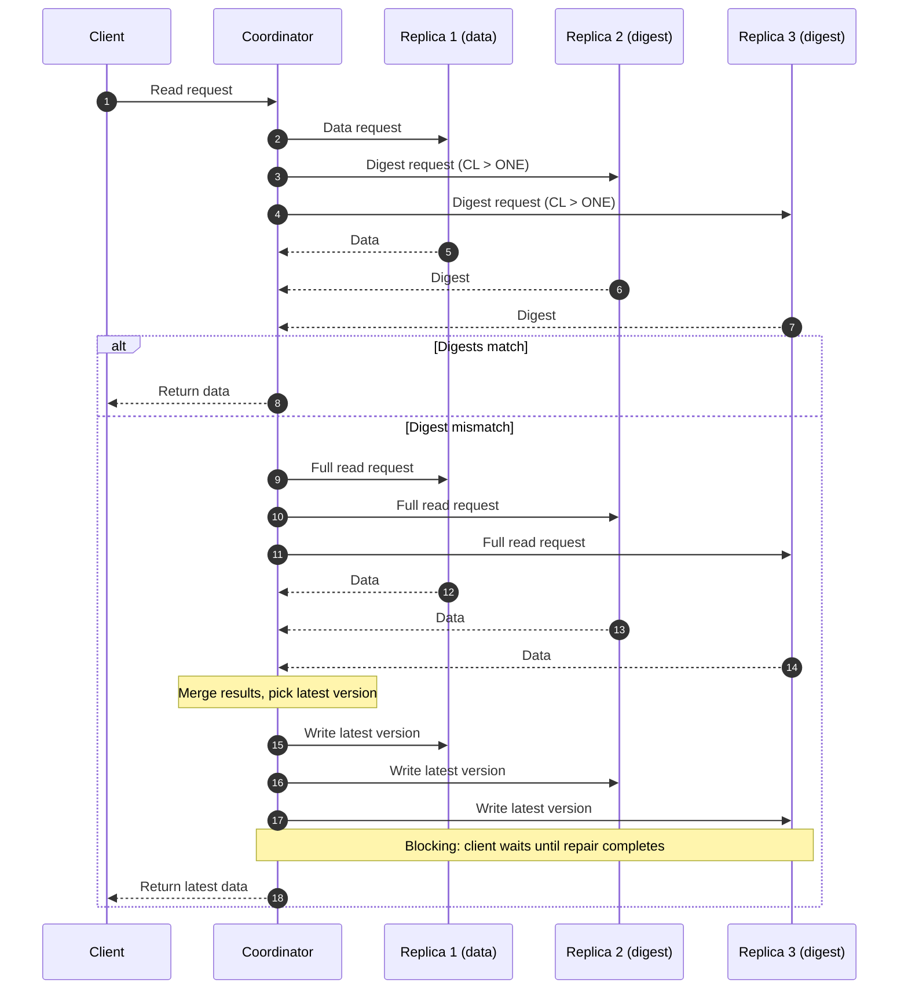
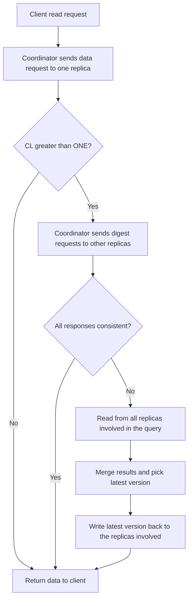
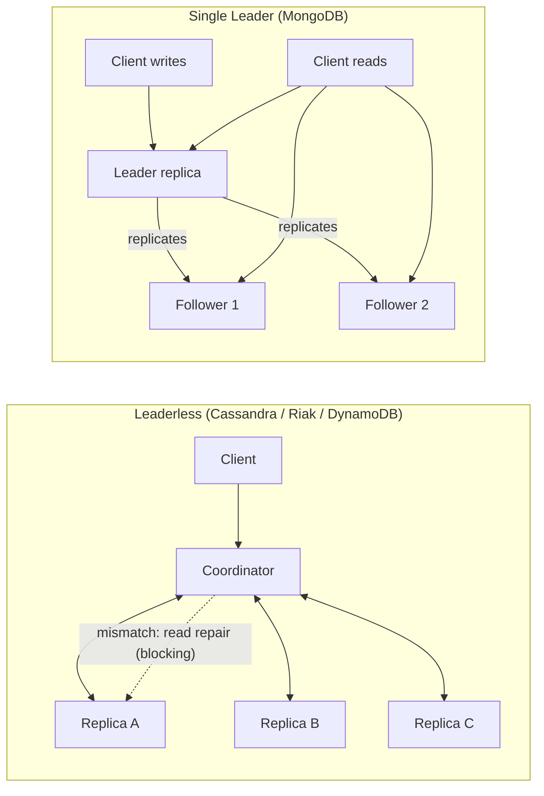
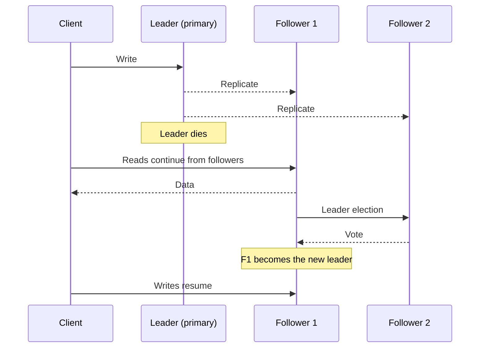

# What’s Read Repair?

Read repair is a process that automatically corrects inconsistent or outdated data in a distributed database during a read request. It's an anti-entropy mechanism that ensures that replicas are updated with the most recent data.

## How Read Repair Works

1. The coordinator node sends a data request to one replica node.
2. The coordinator sends digest requests to other replica nodes for consistency level (CL) greater than ONE.
3. If all nodes return consistent data, the coordinator returns it to the client.
4. If there is a mismatch in the data returned to the coordinator, a read is requested from all replicas involved in the query.
5. The results are merged and the latest version is written back to only the replicas involved in the request.

### Read Repair Flow

Decision flow:

Read repair is blocking, meaning that a response is not returned to the client until the read repair has completed.

## Why are NoSQL databases like Cassandra or Riak not good choices compared to MongoDB?

- NoSQL databases like Cassandra, Riak, and DynamoDB need read repair during the reading stage and will therefore provide slower reads to write performance.
- They are leaderless NoSQL databases that provide weaker atomicity upon concurrent writes. Being a single leader database, MongoDB provides a higher read throughput because we can read from either the leader replica or the follower replicas. The write operations have to pass through the leader replica. It ensures our system’s availability for reading-intensive tasks even in cases where the leader dies.

### Comparison at a Glance

| Aspect | Cassandra / Riak / DynamoDB (leaderless) | MongoDB (single leader) |
| --- | --- | --- |
| Write path | Any replica can accept a write | All writes go through the leader replica |
| Read path | May need read repair (digest compare, merge, write back) | Read from the leader or follower replicas |
| Read latency | Slower when replicas are inconsistent (repair is blocking) | Higher read throughput, no read repair on the read path |
| Atomicity on concurrent writes | Weaker | Stronger (writes are serialized by the leader) |
| If the leader dies | No leader, so no election is needed | Leader election runs, then reads continue from followers |
| Best suited for | Write-heavy, always-available workloads | Read-intensive workloads |

### Leaderless vs Single Leader

### Leader Failure in MongoDB

> **Note:** Since Cassandra inherently ensures availability more than MongoDB, choosing MongoDB over Cassandra might make our system look less available. However, the time taken by the leader election algorithm is negligible compared to the time elapsed between short URL generation and its first usage, so it doesn’t hamper our system’s availability.
