# System Design Interview Prep

A tiered roadmap from warm-up problems to staff-level case studies. Each section covers **how to design the system**, **scalability challenges**, **pros/cons**, and **production hardening** — with notes on how patterns transfer across interview questions.

> **Companion docs:**
>
> - [System Design Questions.md](./System%20Design%20Questions.md) — foundational concepts (CAP, caching, sharding, etc.)
> - [System Design Interview Questions.md](./System%20Design%20Interview%20Questions.md) — 55 curated questions from [SystemDesign.io](https://systemdesign.io/)

---


## Table of Contents


| §     | Tier                                           | Focus                                    | Questions                                                    |
| ----- | ---------------------------------------------- | ---------------------------------------- | ------------------------------------------------------------ |
| **1** | [1. T1 · Warm-ups](#1-t1-warm-ups)             | Foundational, single-concept problems    | TinyURL, Pastebin, Rate Limiter, ID Generator, Typeahead     |
| **2** | [2. T2 · The Classics](#2-t2-the-classics)     | Must-know FAANG canon                    | Twitter, Instagram, Messenger, Uber, Yelp                    |
| **3** | [3. T3 · Modern Systems](#3-t3-modern-systems) | Real-time, AI, collaborative tools       | ChatGPT, Discord, Google Docs, Notifications, Netflix Recs   |
| **4** | [4. T4 · Heavy Hitters](#4-t4-heavy-hitters)   | Senior+ — storage, payments, low latency | YouTube/Netflix, S3, Payments, Google Search, Stock Exchange |
| **5** | [5. T5 · Case Studies](#5-t5-case-studies)     | Staff/principal — read like papers       | Dynamo, Kafka, Cassandra, GFS, BigTable                      |


| §     | Appendix                                                                              |                        |     |
| ----- | ------------------------------------------------------------------------------------- | ---------------------- | --- |
| **6** | [6. How tiers connect — cross-question map](#6-how-tiers-connect--cross-question-map) | Cross-tier pattern map | —   |
| **7** | [7. Production patterns checklist](#7-production-patterns-checklist-all-tiers)        | Production hardening   | —   |


**Recommended order:** 1 → 2 → 3 → 4 → 5. Patterns from earlier tiers reuse constantly in later ones.

---


## 1. T1 · Warm-ups

Foundational, single-concept problems. Master these first — every later interview builds on the same building blocks: **hashing, caching, rate limiting, ID generation, and prefix search**.

### T1 - Shared Patterns


| Pattern                    | Used in                         |
| -------------------------- | ------------------------------- |
| Key-value lookup + cache   | TinyURL, Pastebin               |
| Token/leaky bucket + Redis | Rate Limiter                    |
| Snowflake / base62 / UUID  | ID Generator, TinyURL, Pastebin |
| Trie + ranking + cache     | Typeahead                       |


---


### 1.1 Design TinyURL

**Goal:** Map short codes (`bit.ly/abc`) → long URLs with fast redirects at billions of scale.

#### 1.1.1 Core design

**Clarifying questions to ask the interviewer**


| #   | Question                                        | Why it matters                                      |
| --- | ----------------------------------------------- | --------------------------------------------------- |
| 1   | What's the read-to-write ratio?                 | Drives cache vs DB investment (typically 100:1)     |
| 2   | Do we need custom aliases (`bit.ly/my-link`)?   | Adds uniqueness checks + reserved word list         |
| 3   | Should links expire? Can users delete them?     | TTL column, soft delete, cache invalidation         |
| 4   | Do we need click analytics? Real-time or batch? | Async pipeline vs redirect path                     |
| 5   | Anonymous or authenticated users?               | User table, rate limits per tier                    |
| 6   | Global or single-region?                        | CDN, multi-region DB, latency targets               |
| 7   | Expected scale? (URLs stored, QPS)              | Sharding threshold, ID length                       |
| 8   | Redirect type — 301 or 302?                     | 301 = browser caches (fast but under-counts clicks) |


**Assumptions for this design:** 500M URLs stored, 100:1 read/write, 100K reads/sec peak, 1K writes/sec peak, 7-char base62 codes, optional expiration, async analytics.

---

**High-level architecture**

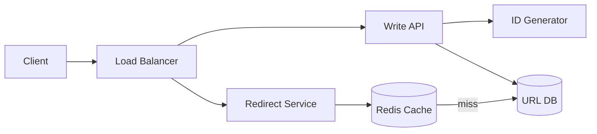
```mermaid
flowchart LR
    client["Client"] --> lb["Load Balancer"]
    lb --> api["Write API"]
    lb --> redirect["Redirect Service"]
    api --> idgen["ID Generator"]
    api --> db[("URL DB")]
    redirect --> cache[("Redis Cache")]
    cache -- "miss" --> db
```


| Component     | Choice                     | Why                             |
| ------------- | -------------------------- | ------------------------------- |
| ID generation | Auto-increment + base62    | Simple, no collisions, sortable |
| Storage       | PostgreSQL (sharded later) | ACID for create; mature tooling |
| Cache         | Redis cluster              | Sub-ms reads for hot URLs       |
| Analytics     | Kafka → ClickHouse         | Don't block redirect path       |


---

**Database ER diagram**

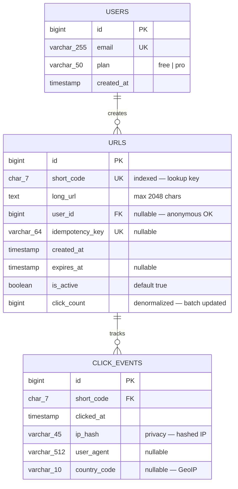
```mermaid
erDiagram
    USERS ||--o{ URLS : creates
    URLS ||--o{ CLICK_EVENTS : tracks

    USERS {
        bigint id PK
        varchar_255 email UK
        varchar_50 plan "free | pro"
        timestamp created_at
    }

    URLS {
        bigint id PK
        char_7 short_code UK "indexed — lookup key"
        text long_url "max 2048 chars"
        bigint user_id FK "nullable — anonymous OK"
        varchar_64 idempotency_key UK "nullable"
        timestamp created_at
        timestamp expires_at "nullable"
        boolean is_active "default true"
        bigint click_count "denormalized — batch updated"
    }

    CLICK_EVENTS {
        bigint id PK
        char_7 short_code FK
        timestamp clicked_at
        varchar_45 ip_hash "privacy — hashed IP"
        varchar_512 user_agent "nullable"
        varchar_10 country_code "nullable — GeoIP"
    }
```


**Indexes**


| Table          | Index                                                        | Purpose                     |
| -------------- | ------------------------------------------------------------ | --------------------------- |
| `URLS`         | `UNIQUE (short_code)`                                        | Primary lookup for redirect |
| `URLS`         | `(user_id, created_at DESC)`                                 | List user's links           |
| `URLS`         | `(expires_at) WHERE expires_at IS NOT NULL`                  | Expiry sweeper job          |
| `URLS`         | `UNIQUE (idempotency_key) WHERE idempotency_key IS NOT NULL` | Retry-safe creates          |
| `CLICK_EVENTS` | `(short_code, clicked_at)`                                   | Analytics queries           |


**Storage estimate:** 500M rows × ~300 bytes/row ≈ **150 GB** — fits one PostgreSQL node; shard when > 1B rows or write QPS exceeds single-node limit (~5K writes/sec).

---

**API signatures**


| Method   | Endpoint                          | Auth             | Description                           |
| -------- | --------------------------------- | ---------------- | ------------------------------------- |
| `POST`   | `/api/v1/urls`                    | Optional API key | Create short URL                      |
| `GET`    | `/{short_code}`                   | None             | 301/302 redirect to long URL          |
| `GET`    | `/api/v1/urls/{short_code}`       | Owner or API key | Get URL metadata + stats              |
| `DELETE` | `/api/v1/urls/{short_code}`       | Owner or API key | Soft-delete (set `is_active = false`) |
| `GET`    | `/api/v1/urls/{short_code}/stats` | Owner or API key | Click analytics summary               |


**POST** `/api/v1/urls` **— request**


| Field                     | Type              | Required    | Notes                                |
| ------------------------- | ----------------- | ----------- | ------------------------------------ |
| `long_url`                | string            | Yes         | Valid HTTP/HTTPS URL, max 2048 chars |
| `custom_alias`            | string            | No          | 3–20 chars, alphanumeric + hyphen    |
| `expires_at`              | ISO 8601 datetime | No          | Must be in the future                |
| Header: `Idempotency-Key` | UUID              | Recommended | Prevents duplicate creates on retry  |


**POST** `/api/v1/urls` **— response** `201 Created`


| Field        | Type     | Example                                |
| ------------ | -------- | -------------------------------------- |
| `short_code` | string   | `"abc1234"`                            |
| `short_url`  | string   | `"https://bit.ly/abc1234"`             |
| `long_url`   | string   | `"https://example.com/very/long/path"` |
| `expires_at` | datetime | `"2027-01-01T00:00:00Z"` or null       |
| `created_at` | datetime | `"2026-09-10T18:00:00Z"`               |


**Error responses**


| Status | When                                               |
| ------ | -------------------------------------------------- |
| `400`  | Invalid URL, alias too short, expired date in past |
| `409`  | Custom alias already taken                         |
| `429`  | Rate limit exceeded                                |
| `422`  | URL on blocklist (malware/phishing)                |


---

**API flow: POST** `/api/v1/urls` **(Create)**

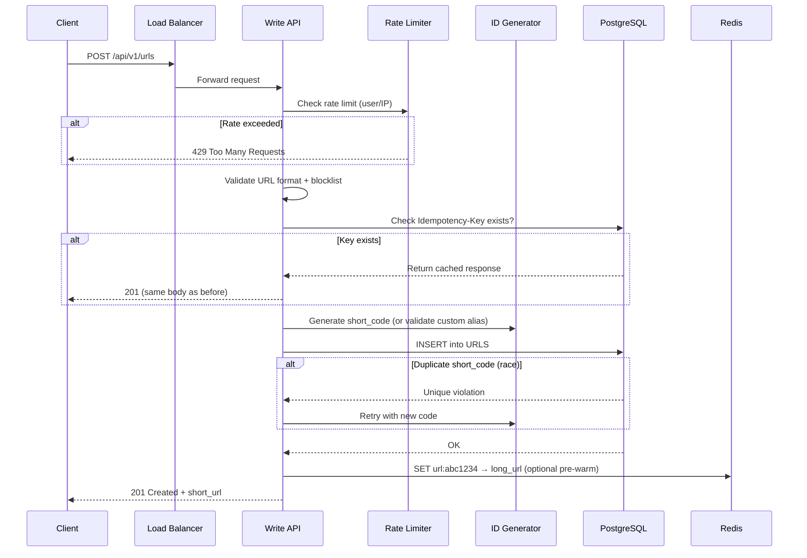
```mermaid
sequenceDiagram
    participant C as Client
    participant LB as Load Balancer
    participant API as Write API
    participant RL as Rate Limiter
    participant ID as ID Generator
    participant DB as PostgreSQL
    participant Cache as Redis

    C->>LB: POST /api/v1/urls
    LB->>API: Forward request
    API->>RL: Check rate limit (user/IP)
    alt Rate exceeded
        RL-->>C: 429 Too Many Requests
    end
    API->>API: Validate URL format + blocklist
    API->>DB: Check Idempotency-Key exists?
    alt Key exists
        DB-->>API: Return cached response
        API-->>C: 201 (same body as before)
    end
    API->>ID: Generate short_code (or validate custom alias)
    API->>DB: INSERT into URLS
    alt Duplicate short_code (race)
        DB-->>API: Unique violation
        API->>ID: Retry with new code
    end
    DB-->>API: OK
    API->>Cache: SET url:abc1234 → long_url (optional pre-warm)
    API-->>C: 201 Created + short_url
```


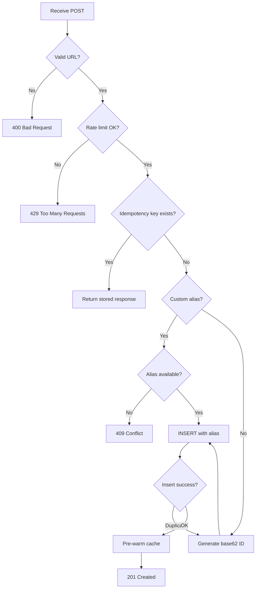
```mermaid
flowchart TD
    A[Receive POST] --> B{Valid URL?}
    B -->|No| E400[400 Bad Request]
    B -->|Yes| C{Rate limit OK?}
    C -->|No| E429[429 Too Many Requests]
    C -->|Yes| D{Idempotency key exists?}
    D -->|Yes| R[Return stored response]
    D -->|No| F{Custom alias?}
    F -->|Yes| G{Alias available?}
    G -->|No| E409[409 Conflict]
    G -->|Yes| H[INSERT with alias]
    F -->|No| I[Generate base62 ID]
    I --> H
    H --> J{Insert success?}
    J -->|Duplicate| I
    J -->|OK| K[Pre-warm cache]
    K --> L[201 Created]
```


---

**API flow: GET** `/{short_code}` **(Redirect)**

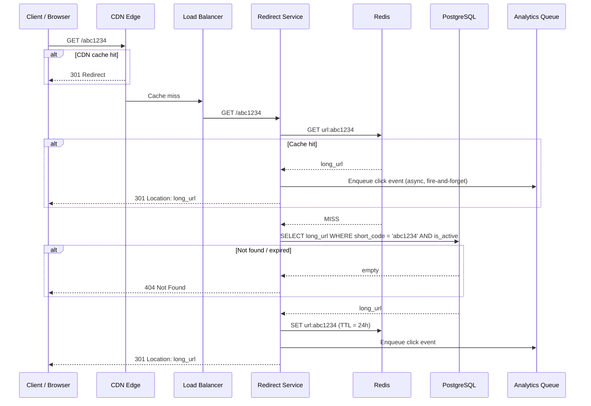
```mermaid
sequenceDiagram
    participant C as Client / Browser
    participant CDN as CDN Edge
    participant LB as Load Balancer
    participant RS as Redirect Service
    participant Cache as Redis
    participant DB as PostgreSQL
    participant Q as Analytics Queue

    C->>CDN: GET /abc1234
    alt CDN cache hit
        CDN-->>C: 301 Redirect
    end
    CDN->>LB: Cache miss
    LB->>RS: GET /abc1234
    RS->>Cache: GET url:abc1234
    alt Cache hit
        Cache-->>RS: long_url
        RS->>Q: Enqueue click event (async, fire-and-forget)
        RS-->>C: 301 Location: long_url
    end
    Cache-->>RS: MISS
    RS->>DB: SELECT long_url WHERE short_code = 'abc1234' AND is_active
    alt Not found / expired
        DB-->>RS: empty
        RS-->>C: 404 Not Found
    end
    DB-->>RS: long_url
    RS->>Cache: SET url:abc1234 (TTL = 24h)
    RS->>Q: Enqueue click event
    RS-->>C: 301 Location: long_url
```


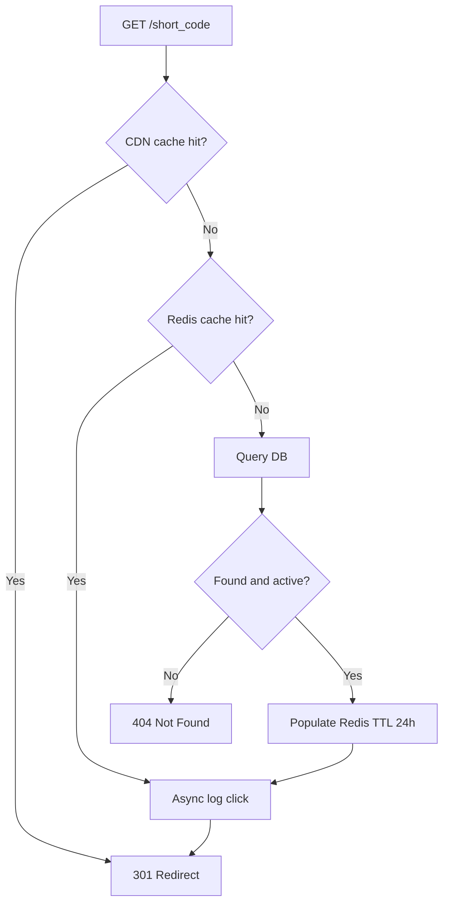
```mermaid
flowchart TD
    A[GET /short_code] --> B{CDN cache hit?}
    B -->|Yes| REDIR[301 Redirect]
    B -->|No| C{Redis cache hit?}
    C -->|Yes| D[Async log click]
    D --> REDIR
    C -->|No| E[Query DB]
    E --> F{Found and active?}
    F -->|No| G[404 Not Found]
    F -->|Yes| H[Populate Redis TTL 24h]
    H --> D
```


**Why 301 vs 302?**


| Code            | Browser behavior                            | Analytics                                      | Use when                      |
| --------------- | ------------------------------------------- | ---------------------------------------------- | ----------------------------- |
| `301 Permanent` | Caches redirect — repeat visits skip server | Under-counts (browser never hits server again) | Max performance, public links |
| `302 Temporary` | Always hits server                          | Accurate click count                           | Analytics-critical links      |


**Recommendation:** Use `302` if analytics matter; use `301` + async click logging via JavaScript pixel for marketing pages.

---

**DB locks & concurrency**


| Operation                 | Lock strategy                                                                      | Why                                                |
| ------------------------- | ---------------------------------------------------------------------------------- | -------------------------------------------------- |
| **Create URL**            | Optimistic — rely on `UNIQUE(short_code)` constraint                               | Low contention; retry on conflict (max 3 attempts) |
| **Custom alias**          | Same — `UNIQUE` constraint catches race between two users picking same alias       | No explicit row lock needed                        |
| **Idempotency**           | `INSERT ... ON CONFLICT (idempotency_key) DO NOTHING` then SELECT                  | Atomic; second request gets same response          |
| **Click count increment** | **Do NOT** update row on every click — use Redis `INCR` + flush to DB every 60 sec | Avoids row-level lock hotspot on viral links       |
| **Soft delete**           | Single row UPDATE with `WHERE short_code = ? AND user_id = ?`                      | No lock contention                                 |
| **Expiry sweeper**        | Batch job: `UPDATE ... WHERE expires_at < NOW() LIMIT 1000` + `DEL` cache keys     | Off-peak; no impact on redirect path               |


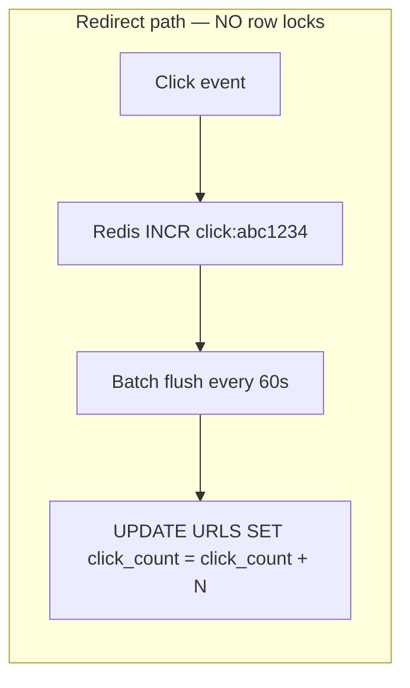
```mermaid
flowchart LR
    subgraph HotPath["Redirect path — NO row locks"]
        Click[Click event] --> RedisINCR[Redis INCR click:abc1234]
        RedisINCR --> Batch[Batch flush every 60s]
        Batch --> DBUpdate[UPDATE URLS SET click_count = click_count + N]
    end
```


**No pessimistic locks (**`SELECT FOR UPDATE`**) needed** on the redirect path — it's read-only. Writes only happen on create (low QPS).

---


#### 1.1.2 Scalability challenges & solutions

**Capacity estimate**


| Metric           | Calculation                                         | Result              |
| ---------------- | --------------------------------------------------- | ------------------- |
| URLs stored      | Given                                               | 500M                |
| Read QPS (peak)  | 100M DAU × 10 redirects/day ÷ 86400 × 3 peak factor | ~**35K reads/sec**  |
| Write QPS (peak) | 100M DAU × 0.1 creates/day ÷ 86400 × 3              | ~**350 writes/sec** |
| Storage          | 500M × 300 bytes                                    | ~**150 GB**         |
| Cache memory     | 20% URLs = 80% traffic → 100M keys × 500 bytes      | ~**50 GB Redis**    |


**Single-node capacity (before sharding)**


| Component                              | Max throughput                           | Bottleneck?             |
| -------------------------------------- | ---------------------------------------- | ----------------------- |
| Redirect service (stateless)           | ~50K req/sec per instance × 10 instances | No — scale horizontally |
| Redis cache (95% hit rate)             | ~100K ops/sec per cluster                | No                      |
| PostgreSQL reads (5% miss = 1.75K/sec) | ~10K reads/sec with replicas             | No                      |
| PostgreSQL writes                      | ~5K writes/sec single node               | No at 350/sec           |
| ID generator (Snowflake)               | ~400K IDs/sec per machine                | No                      |


**System can support ~35K redirects/sec** with this architecture. Scale triggers: reads > 100K/sec → add CDN; writes > 5K/sec → shard DB; storage > 1B rows → shard by hash.

---

**Latency budget**


| Path                     | Step                                   | Latency              |
| ------------------------ | -------------------------------------- | -------------------- |
| **Redirect (cache hit)** | CDN edge                               | ~10–30 ms            |
| **Redirect (Redis hit)** | LB + Redis GET                         | ~1–3 ms              |
| **Redirect (DB miss)**   | LB + Redis + PostgreSQL + SET cache    | ~10–20 ms            |
| **Create URL**           | Validate + ID gen + INSERT + cache SET | ~30–50 ms            |
| **Analytics enqueue**    | Kafka produce (async)                  | ~1 ms (non-blocking) |


**Target SLAs**


| Operation             | p50     | p99      | How to improve                            |
| --------------------- | ------- | -------- | ----------------------------------------- |
| Redirect (cache hit)  | < 5 ms  | < 15 ms  | CDN edge, local in-process cache          |
| Redirect (cache miss) | < 15 ms | < 50 ms  | Read replicas, connection pooling         |
| Create URL            | < 30 ms | < 100 ms | Pre-allocated ID ranges, async cache warm |


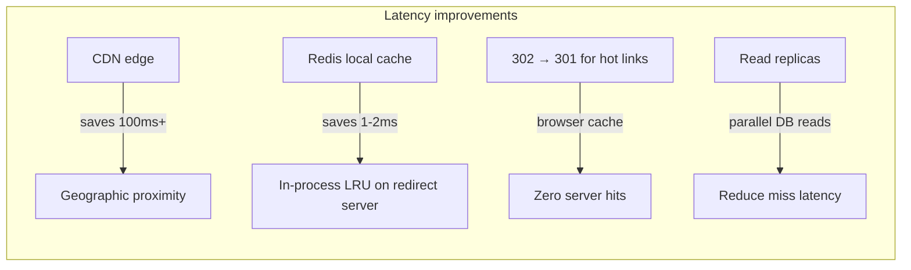
```mermaid
flowchart LR
    subgraph Improve["Latency improvements"]
        A[CDN edge] -->|"saves 100ms+"| B[Geographic proximity]
        C[Redis local cache] -->|"saves 1-2ms"| D[In-process LRU on redirect server]
        E[302 → 301 for hot links] -->|"browser cache"| F[Zero server hits]
        G[Read replicas] -->|"parallel DB reads"| H[Reduce miss latency]
    end
```


---


| Challenge                                          | Solution                                                                                                         |
| -------------------------------------------------- | ---------------------------------------------------------------------------------------------------------------- |
| **Hot keys** — viral link hammers one cache shard  | Local in-process LRU (1000 entries) + replicate hot key to all Redis nodes; CDN caches redirect for top 1% links |
| **Write bottleneck** — single DB for ID generation | Snowflake IDs generated in-app (no DB round-trip); pre-allocate ranges per API server if using auto-increment    |
| **Collision** (hash-based)                         | Prefer auto-increment + base62 (zero collisions); if hash: retry with salt up to 3 times                         |
| **Billions of URLs**                               | Shard by `hash(short_code) % N` when > 1B rows; 7-char base62 = 62^7 ≈ 3.5 trillion codes                        |
| **Abuse / spam**                                   | Rate limit: 10 creates/min per IP, 100/min per API key; URL blocklist; CAPTCHA after threshold                   |
| **Cache stampede**                                 | On expiry, use probabilistic early refresh; mutex per key during DB refill                                       |
| **Analytics at scale**                             | Never write to URL row on click; Kafka → batch aggregate → ClickHouse                                            |


---


#### 1.1.3 Pros & cons


| Pros                                            | Cons                                                      |
| ----------------------------------------------- | --------------------------------------------------------- |
| Simple read path; cache-friendly                | 301 caching means analytics under-count if not careful    |
| Stateless redirect servers scale horizontally   | Custom aliases add uniqueness constraint + reserved words |
| Easy to reason about in 45 min                  | Hash-based IDs have collision edge cases                  |
| Clear separation: write API vs redirect service | Two services to deploy and monitor                        |
| Snowflake IDs = no DB coordination on create    | 7-char codes eventually exhaust if not monitored          |


**Design decision summary for interviewer**


| Decision       | Choice                         | Alternative rejected     | Reason                                                          |
| -------------- | ------------------------------ | ------------------------ | --------------------------------------------------------------- |
| ID strategy    | Auto-increment + base62        | Hash of URL              | Hash has collisions; same URL → same code is not always desired |
| Redirect code  | 302 (analytics) or 301 (perf)  | Always 302               | Tradeoff — state explicitly                                     |
| Click counting | Async Redis INCR + batch flush | Sync DB UPDATE per click | Row lock hotspot on viral links                                 |
| DB             | PostgreSQL → shard later       | DynamoDB from day 1      | PostgreSQL simpler for interview; DynamoDB when > 5K writes/sec |


---


#### 1.1.4 Production-ready checklist

**Reliability**

- [ ] Idempotent create API (`Idempotency-Key` header + DB unique constraint)
- [ ] Retry logic on create: max 3 attempts on `short_code` collision
- [ ] Health checks on redirect service (LB removes unhealthy nodes)
- [ ] DB connection pooling (PgBouncer) — avoid connection exhaustion

**Security**

- [ ] HTTPS everywhere; HSTS headers
- [ ] URL blocklist (Google Safe Browsing API or maintained list)
- [ ] Rate limit: 10 creates/min/IP, 100/min/API key
- [ ] Don't expose internal IDs; use opaque short codes only
- [ ] Hash IPs in click events (GDPR/privacy)

**Data & ops**

- [ ] Link expiration + nightly sweeper job + cache invalidation
- [ ] Soft delete (`is_active = false`) + purge after 30 days
- [ ] Multi-region: read replicas in US/EU/APAC; CDN for redirects
- [ ] Backup: daily PostgreSQL snapshot; Redis persistence (AOF)

**Monitoring & SLIs**


| SLI                            | SLO target  | Alert if                     |
| ------------------------------ | ----------- | ---------------------------- |
| Redirect availability          | 99.99%      | Error rate > 0.01% for 5 min |
| Redirect latency (cache hit)   | p99 < 15 ms | p99 > 50 ms                  |
| Redirect latency (cache miss)  | p99 < 50 ms | p99 > 200 ms                 |
| Create success rate            | 99.9%       | Error rate > 0.1%            |
| Cache hit ratio                | > 95%       | Drops below 90%              |
| Kafka consumer lag (analytics) | < 60 sec    | Lag > 5 min                  |


---


#### 1.1.5 Cross-question patterns

→ **Pastebin** (same key-value + TTL pattern) · **Rate Limiter** (protect create endpoint) · **ID Generator** (short code generation) · **Twitter** (short link previews)

---

**Reserved words table (custom alias protection)**

When users pick a custom alias (`bit.ly/admin`, `bit.ly/api`), block names that would collide with system routes, mislead users, or create security issues.

**Schema:** `RESERVED_WORDS`


| Column       | Type                 | Notes                                          |
| ------------ | -------------------- | ---------------------------------------------- |
| `id`         | `BIGINT` PK          | Auto-increment                                 |
| `word`       | `VARCHAR(50)` UNIQUE | Lowercase alias — e.g. `admin`, `api`, `login` |
| `category`   | `VARCHAR(30)`        | Why it's blocked — see categories below        |
| `is_active`  | `BOOLEAN`            | Default `true` — disable without deleting      |
| `created_at` | `TIMESTAMP`          | When added                                     |
| `notes`      | `VARCHAR(255)`       | Optional — e.g. "matches /api/* route"         |


**Index:** `UNIQUE (word)` — also the lookup key during alias validation.

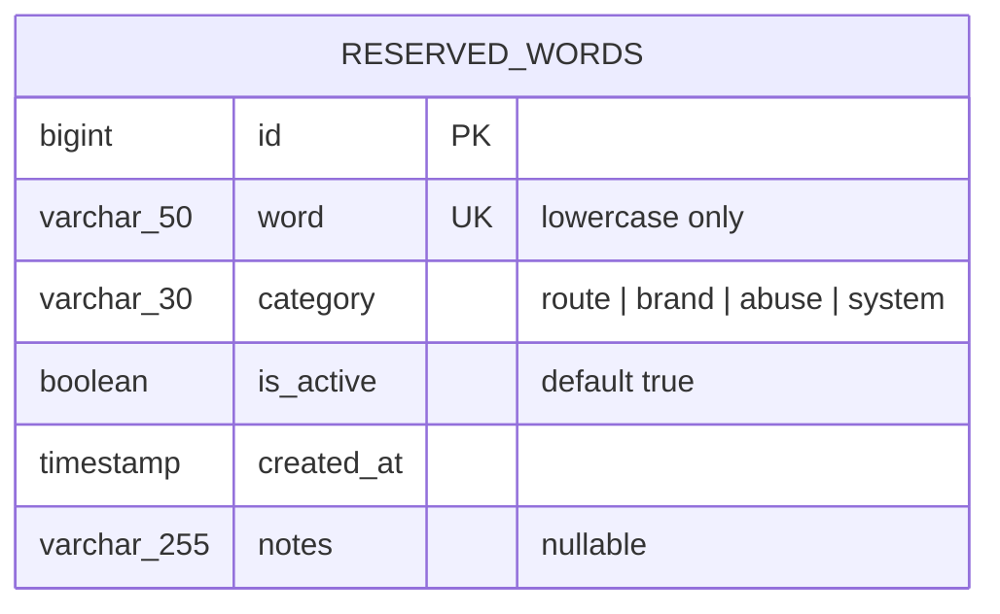
```mermaid
erDiagram
    RESERVED_WORDS {
        bigint id PK
        varchar_50 word UK "lowercase only"
        varchar_30 category "route | brand | abuse | system"
        boolean is_active "default true"
        timestamp created_at
        varchar_255 notes "nullable"
    }
```


**Categories and example rows**


| word         | category | reason                               |
| ------------ | -------- | ------------------------------------ |
| `admin`      | `route`  | Conflicts with `/admin` dashboard    |
| `api`        | `route`  | Conflicts with `/api/v1/*`           |
| `login`      | `route`  | Phishing risk — looks like auth page |
| `help`       | `route`  | System help/docs path                |
| `www`        | `system` | DNS/subdomain confusion              |
| `bitly`      | `brand`  | Brand impersonation                  |
| `null`       | `abuse`  | Technical keyword / confusion        |
| `fuck`       | `abuse`  | Profanity blocklist                  |
| `robots.txt` | `system` | Crawler convention                   |


**Typical size:** ~500–2,000 rows (small, static). Loaded into memory or Redis on startup — no need to query DB on every create.

**Validation flow (custom alias create)**

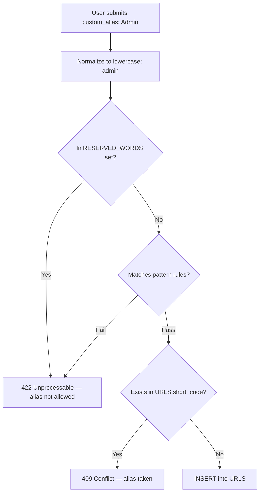
```mermaid
flowchart TD
    A[User submits custom_alias: Admin] --> B[Normalize to lowercase: admin]
    B --> C{In RESERVED_WORDS set?}
    C -->|Yes| D[422 Unprocessable — alias not allowed]
    C -->|No| E{Matches pattern rules?}
    E -->|Fail| D
    E -->|Pass| F{Exists in URLS.short_code?}
    F -->|Yes| G[409 Conflict — alias taken]
    F -->|No| H[INSERT into URLS]
```


**Pattern rules (checked before DB insert)**


| Rule                       | Example pass | Example fail |
| -------------------------- | ------------ | ------------ |
| Length 3–20 chars          | `my-link`    | `ab`         |
| Alphanumeric + hyphen only | `sale-2026`  | `sale_2026`  |
| No leading/trailing hyphen | `my-link`    | `-admin`     |
| Not all digits             | `link42`     | `123456`     |
| Not in reserved set        | `rohtash`    | `admin`      |


**Where to store for fast lookup**


| Layer             | Structure                                                         | Latency               |
| ----------------- | ----------------------------------------------------------------- | --------------------- |
| **In-memory Set** | Load all active `word` values on app startup; refresh every 5 min | ~0 μs                 |
| **Redis SET**     | `SISMEMBER reserved_words admin` — shared across API pods         | ~1 ms                 |
| **PostgreSQL**    | Source of truth; admin UI to add/remove words                     | ~5 ms (fallback only) |


**Admin API (internal only)**


| Method   | Endpoint                             | Description                                               |
| -------- | ------------------------------------ | --------------------------------------------------------- |
| `GET`    | `/internal/v1/reserved-words`        | List all reserved words (paginated)                       |
| `POST`   | `/internal/v1/reserved-words`        | Add word `{ word, category, notes }`                      |
| `DELETE` | `/internal/v1/reserved-words/{word}` | Soft-disable (`is_active = false`) + purge from Redis SET |


On add/delete → publish event → all API pods refresh in-memory Set + update Redis SET.

---

**Follow-up questions the interviewer may ask — and where to point**


| Interviewer asks                           | Answer in this design                                                                        |
| ------------------------------------------ | -------------------------------------------------------------------------------------------- |
| "What if a link goes viral?"               | Hot key section — local cache + CDN + Redis replication                                      |
| "How do you handle 10× traffic overnight?" | Auto-scale redirect pods; CDN absorbs reads; Redis cluster scales horizontally               |
| "How do you count clicks accurately?"      | Async Kafka pipeline; Redis INCR; batch flush — tradeoff with 301 caching                    |
| "Design custom aliases"                    | Normalize → check `RESERVED_WORDS` → pattern rules → `UNIQUE` on `URLS.short_code` → 409/422 |
| "Multi-region?"                            | CDN for redirects; DB read replicas per region; writes go to primary                         |
| "What database would you use?"             | PostgreSQL until 5K writes/sec, then shard or migrate to DynamoDB                            |
| "How long should the short code be?"       | 7 chars base62 = 3.5T URLs; 6 chars = 56B (enough for 500M)                                  |
| "What goes in reserved words?"             | System routes (`api`, `admin`), brand terms, profanity, misleading names (`login`)           |


> **— End of §1.1 —**

---


### 1.2 Design Pastebin

**Goal:** Store arbitrary text blobs, return a shareable short link, support optional expiration.

#### 1.2.1 Core design

**Clarifying questions to ask the interviewer**


| #   | Question                                     | Why it matters                   |
| --- | -------------------------------------------- | -------------------------------- |
| 1   | Max paste size? (1 MB vs 10 MB vs unlimited) | Drives S3 vs DB, upload strategy |
| 2   | Anonymous or registered users only?          | Auth, rate limits, ownership     |
| 3   | Expiration default? (1 hour, 1 day, never)   | TTL column, sweeper job          |
| 4   | Public vs private vs unlisted pastes?        | Visibility enum, access control  |
| 5   | Syntax highlighting required?                | Render layer vs raw text only    |
| 6   | Read-to-write ratio?                         | Cache investment                 |
| 7   | Need raw download vs rendered HTML view?     | Content-Type, API design         |
| 8   | Deduplication — same content → same URL?     | Content hash lookup              |


**Assumptions:** 10M pastes/month, max 1 MB/paste, 50:1 read/write, 7-day default expiry, anonymous OK, public by default.

---

**High-level architecture**

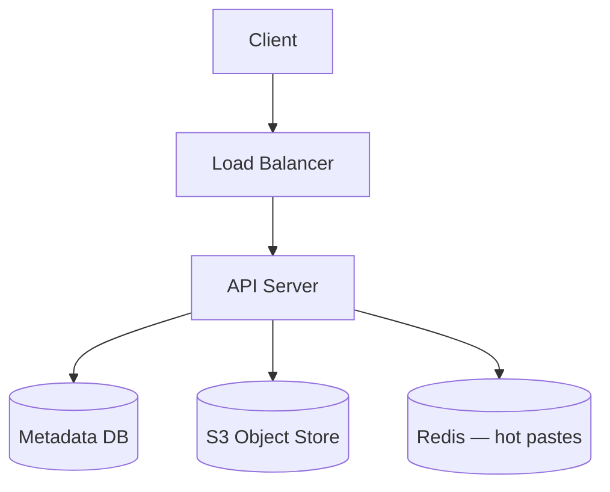
```mermaid
flowchart TB
    Client --> LB[Load Balancer]
    LB --> API[API Server]
    API --> MetaDB[(Metadata DB)]
    API --> BlobStore[(S3 Object Store)]
    API --> Cache[(Redis — hot pastes)]
```


| Component | Choice                          | Why                                 |
| --------- | ------------------------------- | ----------------------------------- |
| Metadata  | PostgreSQL                      | ACID, relationships, expiry queries |
| Content   | S3                              | Blobs don't belong in DB rows       |
| Cache     | Redis                           | Hot pastes served from memory       |
| ID        | Snowflake + base62 (reuse §1.4) | Same pattern as TinyURL             |


---

**Database ER diagram**

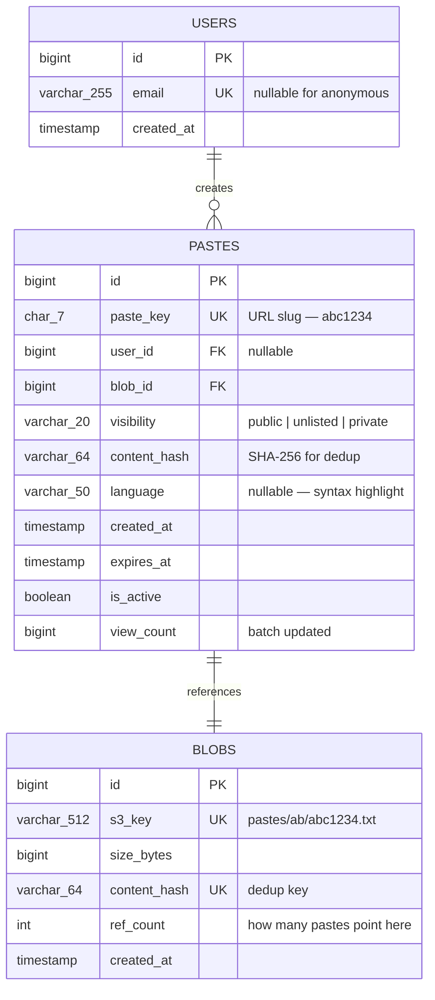
```mermaid
erDiagram
    USERS ||--o{ PASTES : creates
    PASTES ||--|| BLOBS : references

    USERS {
        bigint id PK
        varchar_255 email UK "nullable for anonymous"
        timestamp created_at
    }

    PASTES {
        bigint id PK
        char_7 paste_key UK "URL slug — abc1234"
        bigint user_id FK "nullable"
        bigint blob_id FK
        varchar_20 visibility "public | unlisted | private"
        varchar_64 content_hash "SHA-256 for dedup"
        varchar_50 language "nullable — syntax highlight"
        timestamp created_at
        timestamp expires_at
        boolean is_active
        bigint view_count "batch updated"
    }

    BLOBS {
        bigint id PK
        varchar_512 s3_key UK "pastes/ab/abc1234.txt"
        bigint size_bytes
        varchar_64 content_hash UK "dedup key"
        int ref_count "how many pastes point here"
        timestamp created_at
    }
```


**Indexes:** `UNIQUE(paste_key)`, `(expires_at) WHERE expires_at IS NOT NULL`, `UNIQUE(content_hash)` on BLOBS for dedup.

---

**API signatures**


| Method   | Endpoint                     | Auth           | Description                      |
| -------- | ---------------------------- | -------------- | -------------------------------- |
| `POST`   | `/api/v1/pastes`             | Optional       | Create paste (body or multipart) |
| `GET`    | `/p/{paste_key}`             | None if public | View rendered paste              |
| `GET`    | `/p/{paste_key}/raw`         | None if public | Raw text download                |
| `GET`    | `/api/v1/pastes/{paste_key}` | Owner          | Metadata + stats                 |
| `DELETE` | `/api/v1/pastes/{paste_key}` | Owner          | Soft delete                      |


**POST** `/api/v1/pastes` **— request**


| Field                     | Type          | Required    | Notes                          |
| ------------------------- | ------------- | ----------- | ------------------------------ |
| `content`                 | string        | Yes*        | Max 1 MB; *or multipart upload |
| `language`                | string        | No          | `python`, `javascript`, etc.   |
| `visibility`              | enum          | No          | Default `public`               |
| `expires_in`              | int (seconds) | No          | Default 604800 (7 days)        |
| Header: `Idempotency-Key` | UUID          | Recommended | Retry-safe                     |


**Response** `201`**:** `{ paste_key, url, expires_at, size_bytes }`

---

**API flow: POST create paste**

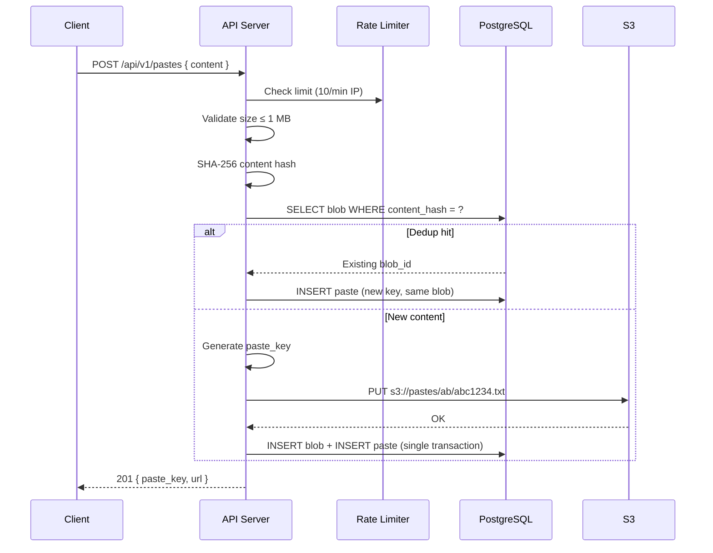
```mermaid
sequenceDiagram
    participant C as Client
    participant API as API Server
    participant RL as Rate Limiter
    participant DB as PostgreSQL
    participant S3 as S3

    C->>API: POST /api/v1/pastes { content }
    API->>RL: Check limit (10/min IP)
    API->>API: Validate size ≤ 1 MB
    API->>API: SHA-256 content hash
    API->>DB: SELECT blob WHERE content_hash = ?
    alt Dedup hit
        DB-->>API: Existing blob_id
        API->>DB: INSERT paste (new key, same blob)
    else New content
        API->>API: Generate paste_key
        API->>S3: PUT s3://pastes/ab/abc1234.txt
        S3-->>API: OK
        API->>DB: INSERT blob + INSERT paste (single transaction)
    end
    API-->>C: 201 { paste_key, url }
```


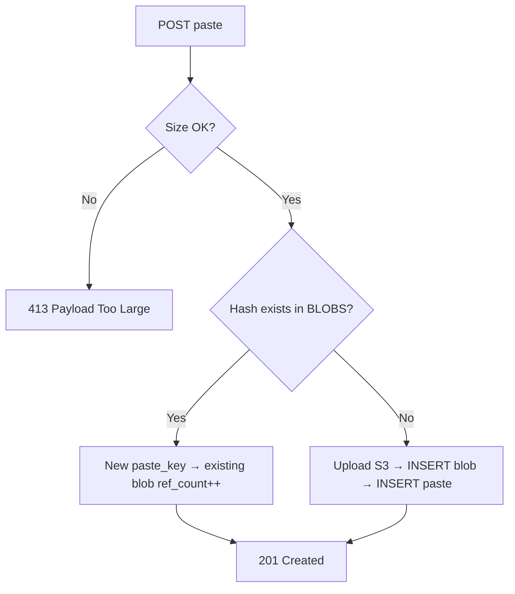
```mermaid
flowchart TD
    A[POST paste] --> B{Size OK?}
    B -->|No| E413[413 Payload Too Large]
    B -->|Yes| C{Hash exists in BLOBS?}
    C -->|Yes| D[New paste_key → existing blob ref_count++]
    C -->|No| E[Upload S3 → INSERT blob → INSERT paste]
    D --> F[201 Created]
    E --> F
```


---

**API flow: GET view paste**

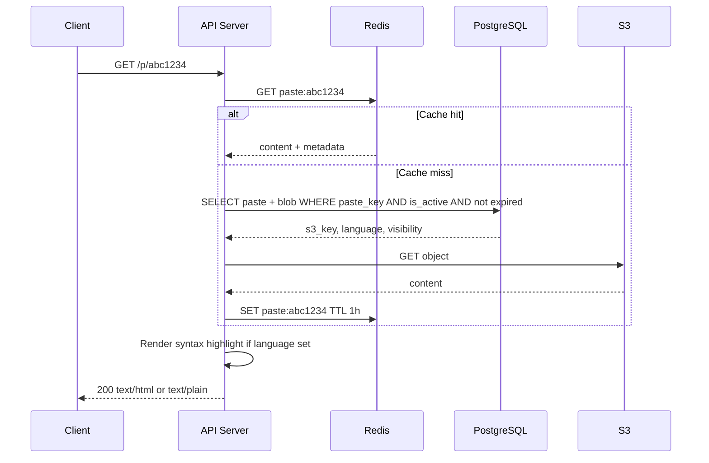
```mermaid
sequenceDiagram
    participant C as Client
    participant API as API Server
    participant Cache as Redis
    participant DB as PostgreSQL
    participant S3 as S3

    C->>API: GET /p/abc1234
    API->>Cache: GET paste:abc1234
    alt Cache hit
        Cache-->>API: content + metadata
    else Cache miss
        API->>DB: SELECT paste + blob WHERE paste_key AND is_active AND not expired
        DB-->>API: s3_key, language, visibility
        API->>S3: GET object
        S3-->>API: content
        API->>Cache: SET paste:abc1234 TTL 1h
    end
    API->>API: Render syntax highlight if language set
    API-->>C: 200 text/html or text/plain
```


---

**DB locks & consistency**


| Operation       | Strategy                                                                      | Why                                      |
| --------------- | ----------------------------------------------------------------------------- | ---------------------------------------- |
| Create paste    | Transaction: INSERT blob + INSERT paste OR dedup ref_count++                  | Atomic metadata + blob link              |
| S3 before DB?   | **DB last** — if DB fails, orphan S3 object; sweeper deletes orphans          | Avoid paste_key pointing to missing blob |
| Dedup ref_count | `UPDATE blobs SET ref_count = ref_count + 1 WHERE id = ?`                     | No row lock on read path                 |
| Expiry sweeper  | Batch `UPDATE pastes SET is_active=false WHERE expires_at < NOW() LIMIT 1000` | Off-peak                                 |
| View count      | Redis INCR + batch flush (same as TinyURL clicks)                             | Avoid row lock hotspot                   |


**Orphan S3 cleanup:** Nightly job lists S3 keys not referenced by any active paste → delete.

---


#### 1.2.2 Scalability challenges & solutions

**Capacity estimate**


| Metric         | Calculation                          | Result             |
| -------------- | ------------------------------------ | ------------------ |
| Pastes/month   | Given                                | 10M                |
| Write QPS peak | 10M × 3 factor ÷ (30×86400)          | ~**12 writes/sec** |
| Read QPS peak  | 50:1 × 12                            | ~**600 reads/sec** |
| S3 storage     | 10M/mo × 50 KB avg × 12 mo retention | ~**6 TB/year**     |
| Metadata DB    | 120M rows × 200 bytes                | ~**24 GB**         |


**Latency budget**


| Path               | p50   | p99                       |
| ------------------ | ----- | ------------------------- |
| Create (new blob)  | 80 ms | 200 ms (S3 PUT dominates) |
| Create (dedup hit) | 20 ms | 50 ms                     |
| Read (cache hit)   | 2 ms  | 10 ms                     |
| Read (S3 miss)     | 30 ms | 100 ms                    |


| Challenge                  | Solution                                                   |
| -------------------------- | ---------------------------------------------------------- |
| **Large pastes**           | Max 1 MB; multipart upload for > 5 MB if limit raised      |
| **Expiration at scale**    | Lazy delete on read + nightly sweeper + S3 lifecycle rules |
| **Anonymous abuse**        | Rate limit 10 pastes/min/IP; CAPTCHA after 20/day          |
| **Storage cost**           | S3 Intelligent-Tiering; Glacier for expired blobs          |
| **Two-system consistency** | Write S3 first, then DB; orphan cleanup job                |


---


#### 1.2.3 Pros & cons


| Pros                                     | Cons                                                            |
| ---------------------------------------- | --------------------------------------------------------------- |
| Metadata/blob split scales independently | Two systems to keep in sync                                     |
| Content dedup saves storage              | Dedup means same URL content for different keys — or share blob |
| Reuses TinyURL ID + cache patterns       | Syntax highlighting adds render CPU                             |


| Decision     | Choice                | Reason                                    |
| ------------ | --------------------- | ----------------------------------------- |
| Blob storage | S3 not DB             | 1 MB × millions = GBs; S3 is cheaper      |
| Dedup        | Optional content_hash | Saves storage for duplicate code snippets |
| Cache        | Redis for hot pastes  | 80/20 — few pastes get most views         |


---


#### 1.2.4 Production-ready checklist

- [ ] Idempotent create (`Idempotency-Key`)
- [ ] Visibility: public / unlisted / private
- [ ] Rate limit anonymous users (§1.3)
- [ ] Content moderation for public pastes
- [ ] Encryption at rest (S3 SSE)
- [ ] Orphan S3 cleanup job

**SLIs:** Create p99 < 200 ms · Read p99 < 100 ms · Availability 99.9%

---


#### 1.2.5 Cross-question patterns

→ **TinyURL** (short key, TTL) · **S3** (§4.2) · **Rate Limiter** (§1.3) · **ID Generator** (§1.4)


| Interviewer asks      | Answer                                                               |
| --------------------- | -------------------------------------------------------------------- |
| "Store 10 MB pastes?" | Multipart S3 upload; raise limit; never store in PostgreSQL          |
| "Private pastes?"     | `visibility=private`; GET requires auth or signed URL                |
| "Same content twice?" | Dedup via `content_hash`; two paste_keys can share one blob          |
| "Paste expired?"      | 404 on read; lazy delete; sweeper removes S3 object when ref_count=0 |


> **— End of §1.2 —**

---


### 1.3 Design an API Rate Limiter

**Goal:** Enforce request quotas per user/IP/API key to prevent abuse and ensure fair usage.

#### 1.3.1 Core design

**Clarifying questions**


| #   | Question                                | Why it matters               |
| --- | --------------------------------------- | ---------------------------- |
| 1   | Rate limit by IP, user ID, or API key?  | Key design in Redis          |
| 2   | Global limit or per-endpoint?           | Layered keys                 |
| 3   | Hard reject (429) or queue/throttle?    | UX vs protection             |
| 4   | Different tiers (free vs paid)?         | Config table                 |
| 5   | Fail-open or fail-closed if Redis down? | Availability vs security     |
| 6   | Burst allowed?                          | Token bucket vs leaky bucket |
| 7   | Distributed — multiple API servers?     | Centralized Redis required   |


**Assumptions:** Token bucket, per API key + per IP, 1000 req/min free tier, 10K req/min pro, fail-closed for login, fail-open for read APIs.

---

**Architecture**

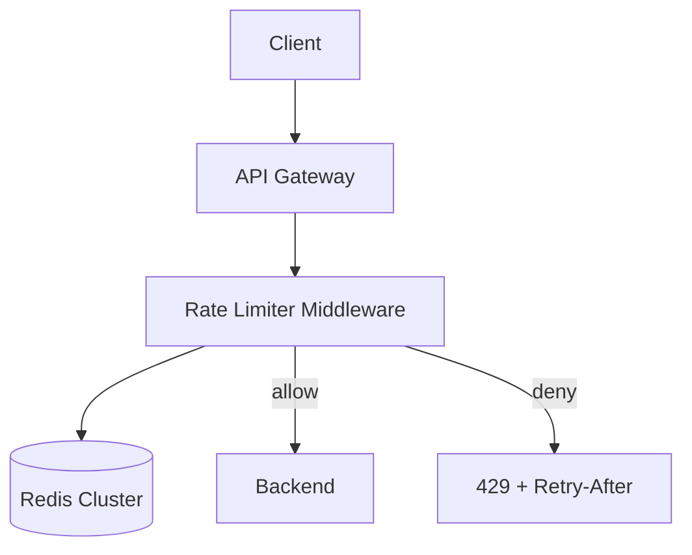
```mermaid
flowchart TB
    Client --> GW[API Gateway]
    GW --> RL[Rate Limiter Middleware]
    RL --> Redis[(Redis Cluster)]
    RL -->|allow| API[Backend]
    RL -->|deny| E429[429 + Retry-After]
```


**Redis key schema**


| Key pattern                     | Example                       | TTL  | Purpose              |
| ------------------------------- | ----------------------------- | ---- | -------------------- |
| `rl:token:{api_key}:{endpoint}` | `rl:token:sk_abc:/v1/urls`    | 60s  | Token bucket state   |
| `rl:fixed:{ip}:{window}`        | `rl:fixed:1.2.3.4:1700000000` | 60s  | Fixed window counter |
| `rl:login:{email}`              | `rl:login:user@x.com`         | 900s | Login attempts       |


**Token bucket state (Redis HASH):** `tokens` (float), `last_refill` (int ms).

**Algorithms**


| Algorithm              | Burst       | Boundary spike | Use case        |
| ---------------------- | ----------- | -------------- | --------------- |
| **Token bucket**       | Yes         | No             | GitHub, Stripe  |
| **Leaky bucket**       | No          | No             | Network QoS     |
| **Fixed window**       | Yes at edge | **2× spike**   | Simple only     |
| **Sliding window log** | Controlled  | No             | Login, payments |


---

**API flow: rate limit check**

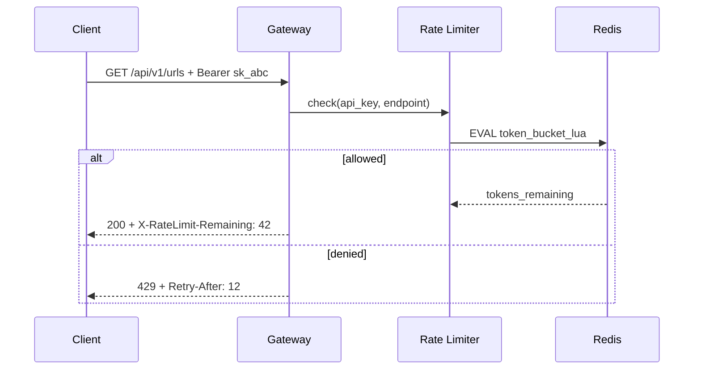
```mermaid
sequenceDiagram
    participant C as Client
    participant GW as Gateway
    participant RL as Rate Limiter
    participant Redis

    C->>GW: GET /api/v1/urls + Bearer sk_abc
    GW->>RL: check(api_key, endpoint)
    RL->>Redis: EVAL token_bucket_lua
    alt allowed
        Redis-->>RL: tokens_remaining
        GW-->>C: 200 + X-RateLimit-Remaining: 42
    else denied
        GW-->>C: 429 + Retry-After: 12
    end
```


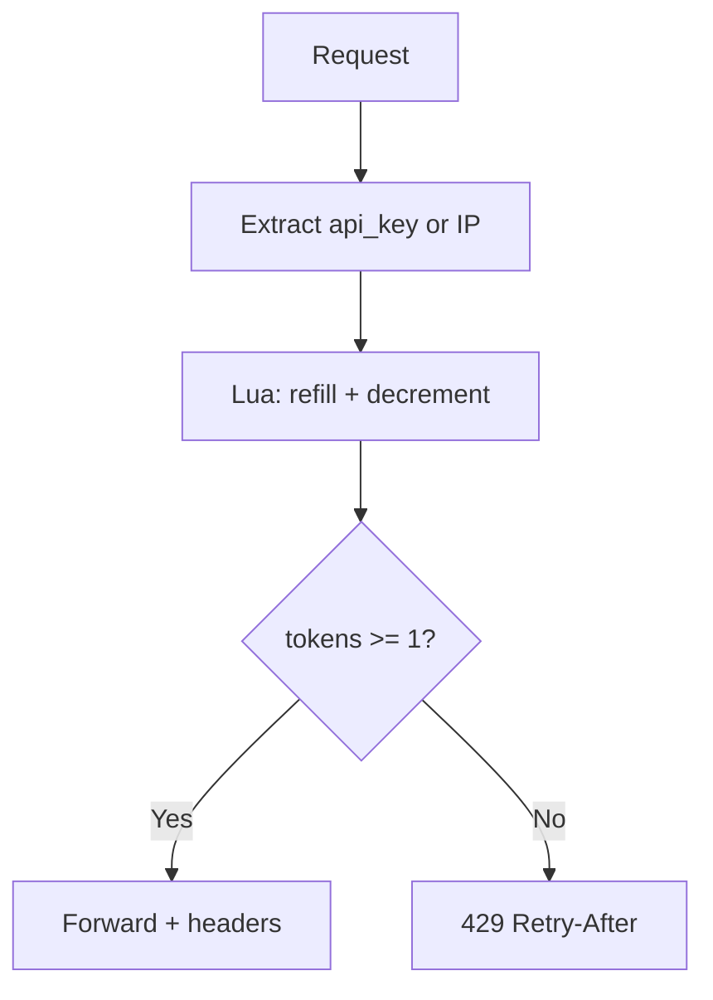
```mermaid
flowchart TD
    A[Request] --> B[Extract api_key or IP]
    B --> C[Lua: refill + decrement]
    C --> D{tokens >= 1?}
    D -->|Yes| E[Forward + headers]
    D -->|No| F[429 Retry-After]
```


**Rate tiers**


| Tier         | req/min    | Burst |
| ------------ | ---------- | ----- |
| Anonymous IP | 60         | 10    |
| Free API key | 1,000      | 100   |
| Pro API key  | 10,000     | 1,000 |
| Login        | 5 / 15 min | 0     |


**Concurrency:** Lua script for atomic read-modify-write; no DB locks.

---


#### 1.3.2 Scalability challenges & solutions


| Metric                    | Value                  |
| ------------------------- | ---------------------- |
| Redis check latency       | ~0.5–1 ms              |
| Throughput per Redis node | ~100K ops/sec          |
| System capacity           | ~50K req/sec (cluster) |


| Challenge        | Solution                               |
| ---------------- | -------------------------------------- |
| Race conditions  | Lua atomic script                      |
| Redis down       | Fail-open (reads) / fail-closed (auth) |
| Millions of keys | TTL auto-expire idle keys              |
| Layered limits   | Check global AND per-endpoint          |


---


#### 1.3.3 Pros & cons


| Pros                 | Cons                      |
| -------------------- | ------------------------- |
| Protects downstream  | +1 ms latency             |
| Tiered plans         | Redis dependency          |
| Standard 429 headers | Limit tuning is ops-heavy |


---


#### 1.3.4 Production-ready checklist

- [ ] `X-RateLimit-Limit`, `Remaining`, `Reset`, `Retry-After` headers
- [ ] Whitelist internal IPs
- [ ] Alert: 429 rate > 5% for 5 min
- [ ] Redis Cluster + replicas

**SLIs:** Check p99 < 2 ms

---


#### 1.3.5 Cross-question patterns

→ **TinyURL/Pastebin** · **Login** · **Every T2+ system**


| Interviewer asks  | Answer                                    |
| ----------------- | ----------------------------------------- |
| "Token vs leaky?" | Token = burst OK; leaky = smooth rate     |
| "Redis down?"     | Fail-open vs fail-closed by endpoint type |
| "100 servers?"    | Centralized Redis + Lua atomicity         |


> **— End of §1.3 —**

---


### 1.4 Design a Unique ID Generator

**Goal:** Generate globally unique, roughly sortable IDs at high throughput without coordination bottlenecks.

#### 1.4.1 Core design

**Clarifying questions**


| #   | Question                             | Why it matters         |
| --- | ------------------------------------ | ---------------------- |
| 1   | Sortable by time?                    | Snowflake vs UUID      |
| 2   | Numeric or short string?             | base62 encoding        |
| 3   | Multi-datacenter?                    | Machine ID bits for DC |
| 4   | QPS per node?                        | Sequence bit width     |
| 5   | Roughly increasing OK if clock skew? | NTP monitoring         |


**Assumptions:** 64-bit Snowflake, ~10K IDs/sec per node, base62 for public URLs, 1024 machine IDs.

---

**Snowflake layout (64 bits)**

```
| 0 sign | 41 timestamp (ms) | 10 machine_id | 12 sequence |
```


| Field      | Bits | Range                | Notes                        |
| ---------- | ---- | -------------------- | ---------------------------- |
| Sign       | 1    | 0                    | Always 0                     |
| Timestamp  | 41   | ~69 years from epoch | ms since custom epoch (2010) |
| Machine ID | 10   | 0–1023               | From ZooKeeper lease         |
| Sequence   | 12   | 0–4095 per ms        | Per-machine counter          |


**Max throughput:** 4096 IDs/ms = **~4M IDs/sec per machine** (sequence exhaust → wait next ms).

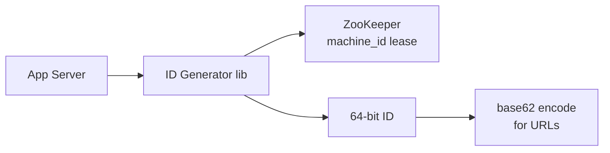
```mermaid
flowchart LR
    App[App Server] --> Gen[ID Generator lib]
    Gen --> ZK[ZooKeeper<br/>machine_id lease]
    Gen --> Out[64-bit ID]
    Out --> B62[base62 encode<br/>for URLs]
```


---

**Machine ID assignment flow**

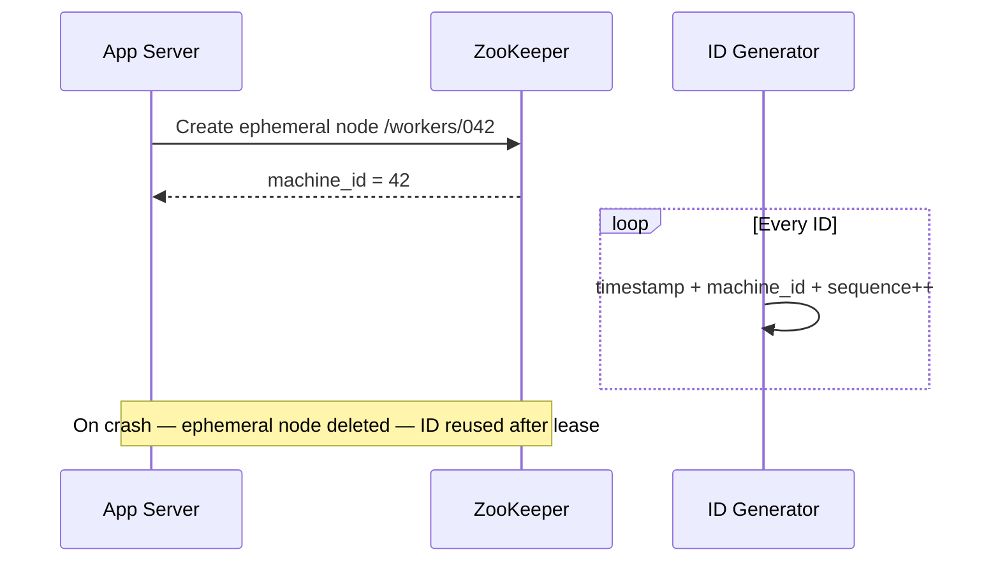
```mermaid
sequenceDiagram
    participant App as App Server
    participant ZK as ZooKeeper
    participant Gen as ID Generator

    App->>ZK: Create ephemeral node /workers/042
    ZK-->>App: machine_id = 42
    loop Every ID
        Gen->>Gen: timestamp + machine_id + sequence++
    end
    Note over App,ZK: On crash — ephemeral node deleted — ID reused after lease
```


**Alternatives**


| Approach          | Sortable | Coordination    | QPS       |
| ----------------- | -------- | --------------- | --------- |
| DB auto-increment | Yes      | DB every ID     | ~5K       |
| UUID v4           | No       | None            | Unlimited |
| Snowflake         | Yes      | Once at startup | ~4M/node  |
| Redis INCR        | Yes      | Redis per ID    | ~100K     |


---

**API (internal service)**


| Method | Endpoint                | Description                                  |
| ------ | ----------------------- | -------------------------------------------- |
| `POST` | `/internal/v1/ids`      | Generate batch of N IDs                      |
| `GET`  | `/internal/v1/ids/next` | Single ID (app libs usually embed generator) |


**Response:** `{ "id": 1234567890123456789, "encoded": "abc1234" }`

---

**Clock rollback handling**

```mermaid
flowchart TD
    A[Generate ID] --> B{current_ms >= last_ms?}
    B -->|Yes| C[Use current_ms, reset sequence]
    B -->|No| D{wait until last_ms?}
    D -->|within 5ms| E[Wait — clock catch up]
    D -->|> 5ms drift| F[Alert + reject — NTP broken]
    C --> G[sequence++ if same ms]
    G --> H{sequence > 4095?}
    H -->|Yes| I[Wait next millisecond]
    H -->|No| J[Return ID]
```


**No DB locks** — entirely in-process after machine_id assigned.

---


#### 1.4.2 Scalability challenges & solutions


| Metric           | Value                           |
| ---------------- | ------------------------------- |
| IDs/sec per node | ~400K typical; 4M max           |
| 100 nodes        | ~40M IDs/sec cluster-wide       |
| ID size          | 8 bytes BIGINT vs 16 bytes UUID |


| Challenge            | Solution                             |
| -------------------- | ------------------------------------ |
| Clock rollback       | Wait or alert; refuse if drift > 5ms |
| Sequence overflow    | Wait 1ms; or add machines            |
| Machine ID collision | ZooKeeper ephemeral sequential nodes |
| Multi-DC             | 5 bits DC + 5 bits worker = 10 bits  |


**Latency:** **~100 ns** per ID (in-process, no I/O).

---


#### 1.4.3 Pros & cons


| Pros                          | Cons                       |
| ----------------------------- | -------------------------- |
| No DB on hot path             | Clock dependency (NTP)     |
| Time-sortable → good sharding | Custom library to maintain |
| Compact 64-bit                | Machine ID ops (ZK/etcd)   |


---


#### 1.4.4 Production-ready checklist

- [ ] NTP/chrony on all nodes; alert on skew > 2ms
- [ ] Fallback UUID if generator throws
- [ ] Monitor sequence wait rate (sign of overload)
- [ ] Document epoch + bit layout for consumers

**SLIs:** ID gen p99 < 1 µs · Duplicate rate = 0

---


#### 1.4.5 Cross-question patterns

→ **TinyURL/Pastebin** paste_key · **Twitter** tweet ID · **Instagram** media ID


| Interviewer asks      | Answer                                           |
| --------------------- | ------------------------------------------------ |
| "UUID instead?"       | OK for uniqueness; lose sortability + 2× storage |
| "Clock goes back?"    | Wait or fail; NTP monitoring                     |
| "4096/ms not enough?" | Add machine IDs; 1024 machines × 4096/ms         |


> **— End of §1.4 —**

---


### 1.5 Design Typeahead / Autocomplete

**Goal:** Return top-K suggestions as the user types, with < 100ms latency.

#### 1.5.1 Core design

**Clarifying questions**


| #   | Question                        | Why it matters                  |
| --- | ------------------------------- | ------------------------------- |
| 1   | Corpus size? (1K vs 1B queries) | Trie in-memory vs Elasticsearch |
| 2   | Top K results?                  | Default K=10                    |
| 3   | Personalization required?       | Per-user cache layer            |
| 4   | Fuzzy match ("apl" → "apple")?  | Levenshtein cost                |
| 5   | Min chars before search?        | 2–3 chars typical               |
| 6   | Trending / fresh queries?       | Rebuild frequency               |


**Assumptions:** 10M unique queries, K=10, 2 char minimum, 100:1 read/write, trie + Redis cache, popularity ranking.

---

**Architecture**

```mermaid
flowchart TB
    User --> FE[Frontend debounce 150ms]
    FE --> API[Suggest API]
    API --> Cache[(Redis prefix:appl)]
    Cache -->|miss| Trie[(Trie / ES)]
    Trie --> Rank[Rank by frequency + CTR]
    Rank --> API
```


**Data schema**

```mermaid
erDiagram
    QUERIES {
        bigint id PK
        varchar_256 term UK "normalized lowercase"
        bigint search_count "popularity"
        bigint click_count "for CTR ranking"
        timestamp last_seen
    }

    QUERY_PREFIX_INDEX {
        varchar_64 prefix PK "first 3 chars"
        jsonb top_terms "precomputed top 50"
        timestamp updated_at
    }
```


**Trie node (in-memory)**


| Field         | Type            | Notes                                      |
| ------------- | --------------- | ------------------------------------------ |
| `children`    | map char → node | 26+ chars                                  |
| `is_terminal` | bool            | End of valid query                         |
| `frequency`   | int             | For ranking                                |
| `top_k`       | list            | Precomputed top suggestions at this prefix |


---

**API signatures**


| Method | Endpoint                          | Description                |
| ------ | --------------------------------- | -------------------------- |
| `GET`  | `/api/v1/suggest?q=appl&limit=10` | Autocomplete suggestions   |
| `POST` | `/internal/v1/queries/log`        | Log search + click (async) |


**GET response** `200`


| Field         | Type   | Example                                     |
| ------------- | ------ | ------------------------------------------- |
| `query`       | string | `"appl"`                                    |
| `suggestions` | array  | `[{ "term": "apple", "score": 0.95 }, ...]` |
| `latency_ms`  | int    | `12`                                        |


---

**API flow: GET suggest**

```mermaid
sequenceDiagram
    participant U as User
    participant FE as Frontend
    participant API as Suggest API
    participant Redis
    participant Trie

    U->>FE: types "a"
    Note over FE: debounce — no request yet
    U->>FE: types "appl"
    FE->>API: GET /suggest?q=appl (cancel prior)
    API->>Redis: GET suggest:appl
    alt cache hit
        Redis-->>API: JSON suggestions
    else miss
        API->>Trie: prefix_search("appl", limit=10)
        Trie-->>API: candidates
        API->>API: rank by frequency × CTR
        API->>Redis: SET suggest:appl TTL 300s
    end
    API-->>FE: 200 suggestions
    FE-->>U: Render dropdown
```


```mermaid
flowchart TD
    A[GET q=appl] --> B{len q >= 2?}
    B -->|No| C[400 or empty]
    B -->|Yes| D{Redis hit?}
    D -->|Yes| E[Return cached]
    D -->|No| F[Trie prefix walk]
    F --> G[Rank top K]
    G --> H[Cache + return]
```


**Frontend debounce flow**

```mermaid
sequenceDiagram
    participant U as User
    participant FE as Frontend

    U->>FE: "a" — timer start 150ms
    U->>FE: "ap" — cancel timer, restart
    U->>FE: "app" — cancel, restart
    U->>FE: "appl" — timer fires
    FE->>FE: fetch /suggest?q=appl
```


---

**Ranking formula (simplified)**


| Signal             | Weight | Source               |
| ------------------ | ------ | -------------------- |
| Search frequency   | 0.5    | `search_count`       |
| Click-through rate | 0.3    | clicks / impressions |
| Recency boost      | 0.2    | `last_seen` decay    |


**No DB locks on read path** — trie is read-only between rebuilds; updates via batch job.

---


#### 1.5.2 Scalability challenges & solutions

**Capacity**


| Metric                | Value                                              |
| --------------------- | -------------------------------------------------- |
| Read QPS peak         | ~50K (search boxes worldwide)                      |
| Trie memory           | ~10M terms × 50 bytes ≈ **500 MB** (fits one node) |
| Cache hit rate target | > 90% for top prefixes                             |
| Rebuild time          | ~5 min offline or double-buffer swap               |


**Latency budget**


| Step                 | ms           |
| -------------------- | ------------ |
| Network + API        | 5–20         |
| Redis hit            | 1            |
| Trie walk            | 0.1–1        |
| **Total p99 target** | **< 100 ms** |


| Challenge        | Solution                                    |
| ---------------- | ------------------------------------------- |
| Trie too large   | Shard by first 2 chars across nodes         |
| Trending queries | Overlay hot cache; rebuild every 5 min      |
| Thundering herd  | Cache popular prefixes; single-flight mutex |
| Personalization  | Generic trie + small per-user Redis overlay |


---


#### 1.5.3 Pros & cons


| Pros                              | Cons                                      |
| --------------------------------- | ----------------------------------------- |
| O(k) prefix lookup                | Trie rebuild downtime (use double buffer) |
| Redis handles 90%+ traffic        | Personalization explodes cache keys       |
| ES alternative scales to billions | ES adds ops complexity                    |


---


#### 1.5.4 Production-ready checklist

- [ ] Client debounce 150–300 ms; abort stale requests
- [ ] Min 2 chars; max q length 100
- [ ] Log impressions + clicks for ranking loop
- [ ] Fallback: return trending queries if trie down
- [ ] A/B test ranking weights

**SLIs:** Suggest p99 < 100 ms · Cache hit > 90%

---


#### 1.5.5 Cross-question patterns

→ **Google Search** (§4.4) · **Yelp** (§2.5) · **Twitter** hashtag search


| Interviewer asks      | Answer                                                   |
| --------------------- | -------------------------------------------------------- |
| "1 billion queries?"  | Elasticsearch completion suggester; shard trie           |
| "Personalized?"       | Base trie + user history overlay in Redis                |
| "Typo tolerance?"     | Levenshtein on top-100 candidates only — not full corpus |
| "Real-time trending?" | Kafka stream updates hot cache between rebuilds          |


> **— End of §1.5 —**

> **— End of Section 1 · T1 · Warm-ups —**

---


## 2. T2 · The Classics

The must-know FAANG canon. These combine multiple T1 patterns — **feeds, fan-out, media storage, real-time messaging, geospatial queries** — and appear most frequently in interviews.

### T2 - Shared Patterns


| Pattern                              | Used in                    |
| ------------------------------------ | -------------------------- |
| Fan-out on write vs read             | Twitter, Instagram         |
| Object storage + CDN                 | Instagram, Twitter (media) |
| WebSockets / long polling            | Messenger                  |
| Geospatial index (QuadTree, Geohash) | Yelp, Uber                 |
| Timeline cache (Redis sorted set)    | Twitter, Instagram feed    |


---


### 2.1 Design Twitter

**Goal:** Post tweets, follow users, read personalized home timeline at scale (300M+ MAU, ~6K tweets/sec write, ~600K timeline reads/sec peak).

#### 2.1.1 Core design

**Clarifying questions to ask the interviewer**

| # | Question | Why it matters |
| --- | --- | --- |
| 1 | What's the read-to-write ratio for timelines vs tweets? | Fan-out on write vs read tradeoff; cache sizing |
| 2 | Do we need retweets, quotes, replies, threads? | Graph complexity; dedup and ranking in timeline merge |
| 3 | Celebrity threshold for fan-out strategy? | Hybrid model boundary — typically 10K–100K followers |
| 4 | Real-time vs near-real-time timeline? | WebSocket push vs poll; SLA for 'tweet appears in feed' |
| 5 | Search scope — users, tweets, hashtags? | Separate Elasticsearch pipeline vs in-DB full-text |
| 6 | Media attachments — photos, video, polls? | Object storage + CDN; async transcoding |
| 7 | Global or single-region MVP? | Multi-region timeline cache; write primary region |
| 8 | Analytics — impressions, engagement? | Async event stream; don't block read path |

**Assumptions for this design:** 300M MAU, 200M tweets/day, 80% users < 1K followers, 0.1% celebrities (>1M followers), hybrid fan-out, Snowflake tweet IDs, media in object storage (§4.2 pattern).

---

**High-level architecture**

```mermaid

flowchart TB
    Client --> LB[Load Balancer]
    LB --> API[API Gateway]
    API --> RL[Rate Limiter §1.3]
    API --> TweetSvc[Tweet Service]
    API --> TimelineSvc[Timeline Service]
    API --> SocialSvc[Social Graph Service]
    TweetSvc --> TweetDB[(Tweet Store<br/>Cassandra / sharded SQL)]
    TweetSvc --> Media[Media Service → Object Store §4.2]
    TweetSvc --> FanOut[Fan-out Worker]
    FanOut --> TimelineCache[(Timeline Cache<br/>Redis sorted sets)]
    SocialSvc --> GraphDB[(Follow Graph DB)]
    TimelineSvc --> TimelineCache
    TimelineSvc --> TweetDB
    TweetSvc --> SearchIdx[Kafka → Elasticsearch]
    FanOut --> Notify[Notification §3.4]

```

| Component | Choice | Why |
| --- | --- | --- |
| Tweet store | Cassandra / sharded PostgreSQL | Time-ordered tweets; high write throughput |
| Timeline cache | Redis sorted sets (tweet_id score) | Pre-computed home feeds for normal users |
| Fan-out | Async workers (Kafka consumers) | Decouple post from follower timeline writes |
| Social graph | Dedicated service + adjacency lists | Follow/unfollow; celebrity detection |
| Search | Elasticsearch (async index) | Hashtag and full-text; not on critical path |
| IDs | Snowflake §1.4 | Time-sortable tweet_id for timeline ordering |

---

**Database ER diagram**

```mermaid

erDiagram

USERS ||--o{ TWEETS : posts
    USERS ||--o{ FOLLOWS : follows
    USERS ||--o{ LIKES : likes
    TWEETS ||--o{ LIKES : receives
    TWEETS ||--o{ MEDIA : has

    USERS {
        bigint user_id PK
        varchar_255 username UK
        varchar_255 display_name
        int follower_count "denormalized"
        int following_count
        boolean is_celebrity "follower_count > threshold"
        timestamp created_at
    }

    TWEETS {
        bigint tweet_id PK "Snowflake"
        bigint user_id FK
        text content "max 280 chars"
        bigint reply_to_tweet_id FK "nullable"
        bigint retweet_of_id FK "nullable"
        timestamp created_at
        boolean is_deleted
    }

    FOLLOWS {
        bigint follower_id FK
        bigint followee_id FK
        timestamp created_at
    }

    LIKES {
        bigint user_id FK
        bigint tweet_id FK
        timestamp created_at
    }

    MEDIA {
        bigint media_id PK
        bigint tweet_id FK
        varchar_512 object_url
        varchar_20 media_type "image | video"
        varchar_512 thumbnail_url "nullable"
    }

```

**Indexes**

| Table | Index | Purpose |
| --- | --- | --- |
| `TWEETS` | `PRIMARY (tweet_id)` | Point lookup by ID |
| `TWEETS` | `(user_id, created_at DESC)` | User profile timeline |
| `FOLLOWS` | `(follower_id, followee_id)` UNIQUE | Graph lookup; fan-out source |
| `FOLLOWS` | `(followee_id)` | Reverse index for follower count |
| Timeline Redis | `ZSET timeline:{user_id}` score=tweet_id | Home feed — top 800 tweets |

---

**API signatures**

| Method | Endpoint | Auth | Description |
| --- | --- | --- | --- |
| `POST` | `/api/v1/tweets` | Auth required | Create tweet |
| `GET` | `/api/v1/timeline/home` | Auth required | Home timeline (cursor paginated) |
| `GET` | `/api/v1/users/{id}/tweets` | Optional | Profile timeline |
| `POST` | `/api/v1/users/{id}/follow` | Auth required | Follow user |
| `DELETE` | `/api/v1/users/{id}/follow` | Auth required | Unfollow |
| `GET` | `/api/v1/tweets/{tweet_id}` | Optional | Single tweet lookup |

**POST** `/api/v1/tweets` **— request**


| Field | Type | Required | Notes |
| --- | --- | --- | --- |
| `content` | string | Yes | Max 280 chars |
| `media_ids` | array of bigint | No | Pre-uploaded media |
| `reply_to_tweet_id` | bigint | No | Thread reply |
**POST** `/api/v1/tweets` **— response** `201 Created`


| Field | Type | Example |
| --- | --- | --- |
| `tweet_id` | bigint | `9876543210` |
| `created_at` | datetime | ISO 8601 |
| `url` | string | Permalink |

---

**API flow: POST `/api/v1/tweets` (Create + fan-out)**

```mermaid

sequenceDiagram

participant C as Client
    participant API as Tweet Service
    participant DB as Tweet Store
    participant K as Kafka
    participant FO as Fan-out Worker
    participant R as Redis Timeline
    participant TL as Timeline Service

    C->>API: POST /api/v1/tweets
    API->>API: Validate + rate limit §1.3
    API->>DB: INSERT tweet (Snowflake ID)
    DB-->>API: OK
    API->>K: Publish tweet.created event
    API-->>C: 201 + tweet_id
    K->>FO: Consume event
    alt Author is celebrity
        FO->>FO: Skip fan-out — mark for read merge
    else Normal user
        FO->>FO: Fetch follower list (paginated)
        loop Each follower batch
            FO->>R: ZADD timeline:{follower_id} tweet_id
        end
    end
    C->>TL: GET /timeline/home
    TL->>R: ZREVRANGE timeline:{user_id}
    TL->>TL: Merge celebrity tweets (pull model)
    TL-->>C: 200 JSON tweets

```

```mermaid

flowchart TD

A[POST tweet] --> B{Rate limit OK?}
    B -->|No| E429[429]
    B -->|Yes| C[INSERT tweet DB]
    C --> D[Publish Kafka event]
    D --> E{Celebrity author?}
    E -->|Yes| F[Skip fan-out]
    E -->|No| G[Fan-out to follower timelines]
    G --> H[ZADD Redis per follower]
    F --> I[201 Created]
    H --> I

```

---

**DB locks & concurrency**

| Operation | Lock strategy | Why |
| --- | --- | --- |
| Create tweet | No row lock — append-only INSERT | Snowflake ID avoids coordination |
| Fan-out to timeline | Redis ZADD per follower key — no cross-key transaction | Partial fan-out OK; eventual consistency |
| Follow/unfollow | INSERT/DELETE on FOLLOWS with UNIQUE constraint | Optimistic; retry on conflict |
| Like tweet | INSERT UNIQUE (user_id, tweet_id) — idempotent | Avoid double-like race |
| Celebrity flag update | Async job when follower_count crosses threshold | Avoid blocking follow path |

```mermaid

flowchart LR
    subgraph WritePath["Tweet write — no timeline locks"]
        T[New tweet] --> K[Kafka]
        K --> W[Fan-out workers]
        W --> R[Redis ZADD per user]
    end

```

---

#### 2.1.2 Scalability challenges & solutions

**Capacity estimate**

| Metric | Calculation | Result |
| --- | --- | --- |
| Tweets/day | 200M given | 200M |
| Write QPS peak | 200M ÷ 86400 × 3 | ~7K/sec |
| Timeline read QPS | 300M DAU × 20 loads × 3 peak ÷ 86400 | ~**200K/sec** |
| Storage (tweets) | 200M/day × 365 × 500 B × 5 yr retention | ~**180 TB** |
| Timeline Redis | 300M users × 800 IDs × 8 B (active 30%) | ~**580 GB** |

**Latency budget**

| Path | Step | Latency |
| --- | --- | --- |
| Post tweet | Validate + INSERT + Kafka produce | 30–80 ms |
| Home timeline (cache hit) | Redis ZREVRANGE + hydrate tweets | 50–100 ms |
| Home timeline (+ celebrities) | Cache + pull 10 celebrity feeds | 100–200 ms |
| Fan-out completion | Async — user sees own tweet immediately | 1–30 sec for followers |

**Target SLAs**

| Operation | p50 | p99 | How to improve |
| --- | --- | --- | --- |
| Post tweet | < 100 ms | < 300 ms | Async fan-out; don't wait for all followers |
| Home timeline p99 | < 150 ms | < 400 ms | Redis cluster; celebrity list capped at 50 |
| Fan-out lag | < 5 sec p99 | < 30 sec | Scale fan-out workers with Kafka lag alert |
| Search index freshness | < 30 sec | < 2 min | Kafka consumer lag monitoring |

| Challenge | Solution |
| --- | --- |
| Celebrity fan-out (80M followers) | Fan-out on read — merge at timeline fetch; cap pulled celebrities |
| Hot user timeline | Shard Redis; local cache for top 1000 users |
| Stale timeline after follow | Backfill last N tweets from new followee on follow event |
| Tweet deletion | Fan-out removal job — ZREM from all follower timelines (async) |
| Thundering herd on breaking news | Rate limit reads; CDN for static assets; read replicas |
| Graph at scale | Shard social graph by user_id; cache follower lists |

---

#### 2.1.3 Pros & cons

| Pros | Cons |
| --- | --- |
| Hybrid fan-out balances read/write for typical users | Celebrity merge adds read-path complexity |
| Pre-computed timelines = fast scroll experience | Fan-out lag — followers see delay |
| Kafka decouples post from distribution | Unfollow/delete requires reverse fan-out cleanup |
| Well-known interview pattern | Retweets/quotes need dedup in merge logic |

**Design decision summary for interviewer**

| Decision | Choice | Alternative rejected | Reason |
| --- | --- | --- | --- |
| Fan-out strategy | Hybrid (write for normal, read for celebrity) | Pure fan-out on write | O(followers) write explosion for celebrities |
| Timeline store | Redis sorted sets | PostgreSQL only | Sub-ms range queries at scale |
| Tweet IDs | Snowflake §1.4 | UUID | Time-sortable; natural cursor pagination |
| Search | Async Elasticsearch | DB full-text | Isolation from write/read hot paths |

---

#### 2.1.4 Production-ready checklist

**Reliability**

- [ ] Idempotent tweet create (client request_id + dedup window)
- [ ] Fan-out worker idempotency (Kafka exactly-once or at-least-once + dedup)
- [ ] Graceful degradation — timeline without celebrity merge if timeout
- [ ] Circuit breaker on Elasticsearch for profile search

**Security & compliance**

- [ ] Rate limit posts: 100/day free, higher for verified §1.3
- [ ] Content moderation pipeline (ML + human queue)
- [ ] Block/mute reflected in timeline filter
- [ ] GDPR — delete tweet cascades fan-out removal

**Monitoring & SLIs**

| SLI | SLO target | Alert if |
| --- | --- | --- |
| Timeline read availability | 99.95% | Error rate > 0.05% for 5 min |
| Post success rate | 99.9% | > 0.1% 5xx |
| Fan-out Kafka lag | < 30 sec p99 | Lag > 2 min |
| Timeline p99 latency | < 400 ms | > 800 ms |

---

#### 2.1.5 Cross-question patterns

→ **Instagram** (§2.2 same fan-out feed) · **Notification** (§3.4 new tweet alerts) · **TinyURL** (§1.1 link previews) · **Rate Limiter** (§1.3 post limits) · **ID Generator** (§1.4 Snowflake)

**Follow-up questions the interviewer may ask — and where to point**

| Interviewer asks | Answer in this design |
| --- | --- |
| What if Bieber tweets? | Celebrity bucket — fan-out on read; merge top 50 followed celebrities at read |
| How long until followers see tweet? | Author instant; followers 1–30 sec depending on fan-out lag |
| Design retweets | Store retweet_of_id; fan-out original to timelines; dedup in merge |
| 10× traffic spike? | Scale API + fan-out workers; Redis cluster; Kafka partition count |
| Consistent ordering? | Snowflake tweet_id as ZSET score — global time order |

> **— End of §2.1 —**


---


### 2.2 Design Instagram

**Goal:** Upload/share photos and videos, follow users, scroll an infinite media-rich feed with low latency (500M+ MAU, heavy read bias).

#### 2.2.1 Core design

**Clarifying questions to ask the interviewer**

| # | Question | Why it matters |
| --- | --- | --- |
| 1 | Photo-only or video/Reels/Stories too? | Transcoding pipeline, TTL for Stories, separate feeds |
| 2 | Max image/video size and formats? | Upload chunking, CDN origin, storage cost |
| 3 | Feed algorithm — chronological or ranked? | ML ranking service vs simple fan-out §2.1 |
| 4 | Direct messaging in scope? | Separate real-time stack §2.3 |
| 5 | Global CDN requirement? | Multi-region object storage, edge caching |
| 6 | Like/comment counts — real-time? | Counter sharding vs async aggregation |
| 7 | Content moderation — pre or post publish? | Upload quarantine, async ML scan |
| 8 | Expected upload QPS vs feed read QPS? | Write path vs read cache investment |

**Assumptions for this design:** 500M MAU, 100M posts/day, 100:1 read/write on feed, hybrid fan-out like §2.1, images + short video, ranked feed v2 with ML scores, object storage + CDN (§4.2).

---

**High-level architecture**

```mermaid

flowchart TB
    Client --> LB[Load Balancer]
    LB --> API[API Gateway]
    API --> Upload[Upload Service]
    API --> FeedSvc[Feed Service]
    API --> MediaProc[Media Processing]
    Upload --> ObjStore[(Object Storage §4.2)]
    Upload --> MetaDB[(Post Metadata DB)]
    MediaProc --> Transcode[Transcode Workers]
    Transcode --> ObjStore
    MediaProc --> CDN[CDN Edge]
    FeedSvc --> Rank[Ranking Service]
    FeedSvc --> TimelineCache[(Feed Cache Redis)]
    MetaDB --> FanOut[Fan-out Worker §2.1]
    FanOut --> TimelineCache
    Rank --> FeatureStore[(Feature Store §3.5)]

```

| Component | Choice | Why |
| --- | --- | --- |
| Object storage | S3-compatible + CDN | Original + resized variants; §4.2 pattern |
| Post metadata | Cassandra / PostgreSQL | Captions, user_id, timestamps, media refs |
| Media processing | Async worker pool (FFmpeg) | Thumbnails, multiple resolutions, video HLS |
| Feed cache | Redis sorted sets + media URLs | Same fan-out model as §2.1 |
| Ranking | ML service (offline + online) | Re-rank candidate feed items by engagement score |
| Upload | Pre-signed URLs + multipart | Direct client → object store; API stores metadata after |

---

**Database ER diagram**

```mermaid

erDiagram

USERS ||--o{ POSTS : creates
    USERS ||--o{ FOLLOWS : follows
    POSTS ||--o{ MEDIA_ASSETS : contains
    POSTS ||--o{ LIKES : receives
    POSTS ||--o{ COMMENTS : has

    USERS {
        bigint user_id PK
        varchar_255 username UK
        varchar_512 avatar_url
        timestamp created_at
    }

    POSTS {
        bigint post_id PK "Snowflake §1.4"
        bigint user_id FK
        text caption "max 2200 chars"
        varchar_20 post_type "photo | video | carousel"
        varchar_20 status "processing | published | removed"
        timestamp created_at
    }

    MEDIA_ASSETS {
        bigint asset_id PK
        bigint post_id FK
        varchar_512 original_url
        varchar_512 thumbnail_url
        varchar_512 medium_url
        varchar_512 hls_playlist_url "video only"
        int width
        int height
        bigint size_bytes
    }

    LIKES {
        bigint user_id FK
        bigint post_id FK
        timestamp created_at
    }

    COMMENTS {
        bigint comment_id PK
        bigint post_id FK
        bigint user_id FK
        text content
        timestamp created_at
    }

```

**Indexes**

| Table | Index | Purpose |
| --- | --- | --- |
| `POSTS` | `(user_id, created_at DESC)` | Profile grid |
| `POSTS` | `(status, created_at)` WHERE processing | Processing queue sweeper |
| `MEDIA_ASSETS` | `(post_id)` | Hydrate feed cards |
| Feed Redis | `ZSET feed:{user_id}` | Candidate post IDs for ranking |

---

**API signatures**

| Method | Endpoint | Auth | Description |
| --- | --- | --- | --- |
| `POST` | `/api/v1/media/upload-url` | Auth | Get pre-signed upload URL |
| `POST` | `/api/v1/posts` | Auth | Create post after upload completes |
| `GET` | `/api/v1/feed` | Auth | Ranked home feed (cursor) |
| `GET` | `/api/v1/posts/{id}` | Optional | Single post detail |
| `POST` | `/api/v1/posts/{id}/like` | Auth | Like post (idempotent) |
| `GET` | `/api/v1/users/{id}/posts` | Optional | Profile posts |

**POST** `/api/v1/posts` **— request**


| Field | Type | Required | Notes |
| --- | --- | --- | --- |
| `media_asset_ids` | array | Yes | From completed upload |
| `caption` | string | No | Max 2200 chars |
| `location_tag` | object | No | lat/lng + place name §2.5 |

---

**API flow: POST `/api/v1/posts` (Upload → publish → fan-out)**

```mermaid

sequenceDiagram

participant C as Client
    participant API as API
    participant S3 as Object Store
    participant MQ as Kafka
    participant MP as Media Processor
    participant DB as Metadata DB
    participant FO as Fan-out
    participant CDN as CDN

    C->>API: POST /media/upload-url
    API-->>C: pre-signed URL
    C->>S3: PUT image bytes
    C->>API: POST /posts {media_asset_ids}
    API->>DB: INSERT post status=processing
    API->>MQ: post.created
    API-->>C: 202 Accepted
    MQ->>MP: Transcode + resize
    MP->>S3: Write variants
    MP->>CDN: Purge/warm cache
    MP->>DB: UPDATE status=published
    MQ->>FO: Fan-out to followers §2.1
    C->>API: GET /feed
    API->>API: Fetch candidates + ML rank
    API-->>C: Feed with CDN URLs

```

```mermaid

flowchart TD

A[Client uploads to S3] --> B[POST /posts metadata]
    B --> C[Status: processing]
    C --> D[Async transcode]
    D --> E{Success?}
    E -->|No| F[Mark failed + notify user]
    E -->|Yes| G[Publish + fan-out]
    G --> H[Feed available]

```

---

**DB locks & concurrency**

| Operation | Lock strategy | Why |
| --- | --- | --- |
| Create post | INSERT metadata; object immutability in S3 | Upload completes before publish |
| Like counter | Redis INCR + periodic flush §1.1 pattern | Avoid row lock on viral posts |
| Fan-out | Same as §2.1 — per-follower Redis ZADD | No global lock |
| Processing status | Optimistic UPDATE WHERE status=processing | Single worker claims job |

---

#### 2.2.2 Scalability challenges & solutions

**Capacity estimate**

| Metric | Calculation | Result |
| --- | --- | --- |
| Posts/day | 100M | 100M |
| Feed read QPS peak | 500M DAU × 30 scrolls × 3 peak ÷ 86400 | ~**520K/sec** |
| Upload write QPS | 100M ÷ 86400 × 3 | ~3.5K/sec |
| Object storage | 100M × 2 MB avg × 365 × 3 variants | ~**220 PB/year** — tiered/lifecycle |
| CDN egress | Dominated by video — 80% cache hit at edge | Multi-CDN strategy |

**Latency budget**

| Path | Step | Latency |
| --- | --- | --- |
| Feed load (cached candidates) | Redis + rank + hydrate URLs | 80–150 ms |
| Image upload (client→S3) | Direct upload | 1–5 sec (network bound) |
| Post visible after upload | Transcode async | 2–30 sec |
| Thumbnail first byte | CDN edge | 20–50 ms |

**Target SLAs**

| Operation | p50 | p99 | How to improve |
| --- | --- | --- | --- |
| Feed p99 | < 200 ms | < 500 ms | Pre-compute rank cache for top users |
| Upload API | < 100 ms | < 300 ms | Pre-signed URL — no bytes through API |
| Media processing p99 | < 30 sec | < 2 min | Priority queue for verified users |
| CDN cache hit ratio | > 90% | < 85% |

| Challenge | Solution |
| --- | --- |
| Large video uploads | Multipart pre-signed; resume tokens; client-side compression |
| Feed ranking latency | Two-stage: cheap fan-out candidates → top 50 ML re-rank |
| Storage cost | Lifecycle to cold tier; delete orphaned uploads after 24h |
| Celebrity fan-out | Reuse §2.1 hybrid model |
| Hot post (viral) | CDN cache media; Redis counter sharding for likes |
| Global latency | CDN + regional metadata read replicas |

---

#### 2.2.3 Pros & cons

| Pros | Cons |
| --- | --- |
| Pre-signed upload offloads bandwidth from API | Async processing — delayed publish |
| CDN-first media delivery scales reads | Storage and egress dominate cost |
| Reuses Twitter fan-out patterns §2.1 | Ranking adds ML infra complexity |
| Multiple resolutions improve UX on mobile | Transcode queue backlog under spike |

**Design decision summary for interviewer**

| Decision | Choice | Alternative rejected | Reason |
| --- | --- | --- | --- |
| Upload path | Direct-to-object-store | Through API server | Avoids API as bandwidth bottleneck |
| Feed order | ML ranked over chronological | Pure chronological | Engagement product requirement |
| Like counts | Redis INCR + async flush | Sync DB update | §1.1 click-count pattern |
| Video delivery | HLS via CDN | Single MP4 progressive | Adaptive bitrate on mobile networks |

---

#### 2.2.4 Production-ready checklist

**Reliability**

- [ ] Multipart upload cleanup for abandoned sessions
- [ ] Idempotent post create (upload_id dedup)
- [ ] Dead-letter queue for failed transcodes
- [ ] Fallback to chronological feed if ranker down

**Security & compliance**

- [ ] Scan uploads for malware (async ClamAV / cloud AV)
- [ ] CSAM detection pipeline — quarantine before CDN
- [ ] Rate limit uploads per user §1.3
- [ ] Signed CDN URLs for private accounts

**Monitoring & SLIs**

| SLI | SLO target | Alert if |
| --- | --- | --- |
| Feed availability | 99.95% | 5xx > 0.05% |
| Media processing success | 99.5% | < 99% over 1 hr |
| CDN origin load | < 15% of total egress | Origin spike alert |
| Feed p99 latency | < 500 ms | > 1 sec |

---

#### 2.2.5 Cross-question patterns

→ **Twitter** (§2.1 fan-out) · **S3** (§4.2 object storage) · **Netflix Recs** (§3.5 ranking) · **Yelp** (§2.5 location tags) · **YouTube** (§4.1 video pipeline)

**Follow-up questions the interviewer may ask — and where to point**

| Interviewer asks | Answer in this design |
| --- | --- |
| Design Stories (24h TTL)? | Separate Redis ZSET with expiry; cron purge; no fan-out to permanent feed |
| How handle 4K video? | Adaptive bitrate ladder; cap upload; background transcode priority tiers |
| Private account feed? | Filter candidates at read — only followers in fan-out set |
| Explore page vs home? | Explore = offline computed interest graph + cached popular posts |
| Duplicate upload detection? | Perceptual hash on upload; block or link to existing |

> **— End of §2.2 —**


---


### 2.3 Design Facebook Messenger / WhatsApp

**Goal:** 1:1 and group messaging with delivery/read receipts, online presence, and end-to-end encryption option at billions of users.

#### 2.3.1 Core design

**Clarifying questions to ask the interviewer**

| # | Question | Why it matters |
| --- | --- | --- |
| 1 | 1:1 only or groups — max group size? | Fan-out write amplification; group sync protocol |
| 2 | E2E encryption required? | Server can't read content; key exchange; metadata still visible |
| 3 | Message ordering guarantees? | Per-chat total order vs causal; sequence numbers |
| 4 | Offline delivery — store-and-forward? | Queue per device; TTL for undelivered messages |
| 5 | Media messages — photos, voice? | Object storage §4.2; thumbnail inline; CDN |
| 6 | Read receipts and typing indicators? | Real-time push; privacy settings |
| 7 | Cross-device sync (phone + web)? | Device registry; multi-device session routing |
| 8 | Message retention / delete for everyone? | Tombstone broadcast; compliance holds |

**Assumptions for this design:** 2B users, 100B messages/day, median group 5 members, max group 256, WebSocket long-lived connections, Cassandra message store, Redis for presence, optional E2E for 1:1.

---

**High-level architecture**

```mermaid

flowchart TB
    Client -->|WebSocket| GW[Connection Gateway]
    GW --> Router[Message Router]
    Router --> ChatSvc[Chat Service]
    ChatSvc --> MsgDB[(Message Store<br/>Cassandra)]
    ChatSvc --> SeqSvc[Sequence Service]
    Router --> Presence[(Presence Redis)]
    Router --> Push[Push Notification §3.4]
    ChatSvc --> Media[Media Service → S3 §4.2]
    Router --> OfflineQ[(Offline Queue<br/>per user-device)]
    GW --> Sync[Multi-device Sync]

```

| Component | Choice | Why |
| --- | --- | --- |
| Connection gateway | WebSocket servers (sticky sessions) | Millions of concurrent connections |
| Message store | Cassandra partitioned by chat_id | Append-only; time-ordered queries |
| Sequence service | Per-chat monotonic counter (Redis/DB) | Total ordering within conversation |
| Presence | Redis heartbeat + TTL | Online/last-seen; §2.5 nearby pattern for status |
| Offline queue | Per-recipient durable queue | Deliver when device reconnects |
| Push fallback | APNs/FCM via §3.4 | When recipient offline or app backgrounded |

---

**Database ER diagram**

```mermaid

erDiagram

USERS ||--o{ CHAT_MEMBERS : participates
    CHATS ||--o{ CHAT_MEMBERS : has
    CHATS ||--o{ MESSAGES : contains
    USERS ||--o{ DEVICES : owns

    USERS {
        bigint user_id PK
        varchar_255 phone_or_email UK
        varchar_512 public_key "E2E optional"
        timestamp created_at
    }

    CHATS {
        bigint chat_id PK
        varchar_20 chat_type "direct | group"
        varchar_255 group_name "nullable"
        bigint created_by FK
        timestamp created_at
    }

    CHAT_MEMBERS {
        bigint chat_id FK
        bigint user_id FK
        bigint last_read_seq
        timestamp joined_at
    }

    MESSAGES {
        bigint chat_id FK
        bigint seq_id "clustering key"
        bigint sender_id FK
        blob ciphertext "E2E payload or plaintext"
        varchar_20 msg_type "text | image | system"
        varchar_512 media_url "nullable"
        timestamp sent_at
        varchar_20 status "sent | delivered | read"
    }

    DEVICES {
        bigint device_id PK
        bigint user_id FK
        varchar_512 push_token
        varchar_20 platform "ios | android | web"
        timestamp last_active
    }

```

**Indexes**

| Table | Index | Purpose |
| --- | --- | --- |
| `MESSAGES` | `(chat_id, seq_id)` | Primary access — paginated history |
| `CHAT_MEMBERS` | `(user_id, chat_id)` | List user's chats |
| `DEVICES` | `(user_id)` | Route to all user devices |
| Offline queue | `queue:{user_id}:{device_id}` | Pending delivery FIFO |

---

**API signatures**

| Method | Endpoint | Auth | Description |
| --- | --- | --- | --- |
| `WS` | `/v1/connect` | Auth token | Establish real-time session |
| `WS` | `send_message` | Session | Send message to chat |
| `WS` | `ack_delivered` | Session | Delivery receipt |
| `GET` | `/api/v1/chats/{id}/messages` | Auth | History sync (cursor by seq_id) |
| `POST` | `/api/v1/chats` | Auth | Create group chat |
| `GET` | `/api/v1/presence/{user_id}` | Auth | Online status (privacy filtered) |

**WebSocket** `send_message` **— payload**


| Field | Type | Notes |
| --- | --- | --- |
| `chat_id` | bigint | Target conversation |
| `client_msg_id` | UUID | Idempotency for retry |
| `ciphertext` | bytes | E2E encrypted body |
| `msg_type` | string | text | image | ... |

---

**API flow: WebSocket send_message (1:1 delivery)**

```mermaid

sequenceDiagram

participant S as Sender Client
    participant GW as Gateway
    participant Chat as Chat Service
    participant Seq as Sequence Svc
    participant DB as Message Store
    participant R as Recipient Gateway
    participant RC as Recipient Client
    participant Push as Push Service

    S->>GW: send_message {chat_id, payload}
    GW->>Chat: Validate membership
    Chat->>Seq: INCR chat:{id}:seq
    Seq-->>Chat: seq_id
    Chat->>DB: INSERT (chat_id, seq_id, ...)
    Chat-->>GW: ack {seq_id, client_msg_id}
    GW-->>S: delivered to server
    Chat->>R: Route to recipient sessions
    alt Recipient online
        R->>RC: new_message event
        RC->>GW: ack_delivered
    else Offline
        Chat->>Push: FCM/APNs §3.4
        Chat->>OfflineQ: Enqueue for sync
    end

```

```mermaid

flowchart TD

A[send_message] --> B{Member of chat?}
    B -->|No| E403[403 Forbidden]
    B -->|Yes| C[Assign seq_id]
    C --> D[Persist message]
    D --> E{Recipient online?}
    E -->|Yes| F[Push via WebSocket]
    E -->|No| G[Offline queue + push notification]
    F --> H[Sender ack]
    G --> H

```

---

**DB locks & concurrency**

| Operation | Lock strategy | Why |
| --- | --- | --- |
| Sequence assignment | Redis INCR per chat_id — atomic | Total order without row locks |
| Message insert | Append-only Cassandra write | No update contention on hot chats |
| Group fan-out | Parallel push to N members — no transaction | At-least-once delivery + idempotent client_msg_id |
| Last read pointer | Optimistic UPDATE last_read_seq WHERE seq <= new | Per-user row — low contention |
| Presence heartbeat | Redis SETEX with TTL — lock-free | Expire = offline |

---

#### 2.3.2 Scalability challenges & solutions

**Capacity estimate**

| Metric | Calculation | Result |
| --- | --- | --- |
| Messages/day | 100B | 100B |
| Write QPS peak | 100B ÷ 86400 × 3 | ~**3.5M/sec** |
| WebSocket connections | 500M concurrent peak | Connection gateway fleet |
| Storage (1 year) | 100B × 365 × 200 B avg | ~**7 PB** — Cassandra tiered |
| Presence updates | 500M users × 1 heartbeat/30s | ~17M ops/sec — Redis cluster |

**Latency budget**

| Path | Step | Latency |
| --- | --- | --- |
| Message server ack | Validate + seq + persist | 20–50 ms |
| Online delivery | WebSocket push | 50–150 ms end-to-end |
| Offline push notification | APNs/FCM | 1–5 sec |
| History page load | Cassandra range query | 50–100 ms |

**Target SLAs**

| Operation | p50 | p99 | How to improve |
| --- | --- | --- | --- |
| Send ack p99 | < 100 ms | < 300 ms | Regional chat service clusters |
| Delivery (online) p99 | < 200 ms | < 500 ms | Dedicated routing mesh |
| Message durability | 99.999% | Any acknowledged msg lost = SEV1 |
| WebSocket uptime | 99.9% | Reconnect storm handling |

| Challenge | Solution |
| --- | --- |
| Connection scale | Millions of WS per gateway; autoscale on connection count |
| Group message fan-out | Parallel pipeline; batch for 256 members; avoid serial loop |
| Ordering across regions | Single primary region per chat for seq assignment |
| E2E + server features | Server sees metadata only; client-side search/sync |
| Hot chat ( stadium ) | Partition Cassandra by chat_id; dedicated routing |
| Reconnect sync | Client sends last_seq_id; server streams gap |

---

#### 2.3.3 Pros & cons

| Pros | Cons |
| --- | --- |
| WebSocket = low latency for real-time UX | Stateful gateways harder to scale than REST |
| Append-only store scales writes | Group fan-out is O(members) per message |
| Sequence numbers simplify ordering | Multi-device sync adds complexity |
| Push fallback covers offline | E2E limits server-side moderation |

**Design decision summary for interviewer**

| Decision | Choice | Alternative rejected | Reason |
| --- | --- | --- | --- |
| Transport | WebSocket primary | Long polling only | Bidirectional; lower overhead |
| Message store | Cassandra by chat_id | PostgreSQL | Write volume and partition key fit |
| Ordering | Server-assigned seq per chat | Lamport clocks client-side | Simple pagination and sync |
| Offline | Durable queue + push | Poll on reconnect only | Better UX; battery friendly |

---

#### 2.3.4 Production-ready checklist

**Reliability**

- [ ] Client idempotency via client_msg_id dedup window
- [ ] Reconnect with exponential backoff + jitter
- [ ] Chat service regional failover — seq gap detection
- [ ] Message TTL + archive to cold storage

**Security & compliance**

- [ ] Optional E2E — Signal protocol key exchange
- [ ] Rate limit messages per user §1.3
- [ ] Report/block propagates to router
- [ ] Encrypt data at rest in Cassandra

**Monitoring & SLIs**

| SLI | SLO target | Alert if |
| --- | --- | --- |
| Message delivery success | 99.99% | < 99.9% over 5 min |
| Send ack p99 | < 300 ms | > 1 sec |
| Gateway connection success | 99.9% | Reject rate spike |
| Push delivery rate | > 95% | < 90% |

---

#### 2.3.5 Cross-question patterns

→ **Discord** (§3.2 WebSocket + channels) · **Notification** (§3.4 push) · **Instagram** (§2.2 media messages) · **Rate Limiter** (§1.3) · **Kafka** (§5.2 audit/event stream)

**Follow-up questions the interviewer may ask — and where to point**

| Interviewer asks | Answer in this design |
| --- | --- |
| Design group of 256? | Parallel fan-out; single seq; batch WS frames |
| Exactly-once delivery? | At-least-once + client_msg_id dedup on client and server |
| Delete for everyone? | Tombstone message type; broadcast to all members |
| WhatsApp multi-device? | Device-specific queues; encrypted session sync |
| How to search messages? | E2E: client index only; else Elasticsearch async index |

> **— End of §2.3 —**


---


### 2.4 Design the Uber Backend

**Goal:** Match riders with nearby drivers in real time, handle trip lifecycle, dynamic pricing, and ETA at global scale.

#### 2.4.1 Core design

**Clarifying questions to ask the interviewer**

| # | Question | Why it matters |
| --- | --- | --- |
| 1 | Riders and drivers count? Trips/day? | Matching QPS, location update frequency |
| 2 | Geographic scope — one city or global? | Geohash grid, regional sharding |
| 3 | Driver location update frequency? | 1–4 sec intervals → write QPS to location service |
| 4 | Surge pricing in scope? | Demand/supply aggregation per geohash cell |
| 5 | Trip states — cancel, re-route? | State machine; idempotent transitions |
| 6 | Payment integration? | §4.3 at trip end; pre-auth hold at match |
| 7 | ETA accuracy requirements? | Historical + live traffic ML model |
| 8 | Pool/shared rides? | Multi-passenger matching complexity |

**Assumptions for this design:** 100M riders, 10M drivers, 20M trips/day, location update every 3 sec from active drivers, geohash indexing, Redis Geo + Kafka location stream, trip state in PostgreSQL.

---

**High-level architecture**

```mermaid

flowchart TB
    RiderApp --> API[API Gateway]
    DriverApp --> API
    API --> TripSvc[Trip Service]
    API --> MatchSvc[Matching Service]
    API --> LocSvc[Location Service]
    LocSvc --> LocStream[Kafka location-updates]
    LocStream --> LocIndex[(Geo Index<br/>Redis Geo / grid)]
    MatchSvc --> LocIndex
    MatchSvc --> TripSvc
    TripSvc --> TripDB[(Trip DB PostgreSQL)]
    TripSvc --> Pay[Payment §4.3]
    MatchSvc --> Surge[Surge Pricing]
    Surge --> DemandAgg[(Demand counters Redis)]
    TripSvc --> Notify[Notification §3.4]

```

| Component | Choice | Why |
| --- | --- | --- |
| Location service | Ingest + Kafka | High-throughput driver GPS writes |
| Geo index | Redis Geo or custom geohash grid | Sub-second nearby driver queries §2.5 |
| Matching service | Stateless workers | Find drivers in radius; rank by ETA/distance |
| Trip service | PostgreSQL state machine | ACID for trip lifecycle transitions |
| Surge pricing | Redis counters per geohash cell | Supply/demand ratio every 30 sec |
| ETA service | ML + routing graph cache | Precomputed + live adjustment |

---

**Database ER diagram**

```mermaid

erDiagram

USERS ||--o{ TRIPS : requests
    DRIVERS ||--o{ TRIPS : fulfills
    DRIVERS ||--o{ DRIVER_LOCATIONS : reports
    TRIPS ||--o| PAYMENTS : settles

    USERS {
        bigint rider_id PK
        varchar_255 name
        varchar_512 payment_method_token
        timestamp created_at
    }

    DRIVERS {
        bigint driver_id PK
        varchar_255 name
        varchar_20 status "offline | available | on_trip"
        varchar_512 vehicle_info
        float rating
    }

    DRIVER_LOCATIONS {
        bigint driver_id FK
        geohash_6 cell_id "partition key"
        float lat
        float lng
        timestamp updated_at
        boolean is_available
    }

    TRIPS {
        bigint trip_id PK "Snowflake §1.4"
        bigint rider_id FK
        bigint driver_id FK "nullable until matched"
        varchar_20 status "requested | matched | ongoing | completed | cancelled"
        float pickup_lat
        float pickup_lng
        float dropoff_lat
        float dropoff_lng
        decimal fare_estimate
        decimal final_fare "nullable"
        timestamp requested_at
        timestamp completed_at "nullable"
    }

    PAYMENTS {
        bigint payment_id PK
        bigint trip_id FK UK
        varchar_20 status "held | captured | refunded"
        decimal amount
    }

```

**Indexes**

| Table | Index | Purpose |
| --- | --- | --- |
| `DRIVER_LOCATIONS` | `(cell_id, is_available, updated_at)` | Nearby available drivers |
| `TRIPS` | `(rider_id, requested_at DESC)` | Ride history |
| `TRIPS` | `(driver_id, status)` | Active trip lookup |
| Redis Geo | `geo:drivers:{cell_id}` | GEORADIUS queries |

---

**API signatures**

| Method | Endpoint | Auth | Description |
| --- | --- | --- | --- |
| `POST` | `/api/v1/trips/request` | Rider auth | Request ride |
| `POST` | `/api/v1/trips/{id}/accept` | Driver auth | Driver accepts match |
| `POST` | `/api/v1/drivers/location` | Driver auth | Update GPS (high frequency) |
| `GET` | `/api/v1/trips/{id}` | Auth | Trip status polling |
| `POST` | `/api/v1/trips/{id}/cancel` | Auth | Cancel with reason |
| `POST` | `/api/v1/trips/{id}/complete` | Driver auth | End trip → trigger payment |

**POST** `/api/v1/trips/request` **— request**


| Field | Type | Required |
| --- | --- | --- |
| `pickup_lat/lng` | float | Yes |
| `dropoff_lat/lng` | float | Yes |
| `ride_type` | string | Yes — uberX | pool |

---

**API flow: POST `/api/v1/trips/request` (Match rider to driver)**

```mermaid

sequenceDiagram

participant R as Rider
    participant API as Trip Service
    participant M as Matching
    participant G as Geo Index
    participant D as Driver App
    participant DB as Trip DB
    participant P as Payment §4.3

    R->>API: POST /trips/request
    API->>DB: INSERT status=requested
    API->>M: Find drivers near pickup
    M->>G: GEORADIUS pickup 2km available
    G-->>M: driver candidates
    M->>M: Rank by ETA + rating
    M->>D: Push ride offer
    D->>API: POST /trips/{id}/accept
    API->>DB: UPDATE status=matched WHERE status=requested
    alt Race — another driver accepted
        DB-->>API: 0 rows updated
        API-->>D: 409 Already matched
    end
    API->>P: Pre-auth hold §4.3
    API-->>R: Driver assigned + ETA
    loop Trip ongoing
        D->>API: POST /drivers/location
    end
    D->>API: POST /trips/{id}/complete
    API->>P: Capture payment

```

```mermaid

flowchart TD

A[Request ride] --> B[Insert trip requested]
    B --> C[Query geo index]
    C --> D{Drivers found?}
    D -->|No| E[Retry widen radius / surge]
    D -->|Yes| F[Offer to top drivers]
    F --> G{Accepted?}
    G -->|No| H[Next driver or fail]
    G -->|Yes| I[Optimistic lock matched]
    I --> J[Pre-auth + notify rider]

```

---

**DB locks & concurrency**

| Operation | Lock strategy | Why |
| --- | --- | --- |
| Trip match | UPDATE ... WHERE status='requested' AND trip_id=? | Optimistic — only one driver wins |
| Driver status | UPDATE driver SET status WHERE status='available' | Prevent double assignment |
| Location update | Upsert per driver_id — last-write-wins | No lock — stale GPS OK for 3 sec |
| Surge counter | Redis INCR demand/supply — atomic | Approximate; refreshed every 30 sec |
| Payment capture | Idempotent capture by trip_id §4.3 | Exactly-once billing |

---

#### 2.4.2 Scalability challenges & solutions

**Capacity estimate**

| Metric | Calculation | Result |
| --- | --- | --- |
| Trips/day | 20M | 20M |
| Location updates/sec | 2M active drivers ÷ 3 sec | ~**670K/sec** |
| Match requests/sec peak | 20M ÷ 86400 × 5 | ~**1.2K/sec** |
| Geo index memory | 10M drivers × 100 B | ~**1 GB** Redis + sharding by city |
| Trip DB writes | Low vs location — ~500/sec peak | PostgreSQL with read replicas |

**Latency budget**

| Path | Step | Latency |
| --- | --- | --- |
| Nearby driver query | Redis GEORADIUS | 5–20 ms |
| Match to first offer | Query + rank + push | 100–500 ms |
| Location ingest ack | Kafka produce | < 10 ms |
| Trip status read | PostgreSQL primary/replica | 10–30 ms |

**Target SLAs**

| Operation | p50 | p99 | How to improve |
| --- | --- | --- | --- |
| Match p99 | < 2 sec | < 5 sec | Widen radius fallback; pre-warm geo index |
| Location ingest p99 | < 50 ms | < 200 ms | Regional Kafka clusters |
| Trip state consistency | Strong on match | — | Optimistic locking on PostgreSQL |
| Payment capture | At-least-once + idempotent §4.3 | — | Never double-charge |

| Challenge | Solution |
| --- | --- |
| Location write flood | Kafka buffer; batch update geo index every 1–3 sec |
| Match race conditions | Optimistic trip status; driver lock on accept |
| Surge thundering herd | Cap surge multiplier; smooth with moving average |
| Driver ghosting | Timeout offer; re-match; penalize acceptance rate |
| Split brain driver on two trips | Driver status state machine — available → on_trip atomically |
| Airport/stadium hotspots | Sub-geohash partitioning; dedicated supply pools |

---

#### 2.4.3 Pros & cons

| Pros | Cons |
| --- | --- |
| Geo index enables fast nearby queries §2.5 | Location stream is massive write load |
| Optimistic match avoids distributed locks | Failed matches need retry UX |
| Kafka decouples GPS from matching | Eventually consistent driver positions |
| Clear trip state machine | Surge pricing politically sensitive |

**Design decision summary for interviewer**

| Decision | Choice | Alternative rejected | Reason |
| --- | --- | --- | --- |
| Geo structure | Geohash grid + Redis Geo | Pure PostGIS | In-memory speed at scale |
| Location path | Kafka async to index | Sync update on every GPS | 670K/sec too hot for sync |
| Match locking | Optimistic SQL UPDATE | Distributed lock | Simpler; trip row is natural mutex |
| Pricing | Dynamic surge per cell | Flat rate | Supply/demand balance |

---

#### 2.4.4 Production-ready checklist

**Reliability**

- [ ] Idempotent trip request (client request_id)
- [ ] Driver offer timeout + auto re-match
- [ ] Dead letter for failed payment capture
- [ ] Regional failover — read-only mode degrades matching

**Security & compliance**

- [ ] Mask exact rider pickup until matched
- [ ] Rate limit trip requests §1.3 anti-fraud
- [ ] Audit log for fare adjustments
- [ ] PII encryption on trip history

**Monitoring & SLIs**

| SLI | SLO target | Alert if |
| --- | --- | --- |
| Match success rate | > 95% | < 90% in city |
| Match p99 latency | < 5 sec | > 10 sec |
| Location pipeline lag | < 5 sec | > 30 sec |
| Payment capture success | 99.99% | Any duplicate charge = SEV1 |

---

#### 2.4.5 Cross-question patterns

→ **Yelp** (§2.5 geospatial index) · **Payment** (§4.3 trip settlement) · **Notification** (§3.4 driver offer push) · **Kafka** (§5.2 location stream) · **Rate Limiter** (§1.3)

**Follow-up questions the interviewer may ask — and where to point**

| Interviewer asks | Answer in this design |
| --- | --- |
| How update driver location at scale? | Kafka → batch consumer updates Redis Geo every 1–3 sec |
| Two riders same driver? | Optimistic UPDATE driver status available→on_trip |
| Design Uber Pool? | Multi-rider route optimization; shared trip_id; sequential pickups |
| Surge pricing algorithm? | demand/supply ratio per geohash; cap 3x; smooth EMA |
| ETA accuracy? | Offline routing graph + live traffic ML; cache common OD pairs |

> **— End of §2.4 —**


---


### 2.5 Design Yelp / Nearby Friends

**Goal:** Search businesses/places by location and filters; show nearby friends with privacy controls; support reviews and rankings.

#### 2.5.1 Core design

**Clarifying questions to ask the interviewer**

| # | Question | Why it matters |
| --- | --- | --- |
| 1 | Business search only or social nearby friends too? | Two indexes — places vs user locations |
| 2 | Search radius default/max? | Geohash precision; pagination by distance |
| 3 | Review text search or category browse? | Elasticsearch vs geo-only index |
| 4 | Friend location sharing granularity? | Exact vs geohash-approx; TTL consent |
| 5 | Ranking factors for businesses? | Rating, distance, sponsored, recency of reviews |
| 6 | How fresh must friend locations be? | 30 sec TTL vs on-demand pull |
| 7 | Global POI database size? | 100M+ businesses — index sharding |
| 8 | Monetization — ads/sponsored? | Separate ad auction in results merge |

**Assumptions for this design:** 50M DAU, 100M POIs, 10M reviews/day, friend location opt-in with 5 min TTL, search radius 5 km default, Elasticsearch + Redis Geo, PostgreSQL for reviews.

---

**High-level architecture**

```mermaid

flowchart TB
    Client --> LB[Load Balancer]
    LB --> API[API Gateway]
    API --> SearchSvc[Search Service]
    API --> SocialSvc[Nearby Friends Service]
    API --> ReviewSvc[Review Service]
    SearchSvc --> ES[(Elasticsearch<br/>geo + text)]
    SearchSvc --> Rank[Ranking Layer]
    SocialSvc --> FriendLoc[(Friend Locations<br/>Redis Geo TTL)]
    SocialSvc --> Graph[(Social Graph)]
    ReviewSvc --> ReviewDB[(Review DB)]
    ReviewSvc --> ES
    API --> RL[Rate Limiter §1.3]

```

| Component | Choice | Why |
| --- | --- | --- |
| Search index | Elasticsearch geo_point + analyzers | Combined text + geo queries |
| Friend locations | Redis Geo + TTL keys | Ephemeral; privacy-first §2.4 location pattern |
| Review store | PostgreSQL | ACID; moderate write volume |
| Ranking | Weighted score: distance + rating + boost | Re-rank top 100 ES hits |
| Social graph | Friend edges service | Only show friends who opted in |
| Typeahead | Prefix index §1.5 | Business name suggestions |

---

**Database ER diagram**

```mermaid

erDiagram

BUSINESSES ||--o{ REVIEWS : has
    USERS ||--o{ REVIEWS : writes
    USERS ||--o{ FRIENDSHIPS : has
    USERS ||--o{ LOCATION_SHARES : opts_in

    BUSINESSES {
        bigint business_id PK
        varchar_255 name
        text address
        float lat
        float lng
        geohash_6 geohash "indexed"
        varchar_100 category
        float avg_rating "denormalized"
        int review_count
    }

    REVIEWS {
        bigint review_id PK
        bigint business_id FK
        bigint user_id FK
        int stars "1-5"
        text body
        timestamp created_at
    }

    USERS {
        bigint user_id PK
        varchar_255 username UK
        boolean share_location_enabled
    }

    FRIENDSHIPS {
        bigint user_id FK
        bigint friend_id FK
        timestamp created_at
    }

    LOCATION_SHARES {
        bigint user_id PK
        float lat_approx "geohash snapped"
        float lng_approx
        geohash_6 cell
        timestamp expires_at
    }

```

**Indexes**

| Table | Index | Purpose |
| --- | --- | --- |
| Elasticsearch | `geo_point location` + `text name/category` | Primary search |
| `REVIEWS` | `(business_id, created_at DESC)` | Business review page |
| Redis Geo | `friends:{user_id}` GEORADIUS | Nearby friends query |
| `BUSINESSES` | `(geohash)` | Fallback SQL geo |

---

**API signatures**

| Method | Endpoint | Auth | Description |
| --- | --- | --- | --- |
| `GET` | `/api/v1/search/businesses` | Optional | Text + geo search |
| `GET` | `/api/v1/friends/nearby` | Auth | Friends within radius |
| `POST` | `/api/v1/location/share` | Auth | Update shared location (TTL) |
| `POST` | `/api/v1/businesses/{id}/reviews` | Auth | Submit review |
| `GET` | `/api/v1/businesses/{id}` | Optional | Business detail + reviews |
| `GET` | `/api/v1/autocomplete` | Optional | Prefix search §1.5 |

**GET** `/api/v1/search/businesses` **— query params**


| Param | Type | Notes |
| --- | --- | --- |
| `q` | string | Search term |
| `lat/lng` | float | User location |
| `radius_km` | float | Default 5, max 50 |
| `category` | string | Filter |

---

**API flow: GET `/api/v1/search/businesses` (Geo + text search)**

```mermaid

sequenceDiagram

participant C as Client
    participant API as Search Service
    participant ES as Elasticsearch
    participant R as Ranker
    participant Cache as Redis

    C->>API: GET /search?q=pizza&lat=&lng=
    API->>Cache: Check cached query hash
    alt Cache hit
        Cache-->>API: Top results
    else Cache miss
        API->>ES: bool: match q + geo_distance filter
        ES-->>API: Top 100 hits
        API->>R: Re-rank by distance rating sponsored
        R-->>API: Top 20
        API->>Cache: SET query cache TTL 60s
    end
    API-->>C: 200 ranked businesses

```

```mermaid

flowchart TD

A[Search request] --> B[Build ES query]
    B --> C[Geo filter + text match]
    C --> D[Fetch top 100]
    D --> E[Re-rank layer]
    E --> F[Merge sponsored slots]
    F --> G[Return page + cursor]

```

---

**DB locks & concurrency**

| Operation | Lock strategy | Why |
| --- | --- | --- |
| Review create | INSERT + async ES index | No lock on business row |
| Rating aggregate | Async job recompute avg_rating | Avoid lock on viral business page |
| Location share | Redis SETEX — overwrite each update | Last position wins; TTL expiry |
| Friend graph read | Read-only — no locks | Cache friend list in Redis |

---

#### 2.5.2 Scalability challenges & solutions

**Capacity estimate**

| Metric | Calculation | Result |
| --- | --- | --- |
| Search QPS peak | 50M DAU × 5 searches × 3 peak ÷ 86400 | ~**8700/sec** |
| Reviews/day | 10M | 10M |
| POI index size | 100M docs × 2 KB | ~**200 GB** ES |
| Friend location updates | 5M sharing × 1/30 sec | ~170K/sec Redis writes |
| Autocomplete QPS | Similar to search — cache hot prefixes §1.5 | Trie in Redis |

**Latency budget**

| Path | Step | Latency |
| --- | --- | --- |
| Business search p50 | ES query + rank | 50–100 ms |
| Nearby friends | Redis GEORADIUS on friend set | 10–30 ms |
| Review write | INSERT PostgreSQL | 20–50 ms |
| Autocomplete | Trie/cache §1.5 | 5–15 ms |

**Target SLAs**

| Operation | p50 | p99 | How to improve |
| --- | --- | --- | --- |
| Search p99 | < 200 ms | < 500 ms | Query cache; ES replica scaling |
| Nearby friends p99 | < 100 ms | < 300 ms | Cap friend set size at 500 |
| Index freshness | Review visible < 30 sec | < 2 min | Kafka → ES consumer lag |
| Location TTL accuracy | Expire within 5 min of last update | — | Redis TTL enforcement |

| Challenge | Solution |
| --- | --- |
| Geo + text combined query | Elasticsearch bool query; tune geo decay |
| Friend privacy | Opt-in only; fuzz location to geohash center |
| Hot POI (Times Square) | Cache popular queries; shard ES by region |
| Review spam | Rate limit §1.3; ML spam detection |
| Ranking fairness | Separate sponsored slots; don't bury organic |
| Cross-region search | Geo-shard ES clusters by continent |

---

#### 2.5.3 Pros & cons

| Pros | Cons |
| --- | --- |
| Elasticsearch excels at geo + full-text | ES ops complexity at 100M docs |
| Redis Geo perfect for ephemeral friend locations | Friend feature is privacy-sensitive |
| Denormalized ratings speed sort | Rating drift until async recompute |
| Reuses typeahead §1.5 and Uber geo §2.4 | Sponsored results complicate ranking story |

**Design decision summary for interviewer**

| Decision | Choice | Alternative rejected | Reason |
| --- | --- | --- | --- |
| Search engine | Elasticsearch | PostgreSQL PostGIS only | Text + geo + scale |
| Friend location | Redis TTL Geo | Persistent DB | Ephemeral by product design |
| Rating update | Async aggregate | Sync on each review | Avoid hot row on popular POI |
| Location precision | Geohash-6 (~1 km) | Exact coordinates | Privacy default |

---

#### 2.5.4 Production-ready checklist

**Reliability**

- [ ] ES cluster health monitoring + replica failover
- [ ] Query result cache with cache key = hash(params)
- [ ] Graceful degrade — geo-only if text index lagging
- [ ] Review duplicate detection (user+business unique)

**Security & compliance**

- [ ] Location share requires explicit consent + TTL
- [ ] Don't expose non-friends' locations ever
- [ ] Rate limit searches and reviews §1.3
- [ ] PII scrubbing in review text

**Monitoring & SLIs**

| SLI | SLO target | Alert if |
| --- | --- | --- |
| Search availability | 99.9% | ES red cluster |
| Search p99 latency | < 500 ms | > 1 sec |
| Review index lag | < 60 sec | > 5 min |
| Location TTL compliance | 100% | Any stale friend pin > TTL |

---

#### 2.5.5 Cross-question patterns

→ **Uber** (§2.4 Redis Geo) · **Google Search** (§4.4 indexing) · **Typeahead** (§1.5 autocomplete) · **Instagram** (§2.2 location tags) · **Rate Limiter** (§1.3)

**Follow-up questions the interviewer may ask — and where to point**

| Interviewer asks | Answer in this design |
| --- | --- |
| How rank results? | ES score × distance decay × log(review_count) × avg_rating + sponsored boost |
| Nearby friends without exact GPS? | Snap to geohash center; show '~0.5 mi away' |
| Scale ES to 100M POIs? | Shard by geohash prefix; dedicated master nodes |
| Real-time busy hours? | Aggregate check-ins Kafka stream; separate popularity signal |
| Filter open now? | Business hours indexed field; client TZ conversion |

> **— End of §2.5 —**


> **— End of Section 2 · T2 · The Classics —**

---


## 3. T3 · Modern Systems

Where 2026 interviews are heading — **real-time, AI inference, collaborative editing, event-driven notifications, and ML recommendation pipelines**.

### T3 - Shared Patterns


| Pattern                           | Used in                           |
| --------------------------------- | --------------------------------- |
| WebSocket / SSE streaming         | ChatGPT, Discord, Live updates    |
| CRDT / OT (conflict-free editing) | Google Docs                       |
| Event-driven + fan-out            | Notifications, Discord            |
| Feature store + ML pipeline       | Netflix Recs, ChatGPT ranking     |
| Queue + worker pool               | Notifications, AI batch inference |


---


### 3.1 Design ChatGPT

**Goal:** Accept user prompts, stream AI responses in real time, maintain conversation context, serve millions concurrently with GPU-efficient inference.

#### 3.1.1 Core design

**Clarifying questions to ask the interviewer**

| # | Question | Why it matters |
| --- | --- | --- |
| 1 | Free vs paid tiers — different models/limits? | Queue priority, rate limits §1.3, model routing |
| 2 | Max context window tokens? | Truncation vs summarization vs RAG retrieval |
| 3 | Multi-modal — images in/out? | Separate vision model pipeline; storage §4.2 |
| 4 | Conversation persistence — how long? | DB retention, GDPR delete, export |
| 5 | Latency target — TTFT and tokens/sec? | Streaming SLA drives queue and batching |
| 6 | Plugins/tools/function calling? | Orchestrator loop; sandboxed execution |
| 7 | Model updates — A/B testing? | Traffic split, shadow inference |
| 8 | Content moderation — input/output? | Block before GPU; filter streamed tokens |

**Assumptions for this design:** 100M MAU, 500M messages/day, 4K context default, SSE streaming, GPU cluster with vLLM, paid tier 10× rate limit, semantic cache for identical prompts, RAG for long-term memory.

---

**High-level architecture**

```mermaid

flowchart TB
    Client -->|SSE| GW[API Gateway]
    GW --> RL[Rate Limiter §1.3]
    RL --> Orch[Inference Orchestrator]
    Orch --> Queue[Priority Queue]
    Queue --> GPU[GPU Cluster vLLM]
    Orch --> Ctx[Context Service]
    Ctx --> SessCache[(Redis session)]
    Ctx --> ConvDB[(Conversation DB)]
    Ctx --> VecDB[(Vector DB RAG)]
    Orch --> Mod[Moderation]
    GPU -->|token stream| Client
    Orch --> SemCache[Semantic Cache]

```

| Component | Choice | Why |
| --- | --- | --- |
| Orchestrator | Stateless routing layer | Model select, context assemble, stream proxy |
| GPU cluster | vLLM / TGI with continuous batching | Maximize tokens/sec per dollar |
| Context service | Redis hot + DB cold | Last N turns; summarize older; RAG chunks |
| Priority queue | Kafka / internal heap | Paid > free; backpressure when GPU saturated |
| Semantic cache | Embedding similarity > 0.95 | Skip GPU for near-duplicate prompts |
| Moderation | Fast classifier pre-GPU | Block harmful input; stream filter output |

---

**Database ER diagram**

```mermaid

erDiagram

USERS ||--o{ CONVERSATIONS : owns
    CONVERSATIONS ||--o{ MESSAGES : contains
    USERS ||--o{ USAGE_QUOTAS : has

    USERS {
        bigint user_id PK
        varchar_255 email UK
        varchar_20 tier "free | plus | enterprise"
        timestamp created_at
    }

    CONVERSATIONS {
        bigint conv_id PK
        bigint user_id FK
        varchar_255 title "auto-generated"
        varchar_50 model_version
        int token_count_total
        timestamp updated_at
    }

    MESSAGES {
        bigint msg_id PK
        bigint conv_id FK
        varchar_20 role "user | assistant | system"
        text content
        int token_count
        timestamp created_at
    }

    USAGE_QUOTAS {
        bigint user_id PK
        int messages_used_period
        int token_budget_remaining
        timestamp period_reset_at
    }

```

**Indexes**

| Table | Index | Purpose |
| --- | --- | --- |
| `MESSAGES` | `(conv_id, created_at)` | Context window assembly |
| `CONVERSATIONS` | `(user_id, updated_at DESC)` | Sidebar history list |
| Vector DB | HNSW on message embeddings | RAG retrieval for long conversations |

---

**API signatures**

| Method | Endpoint | Auth | Description |
| --- | --- | --- | --- |
| `POST` | `/api/v1/chat/completions` | Auth | Send message; SSE stream response |
| `GET` | `/api/v1/conversations` | Auth | List user conversations |
| `GET` | `/api/v1/conversations/{id}/messages` | Auth | History paginated |
| `DELETE` | `/api/v1/conversations/{id}` | Auth | GDPR delete |
| `POST` | `/api/v1/chat/stop` | Auth | Cancel in-flight generation |

**POST** `/api/v1/chat/completions` **— request**


| Field | Type | Required |
| --- | --- | --- |
| `conversation_id` | bigint | No — new if omitted |
| `message` | string | Yes |
| `stream` | boolean | Default true |

---

**API flow: POST `/api/v1/chat/completions` (Stream inference)**

```mermaid

sequenceDiagram

participant C as Client
    participant GW as Gateway
    participant O as Orchestrator
    participant M as Moderation
    participant Ctx as Context Svc
    participant Q as Queue
    participant GPU as GPU Worker

    C->>GW: POST completions {message, stream:true}
    GW->>GW: Rate limit check §1.3
    GW->>M: Scan input
    alt Blocked
        M-->>C: 422 policy violation
    end
    GW->>Ctx: Load context + append user msg
    Ctx->>Ctx: Truncate/summarize/RAG if needed
    GW->>Q: Enqueue inference job (priority=tier)
    Q->>GPU: Batch with other requests
    loop Token stream
        GPU-->>GW: SSE data: {token}
        GW-->>C: SSE chunk
    end
    GW->>Ctx: Persist assistant message
    GW-->>C: SSE [DONE]

```

```mermaid

flowchart TD

A[Chat request] --> B{Rate limit OK?}
    B -->|No| E429[429]
    B -->|Yes| C{Moderation pass?}
    C -->|No| E422[422]
    C -->|Yes| D[Build context window]
    D --> E{Semantic cache hit?}
    E -->|Yes| F[Stream cached response]
    E -->|No| G[Queue → GPU infer]
    G --> H[Stream tokens SSE]
    H --> I[Persist + update quota]

```

---

**DB locks & concurrency**

| Operation | Lock strategy | Why |
| --- | --- | --- |
| Conversation append | Optimistic — single writer per conv_id session | Sticky routing or conv lock in Redis |
| Quota decrement | Redis DECR with floor at 0 — atomic | Rate limit without DB round-trip §1.3 |
| GPU batch slot | Internal queue mutex — scheduler assigns | No user-facing lock |
| Stop generation | Cancel flag in Redis keyed by request_id | Cooperative abort in GPU worker |

---

#### 3.1.2 Scalability challenges & solutions

**Capacity estimate**

| Metric | Calculation | Result |
| --- | --- | --- |
| Messages/day | 500M | 500M |
| Peak inference QPS | 500M ÷ 86400 × 4 | ~**23K/sec** |
| Avg output tokens | 300 tokens × 23K | ~**7M tokens/sec** peak |
| GPU need (rough) | 7M tok/s ÷ 500 tok/s/GPU | ~**14K GPUs** — batching helps 10× |
| Conversation storage | 500M msg × 500 B × 365 | ~**90 TB/year** |

**Latency budget**

| Path | Step | Latency |
| --- | --- | --- |
| TTFT (time to first token) | Queue + prefill | 200 ms–2 sec |
| Inter-token (streaming) | Decode step | 20–50 ms/token |
| Context load | Redis + DB tail | 10–50 ms |
| Moderation | Classifier | 5–20 ms |

**Target SLAs**

| Operation | p50 | p99 | How to improve |
| --- | --- | --- | --- |
| TTFT p99 (paid) | < 2 sec | < 5 sec | Priority queue; keep model warm |
| TTFT p99 (free) | < 5 sec | < 15 sec | Degrade to smaller model when saturated |
| Stream availability | 99.5% | Mid-stream 5xx = bad UX |
| Context persistence | 99.99% | Never lose acknowledged user message |

| Challenge | Solution |
| --- | --- |
| GPU scarcity | Priority queue; continuous batching; smaller fallback model |
| Long context cost | Summarize old turns; RAG retrieve top-k chunks only |
| Streaming through LB | SSE sticky sessions or dedicated streaming gateway |
| Identical prompt cache | Semantic cache via embedding cosine similarity |
| Cost control | Token budgets per tier; max output length cap |
| Model version rollout | Canary 1%; shadow compare quality metrics |

---

#### 3.1.3 Pros & cons

| Pros | Cons |
| --- | --- |
| SSE streaming improves perceived latency | Long-lived connections stress gateways |
| Queue decouples demand from GPU supply | Queue depth = user wait during spikes |
| RAG extends effective memory cheaply | Retrieval quality affects answers |
| Tiered priority monetizes capacity | Free tier UX suffers at peak |

**Design decision summary for interviewer**

| Decision | Choice | Alternative rejected | Reason |
| --- | --- | --- | --- |
| Streaming | SSE | WebSocket | Simpler through HTTP LBs; one-way sufficient |
| Context overflow | Summarize + RAG | Hard truncate only | Preserves coherence better |
| GPU scheduling | Continuous batching vLLM | One request per GPU | 10× throughput |
| Moderation | Pre-GPU block + stream filter | Post-hoc only | Prevent harmful generation early |

---

#### 3.1.4 Production-ready checklist

**Reliability**

- [ ] Idempotent message submit (client message_id)
- [ ] Graceful stream abort on client disconnect
- [ ] Fallback model when primary queue > 30 sec
- [ ] Conversation export + hard delete GDPR

**Security & compliance**

- [ ] Prompt injection defenses in system prompt
- [ ] PII redaction in logs
- [ ] Rate limits by tier §1.3
- [ ] Sandbox tool/function execution

**Monitoring & SLIs**

| SLI | SLO target | Alert if |
| --- | --- | --- |
| TTFT p99 | < 5 sec paid | > 10 sec |
| Tokens/sec delivered | > 30 avg | < 15 sustained |
| GPU utilization | 70–85% | < 50% or > 95% |
| Moderation block accuracy | > 99% on known bad | False positive spike alert |

---

#### 3.1.5 Cross-question patterns

→ **Discord** (§3.2 WebSocket/SSE) · **Rate Limiter** (§1.3 quotas) · **Netflix Recs** (§3.5 ranking) · **Google Search** (§4.4 retrieval) · **Notification** (§3.4 async alerts)

**Follow-up questions the interviewer may ask — and where to point**

| Interviewer asks | Answer in this design |
| --- | --- |
| Context exceeds 128K tokens? | Summarize blocks; RAG vector search top 20 chunks |
| Handle GPU outage? | Failover region; queue requests; status page |
| Design plugins? | Orchestrator tool loop — call API → inject result → re-infer |
| Reduce cost 50%? | Semantic cache; distill smaller model; prompt compression |
| A/B test models? | Hash user_id to variant; compare thumbs + latency |

> **— End of §3.1 —**


---


### 3.2 Design Discord

**Goal:** Real-time text/voice communities — guilds, channels, presence, message fan-out to online members at 150M+ MAU scale.

#### 3.2.1 Core design

**Clarifying questions to ask the interviewer**

| # | Question | Why it matters |
| --- | --- | --- |
| 1 | Text only or voice/video too? | Voice = UDP/WebRTC SFU; separate media plane |
| 2 | Max guild size / channel count? | Fan-out strategy; shard guilds across servers |
| 3 | Message history retention? | Infinite vs capped; search index size |
| 4 | Roles and permissions model? | Bitfield cache per channel; evaluation on every action |
| 5 | Bots and webhooks volume? | Separate rate limits §1.3; bot gateway shards |
| 6 | Presence — online/typing? | Ephemeral Redis; high write rate |
| 7 | Regional latency for voice? | Edge SFU nodes per region |
| 8 | Moderation — automod, audit log? | Async pipeline; immutable audit stream §5.2 |

**Assumptions for this design:** 150M MAU, 50M messages/day in large guilds, guilds up to 500K members, WebSocket gateway sharded, Cassandra messages by channel_id, voice via SFU cluster.

---

**High-level architecture**

```mermaid

flowchart TB
    Client -->|WebSocket| GW[Gateway Shard]
    GW --> Router[Event Router]
    Router --> MsgSvc[Message Service]
    MsgSvc --> MsgDB[(Cassandra by channel_id)]
    Router --> Presence[(Presence Redis)]
    Router --> Perm[Permission Cache]
    MsgSvc --> FanOut[Fan-out to online sessions]
    FanOut --> GW
    VoiceClient --> SFU[Voice SFU]
    SFU --> VoiceMesh[Regional Media Servers]
    MsgSvc --> Search[Kafka → Elasticsearch]
    Audit --> Kafka[(Audit Log §5.2)]

```

| Component | Choice | Why |
| --- | --- | --- |
| Gateway shards | WebSocket pods — ~50K conn each | Horizontally sharded by guild_id hash |
| Message store | Cassandra (channel_id, msg_id) | Append-only; paginate by snowflake §1.4 |
| Fan-out | Push to online members only | Unlike §2.1 — don't write per-user cache for all members |
| Presence | Redis SET + heartbeat | Guild member online set |
| Permission cache | Redis bitfield per (user, channel) | Avoid DB on every message |
| Voice SFU | Selective forwarding unit | Forward audio streams; not full mesh |

---

**Database ER diagram**

```mermaid

erDiagram

GUILDS ||--o{ CHANNELS : contains
    GUILDS ||--o{ MEMBERS : has
    USERS ||--o{ MEMBERS : joins
    CHANNELS ||--o{ MESSAGES : contains

    GUILDS {
        bigint guild_id PK
        varchar_255 name
        bigint owner_id FK
        int member_count
        int shard_id "gateway routing"
    }

    CHANNELS {
        bigint channel_id PK
        bigint guild_id FK
        varchar_20 type "text | voice"
        varchar_100 name
        int position
    }

    MEMBERS {
        bigint guild_id FK
        bigint user_id FK
        bigint role_bitfield
        timestamp joined_at
    }

    MESSAGES {
        bigint channel_id FK
        bigint msg_id "Snowflake clustering"
        bigint author_id FK
        text content
        json attachments "nullable"
        timestamp edited_at "nullable"
    }

    USERS {
        bigint user_id PK
        varchar_255 username UK
    }

```

**Indexes**

| Table | Index | Purpose |
| --- | --- | --- |
| `MESSAGES` | `(channel_id, msg_id DESC)` | Channel history scroll |
| `MEMBERS` | `(guild_id, user_id)` | Permission lookup |
| Presence Redis | `SADD online:{guild_id}` | Fan-out target set |

---

**API signatures**

| Method | Endpoint | Auth | Description |
| --- | --- | --- | --- |
| `WS` | `/gateway` | Token | Identify + receive events |
| `WS` | `MESSAGE_CREATE` | Session | Send channel message |
| `GET` | `/api/v1/channels/{id}/messages` | Auth | History before/after cursor |
| `POST` | `/api/v1/guilds` | Auth | Create guild |
| `PATCH` | `/api/v1/guilds/{id}/members/{uid}` | Mod auth | Update roles |

---

**API flow: MESSAGE_CREATE in large guild**

```mermaid

sequenceDiagram

participant C as Client
    participant GW as Gateway
    participant M as Message Svc
    participant P as Perm Cache
    participant DB as Cassandra
    participant R as Router
    participant O as Online Members

    C->>GW: MESSAGE_CREATE {channel_id, content}
    GW->>P: Check SEND_MESSAGES bit
    alt Denied
        P-->>C: 403
    end
    GW->>M: Persist message
    M->>DB: INSERT (channel_id, msg_id)
    M->>R: Fan-out MESSAGE_CREATE
    R->>O: Iterate online:{guild_id} sessions
    loop Each online member gateway
        R->>GW: Push event
    end
    M-->>C: ACK with msg_id

```

```mermaid

flowchart TD

A[MESSAGE_CREATE] --> B{Permission OK?}
    B -->|No| E403[403]
    B -->|Yes| C[Persist Cassandra]
    C --> D[Get online member sessions]
    D --> E[Parallel push to gateways]
    E --> F[ACK sender]

```

---

**DB locks & concurrency**

| Operation | Lock strategy | Why |
| --- | --- | --- |
| Message insert | Append-only Cassandra — no row lock | Snowflake msg_id ordering |
| Permission update | Invalidate Redis perm cache for user/guild | Eventual consistency OK |
| Presence | Redis SADD/SREM — atomic | Heartbeat TTL removes stale |
| Guild shard assignment | Consistent hash guild_id → gateway shard | Stable routing |

---

#### 3.2.2 Scalability challenges & solutions

**Capacity estimate**

| Metric | Calculation | Result |
| --- | --- | --- |
| Messages/day | 5B across platform | 5B |
| Peak msg write QPS | 5B ÷ 86400 × 3 | ~**175K/sec** |
| WebSocket connections | 50M concurrent | ~1000 gateway pods |
| Largest guild fan-out | 500K members but ~50K online peak | Push 50K sessions not 500K |
| Cassandra storage | 5B/day × 300 B × 30 day hot | ~**45 TB** hot tier |

**Latency budget**

| Path | Step | Latency |
| --- | --- | --- |
| Message ACK to sender | Perm + persist | 30–80 ms |
| Fan-out to online members | Parallel gateway push | 50–200 ms |
| History page | Cassandra range query | 30–60 ms |
| Voice connect | SFU ICE + DTLS | 200–500 ms |

**Target SLAs**

| Operation | p50 | p99 | How to improve |
| --- | --- | --- | --- |
| Message persist durability | 99.999% | Lost ACK'd message = SEV1 |
| Fan-out p99 (online) | < 300 ms | < 1 sec | Regional gateway clusters |
| Gateway reconnect | < 3 sec | < 10 sec | Resume session + gap sync |
| Voice packet loss recovery | < 150 ms glitch | — | FEC + jitter buffer |

| Challenge | Solution |
| --- | --- |
| 500K member guild fan-out | Only push to online set; never fan-out on write to all |
| Gateway shard rebalance | Gradual guild migration; client reconnect |
| Permission explosion | Cache computed bitfield; invalidate on role change |
| Search at scale | Async ES index; not blocking message path |
| Voice regional latency | Geo-routed SFU; user joins nearest |
| Spam bots | Aggressive rate limits §1.3; captcha; automod ML |

---

#### 3.2.3 Pros & cons

| Pros | Cons |
| --- | --- |
| Online-only fan-out saves vs §2.1 timeline write | Offline users miss realtime — catch on reconnect |
| Gateway sharding proven at scale | Shard rebalance is ops-heavy |
| Cassandra fits channel partition key | Cross-channel queries hard |
| SFU scales voice vs mesh | Voice infra separate complexity |

**Design decision summary for interviewer**

| Decision | Choice | Alternative rejected | Reason |
| --- | --- | --- | --- |
| Fan-out | Push to online sessions only | Precompute per-user inbox §2.1 | Guild size makes write fan-out impossible |
| Partition key | channel_id for messages | guild_id | Even write distribution across channels |
| Transport | WebSocket gateway | HTTP poll | Real-time presence + events |
| Voice | SFU architecture | P2P mesh | Large channels need server mix |

---

#### 3.2.4 Production-ready checklist

**Reliability**

- [ ] Resume gateway session with seq gap fill
- [ ] Message dedup via client nonce
- [ ] Cassandra RF=3 cross-AZ
- [ ] Audit log immutable Kafka §5.2

**Security & compliance**

- [ ] Permission check on every action
- [ ] Invite link expiry + max uses
- [ ] Automod for NSFW/spam
- [ ] Rate limit per user and per guild §1.3

**Monitoring & SLIs**

| SLI | SLO target | Alert if |
| --- | --- | --- |
| Message delivery to online | 99.9% | < 99% |
| Gateway uptime | 99.95% | Mass disconnect event |
| Cassandra write p99 | < 50 ms | > 200 ms |
| Voice MOS score | > 4.0 | < 3.5 regional |

---

#### 3.2.5 Cross-question patterns

→ **Messenger** (§2.3 real-time messaging) · **Twitter** (§2.1 fan-out contrast) · **Kafka** (§5.2 audit/events) · **Notification** (§3.4 mentions) · **Rate Limiter** (§1.3)

**Follow-up questions the interviewer may ask — and where to point**

| Interviewer asks | Answer in this design |
| --- | --- |
| @mention notification? | Parse mention → §3.4 push to user regardless of guild online |
| 500K guild — still works? | Never write fan-out; push online:{guild_id} only |
| Cross-guild search? | ES index by content; permission filter at query |
| Design threads? | Child channel or thread_id metadata; same Cassandra partition strategy |
| Voice with 25 speakers? | SFU forwards 25 upstream; client mixes or top-5 spotlight |

> **— End of §3.2 —**


---


### 3.3 Design Google Docs

**Goal:** Real-time collaborative document editing with conflict-free merging, presence cursors, version history, and offline sync.

#### 3.3.1 Core design

**Clarifying questions to ask the interviewer**

| # | Question | Why it matters |
| --- | --- | --- |
| 1 | OT vs CRDT for merge? | OT = central server transform; CRDT = peer merge without server |
| 2 | Max document size / collaborators? | Operation log growth; snapshot frequency |
| 3 | Offline edit support? | Client queue; sync on reconnect with merge |
| 4 | Rich text or plain? | Op granularity — char vs block level |
| 5 | Version history — how granular? | Snapshot every N ops + compact log |
| 6 | Permissions — view/comment/edit? | ACL checked on every op broadcast |
| 7 | Comments and suggestions mode? | Separate op stream or annotation layer |
| 8 | Export formats — PDF/DOCX? | Async export workers; don't block edit path |

**Assumptions for this design:** 500M docs, avg 10 concurrent editors peak 50, OT with central server, WebSocket for ops, snapshot every 1000 ops, 50KB avg doc, operation log in Cassandra.

---

**High-level architecture**

```mermaid

flowchart TB
    Client -->|WebSocket| Collab[Collaboration Server]
    Collab --> OT[OT Engine]
    OT --> OpLog[(Operation Log<br/>Cassandra)]
    Collab --> Snap[Snapshot Store S3 §4.2]
    Collab --> Presence[(Cursor Presence Redis)]
    Collab --> ACL[Permission Service]
    OpLog --> History[Version History API]
    Collab --> Notify[Notification §3.4]
    Export --> Snap

```

| Component | Choice | Why |
| --- | --- | --- |
| Collaboration server | WebSocket — sticky by doc_id | Serializes ops per document |
| OT engine | Transform concurrent ops | Preserves intention; central authority |
| Operation log | Append-only (doc_id, seq) | Source of truth for replay |
| Snapshots | Object storage §4.2 every N ops | Fast doc load — replay tail only |
| Presence | Redis — cursor position + color | Ephemeral; no persistence needed |
| ACL service | doc_id → user permissions | Cached in Redis |

---

**Database ER diagram**

```mermaid

erDiagram

DOCUMENTS ||--o{ OPERATIONS : logs
    DOCUMENTS ||--o{ SNAPSHOTS : has
    USERS ||--o{ DOC_PERMISSIONS : granted
    DOCUMENTS ||--o{ DOC_PERMISSIONS : controls

    DOCUMENTS {
        bigint doc_id PK
        bigint owner_id FK
        varchar_255 title
        bigint latest_seq
        bigint latest_snapshot_seq
        timestamp updated_at
    }

    OPERATIONS {
        bigint doc_id FK
        bigint seq_id "clustering key"
        bigint user_id FK
        json operation "insert|delete|retain + chars"
        timestamp client_ts
        varchar_64 client_op_id UK "idempotency"
    }

    SNAPSHOTS {
        bigint doc_id FK
        bigint seq_id FK
        varchar_512 s3_key
        int byte_size
        timestamp created_at
    }

    DOC_PERMISSIONS {
        bigint doc_id FK
        bigint user_id FK
        varchar_20 role "view | comment | edit"
    }

    USERS {
        bigint user_id PK
        varchar_255 email UK
    }

```

**Indexes**

| Table | Index | Purpose |
| --- | --- | --- |
| `OPERATIONS` | `(doc_id, seq_id)` | Replay and sync |
| `OPERATIONS` | `UNIQUE (client_op_id)` | Idempotent retry |
| `SNAPSHOTS` | `(doc_id, seq_id DESC)` | Latest snapshot lookup |

---

**API signatures**

| Method | Endpoint | Auth | Description |
| --- | --- | --- | --- |
| `WS` | `/v1/docs/{id}/connect` | Auth | Join collaboration session |
| `WS` | `operation` | Session | Submit local op; receive transformed ops |
| `GET` | `/api/v1/docs/{id}` | Auth | Load doc (snapshot + tail ops) |
| `GET` | `/api/v1/docs/{id}/history` | Auth | Version list |
| `POST` | `/api/v1/docs/{id}/export` | Auth | Async PDF export |

---

**API flow: WebSocket operation submit (OT merge)**

```mermaid

sequenceDiagram

participant C1 as Client A
    participant C2 as Client B
    participant S as Collab Server
    participant OT as OT Engine
    participant Log as Op Log

    C1->>S: op: insert 'X' at pos 5
    C2->>S: op: delete pos 3 len 2
    S->>OT: Transform ops against concurrent
    OT->>Log: Append seq=N (total order per doc)
    Log-->>S: OK seq=N
    S->>C1: broadcast transformed ops
    S->>C2: broadcast transformed ops
    Note over C1,C2: Both converge to same doc state

```

```mermaid

flowchart TD

A[Client submits op] --> B{Has edit permission?}
    B -->|No| E403[403]
    B -->|Yes| C[Queue in doc serial queue]
    C --> D[Transform vs pending ops OT]
    D --> E[Append to op log seq++]
    E --> F[Broadcast to all clients]
    F --> G{seq % 1000 == 0?}
    G -->|Yes| H[Async snapshot to S3]
    G -->|No| I[Done]

```

---

**DB locks & concurrency**

| Operation | Lock strategy | Why |
| --- | --- | --- |
| Per-document serialization | Single-thread / queue per doc_id on collab server | Total order without distributed lock |
| Seq assignment | INCR doc:{id}:seq in Redis or local counter | Monotonic op sequence |
| Snapshot trigger | Background job — no lock on live editing | Snapshot from op log replay |
| Offline merge | Server OT transforms client queued ops in arrival order | client_op_id dedup |

```mermaid

flowchart LR
    subgraph DocQueue["One serial queue per doc_id"]
        Op1[Op A] --> Op2[Op B]
        Op2 --> Op3[Op C]
    end

```

---

#### 3.3.2 Scalability challenges & solutions

**Capacity estimate**

| Metric | Calculation | Result |
| --- | --- | --- |
| Active docs concurrent | 5M peak | 5M |
| Ops/sec global peak | 5M docs × 2 ops/sec avg | ~**10M/sec** — shard collab servers |
| Op log storage | 10M ops/sec × 200 B × 86400 | ~**170 TB/day** — compact + snapshot |
| Snapshot storage | 500M docs × 50 KB | ~**25 PB** — S3 tiered §4.2 |
| WebSocket connections | 50M peak editors | Collab server horizontal scale |

**Latency budget**

| Path | Step | Latency |
| --- | --- | --- |
| Op ACK to sender | Transform + append log | 20–80 ms |
| Broadcast to peers | WebSocket fan-out in room | 30–100 ms |
| Doc cold load | Snapshot S3 + replay tail | 100–500 ms |
| Export PDF | Async job | 5–30 sec |

**Target SLAs**

| Operation | p50 | p99 | How to improve |
| --- | --- | --- | --- |
| Op round-trip p99 | < 150 ms | < 500 ms | Regional collab clusters |
| Convergence | 100% — no divergent states | — | OT correctness is mandatory |
| Doc load p99 | < 1 sec | < 3 sec | Snapshot cadence tuning |
| No op loss | 99.999% | Ack only after log persist |

| Challenge | Solution |
| --- | --- |
| Op log unbounded growth | Snapshot + truncate log before snapshot seq |
| Hot document ( viral doc ) | Dedicated collab shard; rate limit ops §1.3 |
| Offline reconciliation | Queue client ops; server transforms on reconnect |
| 50 concurrent editors | Serial queue still OK — ops are tiny |
| CRDT alternative question | Mention CRDT for peer-to-peer; OT simpler with central server |
| Mobile flaky network | Op buffer; exponential reconnect; catch-up from last seq |

---

#### 3.3.3 Pros & cons

| Pros | Cons |
| --- | --- |
| OT with central server = single source of truth | Collab server is SPoF per doc shard |
| Snapshots bound replay time | Snapshot job lag on huge docs |
| WebSocket low latency for cursors | Stateful servers vs pure REST |
| Operation log enables time travel | Storage cost for op log at scale |

**Design decision summary for interviewer**

| Decision | Choice | Alternative rejected | Reason |
| --- | --- | --- | --- |
| Merge algorithm | Operational Transformation | CRDT | Central server simplifies interview; Google Docs uses OT variant |
| Ordering | Server total order per doc | Lamport only | Deterministic replay |
| Persistence | Op log + periodic snapshot | Full snapshot every op | Log too expensive to replay from 0 |
| Transport | WebSocket bidirectional | SSE | Need client→server ops |

---

#### 3.3.4 Production-ready checklist

**Reliability**

- [ ] client_op_id idempotency on retry
- [ ] Ack only after Cassandra fsync
- [ ] Collab server handoff on doc shard migration
- [ ] Version history immutable — no op delete

**Security & compliance**

- [ ] ACL on every op and load
- [ ] Share link tokens with expiry
- [ ] Audit who edited what (op log user_id)
- [ ] Rate limit ops per user §1.3

**Monitoring & SLIs**

| SLI | SLO target | Alert if |
| --- | --- | --- |
| Op persist success | 99.999% | Any acked op lost |
| Collaboration p99 RTT | < 500 ms | > 1 sec |
| Doc load success | 99.9% | 5xx on open |
| Snapshot lag | < 5 min behind head | > 30 min |

---

#### 3.3.5 Cross-question patterns

→ **Messenger** (§2.3 WebSocket) · **S3** (§4.2 snapshots) · **Discord** (§3.2 real-time) · **Kafka** (§5.2 export jobs) · **Notification** (§3.4 share invites)

**Follow-up questions the interviewer may ask — and where to point**

| Interviewer asks | Answer in this design |
| --- | --- |
| Why OT not CRDT? | Central server natural total order; CRDT better for P2P offline-first |
| 1000 editors? | Shard by section; or CRDT per paragraph — beyond typical scope |
| Design suggest mode? | Ops tagged suggestion; accept = merge to main op stream |
| Conflict after offline week? | Replay queued ops through OT against server head |
| How store rich text? | Ops on attributed string model; or tree of paragraphs |

> **— End of §3.3 —**


---


### 3.4 Design a Notification System

**Goal:** Deliver email, SMS, push, and in-app notifications reliably at scale with user preferences, templates, and deduplication.

#### 3.4.1 Core design

**Clarifying questions to ask the interviewer**

| # | Question | Why it matters |
| --- | --- | --- |
| 1 | Channels — push, email, SMS, in-app? | Separate workers + provider adapters |
| 2 | Delivery guarantees — at-least-once or exactly-once? | Idempotency keys + dedup window |
| 3 | User preference/opt-out per channel? | Preference store checked before send |
| 4 | Priority tiers — transactional vs marketing? | Separate queues; marketing lower priority |
| 5 | Batching/digest — daily email summary? | Scheduled aggregator jobs |
| 6 | Template localization? | Template service with locale fallback |
| 7 | Rate limits per user? | Anti-spam caps §1.3 |
| 8 | Analytics — open/click tracking? | Async tracking pixels; don't block send |

**Assumptions for this design:** 1B notifications/day, 40% push, 35% email, 15% SMS, 10% in-app, at-least-once with idempotency, Kafka topics per channel, 99.9% delivery within 5 min for transactional.

---

**High-level architecture**

```mermaid

flowchart TB
    Producers[Twitter §2.1 / Uber §2.4 / etc.] --> API[Notification API]
    API --> Dedup[Dedup Service]
    Dedup --> Router[Channel Router]
    Router --> Pref[Preference Service]
    Pref --> QPush[Kafka push-topic]
    Pref --> QEmail[Kafka email-topic]
    Pref --> QSMS[Kafka sms-topic]
    QPush --> PushWorker --> FCM[FCM/APNs]
    QEmail --> EmailWorker --> SES[Email Provider]
    QSMS --> SMSWorker --> Twilio[SMS Provider]
    PushWorker --> Status[(Delivery Status DB)]
    API --> InApp[(In-app Inbox Redis/DB)]

```

| Component | Choice | Why |
| --- | --- | --- |
| Notification API | Accept events from internal services | Validate schema; enqueue only |
| Dedup service | Redis SET idempotency key TTL 24h | Prevent duplicate alerts on retry |
| Preference service | User channel opt-in/out | Legal compliance CAN-SPAM/GDPR |
| Channel workers | Kafka consumers per channel | Isolate failures; scale independently |
| Template engine | Handlebars + locale | Separate content from code |
| Delivery status | Track sent/delivered/failed | Retry with backoff |

---

**Database ER diagram**

```mermaid

erDiagram

USERS ||--o{ NOTIFICATION_PREFS : configures
    USERS ||--o{ IN_APP_NOTIFICATIONS : receives
    NOTIFICATIONS ||--o{ DELIVERY_ATTEMPTS : tracks

    USERS {
        bigint user_id PK
        varchar_255 email
        varchar_512 push_token "nullable"
        varchar_20 phone "nullable"
    }

    NOTIFICATION_PREFS {
        bigint user_id FK
        varchar_20 channel "push | email | sms"
        varchar_50 category "marketing | transactional"
        boolean enabled
    }

    NOTIFICATIONS {
        bigint notif_id PK "Snowflake §1.4"
        bigint user_id FK
        varchar_64 idempotency_key UK
        varchar_50 template_id
        json payload
        varchar_20 priority "high | normal | low"
        timestamp created_at
    }

    DELIVERY_ATTEMPTS {
        bigint attempt_id PK
        bigint notif_id FK
        varchar_20 channel
        varchar_20 status "pending | sent | failed | delivered"
        int retry_count
        timestamp last_attempt_at
    }

    IN_APP_NOTIFICATIONS {
        bigint id PK
        bigint user_id FK
        text message
        boolean is_read
        timestamp created_at
    }

```

**Indexes**

| Table | Index | Purpose |
| --- | --- | --- |
| `NOTIFICATIONS` | `UNIQUE (idempotency_key)` | Dedup |
| `DELIVERY_ATTEMPTS` | `(notif_id, channel)` | Retry tracking |
| `IN_APP_NOTIFICATIONS` | `(user_id, created_at DESC)` | Inbox feed |

---

**API signatures**

| Method | Endpoint | Auth | Description |
| --- | --- | --- | --- |
| `POST` | `/internal/v1/notifications/send` | Service auth | Enqueue notification |
| `GET` | `/api/v1/notifications/in-app` | User auth | In-app inbox |
| `PATCH` | `/api/v1/notifications/prefs` | User auth | Update preferences |
| `POST` | `/internal/v1/notifications/batch` | Service auth | Bulk send (marketing) |

**POST** `/internal/v1/notifications/send` **— request**


| Field | Type | Required |
| --- | --- | --- |
| `user_id` | bigint | Yes |
| `template_id` | string | Yes |
| `channels` | array | Yes — push|email|sms|in_app |
| `payload` | object | Yes |
| `idempotency_key` | string | Yes |
| `priority` | string | Default normal |

---

**API flow: POST `/internal/v1/notifications/send`**

```mermaid

sequenceDiagram

participant P as Producer §2.1
    participant API as Notification API
    participant D as Dedup
    participant Pref as Preferences
    participant K as Kafka
    participant W as Push Worker
    participant FCM as FCM

    P->>API: send {user_id, template, channels, idempotency_key}
    API->>D: SETNX idempotency_key
    alt Duplicate
        D-->>P: 200 already sent
    end
    API->>Pref: Filter enabled channels
    API->>K: Produce to push-topic
    API-->>P: 202 Accepted
    K->>W: Consume message
    W->>W: Render template
    W->>FCM: Send push
    FCM-->>W: message_id
    W->>Status: UPDATE delivered

```

```mermaid

flowchart TD

A[Send request] --> B{Idempotency key new?}
    B -->|No| C[Return 200 duplicate]
    B -->|Yes| D[Check user preferences]
    D --> E[Route to channel queues]
    E --> F[Workers deliver]
    F --> G{Success?}
    G -->|No| H[Retry backoff max 5]
    G -->|Yes| I[Record delivered]

```

---

**DB locks & concurrency**

| Operation | Lock strategy | Why |
| --- | --- | --- |
| Dedup | Redis SETNX idempotency_key EX 86400 | Atomic duplicate detection |
| Retry | Optimistic UPDATE attempt WHERE status=pending | One worker claims retry |
| In-app inbox insert | Append-only INSERT | No lock |
| Preference update | UPSERT per (user, channel, category) | User-scoped row |

---

#### 3.4.2 Scalability challenges & solutions

**Capacity estimate**

| Metric | Calculation | Result |
| --- | --- | --- |
| Notifications/day | 1B | 1B |
| Peak enqueue QPS | 1B ÷ 86400 × 5 | ~**58K/sec** |
| Push worker throughput | FCM batch 500/msg | ~500/sec per worker × fleet |
| Email/day | 350M | SES quota scaling with AWS |
| Kafka retention | 24h buffer | Replay on worker failure |

**Latency budget**

| Path | Step | Latency |
| --- | --- | --- |
| API accept | Dedup + enqueue Kafka | 10–30 ms |
| Push delivery p99 | Queue + FCM | 30 sec–2 min |
| Email delivery | Queue + SES | 1–5 min |
| In-app | Redis LPUSH | < 50 ms |

**Target SLAs**

| Operation | p50 | p99 | How to improve |
| --- | --- | --- | --- |
| Transactional push p99 | < 60 sec | < 5 min | Dedicated high-priority topic |
| API availability | 99.99% | Producer retry on 5xx |
| Dedup accuracy | 100% | Duplicate push = bad UX |
| Marketing batch | Within scheduled window | — | Lower priority OK |

| Challenge | Solution |
| --- | --- |
| Provider rate limits | Token bucket per provider; multiple API keys |
| Push token rot | Handle invalid token → mark device stale |
| Thundering herd | Jitter retry; exponential backoff |
| Template errors | Schema validate payload before enqueue |
| Global timezone digest | Scheduled jobs shard by user TZ |
| SMS cost | SMS only for high-priority; prefer push/email |

---

#### 3.4.3 Pros & cons

| Pros | Cons |
| --- | --- |
| Kafka decouples producers from delivery | At-least-once requires dedup |
| Channel isolation — email down doesn't block push | Many provider integrations to maintain |
| Template service non-engineer friendly | Localization adds complexity |
| Idempotency prevents user annoyance | Marketing vs transactional queue fairness tuning |

**Design decision summary for interviewer**

| Decision | Choice | Alternative rejected | Reason |
| --- | --- | --- | --- |
| Transport internal | Kafka | Sync HTTP to FCM | Buffer spikes; replay |
| Dedup | Redis idempotency key | DB unique only | Sub-ms check at scale |
| Priority | Separate Kafka topics | Single queue | Transactional never starved |
| In-app | Redis + PostgreSQL archive | Push only | Offline inbox when app opens |

---

#### 3.4.4 Production-ready checklist

**Reliability**

- [ ] Dead letter queue after 5 retries
- [ ] Circuit breaker on provider 5xx
- [ ] Idempotency key required on all producers
- [ ] Replay tool for failed batch

**Security & compliance**

- [ ] Unsubscribe link in all marketing email
- [ ] PII minimal in Kafka payloads
- [ ] Service-to-service mTLS on internal API
- [ ] Rate limit marketing per user §1.3

**Monitoring & SLIs**

| SLI | SLO target | Alert if |
| --- | --- | --- |
| Transactional delivery rate | > 99% | < 95% |
| Enqueue success | 99.99% | Kafka unavailable |
| Push p99 latency | < 2 min | > 10 min |
| Duplicate rate | 0% | Any duplicate idempotency failure |

---

#### 3.4.5 Cross-question patterns

→ **Twitter** (§2.1 tweet alerts) · **Uber** (§2.4 driver offer) · **Messenger** (§2.3 push fallback) · **Kafka** (§5.2 backbone) · **Rate Limiter** (§1.3)

**Follow-up questions the interviewer may ask — and where to point**

| Interviewer asks | Answer in this design |
| --- | --- |
| Exactly-once delivery? | At-least-once + idempotency key + provider dedup where supported |
| 1M marketing blast? | Batch API; low-priority topic; throttle to provider limits |
| User unsubscribed but legal must-send? | Transactional category bypasses marketing opt-out |
| Design digest email? | Daily cron aggregates unread; single template render |
| Multi-device push? | Fan-out to all device tokens for user_id |

> **— End of §3.4 —**


---


### 3.5 Design Netflix Recommendations

**Goal:** Personalized home page rows and rank-ordered titles from billions of events with low latency at request time.

#### 3.5.1 Core design

**Clarifying questions to ask the interviewer**

| # | Question | Why it matters |
| --- | --- | --- |
| 1 | Real-time vs batch personalization? | Offline model train + online feature fetch hybrid |
| 2 | Cold start — new users/titles? | Popular defaults + metadata similarity |
| 3 | Home page structure — rows vs flat list? | Multi-row each with separate ranker |
| 4 | A/B testing infrastructure? | Experiment assignment + metric collection |
| 5 | Exclude already-watched? | Watch history filter in candidate generation |
| 6 | Latency budget for home load? | Precompute vs online inference tradeoff |
| 7 | Content metadata sources? | Genre, actors, embeddings from catalog |
| 8 | Regional licensing filter? | Geo-filter before rank stage |

**Assumptions for this design:** 200M subscribers, 500M events/day (views/clicks), home page 20 rows × 50 titles, candidate generation offline, online rank < 100ms, feature store Redis + Cassandra, embeddings 256-dim.

---

**High-level architecture**

```mermaid

flowchart TB
    Client --> API[Home API]
    API --> RowGen[Row Generator]
    RowGen --> CandGen[Candidate Service]
    CandGen --> Offline[(Offline Computed<br/>Similarity Matrices S3)]
    CandGen --> FeatureStore[(Feature Store Redis)]
    RowGen --> Ranker[Ranking Model Service]
    Ranker --> Filter[Watch History Filter]
    Filter --> Cache[(Home Cache per user)]
    Events --> Kafka[(Events Kafka §5.2)]
    Kafka --> Train[ML Training Pipeline]
    Train --> ModelRegistry[Model Registry]
    ModelRegistry --> Ranker

```

| Component | Choice | Why |
| --- | --- | --- |
| Event pipeline | Kafka §5.2 → data lake | Training data; real-time features |
| Candidate generation | Precomputed item-item CF + ANN | Reduce millions to thousands |
| Feature store | Redis online + offline Cassandra | User features + title features |
| Ranking model | Two-tower or GBDT online | Score top-K candidates |
| Home cache | Precomputed home for active users | Refresh every 15 min async |
| Experiment service | A/B bucket assignment | Consistent hash user_id |

---

**Database ER diagram**

```mermaid

erDiagram

USERS ||--o{ WATCH_HISTORY : generates
    TITLES ||--o{ WATCH_HISTORY : viewed
    TITLES ||--o{ TITLE_FEATURES : has
    USERS ||--o{ USER_FEATURES : has

    USERS {
        bigint user_id PK
        varchar_20 region
        varchar_20 subscription_tier
        timestamp created_at
    }

    TITLES {
        bigint title_id PK
        varchar_255 name
        json genres
        varchar_20 maturity_rating
        json licensed_regions
    }

    WATCH_HISTORY {
        bigint user_id FK
        bigint title_id FK
        int watch_seconds
        timestamp watched_at
    }

    USER_FEATURES {
        bigint user_id PK
        vector_256 embedding
        json genre_affinity
        timestamp updated_at
    }

    TITLE_FEATURES {
        bigint title_id PK
        vector_256 embedding
        float popularity_score
        timestamp updated_at
    }

```

**Indexes**

| Table | Index | Purpose |
| --- | --- | --- |
| `WATCH_HISTORY` | `(user_id, watched_at DESC)` | Recent watches filter |
| Feature Redis | `user:{id}:features` | Online rank input |
| ANN index | HNSW on title embeddings | Similar title candidates |

---

**API signatures**

| Method | Endpoint | Auth | Description |
| --- | --- | --- | --- |
| `GET` | `/api/v1/home` | Auth | Personalized home rows |
| `POST` | `/internal/v1/events/watch` | Service | Ingest watch event |
| `GET` | `/api/v1/titles/{id}/similar` | Auth | Similar titles row |
| `GET` | `/internal/v1/experiments/{user_id}` | Internal | A/B variant |

---

**API flow: GET `/api/v1/home` (Personalized rows)**

```mermaid

sequenceDiagram

participant C as Client
    participant API as Home API
    participant Cache as Home Cache
    participant Cand as Candidate Svc
    participant FS as Feature Store
    participant Rank as Ranker

    C->>API: GET /home
    API->>Cache: GET home:{user_id}
    alt Cache hit fresh
        Cache-->>API: Precomputed rows
    else Stale or miss
        API->>Cand: Get candidates per row type
        Cand->>FS: User + title features
        API->>Rank: Score top 1000 → top 50 per row
        Rank-->>API: Ranked rows
        API->>Cache: SET home:{user_id} TTL 15m
    end
    API-->>C: 200 JSON rows

```

```mermaid

flowchart TD

A[GET /home] --> B{Home cache hit?}
    B -->|Fresh| C[Return cached]
    B -->|Miss| D[Load user features]
    D --> E[Candidate gen per row]
    E --> F[Filter watched + geo license]
    F --> G[Online rank model]
    G --> H[Build 20 rows]
    H --> I[Cache + return]

```

---

**DB locks & concurrency**

| Operation | Lock strategy | Why |
| --- | --- | --- |
| Home cache rebuild | Single flight lock per user_id — Redis SETNX | Prevent stampede on cache miss |
| Event ingest | Append-only Kafka — no lock | Ordering per partition by user_id |
| Feature update | Last-write-wins async from stream | Eventual consistency OK for recs |
| Model deploy | Blue-green ranker endpoints | No lock — version header routing |

---

#### 3.5.2 Scalability challenges & solutions

**Capacity estimate**

| Metric | Calculation | Result |
| --- | --- | --- |
| Home loads/day | 200M × 3 opens | 600M |
| Home QPS peak | 600M ÷ 86400 × 4 | ~**28K/sec** |
| Cache hit target | 80% precomputed | ~22K/sec rank path |
| Events/day | 500M to Kafka | Training pipeline batch |
| Candidate set | 1000 per row × 20 rows | 20K scores — batch inference |

**Latency budget**

| Path | Step | Latency |
| --- | --- | --- |
| Home cache hit | Redis GET | 5–15 ms |
| Full rank path | Candidates + model | 80–150 ms |
| Event to feature update | Stream processing | 1–5 min lag OK |
| Model training | Offline daily | Hours — not online path |

**Target SLAs**

| Operation | p50 | p99 | How to improve |
| --- | --- | --- | --- |
| Home p99 | < 200 ms | < 500 ms | Aggressive home cache |
| Cache freshness | < 30 min stale | — | Background refresh on login |
| Rank availability | 99.9% | Fallback to popularity rows |
| Event ingest | 99.99% | Kafka lag alert |

| Challenge | Solution |
| --- | --- |
| Cold start user | Popular in region + onboarding genre picks |
| Cold start title | Content-based on metadata embedding |
| Filter bubble | Exploration row — epsilon-greedy random slots |
| License geo filter | Apply before rank — shrink candidate pool |
| Model freshness | Daily retrain; canary deploy ranker v2 |
| Home cache memory | Only active 30M users cached — LRU evict |

---

#### 3.5.3 Pros & cons

| Pros | Cons |
| --- | --- |
| Offline candidates + online rank = fast | Two systems to maintain |
| Home cache serves 80% under 15ms | Stale recommendations until refresh |
| Kafka event log powers training §5.2 | PII in events needs governance |
| Row-based UX maps to separate rankers | 20× rank calls — batch optimize |

**Design decision summary for interviewer**

| Decision | Choice | Alternative rejected | Reason |
| --- | --- | --- | --- |
| Architecture | Offline CF + online rank | Pure online only | Latency budget impossible for full catalog scan |
| Cache | Precomputed home blob | Rank every request | 28K rank/sec too expensive |
| Model | Two-tower embeddings | Deep neural rank only | Efficient candidate retrieval |
| Experiments | Consistent hash user→variant | Random per request | Stable UX for A/B |

---

#### 3.5.4 Production-ready checklist

**Reliability**

- [ ] Fallback popularity rows if ranker down
- [ ] Single-flight cache rebuild
- [ ] Model version rollback in registry
- [ ] Watch history filter — never recommend finished series S1E1 only

**Security & compliance**

- [ ] Kids profile maturity filter hard enforced
- [ ] No PII in model features logged
- [ ] Regional content compliance
- [ ] A/B metrics anonymized aggregates

**Monitoring & SLIs**

| SLI | SLO target | Alert if |
| --- | --- | --- |
| Home p99 latency | < 500 ms | > 1 sec |
| Cache hit rate | > 75% | < 60% |
| Ranker error rate | < 0.1% | Fallback rate spike |
| Event pipeline lag | < 15 min | > 1 hr |

---

#### 3.5.5 Cross-question patterns

→ **Instagram** (§2.2 feed ranking) · **Kafka** (§5.2 events) · **Google Search** (§4.4 retrieval+rank) · **ChatGPT** (§3.1 ML serving) · **YouTube** (§4.1 watch events)

**Follow-up questions the interviewer may ask — and where to point**

| Interviewer asks | Answer in this design |
| --- | --- |
| New user day 1? | Regional popular + signup genre selection seeds features |
| Why two-tower? | User+item embeddings enable ANN candidate retrieval in O(log N) |
| Real-time trend breakout? | Trending row uses 1-hour window Kafka aggregate |
| Explain row diversity? | MMR re-rank penalize similar genres back-to-back |
| Netflix vs YouTube recs? | YouTube session-based real-time; Netflix batch-heavy catalog |

> **— End of §3.5 —**


> **— End of Section 3 · T3 · Modern Systems —**

---


## 4. T4 · Heavy Hitters

Senior+ territory — **storage internals, payment correctness, low-latency search, and video streaming at planetary scale**. Expect deep follow-ups on consistency, durability, and failure modes.

### T4 - Shared Patterns


| Pattern                          | Used in                 |
| -------------------------------- | ----------------------- |
| Consistent hashing + replication | S3, Dynamo              |
| Write-ahead log + replication    | Payment, Stock Exchange |
| Inverted index + MapReduce       | Google Search           |
| CDN + adaptive bitrate           | YouTube/Netflix         |
| ACID / exactly-once semantics    | Payment, Stock Exchange |


---


### 4.1 Design YouTube / Netflix (Video Streaming)

**Goal:** Upload, transcode, store, and deliver video globally with adaptive bitrate streaming, resume playback, and CDN-scale egress.

#### 4.1.1 Core design

**Clarifying questions to ask the interviewer**

| # | Question | Why it matters |
| --- | --- | --- |
| 1 | Live vs VOD or both? | Live = low-latency HLS/DASH; VOD = batch transcode |
| 2 | Max video resolution and length? | Transcode ladder; storage cost §4.2 |
| 3 | DRM requirement? | Widevine/FairPlay license server |
| 4 | Upload path — direct or via API? | Pre-signed multipart like §2.2 Instagram |
| 5 | Adaptive bitrate — HLS or DASH? | Segment size 2–6 sec; multiple renditions |
| 6 | Resume playback / watch position? | Client heartbeat; user progress store |
| 7 | Recommendation integration? | §3.5 home vs dedicated watch-next |
| 8 | Global CDN — own or third-party? | Origin shield; multi-CDN failover |

**Assumptions for this design:** 2B hours watched/day, 500K hours uploaded/day, HLS VOD, 5 renditions (360p–4K), CDN 95% cache hit, upload via pre-signed URLs §4.2, progress sync every 30 sec.

---

**High-level architecture**

```mermaid

flowchart TB
    Creator --> Upload[Upload API]
    Upload --> Raw[(Raw Object Store §4.2)]
    Raw --> Transcode[Transcode Farm]
    Transcode --> Packaged[(Packaged HLS Segments)]
    Packaged --> Origin[Origin / CDN §4.2]
    Viewer --> CDN[CDN Edge]
    CDN --> Origin
    Viewer --> MetaAPI[Metadata API]
    MetaAPI --> VideoDB[(Video Catalog DB)]
    Viewer --> Progress[Progress Service]
    Progress --> ProgressDB[(Watch Progress Redis)]
    Transcode --> Kafka[Kafka status §5.2]

```

| Component | Choice | Why |
| --- | --- | --- |
| Upload | Pre-signed multipart §2.2 | Direct to object store |
| Transcode | Distributed FFmpeg workers | Generate ABR ladder + thumbnails |
| Packaging | HLS segmenter | 2 sec segments; .m3u8 manifests |
| CDN | Multi-CDN with origin shield | 95%+ edge cache hit |
| Catalog | PostgreSQL + Elasticsearch | Title metadata search §4.4 lite |
| Progress | Redis + async PostgreSQL | Resume position per user/video |

---

**Database ER diagram**

```mermaid

erDiagram

USERS ||--o{ VIDEOS : uploads
    VIDEOS ||--o{ VIDEO_RENDITIONS : has
    USERS ||--o{ WATCH_PROGRESS : tracks

    VIDEOS {
        bigint video_id PK
        bigint uploader_id FK
        varchar_255 title
        text description
        varchar_20 status "uploading | processing | ready | failed"
        int duration_sec
        timestamp published_at
    }

    VIDEO_RENDITIONS {
        bigint rendition_id PK
        bigint video_id FK
        varchar_10 resolution "360p | 720p | 1080p"
        varchar_512 manifest_url "master.m3u8"
        int bitrate_kbps
        bigint total_bytes
    }

    WATCH_PROGRESS {
        bigint user_id FK
        bigint video_id FK
        int position_sec
        timestamp updated_at
    }

    USERS {
        bigint user_id PK
        varchar_255 username UK
    }

```

**Indexes**

| Table | Index | Purpose |
| --- | --- | --- |
| `VIDEOS` | `(uploader_id, published_at DESC)` | Channel page |
| `WATCH_PROGRESS` | `(user_id, updated_at DESC)` | Continue watching row §3.5 |
| CDN | Cache key = segment URL | Immutable segments — long TTL |

---

**API signatures**

| Method | Endpoint | Auth | Description |
| --- | --- | --- | --- |
| `POST` | `/api/v1/videos/upload-url` | Auth | Multipart pre-signed URLs |
| `POST` | `/api/v1/videos` | Auth | Finalize upload → start transcode |
| `GET` | `/api/v1/videos/{id}/playback` | Auth | Signed manifest URL |
| `PUT` | `/api/v1/videos/{id}/progress` | Auth | Update watch position |
| `GET` | `/api/v1/videos/{id}` | Optional | Metadata |

---

**API flow: Playback start (CDN + signed URL)**

```mermaid

sequenceDiagram

participant V as Viewer
    participant API as Metadata API
    participant CDN as CDN Edge
    participant O as Origin §4.2

    V->>API: GET /videos/{id}/playback
    API->>API: Auth + entitlement check
    API-->>V: Signed master.m3u8 URL (TTL 4h)
    V->>CDN: GET master.m3u8
    alt Cache hit
        CDN-->>V: manifest
    else Miss
        CDN->>O: Fetch manifest
        O-->>CDN-->>V: manifest
    end
    V->>V: ABR select rendition
    loop Each segment
        V->>CDN: GET segment.ts
        CDN-->>V: video bytes
    end
    V->>API: PUT progress every 30s

```

```mermaid

flowchart TD

A[Upload complete] --> B[Transcode ladder]
    B --> C[Package HLS segments]
    C --> D[Upload to origin §4.2]
    D --> E[Update status=ready]
    E --> F[CDN prefetch popular]
    F --> G[Playback via signed URL]

```

---

**DB locks & concurrency**

| Operation | Lock strategy | Why |
| --- | --- | --- |
| Transcode job claim | UPDATE video SET status=processing WHERE status=uploading | One worker claims |
| Progress update | Redis SET — last-write-wins | 30 sec granularity OK |
| View count | Redis INCR + batch flush §1.1 | Avoid hot row on viral video |
| Signed URL | Stateless HMAC — no lock | TTL enforces expiry |

---

#### 4.1.2 Scalability challenges & solutions

**Capacity estimate**

| Metric | Calculation | Result |
| --- | --- | --- |
| Watch hours/day | 2B hours | 2B |
| Peak concurrent streams | ~50M | CDN absorbs |
| Upload hours/day | 500K h × 5 GB/h avg raw | ~**2.5 PB/day** raw — tier lifecycle |
| CDN egress | 2B h × 1 Mbps avg | Massive — 95% edge hit critical |
| Transcode workers | 500K h ÷ 0.5 realtime speed | ~1M CPU-hours/day |

**Latency budget**

| Path | Step | Latency |
| --- | --- | --- |
| Playback start (CDN hit) | Manifest + first segment | 200–500 ms |
| Progress sync ack | Redis SET | < 20 ms |
| Upload finalize API | Metadata INSERT + Kafka | 50–100 ms |
| Transcode completion | Async | 0.5–2× realtime duration |

**Target SLAs**

| Operation | p50 | p99 | How to improve |
| --- | --- | --- | --- |
| Playback start p99 | < 2 sec | < 5 sec | CDN prefetch; origin shield |
| Rebuffer rate | < 0.5% | > 2% | ABR algorithm tuning |
| Transcode success | 99.5% | Retry failed renditions |
| Progress durability | 99.9% | Async flush to PostgreSQL |

| Challenge | Solution |
| --- | --- |
| CDN egress cost | Multi-CDN negotiate; P2P optional for live |
| Transcode backlog | Priority queue trending uploads |
| ABR on variable mobile | Client buffer 3 segments min |
| 4K storage | Lifecycle cold tier for old renditions |
| Live streaming latency | Low-latency HLS 2 sec parts vs 6 sec VOD |
| DRM key delivery | Separate license server; not on critical CDN path |

---

#### 4.1.3 Pros & cons

| Pros | Cons |
| --- | --- |
| HLS universally supported | Segment overhead vs progressive MP4 |
| CDN scales reads independently | Origin spike on cache miss |
| Pre-signed upload like §2.2 | Long transcode before publish |
| Immutable segments = infinite cache TTL | Storage multiplication per rendition |

**Design decision summary for interviewer**

| Decision | Choice | Alternative rejected | Reason |
| --- | --- | --- | --- |
| Streaming protocol | HLS ABR | Single MP4 | Adaptive mobile networks |
| Upload | Direct object store §4.2 | Through API | Bandwidth scale |
| Progress | Redis hot + PG cold | Sync every seek | Reduce write load |
| Segments | 2 sec | 10 sec | Faster ABR switch; more requests |

---

#### 4.1.4 Production-ready checklist

**Reliability**

- [ ] Transcode retry with dead letter
- [ ] CDN failover between providers
- [ ] Signed URL short TTL + refresh endpoint
- [ ] Checksum verify upload before transcode

**Security & compliance**

- [ ] Signed URLs prevent hotlinking
- [ ] DRM for premium content
- [ ] Geo-block via CDN policy
- [ ] Content ID scan for copyright

**Monitoring & SLIs**

| SLI | SLO target | Alert if |
| --- | --- | --- |
| Playback start p99 | < 5 sec | > 10 sec |
| CDN cache hit | > 93% | < 88% |
| Rebuffer ratio | < 0.5% | > 1% |
| Transcode queue lag | < 2× video duration p99 | > 24 hr backlog |

---

#### 4.1.5 Cross-question patterns

→ **S3** (§4.2 storage+CDN) · **Instagram** (§2.2 upload/transcode) · **Netflix Recs** (§3.5 home) · **Kafka** (§5.2 pipeline) · **Google Search** (§4.4 metadata index)

**Follow-up questions the interviewer may ask — and where to point**

| Interviewer asks | Answer in this design |
| --- | --- |
| Design live stream? | Ingest RTMP → packager → low-latency HLS; 3–5 sec glass-to-glass |
| How ABR works? | Client measures bandwidth; switch renditions per segment |
| Viral video CDN miss? | Origin shield; replicate to multiple CDNs; pre-warm |
| Resume on new device? | Progress in Redis keyed user_id+video_id |
| Storage cost control? | Delete unused renditions; 360p only for unpopular; Glacier archive |

> **— End of §4.1 —**


---


### 4.2 Design Amazon S3 (Object Storage)

**Goal:** Store and retrieve unlimited objects via REST API with 11 nines durability, multi-tenant isolation, and range-read support for video §4.1.

#### 4.2.1 Core design

**Clarifying questions to ask the interviewer**

| # | Question | Why it matters |
| --- | --- | --- |
| 1 | Max object size — 5TB? | Multipart upload protocol mandatory > 5GB |
| 2 | Consistency model — read-after-write? | Strong for new object; eventual for overwrite/list in early S3 |
| 3 | Storage classes — hot/cold? | Lifecycle policies; tier migration async |
| 4 | Public vs private buckets? | IAM policy + pre-signed URLs §2.2 |
| 5 | Versioning and delete markers? | Append-only metadata; garbage collect async |
| 6 | Cross-region replication? | Async replicate for DR + latency |
| 7 | Listing performance at billions of keys? | Prefix partitioning; avoid flat bucket scan |
| 8 | Video range reads? | Byte-range GET for streaming §4.1 |

**Assumptions for this design:** 100T objects, avg 500 KB, 1M PUT/sec peak, 10M GET/sec peak, bucket/key flat namespace with hash partitioning, 3× replication cross-AZ, erasure coding for cold tier.

---

**High-level architecture**

```mermaid

flowchart TB
    Client --> LB[Load Balancer]
    LB --> Meta[Metadata Service]
    LB --> Data[Data Node Cluster]
    Meta --> MetaDB[(Metadata Store<br/>SQL + Raft)]
    Data --> Disk1[(Chunk Storage)]
    Data --> Disk2[(Chunk Storage)]
    Meta -->|object→chunks| Data
    Lifecycle[Lifecycle Worker] --> Data
    Client -->|multipart| UploadCoord[Upload Coordinator]

```

| Component | Choice | Why |
| --- | --- | --- |
| Metadata service | Raft-consensus cluster | bucket+key → chunk manifest + ACL |
| Data nodes | Chunk storage on JBOD | Actual bytes; hashed placement |
| Upload coordinator | Multipart session state | Aggregate parts → commit metadata |
| Lifecycle engine | Async tier migration | Hot → warm → cold → delete |
| Replication | 3× sync cross-AZ write | Durability 11 nines |
| Pre-signed URLs | HMAC policy document | Delegate upload/download §2.2 |

---

**Database ER diagram**

```mermaid

erDiagram

BUCKETS ||--o{ OBJECTS : contains
    OBJECTS ||--o{ OBJECT_CHUNKS : split_into
    OBJECTS ||--o{ OBJECT_VERSIONS : versions

    BUCKETS {
        bigint bucket_id PK
        varchar_63 name UK
        bigint owner_id FK
        timestamp created_at
    }

    OBJECTS {
        bigint object_id PK
        bigint bucket_id FK
        varchar_1024 key "prefix/path/file.mp4"
        bigint size_bytes
        varchar_64 content_hash "MD5 or SHA256"
        varchar_20 storage_class "standard | infrequent | glacier"
        timestamp updated_at
    }

    OBJECT_CHUNKS {
        bigint chunk_id PK
        bigint object_id FK
        int chunk_index
        bigint data_node_id FK
        varchar_64 checksum
    }

    OBJECT_VERSIONS {
        bigint version_id PK
        bigint object_id FK
        bigint size_bytes
        boolean is_delete_marker
        timestamp created_at
    }

```

**Indexes**

| Table | Index | Purpose |
| --- | --- | --- |
| Metadata | `UNIQUE (bucket_id, key)` | Primary lookup |
| Metadata | `(bucket_id, key_prefix)` | ListObjects with prefix |
| Data nodes | Consistent hash on chunk_id | Locate replicas |

---

**API signatures**

| Method | Endpoint | Auth | Description |
| --- | --- | --- | --- |
| `PUT` | `/{bucket}/{key}` | SigV4 auth | Upload object or part |
| `GET` | `/{bucket}/{key}` | Auth/pre-signed | Download; Range header supported |
| `DELETE` | `/{bucket}/{key}` | Auth | Delete or add delete marker |
| `POST` | `/{bucket}?uploads` | Auth | Initiate multipart |
| `GET` | `/{bucket}?list-type=2` | Auth | List objects by prefix |
| `HEAD` | `/{bucket}/{key}` | Auth | Metadata only |

---

**API flow: PUT object (write path)**

```mermaid

sequenceDiagram

participant C as Client
    participant M as Metadata Svc
    participant D1 as Data Node A
    participant D2 as Data Node B
    participant D3 as Data Node C

    C->>M: PUT /bucket/key (bytes)
    M->>M: Assign object_id + chunk plan
    par Replicate to 3 AZs
        M->>D1: Write chunk replicas
        M->>D2: Write chunk replicas
        M->>D3: Write chunk replicas
    end
    D1-->>M: ACK quorum 2/3
    M->>M: Commit metadata Raft
    M-->>C: 200 OK ETag

```

```mermaid

flowchart TD

A[PUT request] --> B[Auth SigV4]
    B --> C[Plan chunks + placement]
    C --> D[Write 3 replicas parallel]
    D --> E{Quorum 2/3 OK?}
    E -->|No| F[500 retry client]
    E -->|Yes| G[Commit metadata Raft]
    G --> H[200 OK]

```

---

**DB locks & concurrency**

| Operation | Lock strategy | Why |
| --- | --- | --- |
| Metadata commit | Raft leader serializes writes | Strong consistency for key creation |
| Overwrite same key | Version increment — new object_id | Old version retained if versioning on |
| Multipart complete | Transaction: merge parts + delete temp parts | Coordinator lock on upload_id |
| List consistency | Eventually consistent listing in distributed design | Mention S3 evolution to strong list |

---

#### 4.2.2 Scalability challenges & solutions

**Capacity estimate**

| Metric | Calculation | Result |
| --- | --- | --- |
| Objects total | 100 trillion | 100T |
| PUT peak | 1M/sec | Metadata shard by bucket hash |
| GET peak | 10M/sec | Data nodes scale horizontally |
| Storage raw | 100T × 500 KB | ~**50 EB** — erasure coding reduces overhead |
| Metadata size | 100T × 1 KB metadata | ~**100 PB** metadata tier |

**Latency budget**

| Path | Step | Latency |
| --- | --- | --- |
| Small object GET (hot) | Metadata + 1 chunk local | 10–30 ms |
| Range GET video segment | Seek to chunk offset §4.1 | 20–50 ms first byte |
| PUT small object | 3 replica write + metadata | 50–100 ms |
| List 1000 keys | Prefix index scan | 100–300 ms |

**Target SLAs**

| Operation | p50 | p99 | How to improve |
| --- | --- | --- | --- |
| Durability | 99.999999999% (11 nines) | — | 3× replication + checksum scrub |
| Availability | 99.99% | Regional outage failover |
| GET p99 | < 100 ms same region | < 500 ms | Hot chunk cache on data node |
| PUT p99 | < 200 ms | < 1 sec | Quorum write 2/3 |

| Challenge | Solution |
| --- | --- |
| Hot key — popular object | Replicate to many nodes; CDN in front §4.1 |
| Metadata hotspot bucket | Shard metadata by bucket_id hash |
| Large multipart failures | Lifecycle abort incomplete uploads after 7 days |
| List at scale | Require meaningful prefixes; no full bucket scan |
| Silent corruption | Background checksum scrub + repair |
| Cross-region | Async replication lag — read local write global tradeoff |

---

#### 4.2.3 Pros & cons

| Pros | Cons |
| --- | --- |
| Flat namespace simple API | Key design matters for list perf |
| 3× replication = extreme durability | Storage cost 3× before erasure coding |
| Pre-signed URLs offload auth | Clock skew in signature expiry |
| Range reads enable streaming §4.1 | Metadata service is critical path |

**Design decision summary for interviewer**

| Decision | Choice | Alternative rejected | Reason |
| --- | --- | --- | --- |
| Namespace | Flat bucket/key | Hierarchy filesystem | S3 API simplicity |
| Write quorum | 2/3 replicas ACK | All 3 before ACK | Latency vs durability balance |
| Large objects | Multipart mandatory > 5GB | Single PUT | Retry individual parts |
| Consistency | Strong new object metadata | Eventual everywhere | Read-after-write guarantee for PUT new key |

---

#### 4.2.4 Production-ready checklist

**Reliability**

- [ ] Background corruption detection scrub
- [ ] Incomplete multipart cleanup job
- [ ] Cross-AZ failure — quorum still 2/3 in remaining AZs
- [ ] Rate limit per tenant §1.3

**Security & compliance**

- [ ] SigV4 request signing
- [ ] Bucket policies + IAM
- [ ] Encryption at rest SSE-S3/KMS
- [ ] Pre-signed URL max TTL cap

**Monitoring & SLIs**

| SLI | SLO target | Alert if |
| --- | --- | --- |
| Durability audit | Zero undetected loss | Checksum mismatch unrepaired |
| GET availability | 99.99% | 5xx rate |
| PUT success | 99.99% | Quorum failures |
| Scrub repair lag | < 7 days | > 30 days |

---

#### 4.2.5 Cross-question patterns

→ **YouTube** (§4.1 video storage) · **Instagram** (§2.2 media) · **TinyURL** (§1.1 analytics to S3) · **GFS** (§5.4 chunk storage ancestor) · **Dynamo** (§5.1 metadata scale)

**Follow-up questions the interviewer may ask — and where to point**

| Interviewer asks | Answer in this design |
| --- | --- |
| Design multipart upload? | Init upload_id → PUT parts with ETag → COMPLETE merges metadata |
| Strong listing? | Raft metadata + version vectors; S3 now strong for read-after-write new objects |
| Reduce storage cost? | Erasure coding 8+3 for infrequent; lifecycle to Glacier |
| Presigned URL? | HMAC policy: bucket, key, expiry — client uploads direct §2.2 |
| Find corrupted chunk? | Scrub job reads all replicas; majority vote repair |

> **— End of §4.2 —**


---


### 4.3 Design a Payment System

**Goal:** Process charges, refunds, and idempotent payment flows with PCI compliance, ledger accuracy, and external processor integration (Uber §2.4 trip end).

#### 4.3.1 Core design

**Clarifying questions to ask the interviewer**

| # | Question | Why it matters |
| --- | --- | --- |
| 1 | Card storage — PCI scope? | Tokenize via Stripe/Adyen; never store PAN |
| 2 | Exactly-once charging? | Idempotency keys mandatory on all money APIs |
| 3 | Hold/capture vs immediate charge? | Two-phase for Uber §2.4 ride pre-auth |
| 4 | Multi-currency? | FX table; settle in merchant currency |
| 5 | Refunds and partial refunds? | Immutable ledger entries; never UPDATE amount |
| 6 | Reconciliation with processor? | Daily batch match settlement files |
| 7 | Fraud detection? | Rules engine + ML score before capture |
| 8 | Audit and dispute/chargeback? | Append-only ledger + evidence store |

**Assumptions for this design:** 50M transactions/day, $30 avg, Stripe as processor, idempotency key required, ledger double-entry, 99.999% no duplicate charge, pre-auth hold 120% estimate for rides §2.4.

---

**High-level architecture**

```mermaid

flowchart TB
    Client --> API[Payment API]
    API --> Idem[Idempotency Service §1.1]
    API --> Ledger[Ledger Service]
    API --> Fraud[Fraud Scoring]
    Fraud --> Processor[Payment Processor Stripe]
    Ledger --> LedgerDB[(Ledger DB PostgreSQL)]
    Idem --> Redis[(Idempotency Redis)]
    Processor --> Webhook[Webhook Handler]
    Webhook --> Ledger
    Recon[Reconciliation Batch] --> Processor
    Recon --> LedgerDB

```

| Component | Choice | Why |
| --- | --- | --- |
| Payment API | Orchestrate charge/refund | Never trust client amounts blindly |
| Idempotency | Redis + DB unique §1.1 pattern | Same key → same response; no double charge |
| Ledger | Append-only double-entry | Account debit/credit immutable rows |
| Processor adapter | Stripe API wrapper | Token charges; webhooks for async status |
| Fraud service | Rules + ML score | Block before processor call |
| Reconciliation | Nightly batch job | Match processor settlement to ledger |

---

**Database ER diagram**

```mermaid

erDiagram

USERS ||--o{ PAYMENT_METHODS : stores
    USERS ||--o{ PAYMENTS : makes
    PAYMENTS ||--o{ LEDGER_ENTRIES : generates
    PAYMENTS ||--o{ REFUNDS : may_have

    USERS {
        bigint user_id PK
        varchar_255 email UK
    }

    PAYMENT_METHODS {
        bigint method_id PK
        bigint user_id FK
        varchar_64 processor_token UK "pm_xxx Stripe"
        varchar_4 last_four
        varchar_20 brand "visa | mastercard"
        boolean is_default
    }

    PAYMENTS {
        bigint payment_id PK
        bigint user_id FK
        varchar_64 idempotency_key UK
        varchar_20 type "charge | hold | capture"
        decimal amount
        varchar_3 currency
        varchar_20 status "pending | succeeded | failed | refunded"
        varchar_128 processor_charge_id UK
        bigint trip_id FK "nullable §2.4"
        timestamp created_at
    }

    LEDGER_ENTRIES {
        bigint entry_id PK
        bigint payment_id FK
        varchar_50 account "user_wallet | merchant | processor"
        decimal debit
        decimal credit
        timestamp created_at
    }

    REFUNDS {
        bigint refund_id PK
        bigint payment_id FK
        decimal amount
        varchar_64 idempotency_key UK
        varchar_20 status
    }

```

**Indexes**

| Table | Index | Purpose |
| --- | --- | --- |
| `PAYMENTS` | `UNIQUE (idempotency_key)` | Prevent duplicate charge |
| `PAYMENTS` | `(user_id, created_at DESC)` | History |
| `LEDGER_ENTRIES` | `(payment_id)` | Audit trail |
| `PAYMENTS` | `(status, created_at)` | Reconciliation sweeper |

---

**API signatures**

| Method | Endpoint | Auth | Description |
| --- | --- | --- | --- |
| `POST` | `/api/v1/payments/charge` | Auth + Idempotency-Key | Immediate charge |
| `POST` | `/api/v1/payments/hold` | Auth + Idempotency-Key | Pre-auth hold §2.4 |
| `POST` | `/api/v1/payments/{id}/capture` | Auth + Idempotency-Key | Capture hold up to amount |
| `POST` | `/api/v1/payments/{id}/refund` | Auth + Idempotency-Key | Full or partial refund |
| `GET` | `/api/v1/payments/{id}` | Auth | Status poll |
| `POST` | `/internal/v1/webhooks/stripe` | Stripe sig | Async status updates |

---

**API flow: POST `/api/v1/payments/hold` (Uber pre-auth §2.4)**

```mermaid

sequenceDiagram

participant U as Uber §2.4
    participant API as Payment API
    participant I as Idempotency
    participant L as Ledger
    participant F as Fraud
    participant S as Stripe

    U->>API: POST /hold {amount, idempotency_key, trip_id}
    API->>I: Check idempotency_key
    alt Exists
        I-->>U: 200 same payment_id
    end
    API->>F: Score transaction
    alt High risk
        F-->>U: 402 declined
    end
    API->>L: INSERT pending + ledger hold entry
    API->>S: PaymentIntent authorize only
    S-->>API: pi_xxx requires_capture
    API->>L: UPDATE succeeded hold
    API-->>U: 201 payment_id
    Note over U,S: On trip complete → capture endpoint

```

```mermaid

flowchart TD

A[Payment request] --> B{Idempotency key seen?}
    B -->|Yes| C[Return stored response]
    B -->|No| D[Fraud score]
    D --> E{Pass?}
    E -->|No| F[Decline]
    E -->|Yes| G[Begin DB transaction]
    G --> H[Call processor]
    H --> I{Success?}
    I -->|No| J[Rollback + failed ledger]
    I -->|Yes| K[Commit ledger + store idempotency]

```

---

**DB locks & concurrency**

| Operation | Lock strategy | Why |
| --- | --- | --- |
| Idempotency | INSERT UNIQUE idempotency_key — first wins | Second request reads stored response |
| Capture hold | UPDATE status WHERE status=held FOR UPDATE | Prevent double capture |
| Ledger writes | Same DB transaction as payment status | ACID — debit always matches credit |
| Refund | CHECK sum(refunds) <= payment.amount in transaction | Prevent over-refund |

---

#### 4.3.2 Scalability challenges & solutions

**Capacity estimate**

| Metric | Calculation | Result |
| --- | --- | --- |
| Transactions/day | 50M | 50M |
| Peak TPS | 50M ÷ 86400 × 5 | ~**2900/sec** |
| Ledger rows | 2× per payment (double-entry) | ~100M rows/day |
| Idempotency Redis | 24h TTL × 2900/sec | ~250M keys peak — cluster |
| Reconciliation | Daily batch 50M rows | Spark job overnight |

**Latency budget**

| Path | Step | Latency |
| --- | --- | --- |
| Charge (sync) | Fraud + Stripe API | 200–800 ms |
| Idempotency check | Redis GET | < 5 ms |
| Webhook processing | Verify sig + ledger update | 50–200 ms |
| Reconciliation | Batch offline | Hours — not online path |

**Target SLAs**

| Operation | p50 | p99 | How to improve |
| --- | --- | --- | --- |
| No duplicate charge | 100% | Any duplicate = SEV0 |
| Payment API availability | 99.99% | Queue retries for transient Stripe 5xx |
| Ledger balanced | 100% debit=credit | Nightly invariant check |
| Webhook processing lag | < 60 sec | > 5 min |

| Challenge | Solution |
| --- | --- |
| Processor timeout | Pending state + reconciliation job completes or reverses |
| Double submit | Idempotency key on client + server UNIQUE |
| Partial capture ride fare change | Capture min(actual, hold); release remainder |
| Chargeback | Freeze merchant balance; append dispute ledger entry |
| PCI scope | SAQ-A — iframe/redirect; tokens only |
| Multi-region | Payment primary region; sticky user routing |

---

#### 4.3.3 Pros & cons

| Pros | Cons |
| --- | --- |
| Idempotency makes retries safe §1.1 | Must require key from all clients |
| Append-only ledger = auditable | No in-place updates — storage grows |
| Processor abstraction swappable | Webhook async complexity |
| Hold/capture fits Uber §2.4 | Held funds UX — bank pending charges |

**Design decision summary for interviewer**

| Decision | Choice | Alternative rejected | Reason |
| --- | --- | --- | --- |
| Money storage | Integer cents in DECIMAL | Float | Never float for money |
| Idempotency | Required header + DB unique | Optional | Duplicate charge unacceptable |
| Ledger | Double-entry append-only | Update balance column | Audit trail mandatory |
| PCI | Processor tokenization | Store PAN | Compliance scope explosion |

---

#### 4.3.4 Production-ready checklist

**Reliability**

- [ ] Outbox pattern for webhook → ledger
- [ ] Reconciliation detects drift vs Stripe
- [ ] Saga for hold → capture → release on cancel
- [ ] Manual ops tool for stuck pending

**Security & compliance**

- [ ] PCI SAQ-A — no PAN on servers
- [ ] Webhook signature verification
- [ ] Rate limit payment APIs §1.3
- [ ] Encrypt processor tokens at rest

**Monitoring & SLIs**

| SLI | SLO target | Alert if |
| --- | --- | --- |
| Duplicate charge rate | 0% | Any occurrence |
| Payment success rate | > 98% | < 95% |
| Ledger balance check | 100% pass daily | Mismatch alert |
| Fraud false positive | < 1% | Support ticket spike |

---

#### 4.3.5 Cross-question patterns

→ **Uber** (§2.4 hold/capture) · **TinyURL** (§1.1 idempotency) · **Stock Exchange** (§4.5 ledger precision) · **Notification** (§3.4 receipt email) · **Rate Limiter** (§1.3)

**Follow-up questions the interviewer may ask — and where to point**

| Interviewer asks | Answer in this design |
| --- | --- |
| Exactly-once money? | Idempotency + ledger in one DB txn + processor idempotency key |
| Stripe down? | Queue requests; circuit breaker; no double charge on retry |
| Design refund? | New ledger entries; partial sum check; Stripe refund API |
| Reconciliation? | Daily CSV from Stripe vs PAYMENTS table — flag orphan rows |
| FX multi-currency? | Charge in user currency; settle ledger in merchant USD daily rate table |

> **— End of §4.3 —**


---


### 4.4 Design Google Search

**Goal:** Crawl the web, index billions of pages, and return ranked results in <500ms for arbitrary queries at global scale.

#### 4.4.1 Core design

**Clarifying questions to ask the interviewer**

| # | Question | Why it matters |
| --- | --- | --- |
| 1 | Web-wide or vertical (news/images)? | Vertical indexes + blended universal search |
| 2 | Freshness vs comprehensiveness? | Crawl frequency tiers; breaking news fast path |
| 3 | Personalization level? | Country/language + mild history; mostly query-dependent |
| 4 | Snippets and featured answers? | Extract top passages; knowledge graph entities |
| 5 | Safe search / spam? | PageRank + ML spam classifier; quarantine index |
| 6 | Autocomplete integration? | §1.5 typeahead from query log prefix index |
| 7 | Ads vs organic separation? | Separate ad auction; label clearly |
| 8 | Index update latency? | Incremental index merge vs batch rebuild |

**Assumptions for this design:** 100B pages indexed, 100K QPS peak, crawl 20B pages/day delta, inverted index sharded by term hash, PageRank offline, query latency budget 300ms total, 10 results per page.

---

**High-level architecture**

```mermaid

flowchart TB
    Crawler[Crawler Fleet] --> URLFrontier[URL Frontier]
    URLFrontier --> Fetcher[Fetcher]
    Fetcher --> Parser[Parser + Extractor]
    Parser --> IndexBuilder[Index Builder]
    IndexBuilder --> Shard1[(Inverted Index Shard 1)]
    IndexBuilder --> Shard2[(Inverted Index Shard N)]
    PageRank[Offline PageRank] --> IndexBuilder
    User --> QSvc[Query Service]
    QSvc --> Typeahead[Typeahead §1.5]
    QSvc --> IndexShard[Fan-out to index shards]
    IndexShard --> Ranker[Ranking Layer]
    Ranker --> Cache[(Query Cache Redis)]
    Ranker --> User

```

| Component | Choice | Why |
| --- | --- | --- |
| Crawler | Politeness + robots.txt | Discover and refresh URLs |
| URL frontier | Priority queue in BigTable §5.5 | Crawl scheduling by PageRank/freshness |
| Inverted index | Sharded by term → posting lists | Core retrieval structure |
| PageRank | Offline MapReduce batch | Global authority signal |
| Query service | Parse → retrieve → rank | 300ms end-to-end budget |
| Typeahead | Separate prefix index §1.5 | Query log aggregated prefixes |

---

**Database ER diagram**

```mermaid

erDiagram

DOCUMENTS ||--o{ TERM_POSTINGS : indexed_by
    DOCUMENTS ||--o{ DOC_METADATA : has
    CRAWL_URLS ||--o| DOCUMENTS : fetches

    DOCUMENTS {
        bigint doc_id PK
        varchar_2048 url UK
        text content_compressed
        float pagerank_score
        timestamp last_crawled
        varchar_20 crawl_tier "hot | normal | cold"
    }

    TERM_POSTINGS {
        varchar_64 term PK "shard key hash"
        bigint doc_id FK
        int term_frequency
        json positions "for snippets"
        float field_weight "title boost"
    }

    DOC_METADATA {
        bigint doc_id PK
        varchar_512 title
        varchar_1024 snippet_cache
        varchar_10 language
    }

    CRAWL_URLS {
        varchar_2048 url PK
        int priority_score
        timestamp next_crawl_at
        varchar_20 status "queued | fetched | dead"
    }

```

**Indexes**

| Table | Index | Purpose |
| --- | --- | --- |
| Inverted index | term → sorted posting list by score | Primary retrieval |
| `CRAWL_URLS` | `(next_crawl_at, priority DESC)` | Frontier scheduler |
| Query cache | hash(normalized_query+locale) | Top 1M queries = 60% traffic |

---

**API signatures**

| Method | Endpoint | Auth | Description |
| --- | --- | --- | --- |
| `GET` | `/search?q=` | Optional cookie | Organic search results |
| `GET` | `/search/suggest?q=` | Optional | Typeahead §1.5 |
| `GET` | `/search/images?q=` | Optional | Vertical image index |
| `POST` | `/internal/v1/index/doc` | Crawler auth | Push parsed document |

---

**API flow: GET `/search?q=` (Query path)**

```mermaid

sequenceDiagram

participant U as User
    participant Q as Query Service
    participant Cache as Query Cache
    participant S1 as Index Shard A
    participant S2 as Index Shard B
    participant R as Ranker

    U->>Q: GET /search?q=system+design
    Q->>Q: Tokenize + spell correct
    Q->>Cache: GET query hash
    alt Cache hit
        Cache-->>U: Results
    else Miss
        par Fan-out all shards
            Q->>S1: Lookup postings per term
            Q->>S2: Lookup postings per term
        end
        S1-->>Q: Posting lists
        S2-->>Q: Posting lists
        Q->>Q: Merge + intersect AND terms
        Q->>R: Top 1000 candidates
        R->>R: ML rank + PageRank + freshness
        R-->>Q: Top 10 + snippets
        Q->>Cache: SET TTL 1h
        Q-->>U: 200 results
    end

```

```mermaid

flowchart TD

A[Query string] --> B[Normalize + tokenize]
    B --> C{Query cache hit?}
    C -->|Yes| D[Return cached]
    C -->|No| E[Fan-out index shards]
    E --> F[Merge posting lists]
    F --> G[Candidate top 1000]
    G --> H[Rank + snippet gen]
    H --> I[Cache + return]

```

---

**DB locks & concurrency**

| Operation | Lock strategy | Why |
| --- | --- | --- |
| Index segment merge | Double-buffer — build new segment offline; atomic swap | Query never blocked |
| Crawl URL claim | UPDATE frontier SET status=fetched WHERE url=? AND status=queued | One fetcher wins |
| Doc update | Version doc_id increment — readers see latest segment | Copy-on-write segments |
| Query cache | Lock-free read; SET on miss only | Stale cache OK 1h |

---

#### 4.4.2 Scalability challenges & solutions

**Capacity estimate**

| Metric | Calculation | Result |
| --- | --- | --- |
| Pages indexed | 100B | 100B |
| Search QPS peak | 100K | 100K |
| Index size (compressed) | 100B × 20 KB avg index | ~**2 EB** — sharded thousands of nodes |
| Crawl rate | 20B pages/day | ~230K pages/sec fetch |
| Query cache | 1M hot queries × 50 KB | ~**50 GB** Redis |

**Latency budget**

| Path | Step | Latency |
| --- | --- | --- |
| Query cache hit | Redis | 5–15 ms |
| Index fan-out + merge | Parallel shard queries | 50–150 ms |
| Ranking top 1000 | ML model + features | 50–100 ms |
| Total p99 target | All stages | < **500 ms** |

**Target SLAs**

| Operation | p50 | p99 | How to improve |
| --- | --- | --- | --- |
| Search p99 | < 500 ms | < 1 sec | Query cache + shard parallelism |
| Index freshness (news) | < 15 min | < 1 hr | Hot crawl tier |
| Crawler politeness | ≥ 1 sec between requests/domain | — | Avoid IP ban |
| Availability | 99.99% | Degrade to cache-only if index partial |

| Challenge | Solution |
| --- | --- |
| Index size beyond RAM | Disk-based segments + bloom filters; cache hot terms |
| Long-tail queries | Cache miss expensive — optimize shard fan-out |
| Spam SEO | PageRank + link farm detection + manual actions |
| Fresh content | Separate hot tier recrawl every minutes |
| Snippets | Precomputed positions in posting list; on-the-fly if miss |
| Multi-language | Language detect on crawl; index per locale shard |

---

#### 4.4.3 Pros & cons

| Pros | Cons |
| --- | --- |
| Inverted index proven retrieval | Merge intersections costly for common terms |
| Offline PageRank quality signal | PageRank stale until batch refresh |
| Query cache absorbs head traffic | Tail queries always expensive |
| Sharded index scales horizontally | Fan-out latency grows with shard count — need pruning |

**Design decision summary for interviewer**

| Decision | Choice | Alternative rejected | Reason |
| --- | --- | --- | --- |
| Index structure | Inverted index sharded by term | Document-centric only | AND queries need term lookup |
| Ranking | Two-phase retrieve 1000 → rank 10 | Rank all matching | 100B docs impossible to rank all |
| Crawl scheduling | Priority frontier BigTable §5.5 | BFS only | Important pages refreshed sooner |
| Cache | Full result page cache | No cache | 60% queries repeat — huge win |

---

#### 4.4.4 Production-ready checklist

**Reliability**

- [ ] Graceful degrade — partial shard failure still returns results
- [ ] Index segment atomic swap
- [ ] Crawler retry with exponential backoff on 5xx
- [ ] Dead URL tombstone in index

**Security & compliance**

- [ ] SafeSearch filter
- [ ] SQL injection N/A — parameterized query parse
- [ ] Rate limit scraping §1.3
- [ ] Don't expose internal doc_id in URLs

**Monitoring & SLIs**

| SLI | SLO target | Alert if |
| --- | --- | --- |
| Search p99 latency | < 500 ms | > 1 sec |
| Query cache hit rate | > 55% | < 45% |
| Index serving availability | 99.99% | Shard error rate |
| Crawl success rate | > 95% | Fetch failure spike |

---

#### 4.4.5 Cross-question patterns

→ **Typeahead** (§1.5 prefix index) · **Yelp** (§2.5 geo+text ES) · **Netflix Recs** (§3.5 ranking) · **BigTable** (§5.5 crawl frontier) · **Kafka** (§5.2 crawl pipeline)

**Follow-up questions the interviewer may ask — and where to point**

| Interviewer asks | Answer in this design |
| --- | --- |
| Common word 'the'? | Stop word removal; or skip high-frequency term intersection |
| Design image search? | Separate visual embedding index; same query fan-out pattern |
| PageRank intuition? | Random surfer model — links as votes; offline iterative |
| Fresh tweet in results? | Realtime tier — separate small index merged at query |
| How snippets? | Store term positions in posting list; extract window around query terms |

> **— End of §4.4 —**


---


### 4.5 Design a Stock Exchange

**Goal:** Match buy/sell orders fairly with price-time priority, sub-millisecond matching, and durable audit trail for regulated markets.

#### 4.5.1 Core design

**Clarifying questions to ask the interviewer**

| # | Question | Why it matters |
| --- | --- | --- |
| 1 | Order types — limit, market, stop? | Matcher logic complexity; stop triggers separate engine |
| 2 | Matching — continuous vs call auction? | Continuous for liquid symbols; open/close auction |
| 3 | Latency requirements? | Microseconds in matching engine; ms for retail API |
| 4 | Market data dissemination? | Separate feed to subscribers; UDP multicast for pros |
| 5 | Fractional shares / odd lots? | Integer cents and share quantities in fixed-point |
| 6 | Circuit breakers / halts? | Symbol-level pause; reject new orders during halt |
| 7 | Regulatory audit? | Immutable order event log; replay for investigation |
| 8 | Payment settlement integration? | T+2 settlement separate from matching §4.3 |

**Assumptions for this design:** 10K symbols, 1M orders/sec peak, price-time priority, limit order book in memory, WAL + replicated log for durability, matching colocated in same AZ, retail API via gateway.

---

**High-level architecture**

```mermaid

flowchart TB
    Retail --> GW[Order Gateway]
    GW --> Validate[Validation + Risk]
    Validate --> Router[Symbol Router]
    Router --> ME1[Matching Engine AAPL]
    Router --> ME2[Matching Engine MSFT]
    ME1 --> OB1[(In-Memory Order Book)]
    ME2 --> OB2[(In-Memory Order Book)]
    ME1 --> WAL[WAL / Replicated Log §5.2]
    WAL --> Audit[(Audit Store)]
    ME1 --> MDS[Market Data Publisher]
    MDS --> Subscribers[Brokers / Feeds]
    Settlement --> Payment[Clearing §4.3]

```

| Component | Choice | Why |
| --- | --- | --- |
| Order gateway | Rate limit + auth §1.3 | Retail and broker FIX/API ingress |
| Matching engine | One per hot symbol partition | In-memory order book — red-black tree per price level |
| WAL | Kafka/Persistent log §5.2 | Every order event append-only before ACK |
| Market data | Publish trades + BBO updates | Fan-out to websocket subscribers |
| Risk check | Pre-trade buying power | Reject before matcher — like fraud §4.3 |
| Audit | Immutable replay log | Regulatory compliance |

---

**Database ER diagram**

```mermaid

erDiagram

ORDERS ||--o{ TRADES : generates
    ORDERS ||--o{ ORDER_EVENTS : logs
    SYMBOLS ||--o{ ORDERS : for

    SYMBOLS {
        varchar_10 symbol PK "AAPL"
        varchar_20 status "active | halted"
        decimal last_price
        timestamp updated_at
    }

    ORDERS {
        bigint order_id PK "Snowflake §1.4"
        varchar_10 symbol FK
        bigint user_id FK
        varchar_4 side "buy | sell"
        varchar_10 type "limit | market"
        decimal price "nullable for market"
        int quantity
        int filled_qty
        varchar_20 status "open | partial | filled | cancelled"
        timestamp created_at
    }

    TRADES {
        bigint trade_id PK
        varchar_10 symbol FK
        bigint buy_order_id FK
        bigint sell_order_id FK
        decimal price
        int quantity
        timestamp executed_at
    }

    ORDER_EVENTS {
        bigint event_id PK
        bigint order_id FK
        varchar_30 event_type "placed | matched | cancelled"
        json payload
        timestamp event_at
    }

```

**Indexes**

| Table | Index | Purpose |
| --- | --- | --- |
| Order book memory | BUY max-heap / SELL min-heap by price | Price-time priority queue |
| `ORDERS` | `(user_id, created_at DESC)` | User order history |
| `TRADES` | `(symbol, executed_at DESC)` | Time & sales |
| WAL | Partition by symbol | Ordered replay per symbol |

---

**API signatures**

| Method | Endpoint | Auth | Description |
| --- | --- | --- | --- |
| `POST` | `/api/v1/orders` | Broker auth | Place order |
| `DELETE` | `/api/v1/orders/{id}` | Auth | Cancel open order |
| `GET` | `/api/v1/orderbook/{symbol}` | Public | Level 2 depth snapshot |
| `WS` | `/v1/marketdata` | Sub auth | Live trades + quotes |
| `GET` | `/api/v1/orders/{id}` | Auth | Order status |

---

**API flow: POST `/api/v1/orders` (Limit buy match)**

```mermaid

sequenceDiagram

participant C as Client
    participant GW as Gateway
    participant R as Risk
    participant ME as Matching Engine
    participant WAL as WAL
    participant MDS as Market Data

    C->>GW: POST limit buy AAPL $150 x100
    GW->>R: Check buying power §4.3
    R-->>GW: OK
    GW->>ME: Route to AAPL engine
    ME->>WAL: Append OrderPlaced event
    ME->>ME: Match vs sell book ≤ $150
    loop Each match
        ME->>WAL: Append TradeExecuted
        ME->>MDS: Publish trade + BBO
    end
    ME-->>GW: Order status partial/filled
    GW-->>C: 201 order_id
    Note over WAL: fsync before ACK to client

```

```mermaid

flowchart TD

A[New order] --> B[Risk pre-check]
    B --> C{Valid?}
    C -->|No| D[Reject]
    C -->|Yes| E[Append WAL OrderPlaced]
    E --> F[Insert into book or match]
    F --> G{Matches available?}
    G -->|Yes| H[Execute trades price-time]
    H --> I[Append WAL Trade + publish MD]
    G -->|No| J[Rest on book]
    I --> K[Return fill status]

```

---

**DB locks & concurrency**

| Operation | Lock strategy | Why |
| --- | --- | --- |
| Matching engine | Single-threaded per symbol — no locks needed | Deterministic serial processing |
| Order book mutation | Only matcher thread touches book | Avoid lock — partition by symbol |
| Cancel order | Flag on book entry — matcher checks before match | Cancel vs match race — seq in WAL order |
| WAL append | Leader replication quorum before ACK | Durability before client confirm |

```mermaid

flowchart LR
    subgraph PerSymbol["One thread per symbol — lock-free book"]
        O1[Order 1] --> O2[Order 2]
        O2 --> O3[Match]
    end

```

---

#### 4.5.2 Scalability challenges & solutions

**Capacity estimate**

| Metric | Calculation | Result |
| --- | --- | --- |
| Orders/sec peak | 1M | 1M |
| Symbols | 10K | 10K engines or grouped by liquidity |
| Trades/sec | ~200K derived | Market data fan-out bottleneck |
| WAL throughput | 1M events/sec × 200 B | ~**200 MB/sec** — Kafka §5.2 |
| Order book memory | 10K symbols × 10K orders × 100 B | ~**10 GB** RAM total |

**Latency budget**

| Path | Step | Latency |
| --- | --- | --- |
| Matching (internal) | In-memory match + WAL fsync | 50–500 **μs** |
| Gateway to matcher | Colocated network | 100 μs–1 ms |
| Retail API round-trip | Risk + route + match | 1–5 ms |
| Market data to subscriber | Multicast/WS | 1–10 ms |

**Target SLAs**

| Operation | p50 | p99 | How to improve |
| --- | --- | --- | --- |
| Matching determinism | 100% price-time priority | Any violation = regulatory incident |
| Order ACK after durable WAL | 99.999% | Never ACK before fsync |
| Market data latency | < 1 ms from trade | < 10 ms |
| Gateway availability | 99.99% | Fail closed — don't accept orders if matcher down |

| Challenge | Solution |
| --- | --- |
| Hot symbol (AAPL) | Dedicated matcher thread; no cross-symbol lock |
| Flash crash | Circuit breaker halt symbol; cancel-only mode |
| Market data fan-out | UDP multicast for pros; WS aggregation for retail |
| Replay recovery | Rebuild order book from WAL on crash |
| Clock sync | PTP hardware clocks — timestamp trust for time priority |
| Colocation fairness | Same latency tier for all brokers; no peek advantage |

---

#### 4.5.3 Pros & cons

| Pros | Cons |
| --- | --- |
| In-memory matcher = microsecond latency | Must rebuild from WAL on crash |
| Single-thread per symbol simplifies correctness | 10K symbols = thread/process management |
| Append-only WAL = perfect audit | WAL fsync is latency floor |
| Price-time priority well understood | Stop orders add state machine complexity |

**Design decision summary for interviewer**

| Decision | Choice | Alternative rejected | Reason |
| --- | --- | --- | --- |
| Book structure | In-memory per symbol | DB-backed book | Microsecond requirement |
| Concurrency | Single-thread matcher | Locked shared book | Determinism + no locks |
| Durability | WAL before ACK | Ack then async log | Regulatory + recovery |
| Money | Fixed-point decimal §4.3 | Float | Never float for prices |

---

#### 4.5.4 Production-ready checklist

**Reliability**

- [ ] Daily WAL replay drill rebuilds books
- [ ] Fail closed on matcher unknown state
- [ ] Leader election for matcher HA pair
- [ ] Chaos test symbol halt scenarios

**Security & compliance**

- [ ] Pre-trade risk limits per account
- [ ] Rate limit orders §1.3 anti-spoofing
- [ ] Broker auth mTLS
- [ ] Audit log tamper-evident storage

**Monitoring & SLIs**

| SLI | SLO target | Alert if |
| --- | --- | --- |
| Matching latency p99 | < 1 ms | > 5 ms |
| WAL write success | 99.9999% | Any lost event |
| Order reject accuracy | 100% invalid rejected | Bad fills |
| Market data gap rate | 0% | Sequence number holes |

---

#### 4.5.5 Cross-question patterns

→ **Payment** (§4.3 settlement) · **Kafka** (§5.2 WAL) · **Rate Limiter** (§1.3 gateway) · **ID Generator** (§1.4 order IDs) · **Notification** (§3.4 fill alerts)

**Follow-up questions the interviewer may ask — and where to point**

| Interviewer asks | Answer in this design |
| --- | --- |
| Recover matcher crash? | Replay WAL from last snapshot; rebuild in-memory book |
| Market vs limit? | Market crosses immediately at best price; limit rests on book |
| Design circuit breaker? | Symbol halt flag — gateway rejects new; matcher cancels resting optional |
| Prevent front-running? | Reg NMS — trade at best displayed price; audit timestamps |
| IPO opening auction? | Call auction collects orders; single clearing price at open |

> **— End of §4.5 —**


> **— End of Section 4 · T4 · Heavy Hitters —**

---


## 5. T5 · Case Studies

For staff and principal interviews. Read these like **research papers** — understand the problem that motivated the design, the tradeoffs made, and what you'd do differently today.

### T5 - Shared Patterns


| Pattern                        | Systems                  |
| ------------------------------ | ------------------------ |
| Consistent hashing + quorum    | Dynamo, Cassandra        |
| Distributed log / partition    | Kafka                    |
| Log-structured storage         | BigTable, Cassandra, GFS |
| Master/worker coordination     | GFS, BigTable            |
| Eventual consistency + tunable | Dynamo, Cassandra        |


---


### 5.1 Amazon Dynamo

**Goal:** Always-writable distributed key-value store for shopping cart scale — partition tolerant with tunable consistency (2007 paper).

#### 5.1.1 Core design

**Clarifying questions to ask the interviewer**

| # | Question | Why it matters |
| --- | --- | --- |
| 1 | Consistency vs availability default? | AP system — W+R > N for strong read your writes |
| 2 | Conflict resolution — vector clocks or LWW? | Vector clocks in paper; production often LWW + timestamps |
| 3 | Replication factor N? | Typically N=3; W and R quorum tunable per call |
| 4 | Node failure handling? | Hinted handoff + read repair + Merkle anti-entropy |
| 5 | Hot key problem? | Not in original paper — mention caching layer added later |
| 6 | Key distribution? | Consistent hashing with virtual nodes |
| 7 | Client vs server routing? | Client library with ring state gossip |
| 8 | Evolution to DynamoDB? | Managed service adds partitions leader + streams |

**Assumptions for this design:** N=3 replicas, W=2 write quorum, R=2 read quorum, consistent hashing 128-bit keys, vector clocks for conflict detection, shopping cart use case — always accept writes during partition.

---

**High-level architecture**

```mermaid

flowchart TB
    Client --> Coord[Coordinator / Client Lib]
    Coord --> Ring[Consistent Hash Ring]
    Ring --> N1[Node A<br/>vnode 1-150]
    Ring --> N2[Node B<br/>vnode 151-300]
    Ring --> N3[Node C]
    Coord -->|W=2 quorum write| N1
    Coord -->|R=2 quorum read| N2
    N1 -.->|gossip| N2
    N2 -.->|Merkle sync| N3

```

| Component | Choice | Why |
| --- | --- | --- |
| Partitioning | Consistent hashing + vnodes | Even load; minimal remapping on node add |
| Quorum replication | N, W, R configurable | W+R>N → strong consistency possible |
| Vector clocks | Version conflicts on concurrent writes | Client merges or LWW fallback |
| Hinted handoff | Sloppy quorum — write to alternate node | Hand back when preferred recovers |
| Anti-entropy | Merkle tree compare + sync | Background replica repair |
| Read repair | On read compare versions; write missing | Lazy consistency fix |

---

**Database ER diagram**

```mermaid

erDiagram

KEYS ||--o{ VERSIONS : has
    NODES ||--o{ KEY_REPLICAS : stores

    KEYS {
        varchar_128 key PK "hash ring position"
        varchar_64 bucket "cart | session"
    }

    VERSIONS {
        varchar_128 key FK
        bigint vector_clock "node counters"
        blob value "serialized cart JSON"
        timestamp client_timestamp
        boolean is_tombstone
    }

    NODES {
        varchar_64 node_id PK
        varchar_45 host
        int vnode_count
        varchar_20 status "alive | down"
    }

    KEY_REPLICAS {
        varchar_128 key FK
        varchar_64 node_id FK
        int replica_index "1..N"
        boolean is_hinted "temporary placement"
    }

```

**Indexes**

| Table | Index | Purpose |
| --- | --- | --- |
| Ring | Hash(key) → vnode → physical nodes | O(log N) lookup with tree |
| Local store | LSM per node — key → version list | Latest vector clock wins or merge |

---

**API signatures**

| Method | Endpoint | Auth | Description |
| --- | --- | --- | --- |
| `PUT` | `/store/{key}` | Client lib | Quorum write with context vector clock |
| `GET` | `/store/{key}` | Client lib | Quorum read; merge versions if divergent |
| `DELETE` | `/store/{key}` | Client lib | Tombstone write |
| Internal | gossip membership | Node | Ring state propagation |
| Internal | Merkle sync | Node pair | Anti-entropy repair |

---

**API flow: PUT item (quorum write W=2, N=3)**

```mermaid

sequenceDiagram

participant C as Client
    participant CO as Coordinator
    participant P1 as Preferred Node 1
    participant P2 as Preferred Node 2
    participant P3 as Preferred Node 3

    C->>CO: PUT key cart:123 {items, vector_clock}
    CO->>CO: Hash key → preferred N nodes
    CO->>P1: Write version V
    CO->>P2: Write version V
    alt P2 down
        CO->>P3: Hinted handoff write
        Note over P3: Store hint for P2 recovery
    end
    P1-->>CO: ACK
    P3-->>CO: ACK
    Note over CO: W=2 ACKs received
    CO-->>C: 200 OK

```

```mermaid

flowchart TD

A[PUT key] --> B[Locate N preferred nodes]
    B --> C[Parallel write to N nodes]
    C --> D{≥ W ACKs?}
    D -->|No| E[Return error / retry]
    D -->|Yes| F[Success to client]
    C --> G{Node down?}
    G -->|Yes| H[Hinted handoff to alternate]

```

---

**DB locks & concurrency**

| Operation | Lock strategy | Why |
| --- | --- | --- |
| Key write | No global lock — quorum + vector clock | Concurrent writes create sibling versions |
| Conflict merge | Client reads all versions; merges cart items | Shopping cart commutative merge |
| Hinted handoff return | Single node transfers hint on recovery — row-level | Avoid duplicate hints |
| Ring membership | Gossip eventually consistent — no central lock | Brief misrouting OK with sloppy quorum |

---

#### 5.1.2 Scalability challenges & solutions

**Capacity estimate**

| Metric | Calculation | Result |
| --- | --- | --- |
| Items | Billions keys | Horizontal add nodes |
| Write QPS per node | ~10K limited by disk | Add vnodes + nodes |
| Replication overhead | N=3 storage | 3× value size |
| Gossip bandwidth | O(nodes) heartbeat | Small vs data path |
| Merkle sync | Background — throttle to 5% disk IO | Off-peak repair |

**Latency budget**

| Path | Step | Latency |
| --- | --- | --- |
| Quorum write W=2 | Parallel to 2 of 3 nodes | 5–20 ms LAN |
| Quorum read R=2 | Parallel read + merge | 5–20 ms |
| Hinted handoff extra hop | Recovery transfer | +10 ms one-time |
| Partition scenario | Sloppy quorum still W ACKs | Latency may increase; availability maintained |

**Target SLAs**

| Operation | p50 | p99 | How to improve |
| --- | --- | --- | --- |
| Write availability during partition | 99.99% — AP design | Reject only if < W nodes reachable |
| Durability | N replicas — survive N-1 loss with W=1 risky | W=2 standard |
| Eventual consistency bound | Read repair + Merkle | Divergence window seconds–minutes |
| Conflict rate | < 0.01% carts | Vector clock siblings |

| Challenge | Solution |
| --- | --- |
| Hot key | Not in paper — add cache like DynamoDB DAX |
| Vector clock complexity | Production → LWW for non-cart data |
| Sloppy quorum stale reads | R=2 from distinct nodes; read repair |
| Adding nodes | Vnode steal keys — gradual migration |
| Client merge burden | Shopping cart OK; general KV harder |
| CAP during partition | Choose AP — accept conflicting writes |

---

#### 5.1.3 Pros & cons

| Pros | Cons |
| --- | --- |
| Always writable — cart never blocked | Conflict resolution on client |
| Tunable W/R per operation | Tuning burden on developers |
| Decentralized — no master SPOF | Complex client library |
| Hinted handoff elegant failure handling | Sloppy quorum temporary inconsistency |

**Design decision summary for interviewer**

| Decision | Choice | Alternative rejected | Reason |
| --- | --- | --- | --- |
| CAP position | AP (availability + partition tolerance) | CP | Cart must accept writes during partition |
| Conflict handling | Vector clocks + merge | Single leader | No leader to fail in AP mode |
| Membership | Gossip protocol | ZooKeeper | Decentralized ops |
| Repair | Merkle anti-entropy + read repair | Sync replication only | Catch drift without blocking writes |

---

#### 5.1.4 Production-ready checklist

**Reliability**

- [ ] Monitor hinted handoff queue depth
- [ ] Automated Merkle sync schedule
- [ ] Client retry with exponential backoff
- [ ] Capacity plan vnode count per physical node

**Security & compliance**

- [ ] TLS between nodes in modern deployments
- [ ] Auth on client API layer above Dynamo
- [ ] Encrypt values at rest per node
- [ ] Rate limit abusive keys §1.3

**Monitoring & SLIs**

| SLI | SLO target | Alert if |
| --- | --- | --- |
| Write success AP mode | > 99.99% | During partition tests |
| Quorum write latency p99 | < 50 ms | > 200 ms |
| Replica divergence unrepaired | < 0.1% keys > 1 hr | Merkle lag |
| Hint backlog | < 1000 per node | > 100K |

---

#### 5.1.5 Cross-question patterns

→ **Cassandra** (§5.3 direct descendant) · **S3 metadata** (§4.2) · **CAP** (foundational doc) · **Kafka** (§5.2 not used but contrast log vs KV) · **Payment idempotency** (§4.3 contrast strong consistency need)

**Follow-up questions the interviewer may ask — and where to point**

| Interviewer asks | Answer in this design |
| --- | --- |
| W=1 R=1 risk? | Fast but may lose on node failure — only for cache-like |
| Vector clock example? | Two clients increment different nodes — two siblings on read |
| vs Cassandra? | Dynamo philosophy; Cassandra adds CQL + fixed quorum defaults |
| Hot partition key? | Not solved — cache, externalize hot keys |
| DynamoDB today? | Managed partitions + optional strong consistency leader lease |

> **— End of §5.1 —**


---


### 5.2 Design Apache Kafka

**Goal:** Distributed commit log for high-throughput event streaming — activity tracking, log aggregation, stream processing backbone (§3.4, §2.4).

#### 5.2.1 Core design

**Clarifying questions to ask the interviewer**

| # | Question | Why it matters |
| --- | --- | --- |
| 1 | Retention — time vs size bound? | 7 days default; compacted topics for changelog |
| 2 | Ordering guarantees? | Per-partition total order only |
| 3 | Delivery semantics? | At-least-once default; exactly-once with transactions |
| 4 | Consumer groups? | Partition assignor — one consumer per partition max parallelism |
| 5 | Replication factor? | RF=3 min-sync-replicas=2 for durability |
| 6 | Throughput vs latency? | Batch + linger.ms tradeoff |
| 7 | Log compaction? | Keyed topics keep latest per key — config changelog |
| 8 | Multi-datacenter? | MirrorMaker async replication — active-active caveats |

**Assumptions for this design:** RF=3, min.insync.replicas=2, 1M messages/sec per cluster, avg 1 KB msg, 7-day retention, ZooKeeper/KRaft controller, consumers in groups for §3.4 notifications.

---

**High-level architecture**

```mermaid

flowchart LR
    P1[Producer §2.1] --> B1[Broker 1 Leader P0]
    P2[Producer §2.4] --> B2[Broker 2 Leader P1]
    B1 --> F1[Follower B2]
    B1 --> F2[Follower B3]
    B2 --> F3[Follower B1]
    CG[Consumer Group] --> B1
    CG --> B2
    Controller[KRaft Controller] --> B1
    Controller --> B2

```

| Component | Choice | Why |
| --- | --- | --- |
| Topic | Logical stream partitioned | Parallelism = partition count |
| Broker | Stores log segments on disk | Leader serves read/write per partition |
| Producer | Batch + compress; partition by key | Key hash → same partition ordering |
| Consumer group | Cooperative partition assignment | Scale consumers up to partition count |
| Controller | KRaft metadata quorum | Leader election; ISR management |
| Log segment | Immutable files + index | Sequential disk — high throughput |

---

**Database ER diagram**

```mermaid

erDiagram

TOPICS ||--o{ PARTITIONS : splits
    PARTITIONS ||--o{ LOG_SEGMENTS : stores
    BROKERS ||--o{ PARTITION_REPLICAS : hosts

    TOPICS {
        varchar_255 name PK
        int partition_count
        int replication_factor
        varchar_20 cleanup_policy "delete | compact"
        bigint retention_ms
    }

    PARTITIONS {
        varchar_255 topic FK
        int partition_id PK
        bigint high_watermark
        bigint log_end_offset
    }

    LOG_SEGMENTS {
        bigint segment_id PK
        varchar_255 topic FK
        int partition_id FK
        bigint base_offset
        varchar_512 file_path
        bigint size_bytes
    }

    BROKERS {
        int broker_id PK
        varchar_45 host
        varchar_20 rack "for rack-aware placement"
    }

    PARTITION_REPLICAS {
        varchar_255 topic FK
        int partition_id FK
        int broker_id FK
        varchar_10 role "leader | follower"
        boolean in_sync
    }

```

**Indexes**

| Table | Index | Purpose |
| --- | --- | --- |
| Log | Offset index sparse file per segment | O(1) offset → file position |
| Time index | .timeindex for retention delete | Find segment by timestamp |
| Consumer | `__consumer_offsets` compacted topic | Committed offset storage |

---

**API signatures**

| Method | Endpoint | Auth | Description |
| --- | --- | --- | --- |
| Producer API | `send(topic, key, value)` | Client | Append to partition log |
| Consumer API | `poll(timeout)` | Client | Fetch batch from assigned partitions |
| Admin | `createTopics` | Admin | Set partitions + RF |
| Admin | `describeConfigs` | Admin | Retention, compression |
| Streams | `KStream` processing | App | Stateful transform with changelog |

---

**API flow: Producer send (replicated append)**

```mermaid

sequenceDiagram

participant Pr as Producer §3.4
    participant L as Leader Broker
    participant F1 as Follower 1
    participant F2 as Follower 2

    Pr->>L: Produce batch to partition 3
    L->>L: Append to local log segment
    L->>F1: Replicate records
    L->>F2: Replicate records
    F1-->>L: ACK in-sync
    F2-->>L: ACK in-sync
    Note over L: min.insync.replicas=2 satisfied
    L-->>Pr: ACK offset 918273

```

```mermaid

flowchart TD

A[Producer send] --> B[Partition by key hash]
    B --> C[Batch + compress]
    C --> D[Send to leader broker]
    D --> E[Leader append log]
    E --> F[Replicate to ISR followers]
    F --> G{ISR ≥ min.insync?}
    G -->|No| H[NotEnoughReplicasException]
    G -->|Yes| I[ACK to producer]

```

---

**DB locks & concurrency**

| Operation | Lock strategy | Why |
| --- | --- | --- |
| Partition leader | Single leader per partition — serial append | Total order within partition |
| Leader election | Controller distributed lock via KRaft quorum | One leader at a time |
| Consumer offset commit | Compacted topic append — last offset wins | No cross-partition transaction unless exactly-once |
| Log segment roll | Immutable segments — new file at roll | No in-place update |

---

#### 5.2.2 Scalability challenges & solutions

**Capacity estimate**

| Metric | Calculation | Result |
| --- | --- | --- |
| Throughput | 1M msg/sec × 1 KB | ~**1 GB/sec** per large cluster |
| Retention 7 day | 1M × 86400 × 7 × 1 KB | ~**600 TB** — tiered storage optional |
| Partitions | 1000s per cluster | More partitions = more parallelism + overhead |
| Consumer lag | Target < 60 sec §1.1 analytics | Scale consumers to partition count |
| Brokers | 3–100+ depending scale | RF=3 spreads replicas |

**Latency budget**

| Path | Step | Latency |
| --- | --- | --- |
| Produce ack (acks=all) | Replicate + fsync policy | 5–50 ms |
| Produce ack (acks=1) | Leader only | 1–10 ms |
| Consumer poll batch | Fetch from leader | 5–20 ms + processing |
| End-to-end §3.4 notify | Produce + consume + deliver | seconds |

**Target SLAs**

| Operation | p50 | p99 | How to improve |
| --- | --- | --- | --- |
| Durability acks=all | No acked msg lost if ISR ≥ min.insync | Monitor under-replicated partitions |
| Availability | 99.95% cluster | Leader election < 30 sec |
| Consumer lag p99 | < 60 sec | > 5 min alert |
| Produce error rate | < 0.01% | NotEnoughReplicas spike |

| Challenge | Solution |
| --- | --- |
| Hot partition | Skewed key — salt key or more partitions |
| Rebalance storm | Cooperative sticky assignor; static membership |
| Exactly-once cost | Transactions 20–30% throughput hit |
| Long retention cost | Tiered storage to S3 §4.2 |
| Ordering across keys | Not supported — design per-key partitions |
| Zombie consumer | session.timeout.ms + partition revoke |

---

#### 5.2.3 Pros & cons

| Pros | Cons |
| --- | --- |
| Disk sequential write = huge throughput | Not a database — no query |
| Replayable log — multiple consumer groups | Retention storage cost |
| Partition ordering simple model | Cross-partition order undefined |
| Ecosystem (Connect, Streams) | Operational complexity RF/ISR tuning |

**Design decision summary for interviewer**

| Decision | Choice | Alternative rejected | Reason |
| --- | --- | --- | --- |
| Storage model | Append-only log | Queue delete on read | Replay + multiple consumers |
| Ordering scope | Per-partition | Global order | Scale requires partition parallelism |
| Default acks | all (min.insync=2) | acks=1 only | Durability for §3.4 notifications |
| Metadata | KRaft quorum | ZooKeeper long-term | Simpler ops modern Kafka |

---

#### 5.2.4 Production-ready checklist

**Reliability**

- [ ] Monitor under-replicated partitions
- [ ] min.insync.replicas=2 on critical topics
- [ ] Consumer idempotent processing + dedup
- [ ] Dead letter topic for poison messages

**Security & compliance**

- [ ] SASL/SSL inter-broker and clients
- [ ] ACL per topic prefix
- [ ] Encrypt sensitive payloads at app layer
- [ ] Audit admin operations

**Monitoring & SLIs**

| SLI | SLO target | Alert if |
| --- | --- | --- |
| Under-replicated partitions | 0 | > 0 for 5 min |
| Produce latency p99 acks=all | < 100 ms | > 500 ms |
| Consumer lag | < 60 sec critical topics | > 5 min |
| Broker disk usage | < 75% | > 85% |

---

#### 5.2.5 Cross-question patterns

→ **Notification** (§3.4 channel queues) · **Twitter fan-out** (§2.1 tweet events) · **Uber location** (§2.4 stream) · **Netflix Recs** (§3.5 training events) · **Stock Exchange WAL** (§4.5 contrast)

**Follow-up questions the interviewer may ask — and where to point**

| Interviewer asks | Answer in this design |
| --- | --- |
| Exactly-once? | Idempotent producer + transactional write + read-process-write |
| vs RabbitMQ? | Kafka log retained replay; RabbitMQ queue deletes on ack |
| Pick partition count? | max desired consumer parallelism; rekey costly to change |
| Log compaction? | Keyed changelog — keeps latest per key; tombstone deletes |
| Consumer rebalance? | Revoke partitions → commit offset → assign new — pause processing |

> **— End of §5.2 —**


---


### 5.3 Design Apache Cassandra

**Goal:** Wide-column NoSQL store for always-on, linearly scalable writes — Dynamo + BigTable hybrid (messages §2.3, tweets §2.1).

#### 5.3.1 Core design

**Clarifying questions to ask the interviewer**

| # | Question | Why it matters |
| --- | --- | --- |
| 1 | Consistency level per query? | ONE, QUORUM, LOCAL_QUORUM — tunable like Dynamo §5.1 |
| 2 | Data model — partition key design? | Query-driven; avoid hot partitions |
| 3 | Multi-DC deployment? | NetworkTopologyStrategy replication |
| 4 | Compaction strategy? | SizeTiered vs Leveled — read amplification tradeoff |
| 5 | Secondary indexes? | Avoid — denormalize or materialized views carefully |
| 6 | Lightweight transactions? | CAS for compare-and-set — Paxos overhead |
| 7 | Repair vs anti-entropy? | nodetool repair + Merkle like Dynamo §5.1 |
| 8 | TTL on rows? | Native TTL for ephemeral data §2.3 presence alternative |

**Assumptions for this design:** RF=3, LOCAL_QUORUM default, partition key = chat_id for messages §2.3, clustering key = msg_id DESC, 1M writes/sec cluster, multi-DC 3 regions.

---

**High-level architecture**

```mermaid

flowchart TB
    Client --> Driver[CQL Driver]
    Driver --> Coord[Coordinator Node]
    Coord --> Ring[Token Ring vnodes]
    Ring --> N1[Node 1<br/>SSTables]
    Ring --> N2[Node 2]
    Ring --> N3[Node 3]
    N1 --> CommitLog[(Commit Log)]
    N1 --> MemTable[MemTable]
    MemTable --> SSTable[SSTable on disk]
    N1 -.->|gossip| N2

```

| Component | Choice | Why |
| --- | --- | --- |
| Coordinator | Any node can coordinate CQL query | Routes to replica owners |
| Partitioner | Murmur3 token ring + vnodes | Even distribution like Dynamo §5.1 |
| Storage engine | Commit log → MemTable → SSTable | LSM — optimized writes |
| Replication | NetworkTopologyStrategy | Rack/DC aware replica placement |
| Compaction | Background merge SSTables | Tune for read vs write amplification |
| Gossip | Failure detection membership | No central master |

---

**Database ER diagram**

```mermaid

erDiagram

KEYSPACES ||--o{ TABLES : contains
    TABLES ||--o{ PARTITIONS : stores

    KEYSPACES {
        varchar_64 name PK
        varchar_64 replication_class
        json replication_factor
    }

    TABLES {
        varchar_64 keyspace FK
        varchar_64 table_name PK
        varchar_512 partition_key_cols
        varchar_512 clustering_key_cols
        int default_ttl_sec "nullable"
    }

    PARTITIONS {
        blob partition_key PK
        varchar_64 table FK
        json clustering_rows "sorted by clustering key"
        timestamp max_timestamp
    }

    SSTABLES {
        uuid file_id PK
        int node_id FK
        varchar_64 table FK
        bigint key_count
        bigint size_bytes
        varchar_20 level "L0-LN leveled"
    }

```

**Indexes**

| Table | Index | Purpose |
| --- | --- | --- |
| Primary | (partition_key, clustering_key) | Only efficient access pattern |
| SSTable | Partition index + bloom filter | Skip irrelevant files |
| Materialized view | Denormalized async index — use sparingly | Query alternate access path |

---

**API signatures**

| Method | Endpoint | Auth | Description |
| --- | --- | --- | --- |
| CQL | `INSERT INTO messages ...` | Auth | Single partition write |
| CQL | `SELECT * FROM messages WHERE chat_id=? LIMIT 50` | Auth | Partition range scan |
| CQL | `UPDATE ... IF EXISTS` | Auth | Lightweight transaction CAS |
| nodetool | `repair` | Admin | Anti-entropy between replicas |
| Driver | `BATCH LOGGED` | Auth | Multi-partition atomic batch — same partition only truly atomic |

---

**API flow: INSERT message (chat_id partition §2.3)**

```mermaid

sequenceDiagram

participant C as Client §2.3
    participant CO as Coordinator
    participant R1 as Replica 1
    participant R2 as Replica 2
    participant R3 as Replica 3

    C->>CO: INSERT messages (chat_id, msg_id, ...)
    CO->>CO: Compute token(chat_id) → replicas
    par LOCAL_QUORUM write
        CO->>R1: Write commit log + memtable
        CO->>R2: Write commit log + memtable
    end
    R1-->>CO: ACK
    R2-->>CO: ACK
    Note over CO: 2 of RF=3 in local DC
    CO-->>C: OK

```

```mermaid

flowchart TD

A[CQL INSERT] --> B[Hash partition key]
    B --> C[Route to replica nodes]
    C --> D[Write commit log fsync policy]
    D --> E[Update MemTable]
    E --> F{CL replicas ACK?}
    F -->|No| G[Timeout / retry]
    F -->|Yes| H[Return success]
    E --> I[Async flush SSTable + compaction]

```

---

**DB locks & concurrency**

| Operation | Lock strategy | Why |
| --- | --- | --- |
| Single partition write | LSM append — no row-level lock | High write concurrency |
| Lightweight transaction | Paxos round — 4x normal write cost | Use sparingly for CAS |
| Compaction | Per-SSTable file locks — background | Don't block reads/writes |
| Hot partition | No lock — bottleneck is single node CPU/disk | Redesign partition key |

---

#### 5.3.2 Scalability challenges & solutions

**Capacity estimate**

| Metric | Calculation | Result |
| --- | --- | --- |
| Write throughput | 1M/sec cluster scale-out | Add nodes linearly |
| Storage | Messages §2.3 7 PB/year example | TTL + compaction reclaim tombstones |
| Partition size limit | < 100 MB recommended | Wide rows slow queries |
| Nodes | 100s per cluster | Vnode 256 default per node |
| Multi-DC | LOCAL_QUORUM avoids cross-DC latency | Each DC full replica set |

**Latency budget**

| Path | Step | Latency |
| --- | --- | --- |
| Single partition write LOCAL_QUORUM | 2 replica ACK same DC | 5–15 ms |
| Partition range read | SSTable merge + bloom | 10–50 ms for 50 rows |
| Cross-DC QUORUM | WAN replication wait | 50–200 ms — avoid for hot path |
| LWT CAS | Paxos rounds | 50–100 ms |

**Target SLAs**

| Operation | p50 | p99 | How to improve |
| --- | --- | --- | --- |
| Write availability | 99.99% AP design | Tunable with CL=ONE — weaker |
| Read repair lag | Background on QUORUM reads | Eventual alignment |
| Compaction backlog | SSTable count stable | > 100 L0 files alert |
| Hinted handoff queue | Empty within minutes of node recovery | Like Dynamo §5.1 |

| Challenge | Solution |
| --- | --- |
| Hot partition key | Redesign — split bucket suffix chat_id+date |
| Secondary index query | Scatter-gather all nodes — slow | Denormalize table per query |
| Delete tombstones | Accumulate until gc_grace — compact pressure |
| Multi-DC consistency | LOCAL_QUORUM + async cross-DC replication |
| Large partition | Pagination within partition; avoid unbounded growth |
| Schema migration | Online additive columns OK; key change hard |

---

#### 5.3.3 Pros & cons

| Pros | Cons |
| --- | --- |
| Linear write scale | Query flexibility limited to partition key design |
| Multi-DC native | Operational tuning complex compaction/CL |
| No single point of failure | Eventual consistency learning curve |
| TTL built-in for ephemeral §2.3 | Repair operations heavy at scale |

**Design decision summary for interviewer**

| Decision | Choice | Alternative rejected | Reason |
| --- | --- | --- | --- |
| Partition key | chat_id for messages §2.3 | user_id | All msgs in chat co-located |
| Consistency | LOCAL_QUORUM default | ONE always | Balance latency + consistency in DC |
| Indexes | Denormalized tables | Secondary index | Avoid scatter-gather at scale |
| Lineage | Dynamo §5.1 + BigTable §5.5 model | Pure SQL | Interview explain hybrid |

---

#### 5.3.4 Production-ready checklist

**Reliability**

- [ ] Scheduled nodetool repair
- [ ] Monitor compaction pending tasks
- [ ] Backup snapshots to S3 §4.2
- [ ] Test DC failover quarterly

**Security & compliance**

- [ ] Role-based CQL auth
- [ ] Encrypt inter-node and client TLS
- [ ] Column-level encryption for PII
- [ ] Audit CQL slow query log

**Monitoring & SLIs**

| SLI | SLO target | Alert if |
| --- | --- | --- |
| Write timeout rate | < 0.1% | > 1% |
| Read latency p99 LOCAL_QUORUM | < 50 ms | > 200 ms |
| Repair completion | Within weekly window | Overdue > 14 days |
| Hot partition detection | Automated alert | Single partition > 10 MB/s |

---

#### 5.3.5 Cross-question patterns

→ **Dynamo** (§5.1 philosophy) · **BigTable** (§5.5 data model) · **Messenger** (§2.3 message store) · **Discord** (§3.2 channel messages) · **Twitter** (§2.1 tweet store candidate)

**Follow-up questions the interviewer may ask — and where to point**

| Interviewer asks | Answer in this design |
| --- | --- |
| Bad partition key example? | user_id for all messages — hot user partition |
| QUORUM vs LOCAL_QUORUM? | QUORUM crosses DC slow; LOCAL_QUORUM same DC replicas only |
| How delete works? | Tombstone marker — compact after gc_grace_seconds |
| vs MongoDB? | Cassandra tunable AP multi-DC; MongoDB stronger default document model |
| Logged batch? | Atomic only single partition — multi-partition batch is not ACID |

> **— End of §5.3 —**


---


### 5.4 Design Google File System (GFS)

**Goal:** Fault-tolerant distributed filesystem for large sequential files — master metadata + chunkserver storage (ancestor of S3 §4.2, BigTable §5.5).

#### 5.4.1 Core design

**Clarifying questions to ask the interviewer**

| # | Question | Why it matters |
| --- | --- | --- |
| 1 | File size expectations — multi-GB? | 64 MB default chunk size — optimize for large files |
| 2 | Consistency model? | Single writer per chunk; records mutations for concurrent append |
| 3 | Master single point of failure? | Shadow master + operation log replay |
| 4 | Append vs random write? | Optimized append — Google workloads (MapReduce inputs) |
| 5 | Replication factor? | 3 replicas default chunk placement |
| 6 | Lease mechanism? | Master grants chunk lease to primary for mutation serialization |
| 7 | Namespace scale? | 64-bit file IDs; metadata in master memory |
| 8 | Snapshot and migration? | Copy-on-write reference counts |

**Assumptions for this design:** Thousands of chunkservers, single active master (+ shadow), 64 MB chunks, RF=3, large sequential reads/writes, colocated compute+storage, mutation order defined by primary chunkserver lease.

---

**High-level architecture**

```mermaid

flowchart TB
    Client --> Master[GFS Master]
    Client --> CS1[Chunkserver 1]
    Client --> CS2[Chunkserver 2]
    Master --> Meta[(Namespace + Chunk Locations<br/>in memory + op log)]
    Master --> CS1
    Master --> CS2
    CS1 --> Disk1[(Local disks)]
    CS2 --> Disk2[(Local disks)]
    Client -->|data path bypass| CS1

```

| Component | Choice | Why |
| --- | --- | --- |
| Master | Metadata only — no data path | File → chunk handle mapping; lease management |
| Chunkserver | Store 64 MB chunk replicas | Local disk; report to master |
| Client library | Ask master for chunk locations | Then direct chunkserver I/O |
| Lease | Primary chunkserver serializes mutations | 60 sec lease; renew on writes |
| Operation log | Master WAL + checkpoint | Replay on master recovery |
| Replication | Master instructs chunk copy | Re-replicate on node failure |

---

**Database ER diagram**

```mermaid

erDiagram

FILES ||--o{ CHUNKS : split_into
    CHUNKS ||--o{ CHUNK_REPLICAS : replicated_on

    FILES {
        bigint file_id PK
        varchar_1024 path UK
        bigint size_bytes
        int chunk_size "default 64MB"
        int replication_factor
        timestamp created_at
    }

    CHUNKS {
        bigint chunk_handle PK "globally unique 64-bit"
        bigint file_id FK
        int chunk_index
        bigint version
        varchar_20 lease_holder "chunkserver id nullable"
    }

    CHUNK_REPLICAS {
        bigint chunk_handle FK
        int chunkserver_id FK
        varchar_20 status "healthy | stale | corrupt"
        bigint version
    }

    CHUNKSERVERS {
        int server_id PK
        varchar_45 host
        bigint available_bytes
        varchar_20 rack_id
    }

```

**Indexes**

| Table | Index | Purpose |
| --- | --- | --- |
| Master memory | path → file_id B-tree | Namespace lookup |
| Master memory | chunk_handle → replica list | Chunk location |
| Chunkserver | Local chunk_handle → file on disk | Data access |

---

**API signatures**

| Method | Endpoint | Auth | Description |
| --- | --- | --- | --- |
| `create(path)` | Client → Master | Create empty file metadata |
| `open(path)` | Client → Master | Return file_id + chunk mapping cache hint |
| `read(file, offset, len)` | Client → Chunkserver | Direct data — bypass master after open |
| `append(record)` | Client → Primary chunkserver | Atomic record append at lease holder |
| `snapshot(file)` | Master | Copy-on-write new file reference |

---

**API flow: Record append (lease + mutation order)**

```mermaid

sequenceDiagram

participant C as Client
    participant M as Master
    participant P as Primary Chunkserver
    participant S as Secondary Chunkserver

    C->>M: Find chunk for append at EOF
    M-->>C: chunk_handle + P + S locations + lease on P
    C->>P: Append record data
    P->>P: Apply at chosen offset
    P->>S: Forward mutation order + data
    S->>S: Apply same offset
    P-->>C: ACK success offset
    Note over P,S: Secondaries ack to Primary; Primary acks client

```

```mermaid

flowchart TD

A[Append request] --> B[Master: locate chunk + lease]
    B --> C[Send data to primary]
    C --> D[Primary picks offset]
    D --> E[Primary forwards to all replicas]
    E --> F{All replicas OK?}
    F -->|No| G[Report failure — retry new lease]
    F -->|Yes| H[ACK client]

```

---

**DB locks & concurrency**

| Operation | Lock strategy | Why |
| --- | --- | --- |
| Chunk mutation | Lease — one primary serializes | Avoid distributed lock on every write |
| Namespace | Master single-thread metadata ops | Simple strong namespace consistency |
| Lease grant | Master atomic grant to one chunkserver | 60 sec expiry; renew on activity |
| Chunk version | Increment on lease grant — detect stale replicas | Garbage collect old versions |

---

#### 5.4.2 Scalability challenges & solutions

**Capacity estimate**

| Metric | Calculation | Result |
| --- | --- | --- |
| Total storage | Petabytes across chunkservers | Commodity disks — expect failures |
| Chunk count | PB ÷ 64 MB | Millions of chunks — master memory ~ few bytes each |
| Master metadata | 64B per chunk + namespace | ~**GBs RAM** for PB store metadata |
| Throughput | Aggregate chunkserver disk bandwidth | MapReduce sequential read heavy |
| Clients | 1000s concurrent mutators | Lease reduces master involvement |

**Latency budget**

| Path | Step | Latency |
| --- | --- | --- |
| Master path lookup | In-memory | 1–5 ms |
| Chunk read (sequential) | Direct chunkserver | Disk bound — ms |
| Record append | Primary + replicate secondaries | 10–100 ms |
| Master failover | Shadow promote + replay log | Minutes — rare |

**Target SLAs**

| Operation | p50 | p99 | How to improve |
| --- | --- | --- | --- |
| Data durability | 3 replicas — tolerate 2 failures | Re-replicate on detection |
| Master availability | Shadow failover | Minutes downtime acceptable batch workload |
| Chunk availability | 99.9% readable | Re-replicate under-replicated chunks |
| Append atomicity | Per record at least once | Client dedup with record id |

| Challenge | Solution |
| --- | --- |
| Master bottleneck | Metadata only — clients cache; shadow for HA |
| Hot chunk | Rare for 64 MB granularity vs small objects |
| Stale replica | Version numbers on lease; master garbage collect |
| Small file overhead | 64 MB chunk wasteful for tiny files — inline optional |
| Random write | Not optimized — multiple chunk reads/writes |
| Disk failure | Heartbeats; re-replicate under-replicated chunks |

---

#### 5.4.3 Pros & cons

| Pros | Cons |
| --- | --- |
| Simple master + chunkservers model | Master metadata SPOF mitigated not eliminated |
| Client direct data path — high throughput | Not low-latency random write FS |
| 64 MB chunks amortize metadata | Small file inefficiency |
| Lease simplifies replication consistency | Single writer per chunk limitation |

**Design decision summary for interviewer**

| Decision | Choice | Alternative rejected | Reason |
| --- | --- | --- | --- |
| Chunk size | 64 MB | 4 MB | Reduce master metadata pressure for large files |
| Consistency | Lease primary orders mutations | Full POSIX | Google workload = append + seq read |
| Master role | Metadata only | Data through master | Scale data plane separately |
| API focus | Append + large read | Random write optimized | MapReduce input files pattern |

---

#### 5.4.4 Production-ready checklist

**Reliability**

- [ ] Master operation log + periodic checkpoint
- [ ] Chunkserver heartbeat timeout + re-replicate
- [ ] Checksum per chunk block detect corruption
- [ ] Integration tests master failover replay

**Security & compliance**

- [ ] Not focus of original paper — modern: TLS + ACL on paths
- [ ] Isolate tenant namespaces
- [ ] Encrypt sensitive files at application layer
- [ ] Audit master mutations

**Monitoring & SLIs**

| SLI | SLO target | Alert if |
| --- | --- | --- |
| Under-replicated chunks | 0% | > 0 sustained |
| Master log replay success | 100% on drill | Any corruption |
| Chunk read checksum failure | Auto re-replicate | Unrepaired > 24 hr |
| Append success rate | 99.99% | Lease expiry storms |

---

#### 5.4.5 Cross-question patterns

→ **S3** (§4.2 object chunks evolution) · **BigTable** (§5.5 uses GFS initially) · **HDFS** (Hadoop clone) · **YouTube** (§4.1 large file storage) · **Dynamo** (§5.1 contrast metadata vs data)

**Follow-up questions the interviewer may ask — and where to point**

| Interviewer asks | Answer in this design |
| --- | --- |
| Why 64 MB chunks? | Amortize master metadata; sequential read throughput |
| Master down? | Shadow promotes; replay op log; chunkservers still serve reads if cached locations |
| Concurrent writers same file? | Each writer different chunk except last — lease on last chunk only |
| vs HDFS? | GFS inspiration; HDFS NameNode similar master architecture |
| Small files problem? | Bundling or larger apps avoid tiny files; or inline store in master if tiny |

> **— End of §5.4 —**


---


### 5.5 Design Google BigTable

**Goal:** Distributed wide-column store for structured data at scale — row key sorted tablets, SSTables, Chubby lock (Cassandra §5.3 ancestor, crawl frontier §4.4).

#### 5.5.1 Core design

**Clarifying questions to ask the interviewer**

| # | Question | Why it matters |
| --- | --- | --- |
| 1 | Row key design? | Lexicographic sort — enables range scan; avoid hot spots |
| 2 | Column families? | Separate SSTables per CF — different compression/TTL |
| 3 | Single row update atomicity? | Yes within one row; multi-row transactions no |
| 4 | Tablet splitting? | Auto split when tablet grows ~100–200 MB |
| 5 | Consistency? | Single-row atomic; cross-row eventual |
| 6 | Under storage? | GFS §5.4 initially; now Colossus internal |
| 7 | Chubby role? | Master election + tablet location small metadata |
| 8 | Use cases? | Web index, crawl frontier §4.4, time-series metrics |

**Assumptions for this design:** Petabyte tables, row keys like `reverse_domain.com/page_id`, tablets ~100–200 MB, 3× replication via GFS, single master (+ standby), column families `content:` and `metadata:`, millisecond read/write.

---

**High-level architecture**

```mermaid

flowchart TB
    Client --> BTClient[BigTable Client Lib]
    BTClient --> Master[BigTable Master]
    BTClient --> TS1[Tablet Server 1]
    BTClient --> TS2[Tablet Server 2]
    Master --> Chubby[Chubby Lock Service]
    Master --> Meta[(Tablet Location Metadata)]
    TS1 --> MemTable1[MemTable]
    TS1 --> SST1[SSTable on GFS §5.4]
    TS2 --> MemTable2[MemTable]
    TS2 --> SST2[SSTable on GFS]

```

| Component | Choice | Why |
| --- | --- | --- |
| Master | Assign tablets; load balance; GC | Lightweight — tablet servers do I/O |
| Tablet server | Serve row range — one tablet active per server | MemTable + SSTable like Cassandra §5.3 |
| Tablet | Contiguous row key range | Split when size threshold exceeded |
| Chubby | Distributed lock + small file config | Master election; root tablet pointer |
| SSTable | Immutable sorted string table on GFS | Bloom + index for row lookup |
| Compactions | Minor + major merge SSTables | Remove deleted cells tombstones |

---

**Database ER diagram**

```mermaid

erDiagram

TABLES ||--o{ TABLETS : partitioned
    TABLETS ||--o{ ROWS : stores
    ROWS ||--o{ CELLS : contains

    TABLES {
        varchar_255 table_name PK
        json column_families "cf:name settings"
        timestamp created_at
    }

    TABLETS {
        bigint tablet_id PK
        varchar_255 table_name FK
        varchar_512 start_row_key
        varchar_512 end_row_key
        int tablet_server_id FK
        bigint size_bytes
        varchar_20 state "active | splitting | compacting"
    }

    ROWS {
        varchar_512 row_key PK "within tablet"
        bigint tablet_id FK
        timestamp max_cell_ts
    }

    CELLS {
        varchar_512 row_key FK
        varchar_64 column_family
        varchar_256 column_qualifier
        bigint timestamp_version "desc sort"
        blob value
        boolean is_deleted "tombstone"
    }

    TABLET_SERVERS {
        int server_id PK
        varchar_45 host
        int active_tablets_count
    }

```

**Indexes**

| Table | Index | Purpose |
| --- | --- | --- |
| Row key | Sorted within tablet — range scan efficient | Primary access pattern |
| SSTable | Bloom filter per file | Skip files without row |
| Column family | Separate SSTable sets per CF | Isolate scan IO |

---

**API signatures**

| Method | Endpoint | Auth | Description |
| --- | --- | --- | --- |
| `GetRow(row_key)` | Client lib | Single row all columns or filter CF |
| `PutRow(row_key, mutations)` | Client lib | Atomic row mutation batch |
| `Scan(start_row, end_row)` | Client lib | Range scan across tablets |
| `DeleteRow` | Client lib | Write tombstone cells |
| Admin | `create_table(column_families)` | Admin | Schema with CF options |

---

**API flow: GetRow (tablet locate + SSTable merge)**

```mermaid

sequenceDiagram

participant C as Client §4.4
    participant M as Master
    participant TS as Tablet Server
    participant GFS as GFS §5.4

    C->>M: Locate tablet for row_key (cached)
    M-->>C: tablet server address
    C->>TS: GetRow(row_key)
    TS->>TS: Check MemTable
    TS->>TS: Search SSTables newest first
    TS->>GFS: Read SSTable blocks if needed
    GFS-->>TS: Data blocks
    TS->>TS: Merge cells by timestamp
    TS-->>C: Row result

```

```mermaid

flowchart TD

A[GetRow row_key] --> B{Tablet location cached?}
    B -->|No| C[Ask Master]
    B -->|Yes| D[Contact tablet server]
    C --> D
    D --> E[Read MemTable]
    E --> F[Search SSTables + bloom]
    F --> G[Merge versions by TS]
    G --> H[Return row]

```

---

**DB locks & concurrency**

| Operation | Lock strategy | Why |
| --- | --- | --- |
| Row mutation | Atomic within tablet server row lock — short duration | Single-row ACID |
| Tablet split | Master coordinates; freeze brief; child tablets serve halves | Split key chosen by size |
| Master role | Chubby lock — one active master | Standby waits on lock release |
| Tablet assignment | Master migrates tablet — disable briefly on move | Load balancing |

---

#### 5.5.2 Scalability challenges & solutions

**Capacity estimate**

| Metric | Calculation | Result |
| --- | --- | --- |
| Table size | Petabytes | Millions of tablets |
| Rows/sec per tablet server | ~1000s | Add tablet servers linearly |
| Tablet count | PB ÷ 200 MB | Millions — master keeps metadata compact |
| Row key space | Lexicographic — web pages §4.4 | Reverse domain spreads hotspots |
| Column family storage | Separate compaction per CF | Tune compression gzip vs speed |

**Latency budget**

| Path | Step | Latency |
| --- | --- | --- |
| GetRow hot MemTable | In-memory | < 1 ms |
| GetRow cold SSTable | 1–2 GFS reads + bloom | 5–20 ms |
| Scan large range | Multiple tablets sequential | ms per row amortized |
| Tablet split | Seconds brief unavailability that range | Rare automatic |

**Target SLAs**

| Operation | p50 | p99 | How to improve |
| --- | --- | --- | --- |
| Single-row read p99 | < 20 ms | < 100 ms | Bloom + cache hot rows |
| Row mutation durability | Replicated via GFS §5.4 | RF=3 |
| Master failover via Chubby | < 60 sec | Tablet servers continue serving |
| Tablet availability during split | Brief pause only split range | — |

| Challenge | Solution |
| --- | --- |
| Hot row key | Salting prefix — reverse timestamp in key |
| Large row width | Millions columns — split into related row keys |
| Tablet server recovery | Replay WAL MemTable; re-open tablets |
| Master metadata growth | 1 KB per tablet — sharded meta table internally |
| Scan storm | Rate limit scans; use column family projection |
| Cross-row transaction need | Not supported — app-level or Spanner evolution |

---

#### 5.5.3 Pros & cons

| Pros | Cons |
| --- | --- |
| Row key sort enables range scan §4.4 crawl | Row key design critical — no ad-hoc query |
| Column family tuning flexible | Multi-row txn not supported |
| Proven Google scale | Master + Chubby operational dependency |
| SSTable immutability high read throughput | Compaction IO interference |

**Design decision summary for interviewer**

| Decision | Choice | Alternative rejected | Reason |
| --- | --- | --- | --- |
| Data model | Wide-column sparse `(row, CF, qualifier, ts)` | Relational | Scale + schema flexibility for web index |
| Storage layout | SSTable on GFS §5.4 | B-tree on disk | Immutable files suit GFS large files |
| Split unit | Tablet by size ~200 MB | Fixed hash partition only | Automatic load balance |
| Coordination | Chubby locks | Paxos on every op | Rare master actions only need lock |

---

#### 5.5.4 Production-ready checklist

**Reliability**

- [ ] Tablet server WAL before MemTable ack
- [ ] Master tablet assignment state in Chubby
- [ ] Regular compaction schedule monitoring
- [ ] Integration test tablet split + migration

**Security & compliance**

- [ ] ACL per table row prefix patterns
- [ ] Chubby access restricted
- [ ] Encrypt CF at rest modern deployments
- [ ] Audit admin schema changes

**Monitoring & SLIs**

| SLI | SLO target | Alert if |
| --- | --- | --- |
| GetRow p99 latency | < 100 ms | > 500 ms |
| Under-served tablets | 0 | Master assignment lag |
| Compaction backlog | Stable SSTable count | Runaway L0 |
| Tablet server recovery time | < 5 min | > 30 min |

---

#### 5.5.5 Cross-question patterns

→ **GFS** (§5.4 underlying storage) · **Cassandra** (§5.3 similar LSM tablet) · **Google Search** (§4.4 crawl frontier index) · **Dynamo** (§5.1 different model same era) · **HBase** (open source BigTable clone)

**Follow-up questions the interviewer may ask — and where to point**

| Interviewer asks | Answer in this design |
| --- | --- |
| Row key for web crawl §4.4? | `reverse_url` spreads same domain; avoid hotspot on `com.google.` prefix alone |
| vs Cassandra? | BigTable row sorted ranges; Cassandra hash ring partitions |
| Multi-column timestamp? | Keep latest or all versions — max_versions CF setting |
| Tablet split trigger? | ~200 MB — split at middle row key; master registers children |
| Evolution to Spanner? | BigTable + TrueTime + Paxos replication = global SQL |

> **— End of §5.5 —**


> **— End of Section 5 · T5 · Case Studies —**

---


## 6. How tiers connect — cross-question map

Use this when an interviewer says *"How would you extend this?"* or *"What if scale 100×?"*

```mermaid
flowchart TB
    T1[T1 Warm-ups<br/>cache, IDs, rate limit, trie]
    T2[T2 Classics<br/>feeds, messaging, geo]
    T3[T3 Modern<br/>streaming, AI, CRDT, ML]
    T4[T4 Heavy Hitters<br/>video, storage, payments, search]
    T5[T5 Case Studies<br/>Dynamo, Kafka, Cassandra, GFS, BigTable]

    T1 --> T2
    T2 --> T3
    T3 --> T4
    T1 --> T4
    T4 --> T5
    T2 --> T5
```


| If you know…          | You can answer…                                            |
| --------------------- | ---------------------------------------------------------- |
| TinyURL (T1)          | Pastebin, URL preview in Twitter, redirect service         |
| Rate Limiter (T1)     | Login protection, API gateway, payment throttling          |
| Twitter feed (T2)     | Instagram feed, Facebook News Feed, Netflix homepage       |
| Messenger (T2)        | Discord, Slack, live comments, WhatsApp                    |
| Uber geo (T2)         | Yelp nearby, Nearby Friends, driver matching               |
| Notification (T3)     | Any "notify user" follow-up in T2/T4                       |
| S3 (T4)               | Dropbox, Instagram photos, YouTube videos, Pastebin blobs  |
| Payment (T4)          | Uber trip payment, wire transfer, stock settlement         |
| Kafka (T5)            | Notification pipeline, metrics, surge pricing, ML training |
| Dynamo/Cassandra (T5) | Messenger storage, Instagram metadata, key-value store     |
| GFS/BigTable (T5)     | Google Search index, S3 internals, HBase/HDFS              |


> **— End of Section 6 —**


## 7. Production patterns checklist (all tiers)

Apply these in any interview when asked *"How would you make this production-ready?"*


| Category          | What to mention                                                                     |
| ----------------- | ----------------------------------------------------------------------------------- |
| **Reliability**   | Replication, failover, retries with backoff, circuit breakers, graceful degradation |
| **Scalability**   | Horizontal scaling, caching, sharding, async processing, CDN                        |
| **Consistency**   | Idempotency keys, exactly-once (at-least-once + dedup), saga pattern                |
| **Security**      | Auth (JWT/OAuth), rate limiting, encryption at rest/transit, input validation       |
| **Observability** | Metrics (RED), logs, distributed tracing (OpenTelemetry), SLIs/SLOs, alerting       |
| **Data**          | TTL/expiration, backup/restore, GDPR delete, audit log                              |
| **Ops**           | Feature flags, canary deploys, runbooks, on-call escalation, capacity planning      |


> **— End of Section 7 —**

