# System Design Interview Questions

Curated list of **55 real system design interview questions** from [SystemDesign.io](https://systemdesign.io/) — compiled by FAANG engineers from actual interview loops at Google, Meta, Amazon, Microsoft, and more.

> **Companion doc:** [System Design Questions.md](./System%20Design%20Questions.md) — foundational concepts with detailed explanations, diagrams, and examples.

---

## How to answer any system design interview

Use the same structure for every question below:


| Section | Purpose | Diagram |
| ------- | ------- | ------- |
| **Requirements** | Functional + non-functional; rough scale (QPS, storage) | — |
| **High-level design** | Main components and data flow | `flowchart` / `graph TB` |
| **Data model** | Entities and relationships | `erDiagram` |
| **Core flows** | Create, read, critical path | `sequenceDiagram` |
| **APIs** | REST endpoints, key request/response fields | Table |
| **Availability & scaling** | Replication, caching, sharding, bottlenecks | Bullets + optional diagram |


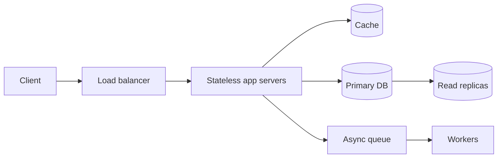


**Interview tip:** Clarify requirements (5 min) → high-level boxes (10 min) → deep dive on data model + one sequence (15 min) → scaling & tradeoffs (10 min). Keep **Recommended resources** at the end for further reading.

---

## Table of Contents


| #   | Question                                                                                                                                                                               | Complexity | Companies                                |
| --- | -------------------------------------------------------------------------------------------------------------------------------------------------------------------------------------- | ---------- | ---------------------------------------- |
| 1   | [Design a URL Shortening service like TinyURL](#1-design-a-url-shortening-service-like-tinyurl)                                                                                        | Easy       | Google, Facebook, Amazon, Microsoft      |
| 2   | [Design Pastebin](#2-design-pastebin)                                                                                                                                                  | Easy       | Amazon, Vanta, Nutanix                   |
| 3   | [Design Instagram](#3-design-instagram)                                                                                                                                                | Easy       | Facebook, Microsoft, Twitter, Amazon     |
| 4   | [Design Dropbox or Google Drive](#4-design-dropbox-or-google-drive)                                                                                                                    | Medium     | Dropbox, Facebook, Google, Amazon        |
| 5   | [Design Facebook Messenger or WhatsApp](#5-design-facebook-messenger-or-whatsapp)                                                                                                      | Medium     | Facebook, Uber, TikTok, Amazon           |
| 6   | [Design Twitter for millions of users](#6-design-twitter-for-millions-of-users)                                                                                                        | Easy       | Uber, Coupang                            |
| 7   | [Design Youtube or Netflix](#7-design-youtube-or-netflix)                                                                                                                              | Medium     | Facebook, Amazon, Snowflake, Wealthfront |
| 8   | [Design Typeahead Suggestion/Autocomplete](#8-design-typeahead-suggestion-autocomplete)                                                                                                | Hard       | Facebook, Google, Expedia, Bloomberg     |
| 9   | [Design an API Rate Limiter](#9-design-an-api-rate-limiter)                                                                                                                            | Hard       | Amazon, Atlassian, Uber, Patreon         |
| 10  | [Design a Distributed Metrics Logging and Aggregation System](#10-design-a-distributed-metrics-logging-and-aggregation-system)                                                         | Very Hard  | Google, Facebook, Amazon, eBay           |
| 11  | [Design a Distributed Stream Processing System like Kafka](#11-design-a-distributed-stream-processing-system-like-kafka)                                                               | Very Hard  | Amazon, Microsoft, Wise, Confluent       |
| 12  | [Design a Key-Value Store](#12-design-a-key-value-store)                                                                                                                               | Medium     | Apple, Google, Canva, Avalara            |
| 13  | [Identify the K Most Shared Articles in Various Time Windows (24 hours, 1 hour, 5 minutes)](#13-identify-the-k-most-shared-articles-in-various-time-windows-24-hours-1-hour-5-minutes) | Hard       | LinkedIn, Facebook, Twitter              |
| 14  | [Design Web Crawler](#14-design-web-crawler)                                                                                                                                           | Medium     | Amazon, Google, Facebook, Atlassian      |
| 15  | [Design Facebook's News Feed](#15-design-facebook-s-news-feed)                                                                                                                         | Medium     | Facebook                                 |
| 16  | [Design Yelp or Nearby Friends](#16-design-yelp-or-nearby-friends)                                                                                                                     | Very Hard  | Amazon, Facebook, Google, Uber           |
| 17  | [System to Collect Performance Metrics from Thousands of Servers](#17-system-to-collect-performance-metrics-from-thousands-of-servers)                                                 | Hard       | Google, Datadog, Amazon, eBay            |
| 18  | [Design Google Calendar](#18-design-google-calendar)                                                                                                                                   | Medium     | Google, LinkedIn                         |
| 19  | [Design a Distributed Queue like RabbitMQ](#19-design-a-distributed-queue-like-rabbitmq)                                                                                               | Hard       | Amazon, Apple, Instacart                 |
| 20  | [Design Google Analytics - User Analytics Dashboard and Pipeline](#20-design-google-analytics-user-analytics-dashboard-and-pipeline)                                                   | Hard       | Microsoft, Facebook, Qualtrics, Google   |
| 21  | [Design a System for Sorting Large Data Sets](#21-design-a-system-for-sorting-large-data-sets)                                                                                         | Easy       | Google, Microsoft                        |
| 22  | [Top K Elements: App Store Rankings, Amazon Bestsellers, etc.](#22-top-k-elements-app-store-rankings-amazon-bestsellers-etc)                                                           | Easy       | Amazon, Bloomberg, Facebook, Pinterest   |
| 23  | [Design a Job Scheduler](#23-design-a-job-scheduler)                                                                                                                                   | Easy       | Google, Amazon, Microsoft, Doordash      |
| 24  | [Design a Notification Service at Scale](#24-design-a-notification-service-at-scale)                                                                                                   | Hard       | Google, Pinterest, OCI, Stubhub          |
| 25  | [Surge Pricing System: Uber - Stream Processing, etc.](#25-surge-pricing-system-uber-stream-processing-etc)                                                                            | Very Hard  | Uber, Lyft                               |
| 26  | [Netflix: Limit the Number of Screens Each User Can Watch](#26-netflix-limit-the-number-of-screens-each-user-can-watch)                                                                | Hard       | Some FAANG                               |
| 27  | [Design an ETA Service and Location Sharing Between Driver and Rider](#27-design-an-eta-service-and-location-sharing-between-driver-and-rider)                                         | Very Hard  | Uber, Some FAANG                         |
| 28  | [Design a Hotel Booking System: Room Availability, Reservation, Booking](#28-design-a-hotel-booking-system-room-availability-reservation-booking)                                      | Medium     | Amazon, Square, Booking.com              |
| 29  | [Design an A/B Testing System (like Optimizely)](#29-design-an-a-b-testing-system-like-optimizely)                                                                                     | Hard       | Affirm, Some FAANG                       |
| 30  | [Design a Price Alert System for Amazon (or for Stock prices)](#30-design-a-price-alert-system-for-amazon-or-for-stock-prices)                                                         | Easy       | Facebook, Bloomberg, Coinbase, Swyftx    |
| 31  | [Design an IoC/Dependency Injection Framework](#31-design-an-ioc-dependency-injection-framework)                                                                                       | Very Hard  | ADP, Some FAANG                          |
| 32  | [Design a Credit Card Processing System](#32-design-a-credit-card-processing-system)                                                                                                   | Very Hard  | Stripe, Paytm, Paypal, Databricks        |
| 33  | [Count Facebook Likes, Especially for High-Profile Users](#33-count-facebook-likes-especially-for-high-profile-users)                                                                  | Medium     | Facebook, Amazon, Twitter                |
| 34  | [Design a Control Plane for a Distributed Database](#34-design-a-control-plane-for-a-distributed-database)                                                                             | Very Hard  | Netflix                                  |
| 35  | [Design a User Login and Authentication System for a Website](#35-design-a-user-login-and-authentication-system-for-a-website)                                                         | Medium     | Google, Visa, Gusto                      |
| 36  | [Develop a Weather Application](#36-develop-a-weather-application)                                                                                                                     | Easy       | Amazon, Chime, Facebook, Hubspot         |
| 37  | [Create a Document Management System like Wikipedia, Notion or Google Docs](#37-create-a-document-management-system-like-wikipedia-notion-or-google-docs)                              | Easy       | Google, Flipkart, Notion, Amazon         |
| 38  | [Build a Marketplace Feature for Facebook](#38-build-a-marketplace-feature-for-facebook)                                                                                               | Easy       | Facebook, Roblox                         |
| 39  | [Design a System to Monitor the Health of a Cluster](#39-design-a-system-to-monitor-the-health-of-a-cluster)                                                                           | Medium     | Uber, Lacework, Amazon, Google           |
| 40  | [Find a Rider for Uber or Uber Eats](#40-find-a-rider-for-uber-or-uber-eats)                                                                                                           | Hard       | Facebook, Uber, Google, Microsoft        |
| 41  | [Design a Distributed Tracing System](#41-design-a-distributed-tracing-system)                                                                                                         | Very Hard  | Uber, Amazon                             |
| 42  | [Design Backend for an App to Distribute 6 Million Free Burgers in One Hour](#42-design-backend-for-an-app-to-distribute-6-million-free-burgers-in-one-hour)                           | Medium     | Google, Deliveroo                        |
| 43  | [Design a File Downloader Library from Frontend to Backend](#43-design-a-file-downloader-library-from-frontend-to-backend)                                                             | Hard       | Facebook                                 |
| 44  | [Design a System to View Latest Stock Prices Worldwide](#44-design-a-system-to-view-latest-stock-prices-worldwide)                                                                     | Easy       | Google, Bloomberg, Amazon                |
| 45  | [Develop a Photo Sharing Platform like Flickr or Google Photos](#45-develop-a-photo-sharing-platform-like-flickr-or-google-photos)                                                     | Medium     | Google, Doordash, Amazon, Uber           |
| 46  | [Design an On-Call Escalation System](#46-design-an-on-call-escalation-system)                                                                                                         | Medium     | Uber                                     |
| 47  | [Design and Implement a Wire Transfer API](#47-design-and-implement-a-wire-transfer-api)                                                                                               | Hard       | Google, Capital One, Revolut             |
| 48  | [Design a Live Comments Feature for Facebook](#48-design-a-live-comments-feature-for-facebook)                                                                                         | Hard       | Facebook                                 |
| 49  | [Design a Feature to Show the Number of Users Viewing a Page](#49-design-a-feature-to-show-the-number-of-users-viewing-a-page)                                                         | Easy       | Booking.com                              |
| 50  | [Design Facebook Likes Feature with Live Updates](#50-design-facebook-likes-feature-with-live-updates)                                                                                 | Easy       | Facebook, Coinbase                       |
| 51  | [Create a System to Migrate Large Data to Google Cloud](#51-create-a-system-to-migrate-large-data-to-google-cloud)                                                                     | Very Hard  | Google, OCI                              |
| 52  | [Design a Distributed Botnet](#52-design-a-distributed-botnet)                                                                                                                         | Hard       | Facebook, Lyft                           |
| 53  | [Create a Distributed File Transfer System like Bittorrent](#53-create-a-distributed-file-transfer-system-like-bittorrent)                                                             | Hard       | Google, Atlassian, Twitch                |
| 54  | [Design a Parts Compatibility Feature for an eCommerce Site](#54-design-a-parts-compatibility-feature-for-an-ecommerce-site)                                                           | Easy       | Some FAANG                               |
| 55  | [Develop an Ads Management and Display System for a Social Feed](#55-develop-an-ads-management-and-display-system-for-a-social-feed)                                                   | Very Hard  | Facebook, Google, Amazon, Pinterest      |


---


## 1. Design a URL Shortening service like TinyURL


|                |                                                                                                |
| -------------- | ---------------------------------------------------------------------------------------------- |
| **Complexity** | Easy                                                                                           |
| **Companies**  | Google, Facebook, Amazon, Microsoft                                                            |
| **Source**     | [systemdesign.io](https://systemdesign.io/question/design-url-shortening-service-like-tinyurl) |


#### Requirements


| Type | Details |
| ---- | ------- |
| **Functional** | Shorten long URL → short link; redirect `GET /{code}` → original URL; optional custom alias, expiration, delete |
| **Non-functional** | Redirect p99 < 50 ms; 100:1 read:write; ~100M new URLs/day; highly available |
| **Scale (estimate)** | ~1.2K writes/s avg, ~12K reads/s avg; ~500 GB/year metadata + analytics |


#### High-level design

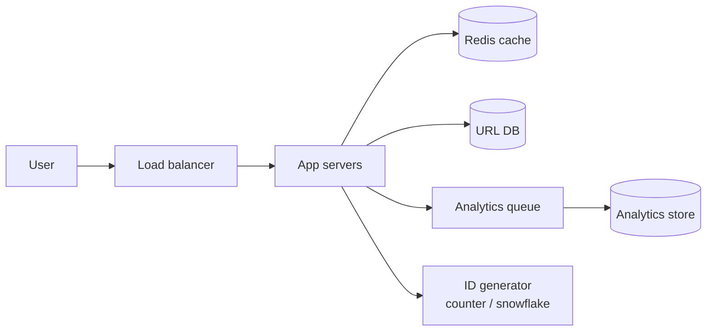


#### Data model

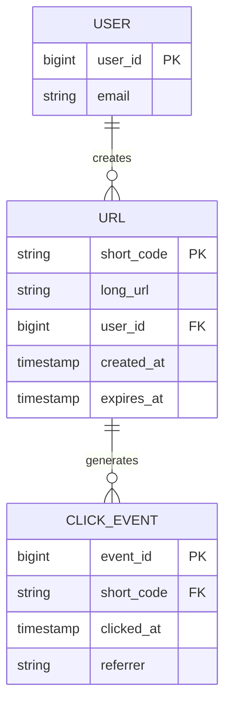


#### Core flow — redirect (read path)

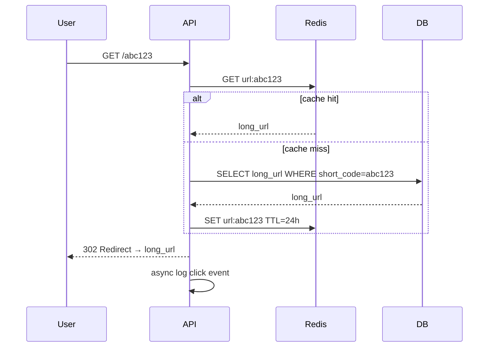


#### APIs


| Method | Endpoint | Purpose |
| ------ | -------- | ------- |
| `POST` | `/api/v1/urls` | `{ "longUrl", "customAlias?", "expiresAt?" }` → `{ "shortUrl" }` |
| `GET` | `/{shortCode}` | HTTP 302 redirect to long URL |
| `DELETE` | `/api/v1/urls/{shortCode}` | Remove mapping (owner only) |
| `GET` | `/api/v1/urls/{shortCode}/stats` | Click count, referrers |


#### Availability & scaling

**Production target:** redirect p99 < 50 ms at ~12K reads/s, survive single-AZ failure, and never block the redirect path for analytics or security checks that can run async.

##### Production architecture (after applying all optimizations)

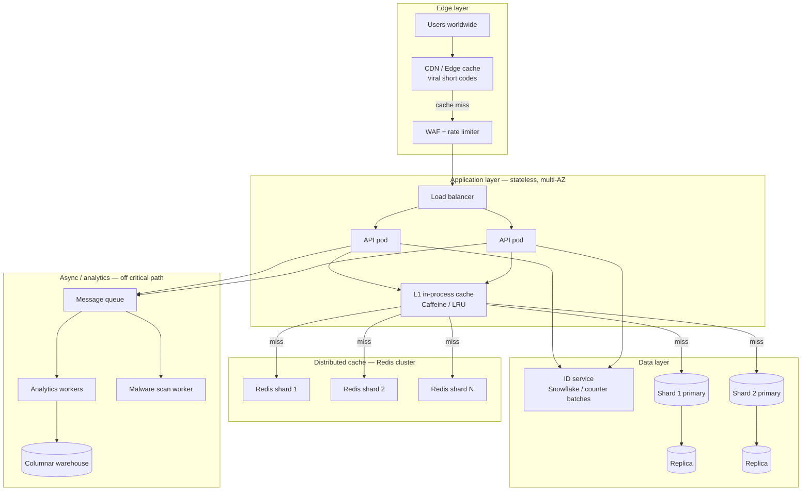

##### 1. Multi-layer caching (read path — implement this first)

Most redirects never hit the DB. Layer caches from fastest to slowest:

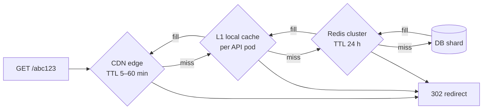

| Layer | What to implement | When it helps |
| ----- | ----------------- | ------------- |
| **CDN** | Cache `302` or `301` for known viral codes at edge POPs | Celebrity / viral links (1 code → millions of hits) |
| **L1 (in-process)** | Small LRU map (`short_code → long_url`, ~10K entries) per pod | Same hot key hammering one Redis shard |
| **Redis** | Cluster sharded by `hash(short_code)`; SET on miss with TTL | 80/20 traffic — most reads served here |
| **DB** | Only on cold miss; use read replica if primary is write-busy | Rare codes, cache expiry, new deploy |

##### 2. Database sharding + read replicas

Shard by `hash(short_code) mod N` so writes and reads spread evenly. Analytics/stat queries go to replicas — never the redirect hot path.

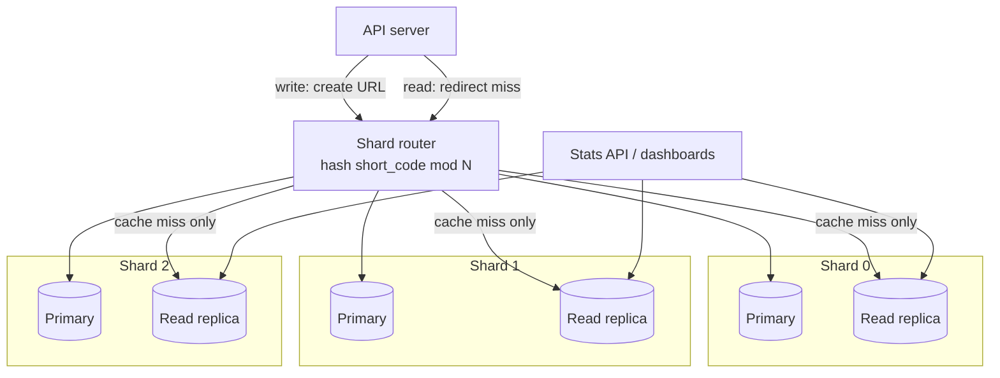

**Implementation checklist:** consistent hashing or mod-N router in app layer; one primary per shard; cross-shard queries avoided (lookup always by `short_code`).

##### 3. ID generation — avoid DB hot spots on create

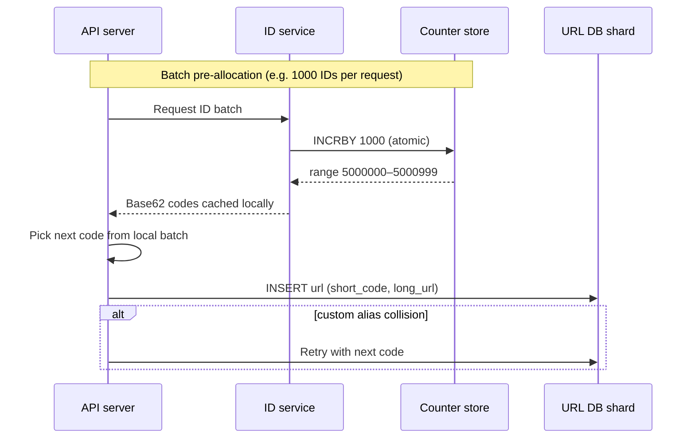

| Approach | Pros | Cons |
| -------- | ---- | ---- |
| **Snowflake / UUID + Base62** | No central counter; horizontally scalable | Longer codes; ordering not sequential |
| **Central counter + batch allocate** | Short sequential codes; low DB contention | ID service is a dependency — replicate for HA |
| **Hash(long_url) + retry on collision** | Stateless | Collisions increase with scale; bad for custom aliases |

##### 4. Hot key mitigation (viral link problem)

When one `short_code` gets 100K+ QPS, a single Redis shard melts. Fix with replication + local cache:

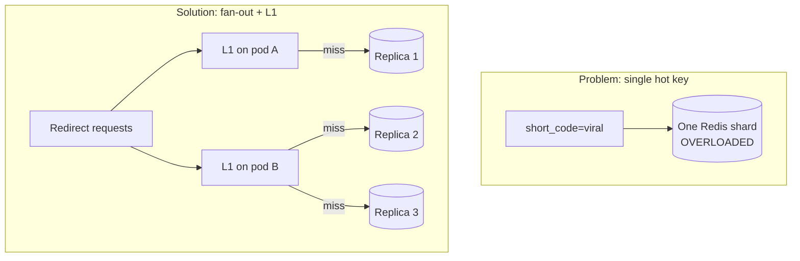

**What to build:** hot-key detector (QPS threshold per key) → async replicate entry to all Redis nodes + extend CDN TTL → alert on-call.

##### 5. Security & abuse — on the write path only

Never block redirects for malware scan. Scan async after create; disable link if malicious.

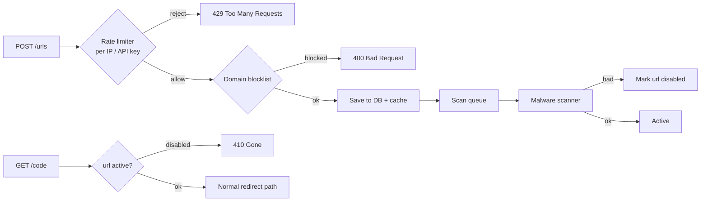

##### 6. Analytics — fully async (never on redirect path)

```mermaid
sequenceDiagram
    participant User
    participant API
    participant Redis
    participant Q as Kafka / SQS
    participant W as Worker
    participant DW as BigQuery / ClickHouse

    User->>API: GET /abc123
    API->>Redis: cache lookup
    Redis-->>API: long_url
    API-->>User: 302 redirect (fast path done)
    API->>Q: fire-and-forget click event
    Note over API,Q: Non-blocking; drop if queue full
    Q->>W: consume batch
    W->>DW: INSERT click_events
    W->>W: aggregate hourly stats
```

**Implementation checklist for a real deploy:**

| Concern | Minimum viable | At scale |
| ------- | -------------- | -------- |
| **Availability** | 2+ AZ, health checks, LB failover | Multi-region active-active reads |
| **Caching** | Redis cluster + TTL | CDN for viral + L1 local cache |
| **Database** | Single primary + 1 replica | Sharded primaries + replica per shard |
| **ID generation** | DB auto-increment (prototype) | Snowflake or batched counter service |
| **Observability** | Redirect latency, cache hit rate, error rate | Per-shard QPS, hot-key alerts, queue lag |
| **Security** | Rate limit on create | Blocklist + async malware scan + CAPTCHA |

#### Key discussion points

- How do you generate a unique short ID?
- How do you avoid collisions?
- How do we prevent malicious links, phishing, or spam?
- Do we rate-limit requests from abusive clients?
- Do we support link expiration or deletion?
- How do we store logs for analytics?
- Should we cache frequently accessed short URLs? Where? (Redis, CDN)
- How do we handle hot keys (very popular links)?


#### Recommended resources

- [Medium article](https://medium.com/%40sandeep4.verma/system-design-scalable-url-shortener-service-like-tinyurl-106f30f23a82)
- [Design Gurus solution](http://designgurus.io/blog/url-shortening)
- [Video walkthrough](https://www.youtube.com/watch?v=qSJAvd5Mgio)
- [AlgoMaster blog](https://blog.algomaster.io/p/design-a-url-shortener)

---


## 2. Design Pastebin


|                |                                                                     |
| -------------- | ------------------------------------------------------------------- |
| **Complexity** | Easy                                                                |
| **Companies**  | Amazon, Vanta, Nutanix                                              |
| **Source**     | [systemdesign.io](https://systemdesign.io/question/design-pastebin) |


#### Requirements


| Type | Details |
|------|---------|
| Functional | Create paste with optional expiry; retrieve paste by unique URL/key; optional password protection; delete or expire pastes |
| Non-functional | Low latency reads (<100ms); high read/write ratio (~100:1); durable storage; abuse prevention (size limits, rate limits) |
| Scale estimate | 10M pastes/month write; 100M reads/month; avg paste 10KB; ~100GB/month new data; 5-year retention ~6TB |

#### High-level design
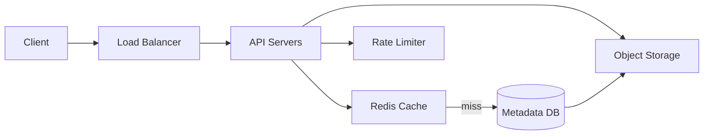

#### Data model
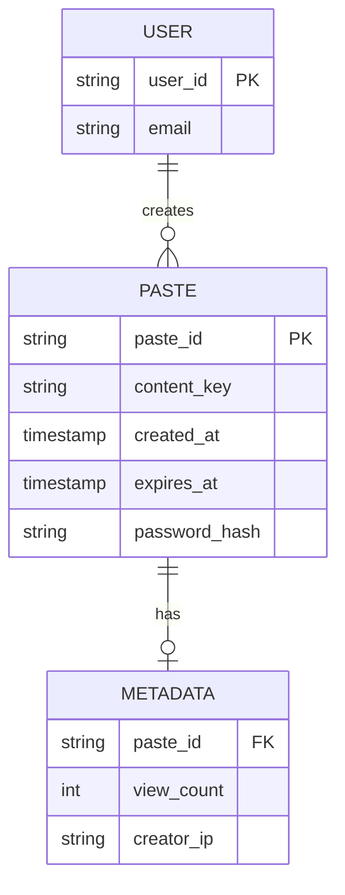

#### Core flow
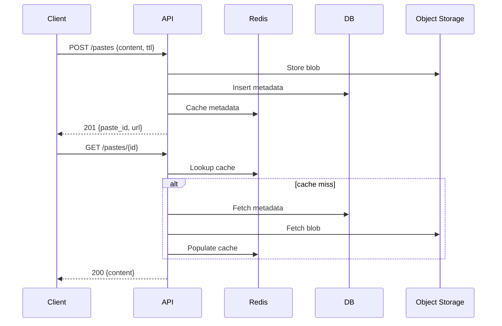

#### APIs
| Method | Endpoint | Purpose |
|--------|----------|---------|
| POST | /v1/pastes | Create a new paste with optional TTL and password |
| GET | /v1/pastes/{paste_id} | Retrieve paste content by ID |
| DELETE | /v1/pastes/{paste_id} | Delete paste (owner or expired cleanup) |
| GET | /v1/pastes/{paste_id}/meta | Fetch metadata without full content |
| POST | /v1/pastes/{paste_id}/verify | Verify password before returning content |

#### Availability & scaling
- Separate read and write paths; scale read replicas and cache independently
- Store large paste bodies in object storage; keep only metadata in relational DB
- Use consistent hashing or key-based sharding on paste_id for horizontal DB scale
- CDN edge caching for popular public pastes reduces origin load
- Background workers expire and purge blobs asynchronously
- Multi-AZ deployment with automated failover on API and cache tiers


#### Key discussion points

- How do you handle large paste sizes? (Limit size per paste, chunk storage if needed)
- How do you support expiration of pastes? (TTL in DB, background cleanup jobs)
- How do you handle anonymous vs registered users? (Access control, rate limits, abuse prevention)
- How do you generate unique IDs or short links for each paste? (Random string, hash, or incremental counter with base62 encoding)


#### Recommended resources

- [Medium article](https://medium.com/codex/designing-pastebin-77e6e86172eb)
- [Video walkthrough](https://www.youtube.com/watch?v=V_yOcipUqUE)
- [ujjwalbhardwaj.me](https://ujjwalbhardwaj.me/post/system-design-design-pastebin-text-storage-system)
- [Video walkthrough](https://www.youtube.com/watch?v=V_yOcipUqUE)

---


## 3. Design Instagram


|                |                                                                      |
| -------------- | -------------------------------------------------------------------- |
| **Complexity** | Easy                                                                 |
| **Companies**  | Facebook, Microsoft, Twitter, Amazon                                 |
| **Source**     | [systemdesign.io](https://systemdesign.io/question/design-instagram) |


#### Requirements


| Type | Details |
|------|---------|
| Functional | Upload photos/videos; follow users; view personalized feed; like and comment; search users and hashtags |
| Non-functional | Feed load <500ms; durable media storage; eventual consistency for likes; global availability |
| Scale estimate | 500M DAU; 100M uploads/day; avg photo 2MB; 200PB media over time; 5B feed reads/day |

#### High-level design
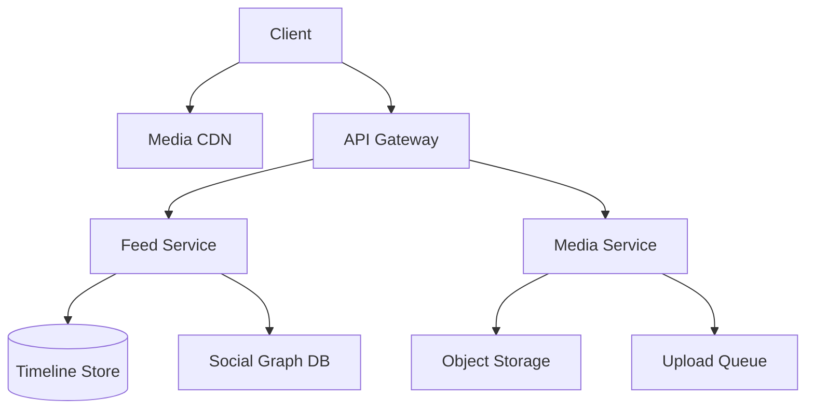

#### Data model
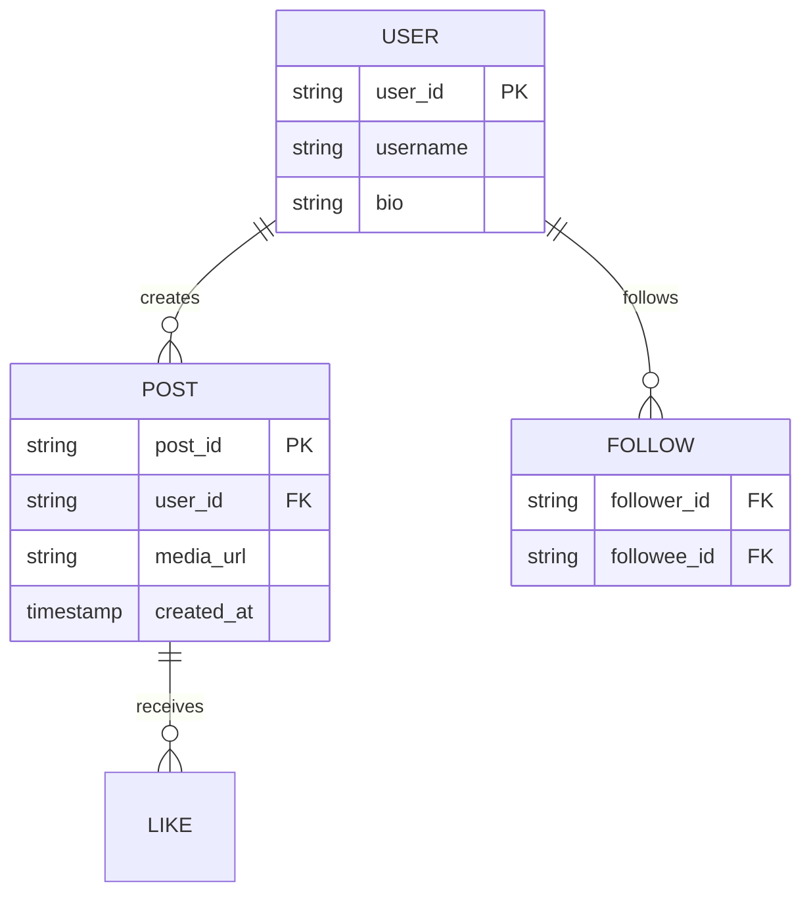

#### Core flow
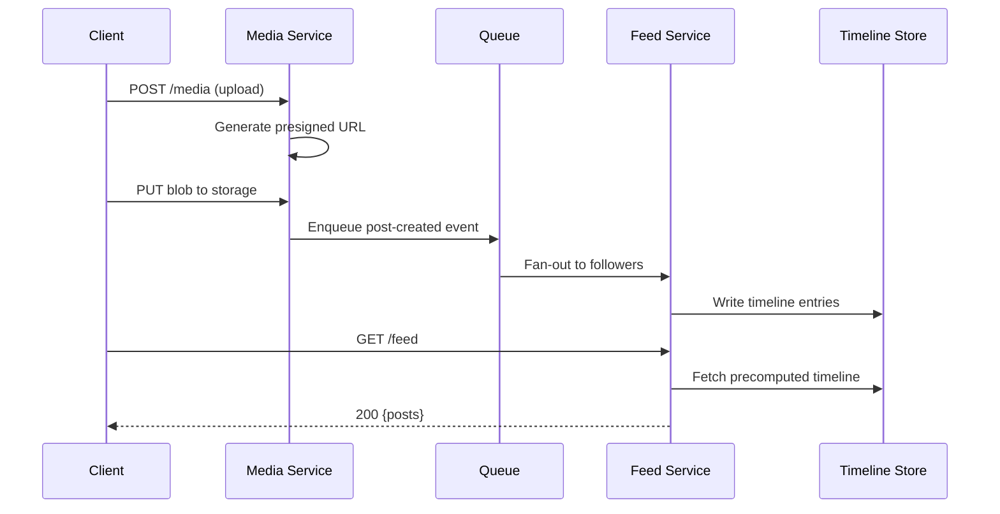

#### APIs
| Method | Endpoint | Purpose |
|--------|----------|---------|
| POST | /v1/media/upload-url | Get presigned URL for direct client upload |
| POST | /v1/posts | Create post metadata after upload completes |
| GET | /v1/feed | Return paginated home feed for authenticated user |
| POST | /v1/posts/{id}/like | Like or unlike a post |
| GET | /v1/users/{id}/posts | Fetch a user's profile grid |

#### Availability & scaling
- Fan-out on write for users with moderate follower counts; fan-in on read for celebrities
- Store media in geo-replicated object storage with CDN for global delivery
- Shard timeline store by user_id with hot-user isolation
- Async workers handle thumbnail generation and transcoding
- Cache feed pages in Redis with short TTL for repeat visits
- Circuit breakers on downstream services prevent cascade failures during spikes


#### Key discussion points

- How do you store billions of photos and videos reliably?
- How do you ensure efficient retrieval when scrolling through a feed?
- How do you optimize the UI to load the image fast?
- How do you cache popular posts and feeds?
- How do you handle fan-out to millions of followers for a celebrity post?


#### Recommended resources

- [Design Gurus solution](https://www.designgurus.io/course-play/grokking-the-system-design-interview/doc/designing-instagram)
- [www.reddit.com](https://www.reddit.com/r/leetcode/comments/1dva2ng/rate_my_system_design_for_instagram/)
- [www.linkedin.com](https://www.linkedin.com/pulse/instagram-system-design-blueprint-crack-faang-rocky-bhatia-w4jtc/)
- [Video walkthrough](https://www.youtube.com/watch?v=S2y9_XYOZsg)
- [Design Gurus solution](https://www.designgurus.io/course-play/grokking-the-system-design-interview/doc/designing-instagramInteresting)

---


## 4. Design Dropbox or Google Drive


|                |                                                                                    |
| -------------- | ---------------------------------------------------------------------------------- |
| **Complexity** | Medium                                                                             |
| **Companies**  | Dropbox, Facebook, Google, Amazon                                                  |
| **Source**     | [systemdesign.io](https://systemdesign.io/question/design-dropbox-or-google-drive) |


#### Requirements


| Type | Details |
|------|---------|
| Functional | Upload/download/sync files across devices; folder hierarchy; sharing with permissions; conflict resolution on concurrent edits |
| Non-functional | Chunk-level deduplication; offline sync support; strong durability (11 nines); bandwidth-efficient sync |
| Scale estimate | 100M users; avg 10GB/user; 1PB total; 10M sync ops/day; peak 50K concurrent sync sessions |

#### High-level design
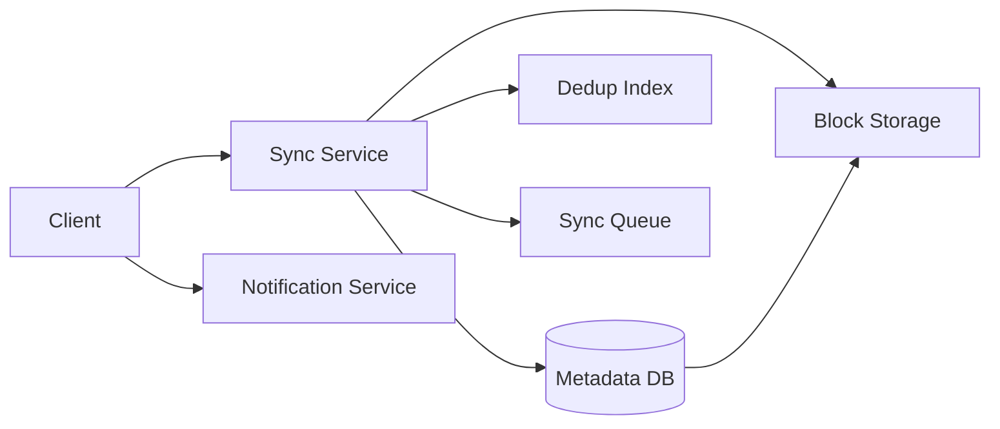

#### Data model
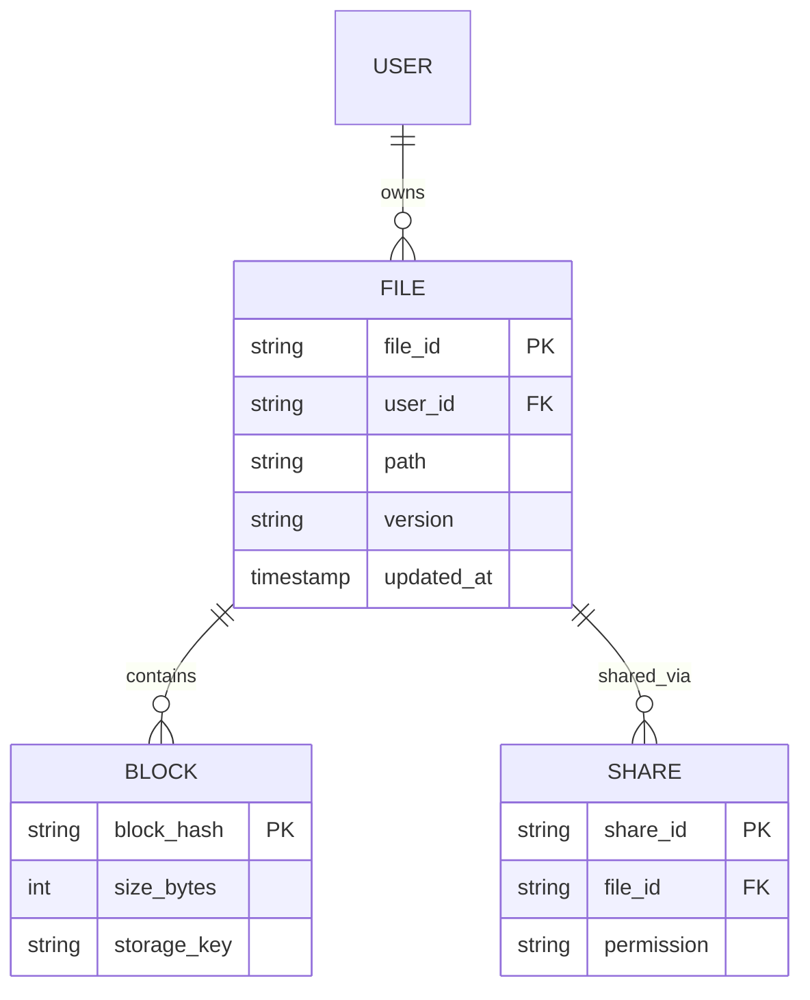

#### Core flow
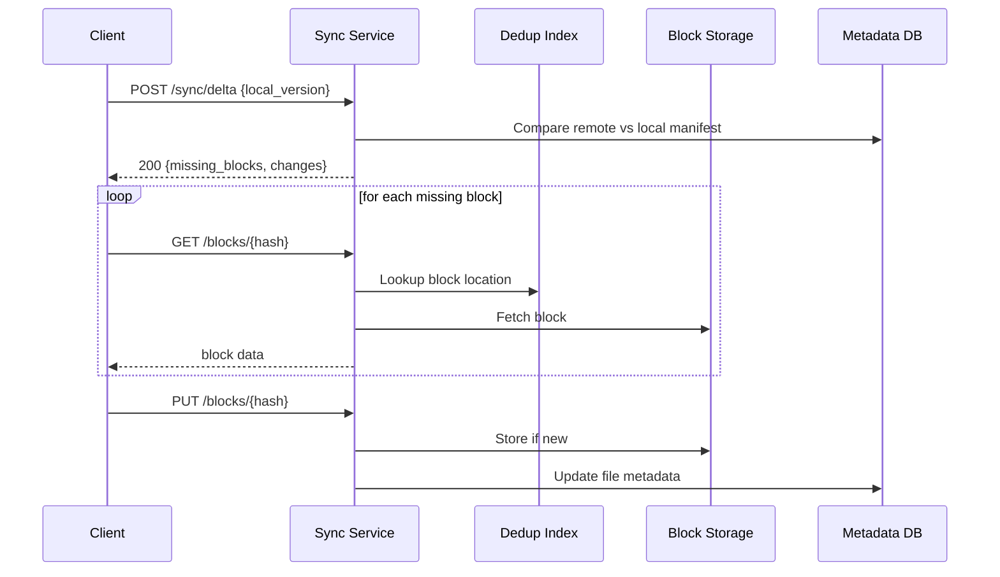

#### APIs
| Method | Endpoint | Purpose |
|--------|----------|---------|
| POST | /v1/sync/delta | Exchange file manifests and get sync delta |
| PUT | /v1/blocks/{hash} | Upload content-addressed block |
| GET | /v1/blocks/{hash} | Download block by hash |
| POST | /v1/files/{id}/share | Create share link with permissions |
| GET | /v1/files/{id}/versions | List file version history |

#### Availability & scaling
- Content-addressed block storage enables cross-user deduplication and cheap replication
- Metadata DB sharded by user_id; block storage is append-only and horizontally scalable
- Long-polling or WebSocket for near-real-time sync notifications
- Client-side chunking (4MB blocks) reduces re-upload on small edits
- Erasure coding on cold blocks balances durability and storage cost
- Per-user rate limits and quota enforcement prevent storage abuse


#### Key discussion points

- How to partition data and scale it?
- How to structure data as folders and files?
- How to do writes and reads with partitions and replication.
- How do you replicate data globally across data centers?
- When an update happens, how doe sit propagate across replicas. What do other readers see?


#### Recommended resources

- [static.googleusercontent.com](https://static.googleusercontent.com/media/research.google.com/en//archive/gfs-sosp2003.pdf)
- [Video walkthrough](https://www.youtube.com/watch?v=_UZ1ngy-kOI)
- [Hello Interview breakdown](https://www.hellointerview.com/learn/system-design/problem-breakdowns/dropbox)
- [Exponent guide](https://www.tryexponent.com/courses/system-design-interviews/design-dropbox)
- [static.googleusercontent.com](https://static.googleusercontent.com/media/research.google.com/en//archive/gfs-sosp2003.pdf)

---


## 5. Design Facebook Messenger or WhatsApp


|                |                                                                                           |
| -------------- | ----------------------------------------------------------------------------------------- |
| **Complexity** | Medium                                                                                    |
| **Companies**  | Facebook, Uber, TikTok, Amazon                                                            |
| **Source**     | [systemdesign.io](https://systemdesign.io/question/design-facebook-messenger-or-whatsapp) |


#### Requirements


| Type | Details |
|------|---------|
| Functional | One-to-one and group messaging; delivery/read receipts; online presence; media attachments; message history |
| Non-functional | Sub-second delivery; at-least-once delivery with client dedup; end-to-end encryption optional; 99.99% uptime |
| Scale estimate | 1B DAU; 50B messages/day; avg 200 bytes/text; peak 5M msg/sec; 10M concurrent WebSocket connections |

#### High-level design
```mermaid
flowchart TB
    Client --> WS[WebSocket Gateway]
    WS --> Router[Message Router]
    Router --> Inbox[(Inbox Store)]
    Router --> Presence[Presence Service]
    Router --> Push[Push Notification]
    Inbox --> Queue[Message Queue]
    Router --> Media[Media Service]
```

#### Data model
```mermaid
erDiagram
    USER ||--o{ MESSAGE : sends
    CONVERSATION ||--o{ MESSAGE : contains
    USER ||--o{ MEMBERSHIP : participates
    CONVERSATION {
        string conv_id PK
        string type
        timestamp created_at
    }
    MESSAGE {
        string msg_id PK
        string conv_id FK
        string sender_id FK
        string body
        timestamp sent_at
    }
    MEMBERSHIP {
        string user_id FK
        string conv_id FK
        timestamp last_read_at
    }
```

#### Core flow
```mermaid
sequenceDiagram
    participant S as Sender
    participant G as WS Gateway
    participant R as Router
    participant Q as Queue
    participant I as Inbox Store
    participant Rc as Recipient

    S->>G: Send message via WebSocket
    G->>R: Route to conversation
    R->>I: Persist message
    R->>Q: Publish delivery event
    Q->>Rc: Push via active WebSocket
    alt recipient offline
        Q->>Rc: Push notification (APNs/FCM)
    end
    Rc-->>G: ACK delivered
    G-->>S: Delivery receipt
```

#### APIs
| Method | Endpoint | Purpose |
|--------|----------|---------|
| POST | /v1/conversations | Create or fetch conversation |
| POST | /v1/conversations/{id}/messages | Send message (HTTP fallback) |
| GET | /v1/conversations/{id}/messages | Paginated message history |
| PUT | /v1/presence | Update online/last-seen status |
| POST | /v1/conversations/{id}/read | Mark messages as read |

#### Availability & scaling
- Sticky sessions on WebSocket gateways route users to consistent connection nodes
- Message queue decouples write path from delivery; absorbs traffic spikes
- Inbox store sharded by conversation_id; hot conversations get dedicated partitions
- Presence stored in Redis with TTL heartbeat; gossip protocol across gateway nodes
- Idempotent message IDs on client prevent duplicate display on retries
- Multi-region active-active with conflict-free ordering via server timestamps


#### Key discussion points

- WhatsApp. Detailed solution with diagrams, tradeoffs, and examples to help you crack your next interview at Google, Amazon, Meta, etc."/
- How do you ensure low-latency message delivery (< 100ms) across millions of users?
- What communication protocol will you use (long polling, WebSockets)?
- How do you handle offline users and guarantee eventual delivery?
- Where do you store messages - do you persist all, or support auto-deletion?
- How do you support multi-device sync (message states consistent across devices)?


#### Recommended resources

- [hayksimonyan.substack.com](https://hayksimonyan.substack.com/p/system-design-interview-design-whatsapp)
- [Medium article](https://medium.com/%40m.romaniiuk/system-design-chat-application-1d6fbf21b372)
- [Medium article](https://medium.com/%40ishwarya1011.hidkimath/system-design-design-a-chat-system-e0056fb093d1)
- [Video walkthrough](https://www.youtube.com/watch?v=-3Ge8EooS3g)

---


## 6. Design Twitter for millions of users


|                |                                                                                          |
| -------------- | ---------------------------------------------------------------------------------------- |
| **Complexity** | Easy                                                                                     |
| **Companies**  | Uber, Coupang                                                                            |
| **Source**     | [systemdesign.io](https://systemdesign.io/question/design-twitter-for-millions-of-users) |


#### Requirements


| Type | Details |
|------|---------|
| Functional | Post tweets (280 chars); follow users; home timeline; search tweets; like/retweet; trending topics |
| Non-functional | Timeline p99 <200ms; high write throughput; fan-out complexity for celebrities; durable tweet storage |
| Scale estimate | 300M DAU; 500M tweets/day; 100B timeline reads/day; avg tweet 300 bytes; peak 10K tweets/sec |

#### High-level design
```mermaid
flowchart LR
    Client --> API[API Layer]
    API --> Tweet[Tweet Service]
    API --> Timeline[Timeline Service]
    Tweet --> TweetDB[(Tweet Store)]
    Timeline --> Cache[Timeline Cache]
    Timeline --> Fanout[Fan-out Workers]
    Fanout --> Cache
    API --> Search[Search Index]
```

#### Data model
```mermaid
erDiagram
    USER ||--o{ TWEET : posts
    USER ||--o{ FOLLOW : follows
    TWEET ||--o{ LIKE : receives
    USER {
        string user_id PK
        string handle
        int follower_count
    }
    TWEET {
        string tweet_id PK
        string user_id FK
        string text
        timestamp created_at
    }
    FOLLOW {
        string follower_id FK
        string followee_id FK
    }
```

#### Core flow
```mermaid
sequenceDiagram
    participant C as Client
    participant T as Tweet Service
    participant F as Fan-out Worker
    participant TL as Timeline Cache
    participant R as Reader

    C->>T: POST /tweets {text}
    T->>T: Persist tweet
    T->>F: Enqueue fan-out job
    F->>TL: Push tweet_id to follower caches

    R->>TL: GET home timeline
    TL-->>R: List of tweet_ids
    R->>T: Hydrate tweet details
    T-->>R: Full tweets
```

#### APIs
| Method | Endpoint | Purpose |
|--------|----------|---------|
| POST | /v1/tweets | Create a new tweet |
| GET | /v1/timeline/home | Fetch authenticated user's home feed |
| GET | /v1/users/{id}/tweets | Fetch user's tweet history |
| POST | /v1/tweets/{id}/retweet | Retweet an existing tweet |
| GET | /v1/search/tweets?q= | Full-text search over tweets |

#### Availability & scaling
- Hybrid fan-out: push to cache for normal users, pull+merge for celebrity accounts
- Tweet store append-only; shard by tweet_id or user_id depending on access pattern
- Timeline cache in Redis sorted sets keyed by user_id with capped size (e.g., 800 tweets)
- Async search indexing via Kafka; Elasticsearch for query serving
- Rate limiting per user prevents spam and protects fan-out workers
- Read replicas and regional caches reduce cross-region latency


#### Key discussion points

- What data will you store for each tweet? (tweet ID, user ID, timestamp, text, media link, etc.)
- What will you cache (timelines? tweet metadata?) and where (e.g., Redis)?
- What will you cache (timelines? tweet metadata?) and where (e.g., Redis)?


#### Recommended resources

- [hayksimonyan.substack.com](https://hayksimonyan.substack.com/p/system-design-interview-design-twitter)
- [Video walkthrough](https://www.youtube.com/watch?v=S2y9_XYOZsg)
- [dev.to](https://dev.to/zeeshanali0704/designing-twitter-a-system-design-interview-question-221e)
- [hayksimonyan.substack.com](https://hayksimonyan.substack.com/p/system-design-interview-design-twitter)
- [Video walkthrough](https://www.youtube.com/watch?v=S2y9_XYOZsg)

---


## 7. Design Youtube or Netflix


|                |                                                                               |
| -------------- | ----------------------------------------------------------------------------- |
| **Complexity** | Medium                                                                        |
| **Companies**  | Facebook, Amazon, Snowflake, Wealthfront                                      |
| **Source**     | [systemdesign.io](https://systemdesign.io/question/design-youtube-or-netflix) |


#### Requirements


| Type | Details |
|------|---------|
| Functional | Upload video; transcode to multiple resolutions; stream with adaptive bitrate; recommendations; resume playback |
| Non-functional | Smooth playback (minimal buffering); global CDN delivery; cost-efficient storage tiers; copyright protection |
| Scale estimate | 2B users; 500K hours uploaded/day; avg 1GB/source file; 1B stream hours/day; peak 20M concurrent viewers |

#### High-level design
```mermaid
flowchart TB
    Creator --> Upload[Upload Service]
    Upload --> Raw[Raw Storage]
    Upload --> Transcode[Transcode Pipeline]
    Transcode --> CDN[CDN Origin]
    Viewer --> Edge[CDN Edge]
    Edge --> CDN
    Viewer --> Rec[Recommendation Service]
    Rec --> Meta[(Video Metadata DB)]
```

#### Data model
```mermaid
erDiagram
    USER ||--o{ VIDEO : uploads
    VIDEO ||--o{ ENCODING : has
    VIDEO ||--o{ VIEW : tracked_by
    VIDEO {
        string video_id PK
        string owner_id FK
        string title
        string status
    }
    ENCODING {
        string encoding_id PK
        string video_id FK
        string resolution
        string cdn_url
    }
    VIEW {
        string view_id PK
        string video_id FK
        string user_id FK
        int watch_seconds
    }
```

#### Core flow
```mermaid
sequenceDiagram
    participant U as Uploader
    participant Up as Upload Service
    participant T as Transcoder
    participant C as CDN
    participant V as Viewer

    U->>Up: Initiate multipart upload
    Up-->>U: upload_id + chunk URLs
    U->>Up: Upload chunks
    Up->>T: Trigger transcode job
    T->>T: Generate HLS/DASH renditions
    T->>C: Publish to CDN origin

    V->>C: GET manifest.m3u8
    C-->>V: Adaptive stream segments
    V->>V: Switch bitrate based on bandwidth
```

#### APIs
| Method | Endpoint | Purpose |
|--------|----------|---------|
| POST | /v1/videos/upload/init | Start resumable multipart upload |
| POST | /v1/videos/{id}/publish | Mark upload complete and trigger transcode |
| GET | /v1/videos/{id}/stream | Return playback manifest URL |
| GET | /v1/videos/feed | Personalized video recommendations |
| PUT | /v1/videos/{id}/progress | Save watch progress for resume |

#### Availability & scaling
- Transcoding farm scales horizontally; priority queues for popular creators
- Store raw uploads in cold tier; serve only encoded segments from CDN edge
- Adaptive bitrate (ABR) HLS/DASH minimizes rebuffering on variable networks
- Geo-distributed CDN with origin shield reduces origin load
- Deduplicate identical source uploads via perceptual hashing where allowed
- Separate read-heavy metadata DB from write-heavy analytics pipeline


#### Key discussion points

- How do you store videos? Object store like S3 or HDFS?
- How do you ensure low-latency, high-availability playback across the globe? Would you use a CDN or edge caching?
- What analytics do you track (watch time, engagement, abandonment)? How is it processed?
- What analytics do you track (watch time, engagement, abandonment)? How is it processed?


#### Recommended resources

- [ByteByteGo article](https://bytebytego.com/courses/system-design-interview/design-youtube)
- [Hello Interview breakdown](https://www.hellointerview.com/learn/system-design/problem-breakdowns/youtube)

---


## 8. Design Typeahead Suggestion/Autocomplete


|                |                                                                                              |
| -------------- | -------------------------------------------------------------------------------------------- |
| **Complexity** | Hard                                                                                         |
| **Companies**  | Facebook, Google, Expedia, Bloomberg                                                         |
| **Source**     | [systemdesign.io](https://systemdesign.io/question/design-typeahead-suggestion-autocomplete) |


#### Requirements


| Type | Details |
|------|---------|
| Functional | Return top-K autocomplete suggestions as user types; support prefix matching; rank by popularity/recency |
| Non-functional | p99 latency <50ms; high QPS; fresh data (minutes delay acceptable); fault tolerant |
| Scale estimate | 500M DAU; 10B queries/day; avg 5 chars/query; dictionary 100M terms; peak 200K QPS |

#### High-level design
```mermaid
flowchart LR
    Client --> Edge[Edge Cache]
    Edge --> API[Typeahead API]
    API --> Trie[Trie Service]
    API --> Rank[Ranking Service]
    Trie --> SSD[Local Trie Cache]
    Rank --> Pop[(Popularity Store)]
    Ingest[Data Pipeline] --> Pop
    Ingest --> Trie
```

#### Data model
```mermaid
erDiagram
    TERM ||--o{ PREFIX_INDEX : indexed_by
    TERM ||--|| POPULARITY : ranked_by
    TERM {
        string term PK
        string category
    }
    PREFIX_INDEX {
        string prefix PK
        list top_terms
    }
    POPULARITY {
        string term FK
        float score
        timestamp updated_at
    }
```

#### Core flow
```mermaid
sequenceDiagram
    participant C as Client
    participant E as Edge Cache
    participant A as Typeahead API
    participant T as Trie Service
    participant R as Ranking

    C->>E: GET /suggest?q=inst
    alt cache hit
        E-->>C: cached suggestions
    else cache miss
        E->>A: forward query
        A->>T: prefix lookup "inst"
        T-->>A: candidate terms
        A->>R: rerank by popularity
        R-->>A: top 10 results
        A-->>E: suggestions
        E-->>C: response
    end
```

#### APIs
| Method | Endpoint | Purpose |
|--------|----------|---------|
| GET | /v1/suggest?q={prefix} | Return ranked autocomplete suggestions |
| POST | /v1/events/click | Log selection for ranking feedback |
| GET | /v1/suggest/trending | Return trending queries independent of prefix |
| POST | /v1/admin/terms | Bulk ingest or update dictionary terms |

#### Availability & scaling
- Precompute top-K results per popular prefix; store in edge CDN cache
- Trie partitioned by first 2-3 characters for horizontal shard distribution
- Batch update popularity scores via streaming pipeline (Kafka + Flink)
- Debounce client requests (150-300ms) to reduce QPS at origin
- Replicate trie shards across AZs; stale reads acceptable for suggestions
- Bloom filters reject queries for non-existent prefixes early


#### Key discussion points

- What data structure will you use for fast suggestions (Trie, inverted index, etc)? How will you keep it memory-efficient?
- How do you handle large-scale writes (e.g., new searches per day)? Do you update the Trie/index in real time or in batches?


#### Recommended resources

- [Medium article](https://medium.com/double-pointer/system-design-interview-autocomplete-type-ahead-system-for-a-search-box-1ac968f9f121)
- [systemdesignschool.io](https://systemdesignschool.io/problems/typeahead/solution)
- [Video walkthrough](https://www.youtube.com/watch?v=MCKX3n4-UR4)
- [Medium article](https://medium.com/double-pointer/system-design-interview-autocomplete-type-ahead-system-for-a-search-box-1ac968f9f1213)
- [systemdesignschool.io](https://systemdesignschool.io/problems/typeahead/solution)

---


## 9. Design an API Rate Limiter


|                |                                                                                |
| -------------- | ------------------------------------------------------------------------------ |
| **Complexity** | Hard                                                                           |
| **Companies**  | Amazon, Atlassian, Uber, Patreon                                               |
| **Source**     | [systemdesign.io](https://systemdesign.io/question/design-an-api-rate-limiter) |


#### Requirements


| Type | Details |
|------|---------|
| Functional | Limit requests per user/API key/IP; support multiple algorithms (token bucket, sliding window); configurable rules per endpoint |
| Non-functional | Minimal added latency (<5ms); accurate under distributed load; high availability; dynamic rule updates |
| Scale estimate | 1M API clients; 1M requests/sec aggregate; rules updated hourly; 99.99% availability target |

#### High-level design
```mermaid
flowchart TB
    Client --> GW[API Gateway]
    GW --> RL[Rate Limiter]
    RL --> Counter[(Redis Cluster)]
    RL --> Rules[Rules Config Service]
    Rules --> Config[(Config Store)]
    GW --> Backend[Backend Services]
    RL --> Log[Audit Log]
```

#### Data model
```mermaid
erDiagram
    CLIENT ||--o{ API_KEY : owns
    API_KEY ||--o{ RATE_RULE : governed_by
    RATE_RULE {
        string rule_id PK
        string endpoint_pattern
        int limit_per_window
        int window_seconds
        string algorithm
    }
    API_KEY {
        string key_id PK
        string client_id FK
        string tier
    }
    COUNTER {
        string key_window PK
        int count
        timestamp expires_at
    }
```

#### Core flow
```mermaid
sequenceDiagram
    participant C as Client
    participant G as Gateway
    participant R as Rate Limiter
    participant Redis as Counter Store
    participant B as Backend

    C->>G: API request + API key
    G->>R: check_limit(key, endpoint)
    R->>Redis: INCR key:window (atomic)
    Redis-->>R: current count
    alt under limit
        R-->>G: allow
        G->>B: forward request
        B-->>G: response
        G-->>C: 200 + X-RateLimit headers
    else over limit
        R-->>G: deny
        G-->>C: 429 Too Many Requests
    end
```

#### APIs
| Method | Endpoint | Purpose |
|--------|----------|---------|
| GET | /v1/rules | List rate limit rules for admin |
| POST | /v1/rules | Create or update rate limit rule |
| GET | /v1/usage/{client_id} | Return current usage counters |
| DELETE | /v1/rules/{rule_id} | Remove a rate limit rule |

#### Availability & scaling
- Redis cluster with hash slots keyed by client_id for even counter distribution
- Sliding window log or token bucket implemented with Lua scripts for atomicity
- Local in-memory cache of rules reduces config lookup latency
- Fail-open vs fail-closed policy configurable per tier (enterprise = fail-closed)
- Gateway-side enforcement avoids backend overload from rejected traffic
- Horizontal scale of stateless gateway nodes behind load balancer


#### Key discussion points

- How to identify users to rate limit?
- What algorithm do you use for rate limiting?
- How about in a distributed system - how do you scale this in large distributed website?
- How to make your rate limiter fault tolerant?
- How to make your rate limiter fault tolerant?


#### Recommended resources

- [Exponent guide](https://www.tryexponent.com/blog/rate-limiter-system-design)
- [Video walkthrough](https://www.youtube.com/watch?v=VzW41m4USGs)
- [ByteByteGo article](https://blog.bytebytego.com/p/rate-limiting-fundamentals)
- [Medium article](https://medium.com/geekculture/system-design-design-a-rate-limiter-81d200c9d392)
- [LeetCode discussion](https://leetcode.com/discuss/interview-question/system-design/1616482/System-Design%3A-Rate-Limiter)

---


## 10. Design a Distributed Metrics Logging and Aggregation System


|                |                                                                                                     |
| -------------- | --------------------------------------------------------------------------------------------------- |
| **Complexity** | Very Hard                                                                                           |
| **Companies**  | Google, Facebook, Amazon, eBay                                                                      |
| **Source**     | [systemdesign.io](https://systemdesign.io/question/design-a-metrics-logging-and-aggregation-system) |


#### Requirements


| Type | Details |
|------|---------|
| Functional | Collect metrics/logs from thousands of services; aggregate and query by tags; alerting on thresholds; retention tiers |
| Non-functional | Ingestion at scale with backpressure; near-real-time query (<30s lag); durable storage; cost-aware retention |
| Scale estimate | 100K hosts; 10M metrics/sec ingest; 500TB/day raw; 90-day hot, 1-year cold retention |

#### High-level design
```mermaid
flowchart LR
    Agents --> Ingest[Ingestion Gateway]
    Ingest --> Kafka[Kafka Cluster]
    Kafka --> Stream[Stream Processor]
    Stream --> TSDB[(Time-Series DB)]
    Stream --> Cold[Cold Storage]
    Query[Query API] --> TSDB
    Query --> Cold
    Alert[Alert Engine] --> TSDB
```

#### Data model
```mermaid
erDiagram
    HOST ||--o{ METRIC : emits
    METRIC ||--o{ DATAPOINT : contains
    METRIC {
        string metric_name PK
        string host_id FK
        map tags
    }
    DATAPOINT {
        timestamp ts PK
        string metric_id FK
        float value
    }
    ALERT_RULE {
        string rule_id PK
        string metric_query
        float threshold
    }
```

#### Core flow
```mermaid
sequenceDiagram
    participant A as Agent
    participant I as Ingest Gateway
    participant K as Kafka
    participant S as Stream Processor
    participant T as TSDB
    participant Q as Query API

    A->>I: POST batch metrics
    I->>K: Publish to topic (partition by host)
    K->>S: Consume and aggregate
    S->>T: Write rollups (1s, 1m, 1h)
    Q->>T: SELECT avg(cpu) WHERE host=X
    T-->>Q: time series data
    Q-->>A: JSON response
```

#### APIs
| Method | Endpoint | Purpose |
|--------|----------|---------|
| POST | /v1/metrics/ingest | Batch ingest metric datapoints |
| GET | /v1/metrics/query | Query metrics with tags and time range |
| POST | /v1/alerts/rules | Create alerting rule on metric query |
| GET | /v1/alerts/active | List currently firing alerts |
| DELETE | /v1/metrics/series | Drop metric series per retention policy |

#### Availability & scaling
- Kafka partitions by host_id absorb ingest spikes with durable buffering
- Downsample older data (1s → 1m → 1h) to control storage growth
- TSDB sharded by metric name hash; hot shards replicated for read scale
- Separate ingestion and query paths prevent analytics from blocking writes
- Cold tier (S3 + Parquet) for long-term retention with async query federation
- Agent-side batching and compression reduce network overhead


#### Key discussion points

- How to collect logs efficiently from distributed systems?
- How to store and index logs for fast retrieval?
- When you search for logs, what happens?
- How about live streaming logs? How would that work?
- How about live streaming logs? How would that work?


#### Recommended resources

- [Video walkthrough](https://www.youtube.com/watch?v=p_q-n09B8KA)
- [Video walkthrough](https://www.youtube.com/watch?v=_KoiMoZZ3C8)
- [Hello Interview breakdown](https://www.hellointerview.com/learn/system-design/problem-breakdowns/ad-click-aggregator)
- [LeetCode discussion](https://leetcode.com/discuss/interview-question/system-design/622704/Design-a-system-to-store-and-retrieve-logs-for-all-of-eBay)

---


## 11. Design a Distributed Stream Processing System like Kafka


|                |                                                                                                  |
| -------------- | ------------------------------------------------------------------------------------------------ |
| **Complexity** | Very Hard                                                                                        |
| **Companies**  | Amazon, Microsoft, Wise, Confluent                                                               |
| **Source**     | [systemdesign.io](https://systemdesign.io/question/design-a-stream-processing-system-like-kafka) |


#### Requirements


| Type | Details |
|------|---------|
| Functional | Publish/subscribe messaging; durable ordered partitions; consumer groups; replay from offset; retention policy |
| Non-functional | High throughput (millions msg/sec); fault-tolerant replication; configurable durability (acks); low consumer lag |
| Scale estimate | 10K topics; 100K partitions; 5M msg/sec peak; avg 1KB/msg; 7-day default retention |

#### High-level design
```mermaid
flowchart TB
    Producer --> Broker[Broker Cluster]
    Broker --> ZK[Coordination Service]
    Broker --> Disk[Commit Log Segments]
    Consumer --> Broker
    Broker --> ISR[In-Sync Replicas]
    Admin[Admin API] --> ZK
    Consumer --> Offset[(Offset Store)]
```

#### Data model
```mermaid
erDiagram
    TOPIC ||--o{ PARTITION : contains
    PARTITION ||--o{ MESSAGE : stores
    CONSUMER_GROUP ||--o{ OFFSET : tracks
    TOPIC {
        string topic_name PK
        int partition_count
        int replication_factor
    }
    PARTITION {
        int partition_id PK
        string topic_name FK
        long high_watermark
    }
    OFFSET {
        string group_id FK
        int partition_id FK
        long committed_offset
    }
```

#### Core flow
```mermaid
sequenceDiagram
    participant P as Producer
    participant B as Broker Leader
    participant F as Follower Replica
    participant C as Consumer

    P->>B: Produce(batch, partition_key)
    B->>F: Replicate to ISR
    F-->>B: ACK replica
    B-->>P: ACK (offset assigned)

    C->>B: Fetch(offset=N)
    B-->>C: Message batch
    C->>C: Process messages
    C->>B: Commit offset N+k
```

#### APIs
| Method | Endpoint | Purpose |
|--------|----------|---------|
| POST | /v1/topics | Create topic with partition and replication config |
| POST | /v1/produce | Publish message batch to topic partition |
| GET | /v1/consume | Fetch messages from partition at given offset |
| PUT | /v1/offsets | Commit consumer group offset |
| GET | /v1/topics/{name}/metadata | Return partition leaders and ISR |

#### Availability & scaling
- Partition is unit of parallelism; increase partitions to scale throughput
- Leader-follower replication with ISR ensures durability without full-sync cost
- Log segments on local SSD; old segments deleted or moved to tiered storage
- Consumer groups enable horizontal scale with one consumer per partition max
- Controller election via coordination service handles broker failure recovery
- Producer batching and compression (lz4/snappy) maximize broker efficiency


#### Key discussion points

- What is the difference between Kafka and RabbitMQ?
- How does Kafka ensure fast writes to the stream? Why is it fast?
- How to scale it so that it can handle Facebook-level stream of data?
- How to do the following:


#### Recommended resources

- [notes.stephenholiday.com](https://notes.stephenholiday.com/Kafka.pdf)
- [Medium article](https://medium.com/better-programming/system-design-series-apache-kafka-from-10-000-feet-9c95af56f18d)
- [Video walkthrough](https://www.youtube.com/watch?v=DU8o-OTeoCc)
- [Video walkthrough](https://www.youtube.com/watch?v=HZklgPkboro)
- [notes.stephenholiday.com](https://notes.stephenholiday.com/Kafka.pdf)

---


## 12. Design a Key-Value Store


|                |                                                                             |
| -------------- | --------------------------------------------------------------------------- |
| **Complexity** | Medium                                                                      |
| **Companies**  | Apple, Google, Canva, Avalara                                               |
| **Source**     | [systemdesign.io](https://systemdesign.io/question/design-a-keyvalue-store) |


#### Requirements


| Type | Details |
|------|---------|
| Functional | Put/get/delete key-value pairs; optional TTL; compare-and-swap; range scan optional; strong per-key consistency |
| Non-functional | Single-digit ms latency; horizontal scale; automatic replication; partition tolerance with eventual healing |
| Scale estimate | 1B keys; avg 1KB/value; 1TB active dataset; 1M ops/sec; 3x replication factor |

#### High-level design
```mermaid
flowchart LR
    Client --> Proxy[Client Proxy]
    Proxy --> Ring[Consistent Hash Ring]
    Ring --> N1[Node A]
    Ring --> N2[Node B]
    Ring --> N3[Node C]
    N1 --> WAL[Write-Ahead Log]
    N2 --> WAL
    N3 --> WAL
    Gossip[Gossip Protocol] --> N1
    Gossip --> N2
    Gossip --> N3
```

#### Data model
```mermaid
erDiagram
    KEY ||--|| VALUE : maps_to
    KEY ||--o{ REPLICA : replicated_on
    KEY {
        string key PK
        string partition_id
        timestamp expires_at
    }
    VALUE {
        string key FK
        blob data
        int version
    }
    REPLICA {
        string key FK
        string node_id FK
        string status
    }
```

#### Core flow
```mermaid
sequenceDiagram
    participant C as Client
    participant P as Proxy
    participant L as Leader Node
    participant R as Replica Node

    C->>P: PUT key=value
    P->>P: hash(key) → partition
    P->>L: Write with quorum W=2
    L->>L: Append to WAL
    L->>R: Replicate
    R-->>L: ACK
    L-->>P: success
    P-->>C: 200 OK

    C->>P: GET key
    P->>L: Read with R=2
    L-->>P: value + version
    P-->>C: 200 {value}
```

#### APIs
| Method | Endpoint | Purpose |
|--------|----------|---------|
| PUT | /v1/kv/{key} | Store or update value with optional TTL |
| GET | /v1/kv/{key} | Retrieve value by key |
| DELETE | /v1/kv/{key} | Remove key and replicas |
| POST | /v1/kv/{key}/cas | Compare-and-swap with version check |
| GET | /v1/kv/scan?prefix= | Range scan by key prefix |

#### Availability & scaling
- Consistent hashing minimizes key redistribution on node add/remove
- Quorum reads/writes (N=3, W=2, R=2) balance consistency and availability
- Hinted handoff and read repair heal data after temporary node failures
- Anti-entropy Merkle tree sync detects and fixes replica divergence
- Separate hot keys routed to dedicated replicas via key salting
- WAL + periodic snapshots enable fast recovery on node restart


#### Key discussion points

- How will you distribute the data via partitioning?
- How will you make sure the data is not lost (replication)?
- How will you ensure fault tolerance?
- Know your CAP Theorem basics - is your store CA or CP or AP? And why?
- How will you handle concurrent reads or writes?


#### Recommended resources

- [Good high level solution](https://www.educative.io/courses/grokking-the-system-design-interview/design-of-a-key-value-store)
- [Mock Interview with Microsoft Engineer](https://www.youtube.com/watch?v=6fOoXT1HYxk)
- [Detailed Video Series](https://www.youtube.com/playlist?list=PL1MM4yIzUdPm2L_Lz8gRa_q6ZElgNoArH)

---


## 13. Identify the K Most Shared Articles in Various Time Windows (24 hours, 1 hour, 5 minutes)


|                |                                                                                                     |
| -------------- | --------------------------------------------------------------------------------------------------- |
| **Complexity** | Hard                                                                                                |
| **Companies**  | LinkedIn, Facebook, Twitter                                                                         |
| **Source**     | [systemdesign.io](https://systemdesign.io/question/identify-k-most-shared-articles-in-time-windows) |


#### Requirements


| Type | Details |
|------|---------|
| Functional | Track article share counts; return top-K most shared articles globally and per category; real-time-ish updates |
| Non-functional | High write throughput on share events; sub-100ms top-K reads; approximate counts acceptable at scale |
| Scale estimate | 10M articles; 100M shares/day; top-100 queries 50K/sec; 24-hour sliding window focus |

#### High-level design
```mermaid
flowchart TB
    Client --> API[Share API]
    API --> Counter[Counter Service]
    Counter --> Redis[Redis Sorted Sets]
    Counter --> Stream[Event Stream]
    Stream --> Agg[Aggregation Worker]
    Agg --> TopK[Top-K Store]
    Reader --> TopK
    Reader --> Redis
```

#### Data model
```mermaid
erDiagram
    ARTICLE ||--o{ SHARE_EVENT : receives
    ARTICLE ||--|| SHARE_COUNT : tracked_by
    TOPK_SNAPSHOT {
        string category PK
        list top_article_ids
        timestamp computed_at
    }
    ARTICLE {
        string article_id PK
        string title
        string category
    }
    SHARE_COUNT {
        string article_id FK
        long count_24h
        long count_total
    }
```

#### Core flow
```mermaid
sequenceDiagram
    participant U as User
    participant A as Share API
    participant C as Counter
    participant R as Redis
    participant W as Agg Worker
    participant T as Top-K Store

    U->>A: POST /articles/{id}/share
    A->>C: increment share
    C->>R: ZINCRBY shares:global article_id
    C->>R: ZINCRBY shares:cat:{cat} article_id
    C-->>A: ACK

    W->>R: ZREVRANGE top 100
    W->>T: Persist snapshot

    U->>A: GET /top?k=10
    A->>T: Read precomputed snapshot
    A-->>U: top 10 articles
```

#### APIs
| Method | Endpoint | Purpose |
|--------|----------|---------|
| POST | /v1/articles/{id}/share | Record a share event |
| GET | /v1/top?k=10&category= | Return top-K shared articles |
| GET | /v1/articles/{id}/shares | Get share count for single article |
| GET | /v1/top/history | Historical top-K snapshots |

#### Availability & scaling
- Redis sorted sets provide O(log N) increment and O(K) top-K retrieval
- Count-Min Sketch for approximate global counts reduces memory on long tail
- Precompute top-K snapshots every few seconds; serve reads from snapshot
- Partition counters by category to isolate hot categories
- Event stream decouples write ingestion from aggregation pipeline
- TTL on sorted set members implements sliding window without full rescans


#### Key discussion points

- How do you use caching to improve read performance?


#### Recommended resources

- [LeetCode discussion](https://leetcode.com/discuss/interview-question/system-design/258398/design-top-shared-post-system-in-5mins1-hour1-day1-week)
- [Video walkthrough](https://www.youtube.com/watch?v=S1DvEdR0iUo)
- [Medium article](https://mecha-mind.medium.com/system-design-top-k-trending-hashtags-4e12de5bb846)
- [Video walkthrough](https://www.youtube.com/watch?v=1lfktgZ9Eeo)
- [Hello Interview breakdown](https://www.hellointerview.com/learn/system-design/problem-breakdowns/top-k)

---


## 14. Design Web Crawler


|                |                                                                        |
| -------------- | ---------------------------------------------------------------------- |
| **Complexity** | Medium                                                                 |
| **Companies**  | Amazon, Google, Facebook, Atlassian                                    |
| **Source**     | [systemdesign.io](https://systemdesign.io/question/design-web-crawler) |


#### Requirements


| Type | Details |
|------|---------|
| Functional | Discover URLs from seed set; fetch and parse pages; respect robots.txt; deduplicate; extract and store content/links |
| Non-functional | Politeness (rate limit per domain); fault tolerant retries; scalable parallel fetch; freshness recrawl |
| Scale estimate | 10B pages indexed; 1B fetches/day; avg page 50KB; 100K domains; 50K fetch/sec peak |

#### High-level design
```mermaid
flowchart LR
    Seed[Seed URLs] --> Frontier[URL Frontier]
    Frontier --> Scheduler[Scheduler]
    Scheduler --> Fetcher[Fetcher Pool]
    Fetcher --> Parser[Parser]
    Parser --> Dedup[Bloom Filter]
    Parser --> Store[(Document Store)]
    Parser --> Frontier
    Robots[Robots Cache] --> Fetcher
```

#### Data model
```mermaid
erDiagram
    URL ||--o| PAGE : fetched_as
    PAGE ||--o{ OUTLINK : contains
    DOMAIN ||--o{ URL : owns
    URL {
        string url_hash PK
        string url
        string domain
        int priority
        timestamp next_fetch_at
    }
    PAGE {
        string url_hash FK
        blob content
        timestamp fetched_at
        int http_status
    }
    DOMAIN {
        string domain PK
        float crawl_delay
        timestamp robots_updated
    }
```

#### Core flow
```mermaid
sequenceDiagram
    participant S as Scheduler
    participant F as Fetcher
    participant R as Robots Cache
    participant P as Parser
    participant D as Dedup
    participant Fr as Frontier

    S->>Fr: Dequeue next URL (priority)
    S->>R: Check robots.txt rules
    S->>F: Fetch URL
    F-->>S: HTML response
    S->>D: Check if content hash seen
    alt new content
        S->>P: Parse links and metadata
        P->>Fr: Enqueue discovered URLs
        P->>P: Store document
    end
```

#### APIs
| Method | Endpoint | Purpose |
|--------|----------|---------|
| POST | /v1/crawl/seeds | Submit seed URLs to frontier |
| GET | /v1/pages?url= | Retrieve stored page content |
| GET | /v1/crawl/status | Return queue depth and fetch rates |
| PUT | /v1/domains/{domain}/rate | Set per-domain politeness delay |
| DELETE | /v1/pages/{url_hash} | Remove page from index |

#### Availability & scaling
- URL frontier partitioned by domain hash for parallel scheduling
- Per-domain rate limiter enforces crawl-delay and prevents IP bans
- Bloom filter for URL dedup with periodic rebuild to bound false positives
- Priority queue favors high-PageRank or frequently updated URLs
- Fetcher pool scales horizontally; failed fetches retry with exponential backoff
- Separate hot path (fetch) from cold path (index compression and storage)


#### Key discussion points

- How do you handle URL deduplication?
- What system do you use to track visited vs unvisited URLs?
- How to implement delay between requests to the same domain?
- How to prioritize pages (e.g. news sites vs low-priority content)?
- How do you schedule that?


#### Recommended resources

- [Hello Interview breakdown](https://www.hellointerview.com/learn/system-design/problem-breakdowns/web-crawler)
- [static.cloudflareinsights.com](https://static.cloudflareinsights.com/beacon.min.js/v31edd6df95cf4e85bb4c19e7a9bdbcba1788362987495)

---


## 15. Design Facebook's News Feed


|                |                                                                                |
| -------------- | ------------------------------------------------------------------------------ |
| **Complexity** | Medium                                                                         |
| **Companies**  | Facebook                                                                       |
| **Source**     | [systemdesign.io](https://systemdesign.io/question/design-facebooks-news-feed) |


#### Requirements


| Type | Details |
|------|---------|
| Functional | Publish posts; aggregated news feed from friends/pages; like/comment; rank by relevance and recency; real-time updates |
| Non-functional | Feed generation <500ms; handle celebrity fan-out; eventual consistency; global user base |
| Scale estimate | 2B users; 500M posts/day; 5B feed loads/day; avg 20 stories per feed; peak 1M feed req/sec |

#### High-level design
```mermaid
flowchart TB
    Client --> Feed[Feed API]
    Feed --> Agg[Feed Aggregator]
    Agg --> Pull[Pull Service]
    Agg --> Push[Push Cache]
    Pull --> PostDB[(Post Store)]
    Push --> Redis[Feed Cache]
    Pub[Publish Service] --> Fanout[Fan-out Worker]
    Fanout --> Push
    Rank[Ranking Service] --> Agg
```

#### Data model
```mermaid
erDiagram
    USER ||--o{ POST : creates
    USER ||--o{ FEED_ITEM : sees
    POST ||--o{ REACTION : receives
    USER {
        string user_id PK
        string name
        int friend_count
    }
    POST {
        string post_id PK
        string author_id FK
        string content
        timestamp created_at
    }
    FEED_ITEM {
        string user_id FK
        string post_id FK
        float rank_score
    }
```

#### Core flow
```mermaid
sequenceDiagram
    participant U as User
    participant P as Publish Service
    participant F as Fan-out Worker
    participant C as Feed Cache
    participant A as Feed Aggregator
    participant R as Reader

    U->>P: POST new story
    P->>P: Persist post
    P->>F: Fan-out to friends
    F->>C: Prepend post_id to friend feeds

    R->>A: GET /feed
    A->>C: Fetch cached feed IDs
    alt celebrity content missing
        A->>A: Pull-merge celebrity posts
    end
    A->>A: Rank and deduplicate
    A-->>R: Personalized feed
```

#### APIs
| Method | Endpoint | Purpose |
|--------|----------|---------|
| POST | /v1/posts | Publish a new post or share |
| GET | /v1/feed | Return ranked news feed for user |
| POST | /v1/posts/{id}/reactions | Add like or other reaction |
| GET | /v1/posts/{id}/comments | Fetch comments on a post |
| POST | /v1/feed/refresh | Force refresh and rerank feed |

#### Availability & scaling
- Hybrid push/pull model: push for normal users, pull for high-fanout accounts
- Feed cache capped per user (e.g., 500 items) with LRU eviction
- ML ranking service scores candidates asynchronously; cache ranked results
- Graph service stores social connections separately from feed storage
- Shard feed cache by user_id; co-locate hot friend clusters when possible
- Write-behind batching on fan-out reduces write amplification during spikes


#### Key discussion points

- How does the system change for a user with millions of friends/followers?


#### Recommended resources

- [Hello Interview breakdown](https://www.hellointerview.com/learn/system-design/problem-breakdowns/fb-news-feed)
- [static.cloudflareinsights.com](https://static.cloudflareinsights.com/beacon.min.js/v31edd6df95cf4e85bb4c19e7a9bdbcba1788362987495)

---


## 16. Design Yelp or Nearby Friends


|                |                                                                                   |
| -------------- | --------------------------------------------------------------------------------- |
| **Complexity** | Very Hard                                                                         |
| **Companies**  | Amazon, Facebook, Google, Uber                                                    |
| **Source**     | [systemdesign.io](https://systemdesign.io/question/design-yelp-or-nearby-friends) |


#### Requirements


| Type | Details |
|------|---------|
| Functional | Search businesses by query and location; filter by category/rating; nearby friends map view; business details and reviews |
| Non-functional | Search latency <200ms; geo-spatial accuracy; fresh business data; mobile-first experience |
| Scale estimate | 200M businesses; 500M DAU; 100M searches/day; 50M location updates/day; 10K QPS peak search |

#### High-level design
```mermaid
flowchart LR
    Client --> Search[Search API]
    Search --> Geo[Geo Index]
    Search --> Text[Text Index]
    Client --> Loc[Location Service]
    Loc --> Redis[Live Location Cache]
    Loc --> Stream[Location Stream]
    Stream --> Geo
    Biz[(Business DB)] --> Geo
    Biz --> Text
```

#### Data model
```mermaid
erDiagram
    BUSINESS ||--o{ REVIEW : has
    USER ||--o{ LOCATION : reports
    BUSINESS ||--|| GEO_INDEX : indexed_in
    BUSINESS {
        string business_id PK
        string name
        string category
        float lat
        float lng
    }
    REVIEW {
        string review_id PK
        string business_id FK
        int rating
        string text
    }
    LOCATION {
        string user_id FK
        float lat
        float lng
        timestamp updated_at
    }
```

#### Core flow
```mermaid
sequenceDiagram
    participant C as Client
    participant S as Search API
    participant G as Geo Index
    participant T as Text Index
    participant L as Location Service

    C->>S: GET /search?q=pizza&lat=37.7&lng=-122.4
    S->>G: Geo radius query
    S->>T: Text match "pizza"
    S->>S: Intersect and rank results
    S-->>C: Business list

    C->>L: PUT /location {lat, lng}
    L->>L: Update live location
    C->>L: GET /friends/nearby
    L->>G: Query friend locations in radius
    L-->>C: Nearby friends
```

#### APIs
| Method | Endpoint | Purpose |
|--------|----------|---------|
| GET | /v1/search | Search businesses by text and geo bounding box |
| GET | /v1/businesses/{id} | Fetch business details and reviews |
| PUT | /v1/users/location | Update user's live location |
| GET | /v1/friends/nearby | List friends within configurable radius |
| POST | /v1/businesses/{id}/reviews | Submit a review |

#### Availability & scaling
- Geohash or S2 cell indexing enables efficient radius queries on geo index
- Elasticsearch (or similar) combines text relevance with geo filters
- Live friend locations in Redis geospatial sets with short TTL (5 min)
- Read replicas on business DB; cache popular business detail pages
- Location updates batched client-side to reduce write QPS
- Regional search clusters serve users from nearest datacenter


#### Key discussion points

- How do you handle different types of proximity services - static (e.g., restaurants) vs dynamic (e.g., nearby friends or riders)?
- What kind of caching would you implement for frequently accessed areas (e.g., popular cities)?


#### Recommended resources

- [systemdesignschool.io](https://systemdesignschool.io/problems/yelp/solution)
- [Video walkthrough](https://www.youtube.com/watch?v=yz1jtze4qr8)
- [Video walkthrough](https://www.youtube.com/watch?v=M4lR_Va97cQ&t=884s)
- [Video walkthrough](https://youtube.com/watch?v=LHuhvvlFxA0)
- [Video walkthrough](http://youtube.com/watch?v=LHuhvvlFxA0)

---


## 17. System to Collect Performance Metrics from Thousands of Servers


|                |                                                                                                         |
| -------------- | ------------------------------------------------------------------------------------------------------- |
| **Complexity** | Hard                                                                                                    |
| **Companies**  | Google, Datadog, Amazon, eBay                                                                           |
| **Source**     | [systemdesign.io](https://systemdesign.io/question/system-to-collect-metrics-from-thousands-of-servers) |


#### Requirements


| Type | Details |
|------|---------|
| Functional | Collect frontend/backend performance metrics (latency, errors, vitals); aggregate dashboards; percentile computation; alerting |
| Non-functional | Minimal client overhead; handle bursty traffic; sampling under load; privacy-safe (no PII) |
| Scale estimate | 10K web apps; 100M page views/day; 1K events/page; 100B events/day; 30-day retention |

#### High-level design
```mermaid
flowchart TB
    Browser --> Beacon[Beacon Collector]
    Server --> Agent[Server Agent]
    Beacon --> Ingest[Ingestion Tier]
    Agent --> Ingest
    Ingest --> Kafka[Event Stream]
    Kafka --> Proc[Aggregation Pipeline]
    Proc --> OLAP[(OLAP Store)]
    Dash[Dashboard API] --> OLAP
    Proc --> Alert[Alert Service]
```

#### Data model
```mermaid
erDiagram
    APP ||--o{ EVENT : generates
    EVENT ||--|| AGGREGATE : rolled_into
    APP {
        string app_id PK
        string name
        string owner
    }
    EVENT {
        string event_id PK
        string app_id FK
        string metric_type
        float value_ms
        timestamp ts
    }
    AGGREGATE {
        string app_id FK
        string metric_type
        float p50
        float p99
        timestamp window_start
    }
```

#### Core flow
```mermaid
sequenceDiagram
    participant B as Browser
    participant I as Ingestion
    participant K as Kafka
    participant P as Processor
    participant O as OLAP
    participant D as Dashboard

    B->>I: POST /beacon {vitals, timings}
    I->>K: Publish event
    K->>P: Consume batch
    P->>P: Compute percentiles per window
    P->>O: Write aggregates

    D->>O: Query p99 latency last 1h
    O-->>D: time series
    D-->>B: Dashboard render
```

#### APIs
| Method | Endpoint | Purpose |
|--------|----------|---------|
| POST | /v1/beacon | Ingest client-side performance events |
| POST | /v1/metrics/server | Ingest server-side timing spans |
| GET | /v1/dashboards/{app_id} | Return aggregated metrics for dashboard |
| GET | /v1/metrics/percentile | Query specific percentile over time range |
| POST | /v1/alerts | Configure threshold alerts on metrics |

#### Availability & scaling
- Client-side sampling (e.g., 10% of sessions) reduces volume without losing trends
- Beacon endpoint returns 204 immediately; async processing via queue
- T-Digest or HdrHistogram for accurate percentile approximation at scale
- Partition Kafka by app_id for tenant isolation and parallel processing
- Roll up raw events to 1-minute windows; discard raw after 7 days
- CDN-hosted collector script with regional endpoints minimizes beacon latency


#### Key discussion points

- What kind of metrics will you pull from the servers?
- How do you fetch metrics? Do you use push or pull?
- Where do you store metrics and query them?
- How do you display the metrics?
- How to you send alerts? When will you send them?


#### Recommended resources

- [systemdesignschool.io](https://systemdesignschool.io/problems/realtime-monitoring-system/solution)
- [archive.is](https://archive.is/Eezec)
- [systemdesignschool.io](https://systemdesignschool.io/problems/realtime-monitoring-system/solutionNice)

---


## 18. Design Google Calendar


|                |                                                                            |
| -------------- | -------------------------------------------------------------------------- |
| **Complexity** | Medium                                                                     |
| **Companies**  | Google, LinkedIn                                                           |
| **Source**     | [systemdesign.io](https://systemdesign.io/question/design-google-calendar) |


#### Requirements


| Type | Details |
|------|---------|
| Functional | Create/edit/delete events; recurring events; invite attendees; free/busy lookup; reminders; cross-device sync |
| Non-functional | Conflict-free concurrent edits; timezone-aware scheduling; low latency reads; notification reliability |
| Scale estimate | 500M users; avg 50 events/user; 25B events total; 10M calendar queries/sec peak; 100M reminders/day |

#### High-level design
```mermaid
flowchart LR
    Client --> Cal[Calendar API]
    Cal --> Event[Event Service]
    Cal --> FreeBusy[Free/Busy Service]
    Event --> DB[(Calendar DB)]
    Event --> Queue[Reminder Queue]
    Queue --> Notify[Notification Service]
    Cal --> Sync[Sync Engine]
    Sync --> DB
    FreeBusy --> Cache[Availability Cache]
```

#### Data model
```mermaid
erDiagram
    USER ||--o{ CALENDAR : owns
    CALENDAR ||--o{ EVENT : contains
    EVENT ||--o{ ATTENDEE : invites
    USER {
        string user_id PK
        string timezone
    }
    EVENT {
        string event_id PK
        string calendar_id FK
        timestamp start_utc
        timestamp end_utc
        string recurrence_rule
    }
    ATTENDEE {
        string event_id FK
        string user_id FK
        string response_status
    }
```

#### Core flow
```mermaid
sequenceDiagram
    participant C as Client
    participant E as Event Service
    participant D as Calendar DB
    participant Q as Reminder Queue
    participant N as Notification

    C->>E: POST /events {title, start, attendees}
    E->>D: Insert event + attendees
    E->>Q: Schedule reminders
    E-->>C: 201 {event_id}

    Q->>N: Fire reminder at T-15min
    N->>C: Push/email notification

    C->>E: GET /freebusy?users=A,B&range=...
    E->>D: Query overlapping events
    E-->>C: Busy blocks per user
```

#### APIs
| Method | Endpoint | Purpose |
|--------|----------|---------|
| POST | /v1/events | Create event with optional recurrence and attendees |
| PUT | /v1/events/{id} | Update event (supports optimistic locking via etag) |
| DELETE | /v1/events/{id} | Delete single or recurring series instance |
| GET | /v1/freebusy | Return busy intervals for given users and time range |
| GET | /v1/calendars/{id}/events | List events in calendar for date range |

#### Availability & scaling
- Shard calendar DB by user_id; co-locate user's calendars on same shard
- Expand recurring events lazily on read with cached expansion for hot series
- Optimistic concurrency control (version/etag) resolves simultaneous edits
- Reminder queue partitioned by fire time; delayed queue for far-future reminders
- Free/busy cache keyed by user+date range reduces repeated overlap queries
- Multi-device sync via incremental sync tokens (since cursor) minimizes payload


#### Key discussion points

- How to structure the data?
- How to query free times in SQL?
- When you add a new event, how does the UI show the change?


#### Recommended resources

- [Medium article](https://medium.com/%40astha2798/system-design-google-calendar-94894ddc9839)
- [Video walkthrough](https://www.youtube.com/watch?v=POfW0UULcyA)
- [LeetCode discussion](https://leetcode.com/discuss/post/305654/system-design-google-calendar-by-kthtes-ttur/)
- [www.linkedin.com](https://www.linkedin.com/pulse/tiny-system-design-google-calendar-like-app-recurring-rajesh-pillai/)
- [Medium article](https://medium.com/%40astha2798/system-design-google-calendar-94894ddc9839)

---


## 19. Design a Distributed Queue like RabbitMQ


|                |                                                                                              |
| -------------- | -------------------------------------------------------------------------------------------- |
| **Complexity** | Hard                                                                                         |
| **Companies**  | Amazon, Apple, Instacart                                                                     |
| **Source**     | [systemdesign.io](https://systemdesign.io/question/design-a-distributed-queue-like-rabbitmq) |


#### Requirements

| Type | Details |
| ---- | ------- |
| **Functional** | Producers publish messages to queues; consumers subscribe and ack; routing (direct, topic, fanout); optional priority, TTL, dead-letter queue |
| **Non-functional** | At-least-once delivery; p99 publish latency < 10 ms; horizontal scale; survive broker node failure |
| **Scale (estimate)** | ~500K msg/s cluster-wide; messages 1 KB avg; 7-day retention for DLQ |

#### High-level design

```mermaid
flowchart TB
    Producer --> LB[Load balancer / client SDK]
    LB --> Broker1[Broker node 1]
    LB --> Broker2[Broker node 2]
    LB --> BrokerN[Broker node N]
    Broker1 --> Meta[(Metadata store<br/>queue bindings, routing)]
    Broker2 --> Meta
    Broker1 --> Store1[(Message store<br/>partitioned log)]
    Broker2 --> Store2[(Message store)]
    Consumer1[Consumer group A] --> Broker1
    Consumer2[Consumer group B] --> Broker2
    Broker1 --> DLQ[(Dead-letter queue)]
```

#### Data model

```mermaid
erDiagram
    EXCHANGE ||--o{ BINDING : routes
    QUEUE ||--o{ BINDING : receives
    QUEUE ||--o{ MESSAGE : holds
    CONSUMER ||--o{ DELIVERY : receives
    MESSAGE ||--o| DELIVERY : tracked_by
    EXCHANGE {
        string exchange_id PK
        string type
        string vhost
    }
    QUEUE {
        string queue_id PK
        string vhost
        int max_length
        int ttl_ms
    }
    BINDING {
        string binding_id PK
        string exchange_id FK
        string queue_id FK
        string routing_key
    }
    MESSAGE {
        string message_id PK
        string queue_id FK
        blob payload
        timestamp enqueued_at
        int delivery_count
    }
    CONSUMER {
        string consumer_id PK
        string queue_id FK
        string group_id
    }
    DELIVERY {
        string delivery_id PK
        string message_id FK
        string consumer_id FK
        string status
    }
```

#### Core flow

```mermaid
sequenceDiagram
    participant P as Producer
    participant B as Broker
    participant M as Metadata
    participant S as Message store
    participant C as Consumer

    P->>B: PUBLISH exchange, routing_key, body
    B->>M: Resolve bindings → target queues
    B->>S: Append message to queue partition
    B-->>P: ACK publish
    C->>B: SUBSCRIBE queue (prefetch=N)
    B->>S: Fetch next unacked message
    S-->>B: message
    B-->>C: DELIVER message
    C->>C: Process
    C->>B: ACK message_id
    B->>S: Mark committed / delete
    alt nack or timeout
        B->>B: Requeue or route to DLQ
    end
```

#### APIs

| Method / Command | Endpoint / Protocol | Purpose |
| ---------------- | ------------------- | ------- |
| `PUBLISH` | AMQP / gRPC | `{ exchange, routingKey, body, headers?, priority? }` → ack |
| `SUBSCRIBE` | AMQP / gRPC | `{ queue, consumerTag, prefetch }` → stream of deliveries |
| `ACK` / `NACK` | AMQP / gRPC | `{ deliveryTag, requeue? }` → confirm consumption |
| `CREATE_QUEUE` | Admin API | `{ name, durable, ttl, dlq? }` → queue metadata |
| `CREATE_EXCHANGE` | Admin API | `{ name, type: direct\|topic\|fanout }` |
| `BIND` | Admin API | `{ exchange, queue, routingKey }` |
| `GET /health` | HTTP | Cluster health, lag per queue |

#### Availability & scaling

- **Partition queues** across broker nodes; replicate metadata (Raft/etcd) for leader election and routing table consistency.
- **Mirror / quorum queues** — replicate messages to N brokers before ack to producer (trade latency for durability).
- **Consumer groups** scale horizontally; prefetch limits per consumer prevent one slow client from hoarding messages.
- **Consistent hashing** on queue name for broker assignment; rebalance on node add/remove with minimal data movement.
- **Dead-letter queues** for poison messages; idempotent consumers + dedup keys for at-least-once semantics.
- **Back-pressure** — broker rejects publish when disk/memory watermark exceeded; producers retry with backoff.

---


#### Key discussion points

- How do you deal with high throughput?
- When would you use a queue vs a pub-sub system?
- How do you partition and scale horizontally?
- How do you deal with machine failures?
- How do you deal with machine failures?


#### Recommended resources

- [LeetCode discussion](https://leetcode.com/discuss/interview-question/system-design/206134/Amazon-or-System-Design-or-Design-a-Distributed-Message-queue)
- [docs.google.com](https://docs.google.com/document/d/1pOarvQbjzLd9tz5ZuxktyrYsZ41mbWba5_LUeFj65lI/edit?tab=t.0#heading=h.iq7ofd902vlf)
- [Exponent guide](https://www.tryexponent.com/blog/distributed-message-queue-system-design-mock-interview)
- [Video walkthrough](https://www.youtube.com/watch?v=iJLL-KPqBpM)

---


## 20. Design Google Analytics - User Analytics Dashboard and Pipeline


|                |                                                                                                    |
| -------------- | -------------------------------------------------------------------------------------------------- |
| **Complexity** | Hard                                                                                               |
| **Companies**  | Microsoft, Facebook, Qualtrics, Google                                                             |
| **Source**     | [systemdesign.io](https://systemdesign.io/question/design-google-analytics-dashboard-and-pipeline) |


#### Requirements

| Type | Details |
| ---- | ------- |
| **Functional** | Collect page views / events from websites; real-time and historical dashboards; dimensions (page, country, device); funnels, cohorts |
| **Non-functional** | Ingest 1M+ events/s; dashboard queries < 5 s; 99.9% ingest availability; eventual consistency OK for aggregates |
| **Scale (estimate)** | ~100B events/day; ~500 bytes/event raw; 2-year retention for rollups |

#### High-level design

```mermaid
flowchart TB
    Site[Website / SDK] --> Edge[Edge collector<br/>regional]
    Edge --> Kafka[(Kafka / Pub-Sub<br/>event stream)]
    Kafka --> Stream[Stream processor<br/>Flink / Spark]
    Stream --> RT[(Real-time OLAP<br/>Pinot / Druid)]
    Stream --> Batch[Batch ETL]
    Batch --> DW[(Data warehouse<br/>BigQuery)]
    Dashboard[Analytics UI] --> Query[Query service]
    Query --> RT
    Query --> DW
    Edge --> Buffer[Local buffer<br/>on client failure]
```

#### Data model

```mermaid
erDiagram
    PROPERTY ||--o{ EVENT : receives
    USER ||--o{ EVENT : generates
    EVENT ||--o{ AGGREGATE_HOURLY : rolls_up_to
    PROPERTY {
        string property_id PK
        string owner_id
        string tracking_id
    }
    USER {
        string client_id PK
        string first_seen
    }
    EVENT {
        string event_id PK
        string property_id FK
        string client_id FK
        string event_type
        string page_url
        string country
        timestamp ts
    }
    AGGREGATE_HOURLY {
        string agg_id PK
        string property_id FK
        string dimension_key
        date hour_bucket
        bigint count
        bigint unique_users
    }
    DASHBOARD {
        string dashboard_id PK
        string property_id FK
        json widget_config
    }
```

#### Core flow

```mermaid
sequenceDiagram
    participant Browser
    participant Edge as Edge collector
    participant Kafka
    participant Flink as Stream processor
    participant OLAP as Real-time store
    participant UI as Dashboard

    Browser->>Edge: POST /collect {event, clientId, page, ts}
    Edge-->>Browser: 204 No Content
    Edge->>Kafka: Produce event (partition by property_id)
    Kafka->>Flink: Consume stream
    Flink->>Flink: Window 1 min — count by page, country
    Flink->>OLAP: Upsert aggregates
    UI->>OLAP: Query active users last 30 min
    OLAP-->>UI: Chart data
```

#### APIs

| Method | Endpoint | Purpose |
| ------ | -------- | ------- |
| `POST` | `/collect` | `{ trackingId, clientId, events[] }` → 204 (beacon) |
| `GET` | `/api/v1/properties/{id}/realtime` | Active users, top pages (last 30 min) |
| `GET` | `/api/v1/properties/{id}/reports` | `{ dimensions[], metrics[], dateRange }` → table |
| `POST` | `/api/v1/properties` | Create property, return tracking snippet |
| `GET` | `/api/v1/properties/{id}/funnels` | Multi-step conversion rates |

#### Availability & scaling

- **Regional edge collectors** absorb traffic spikes; async batch to central Kafka with local spill-to-disk on outage.
- **Kafka partitioning** by `property_id` preserves per-tenant ordering and parallelizes processing.
- **Lambda architecture** — stream layer for real-time (minute granularity); batch layer for accurate daily rollups and corrections.
- **Pre-aggregate** common queries (page views by hour × country); raw events in cold storage (Parquet on object store) for ad-hoc SQL.
- **Sampling** for ultra-high-traffic properties (e.g., 10% sample + extrapolation) when full fidelity not required.
- **CDN + edge caching** for dashboard static assets; query result cache (Redis) keyed by report hash, TTL 60 s.

---


#### Key discussion points

- How do you collect and present real time data?
- How do you store and structure the data?
- How do you ensure high throughput of user events?
- How do you ensure high throughput of user events?


#### Recommended resources

- [LeetCode discussion](https://leetcode.com/discuss/interview-question/system-design/562404/system-designmicrosoft-real-time-analytics)
- [Video walkthrough](https://www.youtube.com/watch?v=kIcq1_pBQSY)
- [Video walkthrough](https://www.youtube.com/watch?v=8_5Gve7aNRk)
- [LeetCode discussion](https://leetcode.com/discuss/interview-question/system-design/562404/system-designmicrosoft-real-time-analyticsFacebook)
- [Video walkthrough](https://www.youtube.com/watch?v=kIcq1_pBQSYDesigning)

---


## 21. Design a System for Sorting Large Data Sets


|                |                                                                                                 |
| -------------- | ----------------------------------------------------------------------------------------------- |
| **Complexity** | Easy                                                                                            |
| **Companies**  | Google, Microsoft                                                                               |
| **Source**     | [systemdesign.io](https://systemdesign.io/question/design-a-system-for-sorting-large-data-sets) |


#### Requirements

| Type | Details |
| ---- | ------- |
| **Functional** | Sort N records (key + payload) that exceed single-machine RAM; input/output on distributed filesystem; deterministic total order |
| **Non-functional** | Handle 10 TB datasets; fault-tolerant (retry failed workers); balanced load across cluster |
| **Scale (estimate)** | 10 TB ≈ 100M records × 100 bytes; 100 worker nodes; external sort in 2–3 passes |

#### High-level design

```mermaid
flowchart TB
    Input[(Input files<br/>HDFS / S3)] --> Split[Split into chunks<br/>fit in RAM]
    Split --> W1[Worker 1<br/>sort chunk → run file]
    Split --> W2[Worker 2]
    Split --> WN[Worker N]
    W1 --> Runs[(Sorted runs<br/>intermediate storage)]
    W2 --> Runs
    WN --> Runs
    Runs --> Merge[K-way merge<br/>distributed]
    Merge --> Output[(Sorted output files)]
    Coord[Coordinator<br/>MapReduce / Spark] --> Split
    Coord --> Merge
```

#### Data model

```mermaid
erDiagram
    JOB ||--o{ CHUNK : splits_into
    CHUNK ||--o| SORTED_RUN : produces
    JOB ||--o{ MERGE_PASS : executes
    JOB {
        string job_id PK
        string input_path
        string output_path
        string status
        bigint total_records
    }
    CHUNK {
        string chunk_id PK
        string job_id FK
        string worker_id
        bigint byte_offset
        bigint byte_length
    }
    SORTED_RUN {
        string run_id PK
        string chunk_id FK
        string storage_path
        bigint record_count
    }
    MERGE_PASS {
        string pass_id PK
        string job_id FK
        int pass_number
        int fan_in
    }
```

#### Core flow

```mermaid
sequenceDiagram
    participant C as Coordinator
    participant W as Worker
    participant Store as Object store

    C->>Store: List input files, compute splits
    C->>W: Assign chunk [offset, length]
    W->>Store: Read chunk into memory
    W->>W: In-memory sort (quicksort/merge)
    W->>Store: Write sorted run file
    W-->>C: Run complete
    C->>C: Plan K-way merge tree
    C->>W: Merge runs R1..Rk → output partition
    W->>Store: Stream-merge with min-heap
    W->>Store: Write final sorted partition
    C->>C: Mark job SUCCESS
```

#### APIs

| Method | Endpoint | Purpose |
| ------ | -------- | ------- |
| `POST` | `/api/v1/sort-jobs` | `{ inputPath, outputPath, keyExtractor, comparator? }` → `{ jobId }` |
| `GET` | `/api/v1/sort-jobs/{id}` | Status, progress %, bytes processed |
| `DELETE` | `/api/v1/sort-jobs/{id}` | Cancel running job |
| `GET` | `/api/v1/sort-jobs/{id}/stats` | Worker count, merge passes, skew metrics |

#### Availability & scaling

- **External merge sort** — O(N log N) per chunk + O(N log K) merge; only RAM-sized chunks loaded at once.
- **Deterministic partitioning** — hash or range splits; recomputed on worker failure without redoing entire job.
- **Multi-pass merge** when K > practical fan-in (e.g., merge 100 runs → 10 super-runs → final merge).
- **Commbinatorial optimization** — size splits evenly to avoid straggler workers holding up merge phase.
- **Speculative execution** — duplicate slow tasks on another worker; first to finish wins.
- **Compression** of intermediate runs (Snappy/LZ4) reduces I/O; SSD-local temp storage speeds merge.

---


#### Key discussion points

- What kind of machines do we have at our disposal?
- How do you make data reading and writing efficient, because you will be reading and writing data from files.


#### Recommended resources

- [quanticdev.com](https://quanticdev.com/algorithms/distributed-computing/distributed-sorting/)
- [Video walkthrough](https://www.youtube.com/watch?v=vgKjatRVtys)
- [LeetCode discussion](https://leetcode.com/discuss/interview-question/4807845/Microsoft-Interview/)
- [quanticdev.com](https://quanticdev.com/algorithms/distributed-computing/distributed-sorting/From)
- [Video walkthrough](https://www.youtube.com/watch?v=vgKjatRVtysLeetcode:)

---


## 22. Top K Elements: App Store Rankings, Amazon Bestsellers, etc.


|                |                                                                                                          |
| -------------- | -------------------------------------------------------------------------------------------------------- |
| **Complexity** | Easy                                                                                                     |
| **Companies**  | Amazon, Bloomberg, Facebook, Pinterest                                                                   |
| **Source**     | [systemdesign.io](https://systemdesign.io/question/top-k-elements-app-store-rankings-amazon-bestsellers) |


#### Requirements

| Type | Details |
| ---- | ------- |
| **Functional** | Track item scores (sales, searches, views); return top K globally and per category; sliding time windows (5 min, 1 hr, 24 hr) |
| **Non-functional** | Update on every event; read top K in < 50 ms; handle hot items (celebrity product) |
| **Scale (estimate)** | 100K events/s; K = 100; 1M distinct items; 3 time windows |

#### High-level design

```mermaid
flowchart TB
    Events[Click / purchase / search] --> Ingest[Event ingest API]
    Ingest --> Kafka[(Kafka)]
    Kafka --> Agg[Aggregation workers]
    Agg --> Counter[(Redis / Cassandra<br/>per-item counts)]
    Agg --> Heap[Top-K maintainer<br/>min-heap per window]
    API[Query API] --> Heap
    API --> Counter
    API --> Cache[(Result cache<br/>top 100 lists)]
    Scheduler[Periodic refresh] --> Heap
```

#### Data model

```mermaid
erDiagram
    ITEM ||--o{ SCORE_EVENT : receives
    ITEM ||--o{ WINDOW_SCORE : tracked_in
    CATEGORY ||--o{ ITEM : contains
    TOPK_SNAPSHOT ||--o{ TOPK_ENTRY : lists
    ITEM {
        string item_id PK
        string category_id FK
        string title
    }
    SCORE_EVENT {
        string event_id PK
        string item_id FK
        int delta
        timestamp ts
    }
    WINDOW_SCORE {
        string item_id FK
        string window_type
        bigint score
        timestamp updated_at
    }
    TOPK_SNAPSHOT {
        string snapshot_id PK
        string window_type
        string category_id
        timestamp computed_at
    }
    TOPK_ENTRY {
        int rank PK
        string snapshot_id FK
        string item_id FK
        bigint score
    }
```

#### Core flow

```mermaid
sequenceDiagram
    participant App
    participant Ingest
    participant Kafka
    participant Worker
    participant Redis
    participant API

    App->>Ingest: POST event {itemId, type, +1}
    Ingest->>Kafka: Produce
    Kafka->>Worker: Consume
    Worker->>Redis: INCR item:{id}:window:1h
    Worker->>Worker: Update local min-heap if score qualifies
    App->>API: GET /top?category=books&window=1h&k=100
    API->>Redis: GET topk:books:1h
    alt cache hit
        Redis-->>API: ranked list
    else miss
        API->>Worker: Trigger recompute / read heap
        API->>Redis: SET topk:books:1h TTL=30s
    end
    API-->>App: [{ rank, itemId, score }]
```

#### APIs

| Method | Endpoint | Purpose |
| ------ | -------- | ------- |
| `POST` | `/api/v1/events` | `{ itemId, eventType, timestamp? }` → 202 |
| `GET` | `/api/v1/top` | `?category=&window=5m\|1h\|24h&k=100` → ranked list |
| `GET` | `/api/v1/items/{id}/rank` | Current rank per window |
| `GET` | `/api/v1/top/trending` | Biggest rank movers in window |

#### Availability & scaling

- **Count-min sketch + heap** for approximate counts at extreme scale; exact counts for top candidates only.
- **Heavy hitters (Space-Saving)** algorithm maintains fixed-size structure for unbounded item universe.
- **Partition Kafka** by `category_id`; per-partition top-K merged at query time (K × partitions heap merge).
- **Separate path for hot keys** — celebrity item increments batched; local aggregation before global merge.
- **Precomputed snapshots** every 30 s served from cache; stale-by-30s acceptable for leaderboards.
- **Time-window rotation** — sliding windows via bucketed counters (e.g., 60 one-minute buckets for 1 hr).

---


#### Key discussion points

- What data structure will you use to rank items?
- How do you handle this at scale?
- How do you handle this at scale?


#### Recommended resources

- [Video walkthrough](https://www.youtube.com/watch?v=1lfktgZ9Eeo)
- [Video walkthrough](https://www.youtube.com/watch?v=RvZbdYvrFeg)
- [serhatgiydiren.com](https://serhatgiydiren.com/system-design-interview-top-k-problem-heavy-hitters/)
- [www.teamblind.com](https://www.teamblind.com/post/Please-critique-my-system-design-for-Top-K-most-searched-terms-Cfrqhnhk)
- [Video walkthrough](https://www.youtube.com/watch?v=1lfktgZ9Eeo)

---


## 23. Design a Job Scheduler


|                |                                                                            |
| -------------- | -------------------------------------------------------------------------- |
| **Complexity** | Easy                                                                       |
| **Companies**  | Google, Amazon, Microsoft, Doordash                                        |
| **Source**     | [systemdesign.io](https://systemdesign.io/question/design-a-job-scheduler) |


#### Requirements

| Type | Details |
| ---- | ------- |
| **Functional** | Schedule one-time and recurring jobs (cron); at-least-once execution; retry with backoff; job priority |
| **Non-functional** | Schedule accuracy ± 1 s; 100K jobs/min; no duplicate execution for critical jobs (optional exactly-once) |
| **Scale (estimate)** | 10M active scheduled jobs; 50K concurrent workers |

#### High-level design

```mermaid
flowchart TB
    Client --> API[Scheduler API]
    API --> Meta[(Job metadata DB)]
    API --> Queue[(Delay queue / time wheel)]
    Timer[Timer service<br/>hierarchical time wheel] --> Queue
    Queue --> Dispatcher[Dispatcher]
    Dispatcher --> W1[Worker pool 1]
    Dispatcher --> W2[Worker pool 2]
    W1 --> Meta
    W2 --> Meta
    W1 --> DLQ[(Dead-letter queue)]
    Leader[Leader election<br/>single scheduler brain] --> Timer
```

#### Data model

```mermaid
erDiagram
    JOB ||--o{ EXECUTION : has
    JOB ||--o| CRON_SPEC : may_have
    WORKER ||--o{ EXECUTION : runs
    JOB {
        string job_id PK
        string cron_expr
        timestamp next_run_at
        string payload
        int priority
        string status
        int max_retries
    }
    EXECUTION {
        string execution_id PK
        string job_id FK
        string worker_id FK
        timestamp started_at
        timestamp finished_at
        string status
        int attempt
    }
    CRON_SPEC {
        string job_id PK
        string timezone
        string expression
    }
    WORKER {
        string worker_id PK
        string pool
        timestamp last_heartbeat
    }
```

#### Core flow

```mermaid
sequenceDiagram
    participant User
    participant API
    participant DB
    participant Timer
    participant Queue
    participant Worker

    User->>API: POST /jobs {cron, payload, runAt?}
    API->>DB: INSERT job, next_run_at
    API->>Timer: Register in time wheel bucket
    Timer->>Queue: Fire at next_run_at — enqueue job_id
    Queue->>Worker: Deliver job
    Worker->>DB: UPDATE execution RUNNING (lease)
    Worker->>Worker: Execute payload (HTTP, lambda, etc.)
    Worker->>DB: UPDATE execution SUCCESS
    Worker->>DB: UPDATE job next_run_at (if recurring)
    alt failure
        Worker->>DB: Schedule retry with backoff
    end
```

#### APIs

| Method | Endpoint | Purpose |
| ------ | -------- | ------- |
| `POST` | `/api/v1/jobs` | `{ schedule, payload, priority?, maxRetries? }` → `{ jobId }` |
| `GET` | `/api/v1/jobs/{id}` | Job definition + next run |
| `DELETE` | `/api/v1/jobs/{id}` | Cancel future runs |
| `GET` | `/api/v1/jobs/{id}/executions` | History with status |
| `POST` | `/api/v1/jobs/{id}/trigger` | Run immediately (manual) |

#### Availability & scaling

- **Leader-elected scheduler** — one active timer process; standby takes over via lease (ZooKeeper / Raft).
- **Hierarchical time wheel** — O(1) insert/fire for millions of future jobs without polling DB.
- **Sharding** — partition jobs by `hash(job_id)` across scheduler instances; each owns a time range or bucket set.
- **Worker leasing** — execution row with TTL prevents double-run; idempotency key in payload for side effects.
- **Priority queues** — separate lanes for critical vs batch; preempt low priority under load.
- **Backfill** — on leader failover, scan DB for `next_run_at < now` and re-enqueue missed jobs.

---


#### Key discussion points

- What if there are multiple jobs at the same time?
- What if a job comes in that needs to be executed very soon?
- How do you scale it across multiple machines to handle more jobs?


#### Recommended resources

- [LeetCode discussion](https://leetcode.com/discuss/general-discussion/1082786/System-Design%3A-Designing-a-distributed-Job-Scheduler-or-Many-interesting-concepts-to-learn)
- [Video walkthrough](https://www.youtube.com/watch?v=pzDwYHRzEnk)
- [AlgoMaster blog](https://blog.algomaster.io/p/design-a-distributed-job-scheduler)
- [interviewing.io](https://interviewing.io/mocks/faang-system-design-job-scheduler)
- [LeetCode discussion](https://leetcode.com/discuss/general-discussion/1082786/System-Design%3A-Designing-a-distributed-Job-Scheduler-or-Many-interesting-concepts-to-learn)

---


## 24. Design a Notification Service at Scale


|                |                                                                                            |
| -------------- | ------------------------------------------------------------------------------------------ |
| **Complexity** | Hard                                                                                       |
| **Companies**  | Google, Pinterest, OCI, Stubhub                                                            |
| **Source**     | [systemdesign.io](https://systemdesign.io/question/design-a-notification-service-at-scale) |


#### Requirements

| Type | Details |
| ---- | ------- |
| **Functional** | Send notifications via push, email, SMS, in-app; user channel preferences; templates; scheduling and batching |
| **Non-functional** | 10M notifications/min peak; at-least-once delivery; p99 delivery < 30 s for push; rate limits per channel |
| **Scale (estimate)** | 500M users; 3 channels avg; dedup within 5 min window |

#### High-level design

```mermaid
flowchart TB
    Services[Order / Social / Marketing] --> API[Notification API]
    API --> Pref[Preference service]
    API --> Kafka[(Event bus)]
    Kafka --> Router[Routing workers]
    Router --> PushQ[Push queue]
    Router --> EmailQ[Email queue]
    Router --> SMSQ[SMS queue]
    PushQ --> PushGW[FCM / APNs gateway]
    EmailQ --> EmailGW[SendGrid / SES]
    SMSQ --> SMSGW[Twilio]
    Router --> Store[(Notification log DB)]
    PushGW --> Store
```

#### Data model

```mermaid
erDiagram
    USER ||--o{ PREFERENCE : configures
    USER ||--o{ NOTIFICATION : receives
    TEMPLATE ||--o{ NOTIFICATION : renders
    NOTIFICATION ||--o{ DELIVERY_ATTEMPT : has
    USER {
        string user_id PK
        string email
        string phone
        string push_token
    }
    PREFERENCE {
        string user_id FK
        string channel
        boolean enabled
        string quiet_hours
    }
    TEMPLATE {
        string template_id PK
        string channel
        string body
    }
    NOTIFICATION {
        string notification_id PK
        string user_id FK
        string template_id FK
        string channel
        string status
        timestamp created_at
    }
    DELIVERY_ATTEMPT {
        string attempt_id PK
        string notification_id FK
        int attempt_num
        string provider_response
    }
```

#### Core flow

```mermaid
sequenceDiagram
    participant S as Source service
    participant API
    participant Pref
    participant Kafka
    participant R as Router
    participant Q as Channel queue
    participant GW as Provider gateway

    S->>API: POST /notify {userId, templateId, data}
    API->>Pref: Get enabled channels
    Pref-->>API: [push, email]
    API->>Kafka: Publish notification events
    Kafka->>R: Consume
    R->>R: Render template, dedup check
    R->>Q: Enqueue push delivery
    Q->>GW: Send via FCM
    GW-->>Q: message_id
    R->>R: Log SUCCESS
    alt provider failure
        Q->>Q: Retry with exponential backoff
    end
```

#### APIs

| Method | Endpoint | Purpose |
| ------ | -------- | ------- |
| `POST` | `/api/v1/notifications` | `{ userId, templateId, data, channels? }` → `{ notificationId }` |
| `GET` | `/api/v1/users/{id}/notifications` | In-app inbox, paginated |
| `PUT` | `/api/v1/users/{id}/preferences` | Channel on/off, quiet hours |
| `POST` | `/api/v1/templates` | Create/update template |
| `GET` | `/api/v1/notifications/{id}/status` | Delivery status per channel |

#### Availability & scaling

- **Async pipeline** — API acks fast; heavy routing and provider calls in workers.
- **Per-channel queues** isolate failures (SMS down does not block push).
- **Idempotency key** `(userId, templateId, dedupWindow)` prevents duplicate marketing blasts.
- **Rate limiting** per user and per provider (APNs quotas); token bucket in Redis.
- **Batching** — collapse 50 "friend liked" events into one digest notification.
- **Multi-region** gateways; failover provider (secondary email ESP) on circuit open.

---


#### Key discussion points

- What channels to support?
- How to capture notifications - what are the sources?
- Where to store them temporarily while they are being processed - Queue? Kafka?
- How to deliver the notifications to channels - Mobile push? Email?
- How do you ensure that a notification is delivered?
- How do you ensure that a notification is delivered?


#### Recommended resources

- [AlgoMaster blog](https://blog.algomaster.io/p/design-a-scalable-notification-service)
- [serhatgiydiren.com](https://serhatgiydiren.com/system-design-interview-notification-service/)
- [Video walkthrough](https://www.youtube.com/watch?v=bBTPZ9NdSk8)
- [Video walkthrough](https://www.youtube.com/watch?v=J-5JozlYIqI)

---


## 25. Surge Pricing System: Uber - Stream Processing, etc.


|                |                                                                               |
| -------------- | ----------------------------------------------------------------------------- |
| **Complexity** | Very Hard                                                                     |
| **Companies**  | Uber, Lyft                                                                    |
| **Source**     | [systemdesign.io](https://systemdesign.io/question/surge-pricing-system-uber) |


#### Requirements

| Type | Details |
| ---- | ------- |
| **Functional** | Compute dynamic multiplier per geo cell; show surge to rider before request; adjust driver incentives; update every 1–5 min |
| **Non-functional** | Low latency fare quote (< 200 ms); handle city-wide events; fair caps (max 3× surge) |
| **Scale (estimate)** | 1M active drivers; 10K geo hex cells per city; 50K location updates/s |

#### High-level design

```mermaid
flowchart TB
    Drivers[Driver GPS stream] --> LocIngest[Location ingest]
    Riders[Ride requests] --> TripAPI[Trip service]
    LocIngest --> Kafka[(Location / demand stream)]
    TripAPI --> Kafka
    Kafka --> Flink[Stream processor<br/>supply/demand per cell]
    Flink --> SurgeStore[(Surge store<br/>Redis)]
    TripAPI --> Pricing[Pricing service]
    Pricing --> SurgeStore
    Pricing --> Fare[Fare calculator]
    Dashboard[Ops dashboard] --> SurgeStore
    Flink --> ML[Optional ML model<br/>demand forecast]
```

#### Data model

```mermaid
erDiagram
    GEO_CELL ||--o{ SURGE_SNAPSHOT : has
    GEO_CELL ||--o{ SUPPLY_METRIC : tracks
    GEO_CELL ||--o{ DEMAND_METRIC : tracks
    TRIP ||--|| GEO_CELL : originates_in
    GEO_CELL {
        string cell_id PK
        string city_id
        float center_lat
        float center_lng
    }
    SUPPLY_METRIC {
        string cell_id FK
        timestamp bucket
        int available_drivers
    }
    DEMAND_METRIC {
        string cell_id FK
        timestamp bucket
        int pending_requests
        int completed_trips
    }
    SURGE_SNAPSHOT {
        string cell_id FK
        timestamp ts
        float multiplier
        string reason
    }
    TRIP {
        string trip_id PK
        string cell_id FK
        float applied_multiplier
    }
```

#### Core flow

```mermaid
sequenceDiagram
    participant D as Driver app
    participant L as Location stream
    participant F as Flink job
    participant R as Redis
    participant Rider
    participant P as Pricing

    D->>L: GPS update every 4s
    L->>F: Aggregate drivers per hex cell
    Rider->>P: GET /estimate {pickup, dropoff}
    P->>R: GET surge:cell:{hexId}
    R-->>P: multiplier 1.8
    P-->>Rider: fare estimate with surge
    F->>F: demand/supply ratio per cell
    F->>R: SET surge:cell:{hexId} = f(ratio)
    Note over F,R: Recompute every 2 min
```

#### APIs

| Method | Endpoint | Purpose |
| ------ | -------- | ------- |
| `GET` | `/api/v1/surge` | `?lat=&lng=` → `{ multiplier, cellId, expiresAt }` |
| `GET` | `/api/v1/estimate` | `{ pickup, dropoff }` → `{ baseFare, surge, total }` |
| `GET` | `/api/v1/surge/map` | Heatmap for ops (admin) |
| `POST` | `/api/v1/surge/override` | Manual cap or freeze (admin) |
| `POST` | `/internal/location` | Driver location batch ingest |

#### Availability & scaling

- **Geospatial indexing** — H3 / S2 hex cells; bucket supply and demand in streaming windows (2 min tumbling).
- **Surge formula** — `multiplier = 1 + α × (demand − supply) / supply`, clamped [1.0, 3.0].
- **Redis replication** per region for sub-ms reads on fare path; async update from stream processor OK (30 s staleness max).
- **Smoothing** — EMA on multiplier changes to avoid flicker; hysteresis when supply recovers.
- **Partition Kafka** by city; scale Flink parallelism with partition count.
- **Circuit breaker** on manual overrides during disasters; audit log all surge changes.

---


#### Key discussion points

- How to you decide when surge pricing is needed?
- How do you calculate the pricing?
- How do you integrate it into an existing ride sharing system?


#### Recommended resources

- [docs.google.com](https://docs.google.com/document/d/1uJpPuhO6vZK_VCxBYKbCJoQYrbFE9Ihrsfs919X8f40/edit?usp=sharing)
- [docs.google.com](https://docs.google.com/document/d/1hfUmr8SpBMCkEMlOeXl6Y-H85PMzq-zd07Isb1ltWZE/edit?usp=sharing)
- [docs.google.com](https://docs.google.com/document/d/1uJpPuhO6vZK_VCxBYKbCJoQYrbFE9Ihrsfs919X8f40/edit?usp=sharingGPT)

---


## 26. Netflix: Limit the Number of Screens Each User Can Watch


|                |                                                                                                             |
| -------------- | ----------------------------------------------------------------------------------------------------------- |
| **Complexity** | Hard                                                                                                        |
| **Companies**  | Some FAANG                                                                                                  |
| **Source**     | [systemdesign.io](https://systemdesign.io/question/netflix-limit-the-number-of-screens-each-user-can-watch) |


#### Requirements

| Type | Details |
| ---- | ------- |
| **Functional** | Enforce plan limit (1/2/4 concurrent streams); track active playback sessions per account; evict or block when limit exceeded |
| **Non-functional** | Check on play start < 100 ms; heartbeat every 30 s; global consistency for session count |
| **Scale (estimate)** | 200M subscribers; 50M concurrent streams peak; 4 screens max on premium |

#### High-level design

```mermaid
flowchart TB
    Client[TV / Web / Mobile] --> PlayAPI[Playback API]
    PlayAPI --> Session[Session service]
    Session --> Redis[(Redis cluster<br/>active sessions)]
    PlayAPI --> CDN[CDN / stream origin]
    Client --> Heartbeat[Heartbeat every 30s]
    Heartbeat --> Session
    Billing[Subscription service] --> Session
    Session --> Lock[Distributed lock<br/>per account]
```

#### Data model

```mermaid
erDiagram
    ACCOUNT ||--o{ SUBSCRIPTION : has
    ACCOUNT ||--o{ STREAM_SESSION : owns
    DEVICE ||--o{ STREAM_SESSION : plays_on
    SUBSCRIPTION ||--|| PLAN : tier
    ACCOUNT {
        string account_id PK
        int max_streams
    }
    PLAN {
        string plan_id PK
        int stream_limit
    }
    STREAM_SESSION {
        string session_id PK
        string account_id FK
        string device_id FK
        string content_id
        timestamp started_at
        timestamp last_heartbeat
    }
    DEVICE {
        string device_id PK
        string account_id FK
        string device_type
    }
```

#### Core flow

```mermaid
sequenceDiagram
    participant Device
    participant Play as Playback API
    participant Sub as Subscription
    participant Sess as Session service
    participant Redis

    Device->>Play: POST /play {contentId, deviceId}
    Play->>Sub: GET plan stream limit
    Sub-->>Play: max_streams = 2
    Play->>Sess: Request slot
    Sess->>Redis: LOCK account:{id}
    Sess->>Redis: ZCOUNT active sessions (heartbeat > now-60s)
    alt count < limit
        Sess->>Redis: ZADD session, heartbeat TTL
        Sess-->>Play: GRANTED sessionId
        Play-->>Device: Stream URL + sessionId
    else limit reached
        Sess-->>Play: DENIED { activeDevices[] }
        Play-->>Device: 409 Too many streams
    end
    loop every 30s
        Device->>Sess: PUT /sessions/{id}/heartbeat
        Sess->>Redis: ZADD update score
    end
```

#### APIs

| Method | Endpoint | Purpose |
| ------ | -------- | ------- |
| `POST` | `/api/v1/play` | `{ contentId, deviceId }` → stream manifest or 409 |
| `PUT` | `/api/v1/sessions/{id}/heartbeat` | Keep session alive |
| `DELETE` | `/api/v1/sessions/{id}` | Stop playback, release slot |
| `GET` | `/api/v1/accounts/{id}/sessions` | List active streams (user dashboard) |
| `DELETE` | `/api/v1/accounts/{id}/sessions/{deviceId}` | Remote kill stream |

#### Availability & scaling

- **Redis sorted set** — member = `session_id`, score = last heartbeat epoch; prune stale with `ZREMRANGEBYSCORE`.
- **Per-account distributed lock** (Redlock) for atomic check-and-register; short lease (100 ms).
- **Eventual cleanup** — sessions without heartbeat for 90 s auto-expire; no explicit stop required.
- **Regional Redis** with cross-region sync for travelers (or sticky routing to home region).
- **Cache plan limits** locally; invalidate on subscription change via event bus.
- **Grace period** — 10 s overlap when switching device to avoid flicker deny.

---


#### Key discussion points

- How do you identify each device?
- How do you scale this at a global level - with millions of users watching at once?


#### Recommended resources

- [static.cloudflareinsights.com](https://static.cloudflareinsights.com/beacon.min.js/v31edd6df95cf4e85bb4c19e7a9bdbcba1788362987495)

---


## 27. Design an ETA Service and Location Sharing Between Driver and Rider


|                |                                                                                                                   |
| -------------- | ----------------------------------------------------------------------------------------------------------------- |
| **Complexity** | Very Hard                                                                                                         |
| **Companies**  | Uber, Some FAANG                                                                                                  |
| **Source**     | [systemdesign.io](https://systemdesign.io/question/design-eta-and-location-sharing-between-uber-driver-and-rider) |


#### Requirements

| Type | Details |
| ---- | ------- |
| **Functional** | Real-time driver location to rider; ETA to pickup and destination; route polyline; update every 2–5 s |
| **Non-functional** | Location latency < 3 s; ETA accuracy ± 2 min; 5M concurrent trips |
| **Scale (estimate)** | 500K location updates/s; map graph cached per city |

#### High-level design

```mermaid
flowchart TB
    DriverApp --> LocAPI[Location ingest]
    LocAPI --> Kafka[(Location stream)]
    Kafka --> LocStore[(Location store<br/>Redis + Cassandra)]
    Kafka --> ETAEngine[ETA service]
    ETAEngine --> Graph[(Road graph<br/>preprocessed)]
    ETAEngine --> ML[ML ETA model]
    RiderApp --> TripWS[WebSocket / SSE]
    TripWS --> LocStore
    TripWS --> ETAEngine
    LocStore --> TripWS
    Graph --> ETAEngine
```

#### Data model

```mermaid
erDiagram
    TRIP ||--|| DRIVER : assigned
    TRIP ||--|| RIDER : requested_by
    DRIVER ||--o{ LOCATION_PING : emits
    TRIP ||--o{ ETA_SNAPSHOT : has
    TRIP {
        string trip_id PK
        string driver_id FK
        string rider_id FK
        point pickup
        point dropoff
        string status
    }
    DRIVER {
        string driver_id PK
        string vehicle_type
    }
    LOCATION_PING {
        string driver_id FK
        timestamp ts
        float lat
        float lng
        float heading
    }
    ETA_SNAPSHOT {
        string trip_id FK
        timestamp ts
        int eta_seconds
        string route_polyline
    }
```

#### Core flow

```mermaid
sequenceDiagram
    participant Driver
    participant Ingest
    participant Store
    participant ETA
    participant Rider

    Driver->>Ingest: POST /location {tripId, lat, lng, ts}
    Ingest->>Store: UPDATE driver:{id} TTL 30s
    Ingest->>Rider: Push via WebSocket (fanout)
    Rider->>ETA: GET /trips/{id}/eta
    ETA->>Store: GET driver current position
    ETA->>ETA: A* / Contraction Hierarchies on road graph
    ETA->>ETA: ML adjust (traffic, time of day)
    ETA-->>Rider: { etaSec, distanceM, polyline }
    Note over Driver,Rider: Repeat every 3-5 s during trip
```

#### APIs

| Method | Endpoint | Purpose |
| ------ | -------- | ------- |
| `POST` | `/api/v1/drivers/location` | `{ driverId, tripId, lat, lng, heading }` → 204 |
| `GET` | `/api/v1/trips/{id}/eta` | `{ etaSeconds, distanceMeters, polyline }` |
| `WS` | `/api/v1/trips/{id}/stream` | Live location + ETA updates |
| `GET` | `/api/v1/trips/{id}/route` | Full route geometry |
| `POST` | `/api/v1/trips/{id}/share-link` | Generate live trip share URL |

#### Availability & scaling

- **Write-heavy location path** — append to Kafka; latest value cache in Redis (`GET driver:{id}`).
- **WebSocket fanout** via pub/sub (Redis or dedicated push cluster) keyed by `trip_id`.
- **Precomputed road graphs** per city in memory; Contraction Hierarchies for ms-level routing.
- **ETA hybrid** — graph shortest path + ML correction from historical trip durations (XGBoost).
- **Geofencing** — snap GPS to road network (map matching) to reduce jitter on client map.
- **Partition** location stream by city; regional ETA workers colocated with graph shards.

---


#### Key discussion points

- What you have your own maps modeled as graphs? How can you calculate ETA there?


#### Recommended resources

- [Medium article](https://mecha-mind.medium.com/ml-system-design-eta-prediction-9dc8000fd86b)
- [www.finalroundai.com](https://www.finalroundai.com/interview-questions/google-maps-eta-compute)
- [www.linkedin.com](https://www.linkedin.com/pulse/building-live-location-tracking-app-best-practices-real-time-das-cuujc/)
- [github.com](https://github.com/praveenkumardec89/location-tracking-system-design)
- [Medium article](https://mecha-mind.medium.com/ml-system-design-eta-prediction-9dc8000fd86b)

---


## 28. Design a Hotel Booking System: Room Availability, Reservation, Booking


|                |                                                                                   |
| -------------- | --------------------------------------------------------------------------------- |
| **Complexity** | Medium                                                                            |
| **Companies**  | Amazon, Square, Booking.com                                                       |
| **Source**     | [systemdesign.io](https://systemdesign.io/question/design-a-hotel-booking-system) |


#### Requirements

| Type | Details |
| ---- | ------- |
| **Functional** | Search hotels by city/dates; check room availability; hold reservation; confirm booking; cancel with policy |
| **Non-functional** | No double-booking; search p99 < 500 ms; strong consistency on inventory |
| **Scale (estimate)** | 500K hotels; 10M rooms; 50K bookings/min peak |

#### High-level design

```mermaid
flowchart TB
    User --> API[Booking API]
    API --> Search[Search service<br/>Elasticsearch]
    API --> Inv[Inventory service]
    Inv --> DB[(Inventory DB<br/>per room-night row)]
    API --> Pay[Payment service]
    API --> Notify[Notification]
    Inv --> Cache[(Availability cache)]
    Search --> Index[(Hotel index)]
    Admin[Hotel admin portal] --> Inv
```

#### Data model

```mermaid
erDiagram
    HOTEL ||--o{ ROOM_TYPE : offers
    ROOM_TYPE ||--o{ ROOM_NIGHT : inventory
    USER ||--o{ BOOKING : makes
    BOOKING ||--|{ BOOKING_LINE : contains
    BOOKING {
        string booking_id PK
        string user_id FK
        string status
        timestamp created_at
    }
    HOTEL {
        string hotel_id PK
        string city
        string name
    }
    ROOM_TYPE {
        string room_type_id PK
        string hotel_id FK
        int capacity
        decimal price
    }
    ROOM_NIGHT {
        string room_type_id FK
        date night_date PK
        int total_rooms
        int booked_rooms
    }
    BOOKING_LINE {
        string booking_id FK
        date night_date
        string room_type_id FK
        int quantity
    }
```

#### Core flow

```mermaid
sequenceDiagram
    participant User
    participant API
    participant Inv
    participant DB
    participant Pay

    User->>API: GET /search?city=&checkIn=&checkOut=
    API-->>User: Hotel list with from-price
    User->>API: POST /hold {roomTypeId, dates, qty}
    API->>Inv: Reserve inventory
    Inv->>DB: BEGIN TX
    Inv->>DB: SELECT booked FROM room_night FOR UPDATE
    Inv->>DB: UPDATE booked_rooms + qty WHERE available
    alt success
        Inv->>DB: INSERT hold expires 15min
        Inv-->>API: holdId
        API-->>User: Proceed to payment
        User->>Pay: Confirm payment
        Pay->>Inv: Confirm hold → booking
        Inv->>DB: COMMIT booking status CONFIRMED
    else sold out
        Inv->>DB: ROLLBACK
        Inv-->>API: 409 Sold out
    end
```

#### APIs

| Method | Endpoint | Purpose |
| ------ | -------- | ------- |
| `GET` | `/api/v1/search` | `city, checkIn, checkOut, guests` → hotels + availability |
| `POST` | `/api/v1/holds` | `{ roomTypeId, dates[], quantity }` → `{ holdId, expiresAt }` |
| `POST` | `/api/v1/bookings` | `{ holdId, paymentToken }` → `{ bookingId }` |
| `GET` | `/api/v1/bookings/{id}` | Booking details |
| `DELETE` | `/api/v1/bookings/{id}` | Cancel per policy, refund |

#### Availability & scaling

- **Inventory as room-night rows** — pessimistic locking (`SELECT FOR UPDATE`) prevents oversell.
- **Hold TTL** — 15 min reservation; cron releases expired holds back to inventory.
- **Search denormalized** in Elasticsearch; availability fetched from inventory service (not stale index).
- **Idempotent booking** — `Idempotency-Key` on confirm; payment + inventory in saga with compensating cancel.
- **Shard inventory** by `hotel_id`; hot hotels get dedicated cache with version numbers.
- **Read replicas** for booking history; all writes to primary for inventory correctness.

---


#### Key discussion points

- How do you query for room availability?


#### Recommended resources

- [Video walkthrough](https://www.youtube.com/watch?v=Ale7Fn921GQ)
- [ByteByteGo article](https://bytebytego.com/courses/system-design-interview/hotel-reservation-system)
- [javascript.plainenglish.io](https://javascript.plainenglish.io/how-to-design-a-hotel-booking-system-56ef18b6adfc)
- [Video walkthrough](https://www.youtube.com/watch?v=m67Mjbx6DMY)
- [Exponent guide](https://www.tryexponent.com/blog/design-a-hotel-booking-service-system-design-interview-question-answer)

---


## 29. Design an A/B Testing System (like Optimizely)


|                |                                                                                                 |
| -------------- | ----------------------------------------------------------------------------------------------- |
| **Complexity** | Hard                                                                                            |
| **Companies**  | Affirm, Some FAANG                                                                              |
| **Source**     | [systemdesign.io](https://systemdesign.io/question/design-an-ab-testing-system-like-optimizely) |


#### Requirements

| Type | Details |
| ---- | ------- |
| **Functional** | Create experiments with variants; deterministic user bucketing; track metrics; statistical significance; feature flags |
| **Non-functional** | Assignment latency < 10 ms; consistent variant per user across sessions; 10K concurrent experiments |
| **Scale (estimate)** | 100M DAU; 1B metric events/day |

#### High-level design

```mermaid
flowchart TB
    App[Client / Server SDK] --> Assign[Assignment service]
    Assign --> ExpCache[(Experiment config cache)]
    App --> Metrics[Metrics collector]
    Metrics --> Kafka[(Events)]
    Kafka --> Agg[Aggregation pipeline]
    Agg --> Stats[(Metrics store)]
    Admin[Experiment admin UI] --> Config[Config service]
    Config --> ExpCache
    Dashboard[Results dashboard] --> Stats
    Dashboard --> StatsEngine[Stats engine<br/>chi-square, Bayesian]
```

#### Data model

```mermaid
erDiagram
    EXPERIMENT ||--|{ VARIANT : has
    EXPERIMENT ||--o{ EXPOSURE : records
    USER ||--o{ EXPOSURE : assigned
    EXPERIMENT ||--o{ METRIC_DEFINITION : tracks
    EXPOSURE ||--o{ METRIC_EVENT : generates
    EXPERIMENT {
        string experiment_id PK
        string name
        string status
        float traffic_pct
        timestamp start_at
        timestamp end_at
    }
    VARIANT {
        string variant_id PK
        string experiment_id FK
        string name
        float weight
        json config
    }
    EXPOSURE {
        string user_id FK
        string experiment_id FK
        string variant_id FK
        timestamp first_seen
    }
    METRIC_EVENT {
        string event_id PK
        string experiment_id FK
        string variant_id FK
        string metric_name
        float value
    }
```

#### Core flow

```mermaid
sequenceDiagram
    participant App
    participant SDK
    participant Assign
    participant Cache
    participant Metrics

    App->>SDK: getVariant(experimentKey, userId)
    SDK->>Assign: GET /assign?exp=X&user=Y
    Assign->>Cache: Load experiment X config
    Assign->>Assign: hash(userId + salt) % 100 → bucket
    Assign->>Assign: Map bucket to variant B
    Assign-->>SDK: { variant: B, config }
    SDK-->>App: Render variant B UI
    App->>Metrics: POST /event {exp, variant, metric, value}
    Note over Assign: Same user always gets B while exp active
```

#### APIs

| Method | Endpoint | Purpose |
| ------ | -------- | ------- |
| `GET` | `/api/v1/assign` | `?experimentId=&userId=` → `{ variantId, config }` |
| `POST` | `/api/v1/events` | `{ experimentId, userId, metric, value }` |
| `POST` | `/api/v1/experiments` | Create experiment (admin) |
| `PUT` | `/api/v1/experiments/{id}/status` | Start / pause / stop |
| `GET` | `/api/v1/experiments/{id}/results` | Conversion rates, p-value, confidence |

#### Availability & scaling

- **Deterministic hashing** — `hash(user_id + experiment_salt) mod 100` ensures stable assignment without storing every user.
- **Exposure logging** async for analysis; assignment itself is stateless computation.
- **Config CDN** — push experiment definitions to edge; SDK evaluates locally for zero-latency.
- **Mutual exclusion** — experiment layers (UI vs pricing) with orthogonal salts prevent interaction bugs.
- **Metrics pipeline** — stream aggregate counts per variant; CUPED variance reduction for faster convergence.
- **Guardrail metrics** — auto-pause if error rate or latency degrades beyond threshold.

---


#### Key discussion points

- How will you store and retrieve different treatment UI?
- How will you measure the success metrics for each treatment?
- How will you assign a treatment to a user and maintain it for that user across sessions?
- How will the company admin see the treatments?
- How will you store the information for the tests? Or, how will you structure the database?
- How will you easily turn the test on and off?


#### Recommended resources

- [Good design](https://chuan-zhang.medium.com/building-a-trustworthy-a-b-testing-platform-practical-guide-and-an-architecture-demonstration-332446724ba0)
- [High level overview](https://xhinliang.medium.com/how-to-design-an-a-b-test-system-1450b06933f)
- [Homemade A/B test engine](https://medium.com/studocu-techblog/recipe-for-implementing-a-homemade-a-b-testing-engine-2e95c97c8020)

---


## 30. Design a Price Alert System for Amazon (or for Stock prices)


|                |                                                                                                            |
| -------------- | ---------------------------------------------------------------------------------------------------------- |
| **Complexity** | Easy                                                                                                       |
| **Companies**  | Facebook, Bloomberg, Coinbase, Swyftx                                                                      |
| **Source**     | [systemdesign.io](https://systemdesign.io/question/design-a-price-alert-system-for-amazon-or-stock-prices) |


#### Requirements

| Type | Details |
| ---- | ------- |
| **Functional** | User sets alert rules (price < X, drop Y%); monitor product/stock prices; notify on trigger; support watchlists |
| **Non-functional** | Price check latency < 5 min; 10M active alerts; idempotent notifications |
| **Scale (estimate)** | 1M products tracked; 100K price updates/min from feeds/scrapers |

#### High-level design

```mermaid
flowchart TB
    Feeds[Vendor feeds / scrapers] --> Ingest[Price ingest]
    Ingest --> Kafka[(Price stream)]
    Kafka --> Matcher[Alert matcher]
    Matcher --> AlertDB[(Alerts DB)]
    Matcher --> Notify[Notification service]
    User --> API[Alert API]
    API --> AlertDB
    Ingest --> PriceStore[(Latest prices<br/>Redis)]
    API --> PriceStore
```

#### Data model

```mermaid
erDiagram
    USER ||--o{ ALERT : creates
    PRODUCT ||--o{ PRICE_HISTORY : has
    PRODUCT ||--o{ ALERT : watched_by
    ALERT ||--o{ ALERT_TRIGGER : fires
    USER {
        string user_id PK
        string email
    }
    PRODUCT {
        string product_id PK
        string source
        string url
        decimal current_price
    }
    ALERT {
        string alert_id PK
        string user_id FK
        string product_id FK
        string rule_type
        decimal threshold
        boolean active
    }
    PRICE_HISTORY {
        string product_id FK
        timestamp ts
        decimal price
    }
    ALERT_TRIGGER {
        string trigger_id PK
        string alert_id FK
        decimal triggered_price
        timestamp ts
    }
```

#### Core flow

```mermaid
sequenceDiagram
    participant User
    participant API
    participant Ingest
    participant Kafka
    participant Matcher
    participant Notify

    User->>API: POST /alerts {productId, rule: price < 50}
    API->>API: Persist alert
    Ingest->>Kafka: Price update {productId, price: 45}
    Kafka->>Matcher: Consume
    Matcher->>Matcher: Index alerts by productId
    Matcher->>Matcher: Evaluate rules (45 < 50 → trigger)
    Matcher->>Notify: Send price drop notification
    Matcher->>API: Mark alert triggered / deactivate one-shot
    Notify-->>User: Email / push: Price dropped to $45
```

#### APIs

| Method | Endpoint | Purpose |
| ------ | -------- | ------- |
| `POST` | `/api/v1/alerts` | `{ productId, ruleType, threshold }` → `{ alertId }` |
| `GET` | `/api/v1/alerts` | User's active alerts |
| `DELETE` | `/api/v1/alerts/{id}` | Remove alert |
| `GET` | `/api/v1/products/{id}/price` | Current + history sparkline |
| `POST` | `/internal/prices` | Ingest price update (scraper) |

#### Availability & scaling

- **Inverted index** — `product_id → [alert_ids]` in Redis for O(alerts per product) matching, not O(all alerts).
- **Debouncing** — suppress re-notify for same product within 24 h unless price drops further.
- **Rule types** — absolute threshold, percent drop, moving average crossover; compile to evaluable predicates.
- **Scraper resilience** — adapter pattern per retailer; schema mapping layer when HTML changes.
- **Priority queue** for popular products (iPhone) checked more frequently than long-tail SKUs.
- **Exactly-once notify** — dedup key `(alertId, price, day)` in notification pipeline.

---


#### Key discussion points

- What constitutes a price alert? Are there any rules a user can add - rule based alerts?
- How to you maintain the scraped data even if the html changes?


#### Recommended resources

- [LeetCode discussion](https://leetcode.com/discuss/interview-question/system-design/5745135/Design-Stock-price-Notification-System)
- [Medium article](https://dilipkumar.medium.com/price-drop-tracker-system-design-d2f9ed36a935)
- [Exponent guide](https://www.tryexponent.com/questions/3371/design-amazon-price-tracker)
- [Medium article](https://dilipkumar.medium.com/price-drop-tracker-system-design-d2f9ed36a935Another)

---


## 31. Design an IoC/Dependency Injection Framework


|                |                                                                                                     |
| -------------- | --------------------------------------------------------------------------------------------------- |
| **Complexity** | Very Hard                                                                                           |
| **Companies**  | ADP, Some FAANG                                                                                     |
| **Source**     | [systemdesign.io](https://systemdesign.io/question/design-an-ioc-or-dependency-injection-framework) |


#### Requirements

| Type | Details |
| ---- | ------- |
| **Functional** | Register types (singleton, transient, scoped); resolve dependency graphs; constructor injection; lifecycle hooks |
| **Non-functional** | Thread-safe resolution; detect circular dependencies; lazy vs eager init; minimal reflection overhead |
| **Scale (estimate)** | 10K types registered; resolution < 1 ms; used in-process (not distributed) |

#### High-level design

```mermaid
flowchart TB
    App[Application bootstrap] --> Config[Container config<br/>modules / bindings]
    Config --> Registry[(Type registry<br/>descriptor map)]
    Client[Application code] --> Container[IoC Container]
    Container --> Registry
    Container --> Factory[Instance factory<br/>reflection / codegen]
    Container --> Scope[Scope manager<br/>request / thread]
    Factory --> Instances[(Live instances<br/>singleton cache)]
    Scope --> Instances
```

#### Data model

```mermaid
erDiagram
    TYPE_DESCRIPTOR ||--o{ DEPENDENCY : requires
    TYPE_DESCRIPTOR ||--o| INSTANCE : resolves_to
    MODULE ||--|{ TYPE_DESCRIPTOR : registers
    SCOPE ||--o{ INSTANCE : owns
    TYPE_DESCRIPTOR {
        string type_id PK
        string interface
        string impl_class
        string lifetime
        boolean lazy
    }
    DEPENDENCY {
        string type_id FK
        string param_name
        string dep_type_id FK
    }
    INSTANCE {
        string instance_id PK
        string type_id FK
        string scope_id FK
        object ref
    }
    MODULE {
        string module_id PK
        string name
    }
    SCOPE {
        string scope_id PK
        string scope_type
    }
```

#### Core flow

```mermaid
sequenceDiagram
    participant App
    participant Container
    participant Registry
    participant Factory

    App->>Container: Register(IUserRepo, UserRepo, Singleton)
    App->>Container: Register(IUserService, UserService, Transient)
    App->>Container: Resolve(IUserService)
    Container->>Registry: Get descriptor IUserService
    Container->>Container: Build dependency graph
    Container->>Container: Detect cycles (DFS)
    Container->>Factory: Create UserService
    Factory->>Container: Resolve(IUserRepo)
    Container->>Registry: Singleton cached?
    alt cache hit
        Registry-->>Container: existing UserRepo
    else create
        Factory->>Factory: new UserRepo()
        Container->>Container: Store in singleton cache
    end
    Factory-->>Container: UserService instance
    Container-->>App: Resolved object graph
```

#### APIs

| Method | API (conceptual) | Purpose |
| ------ | ---------------- | ------- |
| `register` | `container.register(Interface, Impl, Lifetime)` | Bind abstraction to implementation |
| `resolve` | `container.resolve(Type)` | Build instance with dependencies |
| `createScope` | `container.createScope()` | Begin request/thread scope |
| `dispose` | `scope.dispose()` | Tear down scoped instances |
| `tryResolve` | `container.tryResolve(Type)` | Optional dependency |
| `validate` | `container.validate()` | Startup check for missing bindings / cycles |

#### Availability & scaling

- **Not a distributed system** — focus on correctness, performance, and developer ergonomics in-process.
- **Cycle detection** at registration or first resolve via topological sort / DFS coloring.
- **Singleton cache** — thread-safe double-checked locking or concurrent map.
- **Scoped lifetime** — store instances in async context / thread-local; dispose at scope end.
- **Compile-time codegen** (Dagger, Micronaut) avoids runtime reflection cost at scale.
- **Lazy initialization** — defer expensive singletons until first resolve; optional warmup on startup.

---


#### Key discussion points

- How will you handle circular dependencies?
- How will your framework handle multithreading?


#### Recommended resources

- [Intro to concepts](https://tarunjain07.medium.com/inversion-of-control-ioc-dependency-injection-di-9155a4151db9)
- [More info](https://www.finalroundai.com/blog/dependency-injection-interview-questions)
- [Video](https://www.youtube.com/watch?v=ryI8CA7Dbx8)

---


## 32. Design a Credit Card Processing System


|                |                                                                                            |
| -------------- | ------------------------------------------------------------------------------------------ |
| **Complexity** | Very Hard                                                                                  |
| **Companies**  | Stripe, Paytm, Paypal, Databricks                                                          |
| **Source**     | [systemdesign.io](https://systemdesign.io/question/design-a-credit-card-processing-system) |


#### Requirements

| Type | Details |
| ---- | ------- |
| **Functional** | Authorize, capture, refund, void; PCI-compliant card handling; idempotent charges; multi-currency |
| **Non-functional** | 99.99% availability; p99 authorize < 500 ms; exactly-once money movement; audit trail |
| **Scale (estimate)** | 50K TPS peak; $1B daily volume |

#### High-level design

```mermaid
flowchart TB
    Merchant --> GW[Payment gateway API]
    GW --> Router[PSP router]
    Router --> Stripe[Stripe / Adyen]
    Router --> Bank[Issuing bank network]
    GW --> Ledger[(Ledger DB<br/>double-entry)]
    GW --> TokenVault[(Token vault<br/>PCI scope)]
    GW --> Fraud[Fraud scoring]
    Stripe --> Webhook[Webhook handler]
    Webhook --> Ledger
    GW --> Queue[(Retry queue)]
```

#### Data model

```mermaid
erDiagram
    MERCHANT ||--o{ PAYMENT_INTENT : creates
    PAYMENT_INTENT ||--o{ TRANSACTION : has
    PAYMENT_INTENT ||--o| IDEMPOTENCY_KEY : guarded_by
    TRANSACTION ||--o{ LEDGER_ENTRY : posts
    CUSTOMER ||--o{ PAYMENT_METHOD : owns
    PAYMENT_INTENT {
        string intent_id PK
        string merchant_id FK
        decimal amount
        string currency
        string status
        string idempotency_key
    }
    TRANSACTION {
        string txn_id PK
        string intent_id FK
        string type
        string psp_ref
        string status
    }
    LEDGER_ENTRY {
        string entry_id PK
        string txn_id FK
        string account
        decimal debit
        decimal credit
    }
    PAYMENT_METHOD {
        string pm_id PK
        string customer_id FK
        string token
        string last4
    }
```

#### Core flow

```mermaid
sequenceDiagram
    participant M as Merchant
    participant GW as Gateway
    participant Vault
    participant PSP
    participant Ledger

    M->>GW: POST /charges Idempotency-Key: abc
    GW->>GW: Check idempotency store
    GW->>Vault: Detokenize card
    GW->>GW: Fraud score
    GW->>PSP: Authorize amount
    PSP-->>GW: auth_code
    GW->>Ledger: BEGIN TX — debit customer, credit merchant_pending
    GW->>Ledger: COMMIT
    GW-->>M: 200 { chargeId, status: authorized }
    Note over GW,PSP: Capture later (or auto-capture)
    GW->>PSP: Capture
    GW->>Ledger: Move merchant_pending → merchant_available
```

#### APIs

| Method | Endpoint | Purpose |
| ------ | -------- | ------- |
| `POST` | `/v1/charges` | `{ amount, currency, paymentMethod, capture? }` + Idempotency-Key |
| `POST` | `/v1/charges/{id}/capture` | Capture authorized funds |
| `POST` | `/v1/refunds` | `{ chargeId, amount? }` partial or full |
| `POST` | `/v1/payment-methods` | Tokenize card → `{ pmId }` |
| `GET` | `/v1/charges/{id}` | Status and timeline |
| `POST` | `/webhooks/psp` | Async status updates from PSP |

#### Availability & scaling

- **Idempotency keys** stored 24 h — duplicate POST returns cached response, no double charge.
- **Double-entry ledger** — immutable append-only; balance = sum(entries); reconciliation with PSP daily.
- **PCI scope minimization** — card data never touches merchant servers; hosted fields / tokenization.
- **Saga pattern** for auth → capture → settle with compensating void on failure.
- **Multi-PSP routing** — failover on decline codes; geo-based routing for local acquirers.
- **Rate limiting + fraud ML** — velocity checks, 3DS for risky transactions; async review queue.

---


#### Key discussion points

- How do you ensure that a payment doesn't get processed twice?
- How do we handle global payments?
- How do you conduct a large number of transactions?
- How do you handle a burst of payments?
- How do you handle a burst of payments?


#### Recommended resources

- [newsletter.pragmaticengineer.com](https://newsletter.pragmaticengineer.com/p/designing-a-payment-system)
- [hackernoon.com](https://hackernoon.com/system-design-interview-designing-payment-systems-follow-up-questions-and-probable-issues)
- [Video walkthrough](https://www.youtube.com/watch?v=olfaBgJrUBI)
- [newsletter.pragmaticengineer.com](https://newsletter.pragmaticengineer.com/p/designing-a-payment-systemSimpler)

---


## 33. Count Facebook Likes, Especially for High-Profile Users


|                |                                                                                                       |
| -------------- | ----------------------------------------------------------------------------------------------------- |
| **Complexity** | Medium                                                                                                |
| **Companies**  | Facebook, Amazon, Twitter                                                                             |
| **Source**     | [systemdesign.io](https://systemdesign.io/question/count-facebook-likes-especially-for-popular-users) |


#### Requirements

| Type | Details |
| ---- | ------- |
| **Functional** | Like / unlike posts; display count on post; handle celebrity posts with billions of likes |
| **Non-functional** | Write like < 100 ms; read count < 50 ms; approximate count OK for display with periodic sync |
| **Scale (estimate)** | 1M likes/s global; single post up to 10B likes |

#### High-level design

```mermaid
flowchart TB
    User --> LikeAPI[Like API]
    LikeAPI --> Shard[(Sharded counter store<br/>Cassandra)]
    LikeAPI --> Fanout[Async fanout queue]
    LikeAPI --> Bloom[Bloom filter<br/>dedup liked?]
    Fanout --> Notif[Notification workers]
    ReadAPI[Read API] --> Agg[Aggregation service]
    Agg --> Shard
    Agg --> Cache[(Redis<br/>hot post counts)]
    CDN[CDN edge] --> Cache
```

#### Data model

```mermaid
erDiagram
    USER ||--o{ LIKE : creates
    POST ||--o{ LIKE : receives
    POST ||--|| POST_COUNTER : has
    POST ||--o{ COUNTER_SHARD : splits_for_hot_posts
    USER {
        string user_id PK
    }
    POST {
        string post_id PK
        string author_id FK
        boolean is_high_profile
    }
    LIKE {
        string user_id FK
        string post_id FK
        timestamp created_at
    }
    POST_COUNTER {
        string post_id PK
        bigint total_count
        bigint cached_display
    }
    COUNTER_SHARD {
        string post_id FK
        int shard_id PK
        bigint partial_count
    }
```

#### Core flow

```mermaid
sequenceDiagram
    participant User
    participant API
    participant Bloom
    participant Shard
    participant Cache

    User->>API: POST /posts/{id}/like
    API->>Bloom: Already liked?
    alt not liked
        API->>Shard: INCR post:{id}:shard:{hash(user)%N}
        API->>Bloom: ADD userId
        API->>Cache: INCR post:{id}:count (async)
        API-->>User: 200 { liked: true }
    else already liked
        API-->>User: 200 idempotent
    end
    User->>API: GET /posts/{id}
    API->>Cache: GET count
    alt cache miss
        API->>Shard: SUM shards
        API->>Cache: SET with TTL
    end
    API-->>User: { likeCount: 1.2B }
```

#### APIs

| Method | Endpoint | Purpose |
| ------ | -------- | ------- |
| `POST` | `/api/v1/posts/{id}/like` | Toggle or add like → `{ liked, count? }` |
| `DELETE` | `/api/v1/posts/{id}/like` | Unlike |
| `GET` | `/api/v1/posts/{id}` | Post with `likeCount` |
| `GET` | `/api/v1/posts/{id}/likes` | Paginated likers (non-celebrity; sampled for viral) |
| `GET` | `/api/v1/users/{id}/likes` | Posts user liked |

#### Availability & scaling

- **Sharded counters** — `post_id + shard_id`; N shards (100+) for hot posts; sum on read.
- **Write-behind aggregation** — periodic batch flush to display count; UI shows "1.2B" rounded.
- **Bloom filter** per post (or partitioned) for fast "has user liked?" without DB read.
- **Separate path for celebrities** — skip fan-out on write; lazy counter merge every 10 s.
- **CDN cache** like count on post JSON with short TTL (5 s) for viral content.
- **Eventual consistency** acceptable — count may lag seconds; strong dedup via unique (user, post) constraint in cold store.

---


#### Key discussion points

- How do you deal with system failures? You will need some replication.
- How do you deal with system failures? You will need some replication.


#### Recommended resources

- [www.teamblind.com](https://www.teamblind.com/post/System-Design-Question-How-does-FBInsta-storeretrieve-likes-NZEcwqVp)
- [systemdesign.one](https://systemdesign.one/distributed-counter-system-design/)
- [blog.interviewcamp.io](https://blog.interviewcamp.io/live-design-facebook-likes-distributed-counter)
- [www.teamblind.com](https://www.teamblind.com/post/System-Design-Question-How-does-FBInsta-storeretrieve-likes-NZEcwqVpDetailed)
- [systemdesign.one](https://systemdesign.one/distributed-counter-system-design/Video)

---


## 34. Design a Control Plane for a Distributed Database


|                |                                                                                                       |
| -------------- | ----------------------------------------------------------------------------------------------------- |
| **Complexity** | Very Hard                                                                                             |
| **Companies**  | Netflix                                                                                               |
| **Source**     | [systemdesign.io](https://systemdesign.io/question/design-a-control-plane-for-a-distributed-database) |


#### Requirements

| Type | Details |
| ---- | ------- |
| **Functional** | Provision clusters; schema DDL; shard placement; replication topology; failover; backups; auth; monitoring |
| **Non-functional** | Control plane 99.99%; data plane independent; config propagation < 30 s; audit all changes |
| **Scale (estimate)** | 10K tenant clusters; 100K nodes; 1M tables |

#### High-level design

```mermaid
flowchart TB
    Admin --> CPAPI[Control plane API]
    CPAPI --> Meta[(Metadata store<br/>etcd / Spanner)]
    CPAPI --> Scheduler[Placement scheduler]
    CPAPI --> Orchestrator[Node orchestrator<br/>K8s / custom]
    Scheduler --> Meta
    Orchestrator --> Nodes[(Data plane nodes)]
    Agent[Node agent] --> Nodes
    CPAPI --> Agent
    Agent --> Meta
    Monitor[Monitoring] --> Nodes
    Monitor --> CPAPI
    Backup[Backup coordinator] --> ObjectStore[(Backup storage)]
```

#### Data model

```mermaid
erDiagram
    CLUSTER ||--|{ NODE : contains
    CLUSTER ||--|{ TABLE : owns
    TABLE ||--|{ SHARD : partitioned_into
    SHARD ||--o{ REPLICA : replicated_as
    TENANT ||--o{ CLUSTER : provisions
    TENANT {
        string tenant_id PK
        string plan
    }
    CLUSTER {
        string cluster_id PK
        string tenant_id FK
        string region
        string status
    }
    NODE {
        string node_id PK
        string cluster_id FK
        string role
        string address
    }
    TABLE {
        string table_id PK
        string cluster_id FK
        string schema_json
    }
    SHARD {
        string shard_id PK
        string table_id FK
        string key_range
    }
    REPLICA {
        string replica_id PK
        string shard_id FK
        string node_id FK
        string role
    }
```

#### Core flow

```mermaid
sequenceDiagram
    participant Admin
    participant CP as Control plane
    participant Meta
    participant Sched as Scheduler
    participant Agent
    participant Node

    Admin->>CP: POST /clusters {region, size}
    CP->>Meta: INSERT cluster PENDING
    CP->>Sched: Plan shard → node mapping
    Sched->>Meta: Persist placement
    CP->>Agent: Provision nodes (scale set)
    Agent->>Node: Start DB process + join cluster
    Node->>Meta: Register heartbeat
    Admin->>CP: POST /tables {schema, shardKey}
    CP->>Meta: DDL + create shards
    CP->>Agent: Push config revision
    Agent->>Node: Apply schema locally
    CP-->>Admin: Cluster READY
```

#### APIs

| Method | Endpoint | Purpose |
| ------ | -------- | ------- |
| `POST` | `/api/v1/clusters` | Provision cluster |
| `POST` | `/api/v1/clusters/{id}/tables` | Create table + sharding policy |
| `POST` | `/api/v1/clusters/{id}/failover` | Promote replica (manual/auto) |
| `GET` | `/api/v1/clusters/{id}/topology` | Shards, replicas, node health |
| `POST` | `/api/v1/clusters/{id}/backup` | Trigger backup |
| `PUT` | `/api/v1/clusters/{id}/config` | Tunables (replication factor, etc.) |

#### Availability & scaling

- **Separate control vs data plane** — control plane outage does not stop reads/writes on cached topology.
- **Strongly consistent metadata** — etcd/Raft or Spanner for cluster state; optimistic locking on revisions.
- **Placement algorithm** — rack-aware, region-aware; rebalance on node add with minimal data movement.
- **Config push + pull** — agents watch metadata revision; fallback poll every 30 s.
- **Automated failover** — lease-based leader election per shard; orchestrator replaces dead nodes.
- **Multi-tenant isolation** — namespace per tenant; RBAC + audit log for every DDL and failover action.

---


#### Key discussion points

- What are the core functionalities of your DB's control plane? E.g, provisioning, configuration management, monitoring, scaling, backups, etc.
- How does your DB manage creating and managing new tables?
- How does your DB handle scaling?
- How does your DB handle authentication?
- How about monitoring and alerts? What is monitored?


#### Recommended resources

- [Video walkthrough](https://www.youtube.com/watch?v=Ep1QW-wOmgc)
- [www.allthingsdistributed.com](https://www.allthingsdistributed.com/files/amazon-dynamo-sosp2007.pdf)
- [Video walkthrough](https://www.youtube.com/watch?v=Ep1QW-wOmgcDynamoDB)

---


## 35. Design a User Login and Authentication System for a Website


|                |                                                                                                   |
| -------------- | ------------------------------------------------------------------------------------------------- |
| **Complexity** | Medium                                                                                            |
| **Companies**  | Google, Visa, Gusto                                                                               |
| **Source**     | [systemdesign.io](https://systemdesign.io/question/design-a-user-login-and-authentication-system) |


#### Requirements

| Type | Details |
| ---- | ------- |
| **Functional** | Register, login, logout; email/password + OAuth; JWT or session cookies; password reset; MFA optional |
| **Non-functional** | Login p99 < 200 ms; secure password storage; rate-limited; HTTPS only |
| **Scale (estimate)** | 50M users; 10K logins/s peak; session TTL 7 days |

#### High-level design

```mermaid
flowchart TB
    Client --> LB[Load balancer]
    LB --> Auth[Auth service]
    Auth --> UserDB[(User DB)]
    Auth --> Redis[(Session store / token blocklist)]
    Auth --> OAuth[OAuth providers<br/>Google, Apple]
    Auth --> Email[Email service]
    Auth --> MFA[MFA / TOTP service]
    Client --> CDN[Static login page]
    Other[Other microservices] --> Auth
    Other --> JWT[JWT validation<br/>local verify]
```

#### Data model

```mermaid
erDiagram
    USER ||--o| CREDENTIAL : has
    USER ||--o{ SESSION : owns
    USER ||--o{ OAUTH_LINK : links
    USER ||--o{ PASSWORD_RESET : requests
    USER {
        string user_id PK
        string email
        boolean email_verified
        timestamp created_at
    }
    CREDENTIAL {
        string user_id PK
        string password_hash
        string salt
        int failed_attempts
    }
    SESSION {
        string session_id PK
        string user_id FK
        string refresh_token_hash
        timestamp expires_at
        string device_info
    }
    OAUTH_LINK {
        string user_id FK
        string provider
        string provider_user_id
    }
    PASSWORD_RESET {
        string token_hash PK
        string user_id FK
        timestamp expires_at
    }
```

#### Core flow

```mermaid
sequenceDiagram
    participant User
    participant Auth
    participant DB
    participant Redis

    User->>Auth: POST /login {email, password}
    Auth->>Auth: Rate limit check
    Auth->>DB: SELECT user + credential
    Auth->>Auth: bcrypt verify password
    alt invalid
        Auth->>DB: INCR failed_attempts
        Auth-->>User: 401 generic error
    else valid
        Auth->>Auth: Generate access JWT + refresh token
        Auth->>Redis: STORE refresh:{hash} userId TTL
        Auth-->>User: 200 { accessToken, refreshToken }
    end
    User->>Auth: GET /me Authorization: Bearer JWT
    Auth->>Auth: Verify signature + expiry locally
    Auth-->>User: User profile
```

#### APIs

| Method | Endpoint | Purpose |
| ------ | -------- | ------- |
| `POST` | `/api/v1/register` | `{ email, password }` → user created |
| `POST` | `/api/v1/login` | `{ email, password }` → tokens |
| `POST` | `/api/v1/token/refresh` | `{ refreshToken }` → new access token |
| `POST` | `/api/v1/logout` | Invalidate refresh token |
| `POST` | `/api/v1/password/forgot` | Send reset email |
| `POST` | `/api/v1/password/reset` | `{ token, newPassword }` |
| `GET` | `/api/v1/oauth/{provider}/callback` | OAuth flow completion |

#### Availability & scaling

- **bcrypt / Argon2** for password hashing; never store plaintext; constant-time compare.
- **JWT access tokens** (15 min) + opaque refresh tokens in Redis for revocation.
- **Rate limiting** — per IP and per account (5 failures → lockout / CAPTCHA).
- **Generic errors** — "Invalid email or password" prevents account enumeration.
- **OAuth 2.0 + PKCE** for mobile/SPA; link provider ID to internal user record.
- **Stateless auth service** — horizontal scale behind LB; Redis cluster for sessions.
- **MFA** — TOTP or WebAuthn for step-up on sensitive actions.

---


#### Key discussion points

- What methods do you use to authenticate?
- How do you verify a user's credentials in the backend?
- How do you maintain an authenticated session?
- How do you store passwords in a database?
- How do you handle error flows - like forgotten passwords?


#### Recommended resources

- [Video walkthrough](https://www.youtube.com/watch?v=uj_4vxm9u90)
- [hackernoon.com](https://hackernoon.com/designing-functional-authentication-and-authorization-systems)
- [www.finalroundai.com](https://www.finalroundai.com/interview-questions/google-design-login-endpoint)
- [Video walkthrough](https://www.youtube.com/watch?v=fyTxwIa-1U0)
- [Video walkthrough](https://www.youtube.com/watch?v=zt8Cocdy15c)

---


## 36. Develop a Weather Application


|                |                                                                                  |
| -------------- | -------------------------------------------------------------------------------- |
| **Complexity** | Easy                                                                             |
| **Companies**  | Amazon, Chime, Facebook, Hubspot                                                 |
| **Source**     | [systemdesign.io](https://systemdesign.io/question/design-a-weather-application) |


#### Requirements

| Type | Details |
| ---- | ------- |
| **Functional** | Current conditions + multi-day forecast by location; search city / GPS; alerts (storm, heat); units °F/°C |
| **Non-functional** | API p99 < 300 ms; data freshness < 15 min; 99.9% availability |
| **Scale (estimate)** | 10M DAU; 50K QPS read; 50K cities tracked |

#### High-level design

```mermaid
flowchart TB
    User[Mobile / Web app] --> API[Weather API]
    API --> Cache[(Redis cache<br/>by lat/lng grid)]
    API --> DB[(Weather DB)]
    Ingest[Ingestion pipeline] --> Providers[NOAA / OpenWeather<br/>third-party feeds]
    Ingest --> DB
    Ingest --> Cache
    Scheduler[Cron / streaming] --> Ingest
    API --> Geo[Geocoding service]
    Push[Push notifications] --> User
    Alerts[Alert engine] --> Push
    Alerts --> DB
```

#### Data model

```mermaid
erDiagram
    LOCATION ||--|| CURRENT_WEATHER : has
    LOCATION ||--o{ FORECAST : has
    LOCATION ||--o{ ALERT : triggers
    USER ||--o{ SAVED_LOCATION : bookmarks
    LOCATION {
        string location_id PK
        float lat
        float lng
        string city_name
        string timezone
    }
    CURRENT_WEATHER {
        string location_id PK
        timestamp observed_at
        float temp_c
        int humidity
        string condition
        float wind_kph
    }
    FORECAST {
        string location_id FK
        date forecast_date PK
        float high_c
        float low_c
        string condition
        int precip_pct
    }
    ALERT {
        string alert_id PK
        string location_id FK
        string severity
        string headline
        timestamp expires_at
    }
    SAVED_LOCATION {
        string user_id FK
        string location_id FK
    }
```

#### Core flow

```mermaid
sequenceDiagram
    participant App
    participant API
    participant Geo
    participant Cache
    participant DB

    App->>API: GET /weather?lat=37.7&lng=-122.4
    API->>API: Snap to grid cell (0.1°)
    API->>Cache: GET weather:grid:{cell}
    alt cache hit
        Cache-->>API: current + forecast
    else miss
        API->>DB: SELECT by location_id
        DB-->>API: weather rows
        API->>Cache: SET TTL 10 min
    end
    API-->>App: { current, forecast[], alerts[] }
    Note over App: Poll every 15 min or use push for alerts
```

#### APIs

| Method | Endpoint | Purpose |
| ------ | -------- | ------- |
| `GET` | `/api/v1/weather` | `?lat=&lng=` or `?city=` → current + 7-day forecast |
| `GET` | `/api/v1/locations/search` | `?q=san` → autocomplete cities |
| `GET` | `/api/v1/alerts` | `?lat=&lng=` → active weather alerts |
| `POST` | `/api/v1/users/{id}/locations` | Save favorite city |
| `GET` | `/api/v1/weather/hourly` | 48-hour hourly forecast |

#### Availability & scaling

- **Grid-based caching** — round lat/lng to 0.1° (~11 km); one cache key serves many nearby users.
- **CDN + edge cache** for static assets; API responses cacheable 5–10 min per grid cell.
- **Ingestion decoupled** — scheduled jobs pull provider APIs; write to DB then invalidate cache.
- **Read replicas** for historical data; hot current conditions in Redis cluster.
- **Geocoding cache** — city name → lat/lng stored indefinitely; reverse geocode on first GPS hit.
- **Alert engine** — batch evaluate user saved locations when NWS issues alert polygons; push via notification service.
- **Multi-provider fallback** — primary NOAA; secondary provider if feed stale > 30 min.

---

# Author

- Rohtash Lakra


#### Key discussion points

- How do you store the data in the database?
- What does your frontend look like? How will you update it?


#### Recommended resources

- [LeetCode discussion](https://leetcode.com/discuss/interview-question/system-design/1286344/system-design-design-weather-widget)
- [Video walkthrough](https://www.youtube.com/watch?v=sWNRuClDOo4&t=2s)
- [Video walkthrough](https://www.youtube.com/watch?v=PxL8W3WoK5k)
- [LeetCode discussion](https://leetcode.com/discuss/interview-question/system-design/1286344/system-design-design-weather-widgetVideo)
- [Video walkthrough](https://www.youtube.com/watch?v=sWNRuClDOo4u0026t=2sAnother)

---


## 37. Create a Document Management System like Wikipedia, Notion or Google Docs


|                |                                                                                                                  |
| -------------- | ---------------------------------------------------------------------------------------------------------------- |
| **Complexity** | Easy                                                                                                             |
| **Companies**  | Google, Flipkart, Notion, Amazon                                                                                 |
| **Source**     | [systemdesign.io](https://systemdesign.io/question/create-a-document-management-system-like-wikipedia-or-notion) |


#### Requirements

| Type | Requirement |
| ---- | ----------- |
| Functional | Create, edit, delete documents; rich text blocks; real-time collaborative editing; version history; permissions (view/comment/edit); search; folders/workspaces |
| Non-functional | Low latency edits (<200 ms perceived); strong consistency per document; 99.9% availability; support 10M+ documents |
| Scale | 1M DAU; 50K concurrent editors peak; avg doc 50 KB; 100 edits/sec per hot doc |

#### High-level design

```mermaid
flowchart TB
    Client[Web/Mobile Client] --> LB[Load Balancer]
    LB --> API[Document API]
    LB --> WS[WebSocket Gateway]
    API --> Auth[Auth Service]
    API --> MetaDB[(Document Metadata DB)]
    API --> Search[Search Index]
    WS --> OT[Operational Transform / CRDT Service]
    OT --> DocStore[(Document Snapshot Store)]
    OT --> OpLog[(Operation Log / WAL)]
    OpLog --> Queue[Event Queue]
    Queue --> VersionWorker[Version Snapshot Worker]
    VersionWorker --> Blob[(Object Storage)]
    API --> Perm[Permission Service]
    Perm --> Cache[(Redis Cache)]
```

#### Data model

```mermaid
erDiagram
    USER ||--o{ WORKSPACE_MEMBER : belongs
    WORKSPACE ||--o{ WORKSPACE_MEMBER : has
    WORKSPACE ||--o{ DOCUMENT : contains
    DOCUMENT ||--o{ BLOCK : has
    DOCUMENT ||--o{ DOCUMENT_VERSION : snapshots
    DOCUMENT ||--o{ PERMISSION : grants
    USER ||--o{ PERMISSION : receives
    DOCUMENT ||--o{ OPERATION : append_only
    USER {
        uuid id PK
        string email
    }
    WORKSPACE {
        uuid id PK
        string name
    }
    DOCUMENT {
        uuid id PK
        uuid workspace_id FK
        string title
        timestamp updated_at
    }
    BLOCK {
        uuid id PK
        uuid document_id FK
        int order_index
        json content
    }
    OPERATION {
        bigint seq PK
        uuid document_id FK
        uuid user_id FK
        json delta
        timestamp ts
    }
    DOCUMENT_VERSION {
        uuid id PK
        uuid document_id FK
        int version_num
        string blob_ref
    }
    PERMISSION {
        uuid document_id FK
        uuid user_id FK
        enum role
    }
```

#### Core flow

```mermaid
sequenceDiagram
    participant U1 as User A
    participant U2 as User B
    participant WS as WebSocket Gateway
    participant OT as OT/CRDT Service
    participant Log as Operation Log
    participant Snap as Snapshot Store

    U1->>WS: Connect + subscribe(doc_id)
    U2->>WS: Connect + subscribe(doc_id)
    U1->>WS: Edit operation (insert text)
    WS->>OT: Transform against pending ops
    OT->>Log: Append op (seq=N)
    OT->>Snap: Apply to in-memory doc state
    OT-->>WS: Broadcast transformed op
    WS-->>U2: Push op to User B
    Note over Log,Snap: Periodic snapshot every N ops
    Log->>Snap: Persist snapshot + trim old ops
```

#### APIs

| Method | Endpoint | Description |
| ------ | -------- | ----------- |
| POST | `/v1/documents` | Create document `{title, workspace_id}` → `{doc_id}` |
| GET | `/v1/documents/{id}` | Fetch metadata + latest snapshot |
| PATCH | `/v1/documents/{id}` | Update title, move folder |
| WS | `/v1/documents/{id}/collab` | Real-time ops stream `{op, client_seq, doc_id}` |
| GET | `/v1/documents/{id}/history` | List versions |
| POST | `/v1/documents/{id}/permissions` | Grant `{user_id, role}` |
| GET | `/v1/search?q=` | Full-text search across workspace |

#### Availability & scaling

- Shard documents by `doc_id`; hot docs get dedicated OT partition with in-memory state
- Operation log append-only on durable store; periodic snapshots reduce replay cost
- WebSocket gateway horizontally scaled; sticky sessions or doc-based routing
- Read replicas for metadata; CDN for static exports
- Conflict resolution via OT or CRDT; idempotent op delivery with `(client_id, client_seq)`
- Async indexing to Elasticsearch for search; cache permissions in Redis


#### Key discussion points

- What will the URLs look like?


#### Recommended resources

- [LeetCode discussion](https://leetcode.com/discuss/interview-question/system-design/322448/Content-Management-System-Design)
- [Video walkthrough](https://www.youtube.com/watch?v=YCjVIDv0zQY)
- [Video walkthrough](https://www.youtube.com/watch?v=tsGarhpWOws)
- [LeetCode discussion](https://leetcode.com/discuss/interview-question/system-design/322448/Content-Management-System-Design)
- [Video walkthrough](https://www.youtube.com/watch?v=YCjVIDv0zQYDetailed)

---


## 38. Build a Marketplace Feature for Facebook


|                |                                                                                              |
| -------------- | -------------------------------------------------------------------------------------------- |
| **Complexity** | Easy                                                                                         |
| **Companies**  | Facebook, Roblox                                                                             |
| **Source**     | [systemdesign.io](https://systemdesign.io/question/build-a-marketplace-feature-for-facebook) |


#### Requirements

| Type | Requirement |
| ---- | ----------- |
| Functional | List items for sale; browse/search by location/category; messaging between buyer/seller; photos; price negotiation; report/block |
| Non-functional | Geo-relevant results; sub-second search; 99.9% uptime |
| Scale | 100M listings; 10M DAU; 50K new listings/day; 500 QPS search |

#### High-level design

```mermaid
flowchart TB
    Client --> LB[Load Balancer]
    LB --> ListingAPI[Listing Service]
    LB --> SearchAPI[Search Service]
    LB --> ChatAPI[Messaging Service]
    ListingAPI --> ListingDB[(Listing DB - sharded)]
    ListingAPI --> Media[Media Service]
    Media --> S3[(Object Storage)]
    SearchAPI --> ES[(Elasticsearch)]
    ListingAPI --> Queue[Event Bus]
    Queue --> Indexer[Search Indexer]
    Indexer --> ES
    ListingAPI --> Geo[Geo Index - H3/S2]
    ChatAPI --> ChatDB[(Messages DB)]
    ListingAPI --> Mod[Moderation Service]
```

#### Data model

```mermaid
erDiagram
    USER ||--o{ LISTING : sells
    USER ||--o{ MESSAGE : sends
    LISTING ||--o{ LISTING_PHOTO : has
    LISTING ||--o{ MESSAGE : about
    LISTING }o--|| CATEGORY : in
    USER {
        uuid id PK
        string name
        point location
    }
    LISTING {
        uuid id PK
        uuid seller_id FK
        string title
        decimal price
        enum status
        point location
        string geo_hash
        timestamp created_at
    }
    LISTING_PHOTO {
        uuid id PK
        uuid listing_id FK
        string url
        int order
    }
    CATEGORY {
        int id PK
        string name
        int parent_id
    }
    MESSAGE {
        uuid id PK
        uuid listing_id FK
        uuid sender_id FK
        text body
        timestamp sent_at
    }
```

#### Core flow

```mermaid
sequenceDiagram
    participant Seller
    participant API as Listing API
    participant Media as Media Service
    participant DB as Listing DB
    participant Q as Event Queue
    participant Idx as Search Indexer
    participant ES as Elasticsearch

    Seller->>API: POST /listings {title, price, photos, lat/lng}
    API->>Media: Upload photos (presigned URLs)
    Media-->>API: photo URLs
    API->>DB: Insert listing (status=active)
    API->>Q: Publish ListingCreated event
    API-->>Seller: 201 {listing_id}
    Q->>Idx: Consume event
    Idx->>ES: Index listing + geo point
    Note over Seller,ES: Buyer searches nearby
    Seller->>API: GET /search?lat=&lng=&radius=&q=
    API->>ES: Geo + text query
    ES-->>API: Ranked listing IDs
    API->>DB: Hydrate listing details
    API-->>Seller: Search results
```

#### APIs

| Method | Endpoint | Description |
| ------ | -------- | ----------- |
| POST | `/v1/listings` | Create listing with photos, location, category |
| GET | `/v1/listings/{id}` | Get listing detail |
| PATCH | `/v1/listings/{id}` | Update price, status (sold/removed) |
| GET | `/v1/search` | `{q, lat, lng, radius, category, cursor}` |
| POST | `/v1/listings/{id}/messages` | Send buyer message |
| GET | `/v1/listings/{id}/messages` | Thread history |
| POST | `/v1/listings/{id}/report` | Flag listing |

#### Availability & scaling

- Shard listings by `seller_id` or geo region; Elasticsearch for search with geo filters
- Presigned S3 uploads offload media bandwidth; CDN for photo delivery
- Event-driven search indexing decouples write path from search latency
- Cache popular category/location browse pages in Redis
- Moderation pipeline async via ML + human review queue
- Rate limit listing creation; dedupe spam via device fingerprint


#### Key discussion points

- How will you store and retrieve listings?
- How will you show listings based on location?
- How will you show recommendations?
- How will you add search - if a user wants to search for specific items?


#### Recommended resources

- [Cheat Sheet (online marketplace)](https://www.reddit.com/r/leetcode/comments/104wf74/system_design_cheatsheet_online_marketplace/)
- [Craigslist Design](https://medium.com/@bugfreeai/system-design-interview-practice-design-craigslist-c95ba0238f74)
- [Mock Interview](https://www.youtube.com/watch?v=2N0TXrgB9AY)

---


## 39. Design a System to Monitor the Health of a Cluster


|                |                                                                                                        |
| -------------- | ------------------------------------------------------------------------------------------------------ |
| **Complexity** | Medium                                                                                                 |
| **Companies**  | Uber, Lacework, Amazon, Google                                                                         |
| **Source**     | [systemdesign.io](https://systemdesign.io/question/design-a-system-to-monitor-the-health-of-a-cluster) |


#### Requirements

| Type | Requirement |
| ---- | ----------- |
| Functional | Collect CPU/memory/disk/network metrics; heartbeat checks; alert on threshold breach; dashboards; historical trends |
| Non-functional | Near real-time (<30 s detection); minimal agent overhead; multi-tenant |
| Scale | 50K nodes; 1M metrics/sec ingest; 90-day retention |

#### High-level design

```mermaid
flowchart TB
    Agent[Node Agent] --> Coll[Collector Gateway]
    Coll --> Kafka[Kafka / Stream]
    Kafka --> Proc[Stream Processor]
    Proc --> TSDB[(Time-Series DB)]
    Proc --> Alert[Alert Engine]
    Alert --> Notify[PagerDuty / Slack]
    TSDB --> Dash[Dashboard API]
    Dash --> UI[Grafana UI]
    Heartbeat[Heartbeat Service] --> Redis[(Last-Seen Store)]
    Heartbeat --> Alert
    Proc --> Agg[Rollup Worker]
    Agg --> TSDB
```

#### Data model

```mermaid
erDiagram
    CLUSTER ||--o{ NODE : contains
    NODE ||--o{ METRIC_SAMPLE : emits
    NODE ||--o{ HEARTBEAT : sends
    ALERT_RULE ||--o{ ALERT_EVENT : triggers
    CLUSTER {
        uuid id PK
        string name
    }
    NODE {
        uuid id PK
        uuid cluster_id FK
        string hostname
        enum status
        timestamp last_seen
    }
    METRIC_SAMPLE {
        uuid node_id FK
        string metric_name
        float value
        timestamp ts
    }
    HEARTBEAT {
        uuid node_id FK
        timestamp ts
        json metadata
    }
    ALERT_RULE {
        uuid id PK
        string metric
        float threshold
        enum comparator
        int duration_sec
    }
    ALERT_EVENT {
        uuid id PK
        uuid rule_id FK
        uuid node_id FK
        enum state
        timestamp fired_at
    }
```

#### Core flow

```mermaid
sequenceDiagram
    participant Agent as Node Agent
    participant Coll as Collector
    participant K as Kafka
    participant P as Stream Processor
    participant TS as Time-Series DB
    participant A as Alert Engine
    participant N as Notification

    loop Every 10s
        Agent->>Coll: Push metrics batch
        Coll->>K: Produce to metrics topic
    end
    K->>P: Consume metric events
    P->>TS: Write data points
    P->>A: Evaluate alert rules (windowed)
    alt Threshold breached
        A->>N: Fire alert (dedupe key=node+rule)
        N-->>A: Ack
    end
    Agent->>Coll: Heartbeat
    Coll->>P: Update last_seen
    Note over P,A: Missing heartbeat > 60s triggers alert
```

#### APIs

| Method | Endpoint | Description |
| ------ | -------- | ----------- |
| POST | `/v1/agents/register` | Register node `{cluster_id, hostname}` |
| POST | `/v1/metrics/batch` | Agent push `{node_id, metrics[]}` |
| POST | `/v1/heartbeat` | Liveness ping |
| GET | `/v1/clusters/{id}/nodes` | List nodes + status |
| GET | `/v1/query` | PromQL-like `{expr, start, end, step}` |
| POST | `/v1/alerts/rules` | Create threshold rule |
| GET | `/v1/alerts/events` | Active/historical alerts |

#### Availability & scaling

- Kafka partitions by `cluster_id` for ordered per-cluster ingest
- Time-series DB (InfluxDB/TimescaleDB) with downsampling: raw 7d → 1m rollup 90d
- Collector tier stateless behind LB; agents retry with backoff
- Alert deduplication and grouping prevent notification storms
- Heartbeat store in Redis with TTL; sweep job marks nodes stale
- Multi-region collectors; central TSDB with replication


#### Key discussion points

- What metrics will you track for health?
- What will you do if a metric is down? Will you have an action for each metric? For example, if a cluster is not responding, will you ask for a restart?


#### Recommended resources

- [Medium article](https://medium.com/%40ajingnv/system-design-a-server-health-monitoring-system-9bdd0066bb9c)
- [systemdesignschool.io](https://systemdesignschool.io/problems/realtime-monitoring-system/solution)
- [LeetCode discussion](https://leetcode.com/discuss/interview-question/system-design/958919/System-Design-Interview-or-Service-Health-Monitoring-and-Alerting-Service)
- [Medium article](https://medium.com/%40ajingnv/system-design-a-server-health-monitoring-system-9bdd0066bb9c:)
- [systemdesignschool.io](https://systemdesignschool.io/problems/realtime-monitoring-system/solutionLeetcode)

---


## 40. Find a Rider for Uber or Uber Eats


|                |                                                                                        |
| -------------- | -------------------------------------------------------------------------------------- |
| **Complexity** | Hard                                                                                   |
| **Companies**  | Facebook, Uber, Google, Microsoft                                                      |
| **Source**     | [systemdesign.io](https://systemdesign.io/question/find-a-rider-for-uber-or-uber-eats) |


#### Requirements

| Type | Requirement |
| ---- | ----------- |
| Functional | Match delivery order to nearby available couriers; ETA estimate; re-assign on timeout; respect vehicle type and capacity |
| Non-functional | Match within 5 s; 99.99% during peak dinner; fair dispatch |
| Scale | 500K active couriers; 100K concurrent match requests; location updates every 3 s |

#### High-level design

```mermaid
flowchart TB
    Order[Order Service] --> Match[Matching Service]
    Match --> Geo[Geo Index - Quadtree/H3]
    Loc[Location Service] --> Geo
    Courier[Courier App] --> Loc
    Match --> Dispatch[Dispatch Queue]
    Dispatch --> Push[Push Notification]
    Match --> ETA[ETA Service]
    ETA --> Traffic[Traffic/Map API]
    Match --> State[(Match State DB)]
    Geo --> Redis[(Geo Cache)]
```

#### Data model

```mermaid
erDiagram
    ORDER ||--o| MATCH : has
    COURIER ||--o{ LOCATION_UPDATE : reports
    COURIER ||--o{ MATCH : assigned
    ORDER {
        uuid id PK
        point pickup
        point dropoff
        enum status
        timestamp created_at
    }
    COURIER {
        uuid id PK
        enum vehicle_type
        enum status
        point last_location
        timestamp location_ts
    }
    LOCATION_UPDATE {
        uuid courier_id FK
        point location
        timestamp ts
    }
    MATCH {
        uuid id PK
        uuid order_id FK
        uuid courier_id FK
        enum status
        int eta_seconds
        timestamp matched_at
    }
```

#### Core flow

```mermaid
sequenceDiagram
    participant O as Order Service
    participant M as Matching Service
    participant G as Geo Index
    participant E as ETA Service
    participant C as Courier App
    participant P as Push Service

    O->>M: Request match(order_id, pickup, constraints)
    M->>G: Query couriers within 3km, status=available
    G-->>M: Candidate courier IDs (top 20)
    M->>E: Batch ETA(pickup → each courier)
    E-->>M: Ranked by ETA + rating
    M->>M: Lock best courier (optimistic)
    M->>P: Dispatch offer to courier
    P->>C: Push notification (15s timeout)
    alt Courier accepts
        C->>M: Accept match
        M-->>O: Match confirmed {courier_id, eta}
    else Timeout/reject
        M->>M: Mark courier busy/unavailable
        M->>G: Query next candidate
    end
```

#### APIs

| Method | Endpoint | Description |
| ------ | -------- | ----------- |
| POST | `/v1/orders/{id}/match` | Trigger match for order |
| POST | `/v1/couriers/{id}/location` | Stream location update |
| POST | `/v1/matches/{id}/accept` | Courier accepts offer |
| POST | `/v1/matches/{id}/reject` | Courier rejects |
| GET | `/v1/couriers/nearby` | Admin/debug geo query |
| PATCH | `/v1/couriers/{id}/status` | available/busy/offline |

#### Availability & scaling

- Geo index sharded by H3 cell; in-memory quadtree per region in Redis
- Location updates via Kafka; async index refresh every 3 s acceptable
- Matching stateless workers; distributed lock (Redis) per courier during offer
- Fallback cascade: expand radius → surge pricing → queue order
- Partition match requests by city/region for isolation
- Pre-warm ETA cache for popular restaurant zones


#### Key discussion points

- How do you maintain a geospatial index of drivers?
- How do you remove the driver as soon as you match a rider? You don't want the driver to be matched at the same time.
- How do you ensure efficient edits - when a driver location changes, your algorithm should update the index fast.
- How do you ensure efficient edits - when a driver location changes, your algorithm should update the index fast.


#### Recommended resources

- [blog.mapbox.com](https://blog.mapbox.com/a-dive-into-spatial-search-algorithms-ebd0c5e39d2a)
- [systemdesignschool.io](https://systemdesignschool.io/problems/yelp/solution)
- [Video walkthrough](https://www.youtube.com/watch?v=M4lR_Va97cQ)
- [Video walkthrough](https://www.youtube.com/watch?v=atywHEArk1w)

---


## 41. Design a Distributed Tracing System


|                |                                                                                         |
| -------------- | --------------------------------------------------------------------------------------- |
| **Complexity** | Very Hard                                                                               |
| **Companies**  | Uber, Amazon                                                                            |
| **Source**     | [systemdesign.io](https://systemdesign.io/question/design-a-distributed-tracing-system) |


#### Requirements

| Type | Requirement |
| ---- | ----------- |
| Functional | Propagate trace context across services; record spans with timing/tags; trace search; service dependency graph |
| Non-functional | <1% overhead; sampling for high volume; 7–30 day retention |
| Scale | 1M spans/sec; 100K services; p99 query <2 s |

#### High-level design

```mermaid
flowchart TB
    App[Instrumented Services] --> Agent[Trace Agent / Sidecar]
    Agent --> Coll[Collector]
    Coll --> Kafka[Kafka]
    Kafka --> Proc[Span Processor]
    Proc --> Hot[(Hot Storage - Cassandra)]
    Proc --> Cold[(Cold Storage - S3)]
    Query[Query API] --> Hot
    Query --> Cold
    Query --> Index[(Trace Index - Elasticsearch)]
    Proc --> Index
    UI[Trace UI] --> Query
    Proc --> DAG[Dependency Graph Builder]
    DAG --> GraphDB[(Graph Metadata)]
```

#### Data model

```mermaid
erDiagram
    TRACE ||--o{ SPAN : contains
    SPAN }o--|| SERVICE : from
    TRACE {
        uuid trace_id PK
        timestamp start_time
        int duration_ms
    }
    SPAN {
        uuid span_id PK
        uuid trace_id FK
        uuid parent_span_id
        uuid service_id FK
        string operation
        timestamp start
        int duration_ms
        json tags
    }
    SERVICE {
        uuid id PK
        string name
    }
    SERVICE ||--o{ SERVICE_EDGE : calls
    SERVICE_EDGE {
        uuid from_service FK
        uuid to_service FK
        int call_count
    }
```

#### Core flow

```mermaid
sequenceDiagram
    participant GW as API Gateway
    participant S1 as Order Service
    participant S2 as Payment Service
    participant Ag as Trace Agent
    participant Coll as Collector
    participant K as Kafka
    participant Q as Query API

    GW->>S1: Request + trace_id, span_id headers
    S1->>Ag: Emit span (gateway→order)
    S1->>S2: Call + child span context
    S2->>Ag: Emit span (order→payment)
    S2-->>S1: Response
    S1-->>GW: Response
    Ag->>Coll: Batch export spans
    Coll->>K: Produce spans
    Note over K: Async indexing
    Q->>Q: Search by trace_id or tags
```

#### APIs

| Method | Endpoint | Description |
| ------ | -------- | ----------- |
| POST | `/v1/spans/batch` | Agent ingest `{spans[]}` |
| GET | `/v1/traces/{trace_id}` | Full trace tree |
| GET | `/v1/traces/search` | `{service, operation, min_duration, tags}` |
| GET | `/v1/services/dependencies` | Service DAG |
| GET | `/v1/services/{name}/stats` | Latency histograms |

#### Availability & scaling

- Head-based + tail-based sampling; always sample errors and slow traces
- Kafka buffers ingest spikes; collectors horizontally scaled
- Hot storage for recent 48h; cold archive to S3 with columnar format
- Index by `(service, operation, timestamp)` in Elasticsearch
- Context propagation via W3C Trace Context headers
- Agent-side batching and backpressure to protect apps


#### Key discussion points

- Where will you send the info and how will you store it?


#### Recommended resources

- [LeetCode discussion](https://leetcode.com/discuss/interview-question/system-design/313117/Design-a-system-capable-of-tracking-bad-request-down-quickly)
- [betterstack.com](https://betterstack.com/community/guides/observability/distributed-tracing/)
- [research.google](https://research.google/pubs/pub36356/)
- [Video walkthrough](https://www.youtube.com/watch?v=Jkhw_FSikX0)
- [LeetCode discussion](https://leetcode.com/discuss/interview-question/system-design/313117/Design-a-system-capable-of-tracking-bad-request-down-quickly)

---


## 42. Design Backend for an App to Distribute 6 Million Free Burgers in One Hour


|                |                                                                                                                |
| -------------- | -------------------------------------------------------------------------------------------------------------- |
| **Complexity** | Medium                                                                                                         |
| **Companies**  | Google, Deliveroo                                                                                              |
| **Source**     | [systemdesign.io](https://systemdesign.io/question/design-backend-to-distribute-6-million-burgers-in-one-hour) |


#### Requirements

| Type | Requirement |
| ---- | ----------- |
| Functional | Claim one voucher per user; show remaining inventory; redeem at store; prevent double-claim |
| Non-functional | Handle 6M claims in 60 min (~1,700 QPS avg, 10K+ peak); exactly-once claim semantics |
| Scale | 6M vouchers; 10M registered users; global mobile app |

#### High-level design

```mermaid
flowchart TB
    App[Mobile App] --> LB[Load Balancer]
    LB --> Claim[Claim Service]
    Claim --> Redis[(Redis - Inventory Counter)]
    Claim --> Idem[(Idempotency Store)]
    Claim --> UserDB[(User DB)]
    Claim --> Queue[Kafka]
    Queue --> Audit[Audit Worker]
    Audit --> DW[(Analytics DB)]
    Claim --> CDN[CDN - Static "sold out" page]
    PreWarm[Pre-warm Cache] --> Redis
```

#### Data model

```mermaid
erDiagram
    USER ||--o| VOUCHER_CLAIM : claims
    CAMPAIGN ||--|| INVENTORY : tracks
    USER {
        uuid id PK
        string device_id
    }
    CAMPAIGN {
        uuid id PK
        int total_vouchers
        timestamp start_at
        timestamp end_at
    }
    INVENTORY {
        uuid campaign_id PK
        int remaining
        int claimed
    }
    VOUCHER_CLAIM {
        uuid id PK
        uuid user_id FK
        uuid campaign_id FK
        string voucher_code
        timestamp claimed_at
    }
    IDEMPOTENCY_KEY {
        string key PK
        uuid user_id
        enum status
        timestamp expires_at
    }
```

#### Core flow

```mermaid
sequenceDiagram
    participant U as User App
    participant C as Claim Service
    participant R as Redis
    participant I as Idempotency Store
    participant DB as User DB

    U->>C: POST /claim {user_id, idempotency_key}
    C->>I: Check idempotency_key
    alt Already processed
        I-->>C: Previous result
        C-->>U: Return cached voucher
    else New claim
        C->>R: DECR inventory (atomic)
        alt remaining >= 0
            C->>DB: Insert claim (unique user_id+campaign)
            C->>I: Store success result
            C-->>U: 200 {voucher_code}
        else Sold out
            C->>I: Store sold-out result
            C-->>U: 410 Gone
        end
    end
```

#### APIs

| Method | Endpoint | Description |
| ------ | -------- | ----------- |
| GET | `/v1/campaigns/{id}/status` | `{remaining, total, active}` |
| POST | `/v1/campaigns/{id}/claim` | Claim voucher `{idempotency_key}` |
| GET | `/v1/users/{id}/voucher` | User's claimed voucher |
| POST | `/v1/vouchers/redeem` | Store redeems `{voucher_code}` |

#### Availability & scaling

- Pre-load inventory counter in Redis; atomic DECR is O(1)
- Idempotency keys prevent duplicate claims on retry
- DB unique constraint on `(user_id, campaign_id)` as final guard
- Auto-scale claim service 50–200 pods based on QPS; CDN for status reads
- Queue writes for audit to avoid blocking hot path
- Rate limit per user/device; CAPTCHA at peak; graceful "sold out" degradation


#### Key discussion points

- How do you store the number of vouchers left?
- How do you ensure that the number of vouchers is reduced exactly once per user?
- How do you do this within the deadline - calculate rate of processing needed and machines needed for that.
- What if something fails, how do you handle that?


#### Recommended resources

- [interviewing.io](https://interviewing.io/mocks/google-system-design-design-a-free-food-app)
- [interviewing.io](https://interviewing.io/questions/design-a-free-food-app)
- [www.reddit.com](https://www.reddit.com/r/softwarearchitecture/comments/xlztzr/interview_systems_design_question_that_i_want/)
- [interviewing.io](https://interviewing.io/mocks/google-system-design-design-a-free-food-appAnother)
- [interviewing.io](https://interviewing.io/questions/design-a-free-food-appReddit)

---


## 43. Design a File Downloader Library from Frontend to Backend


|                |                                                                                      |
| -------------- | ------------------------------------------------------------------------------------ |
| **Complexity** | Hard                                                                                 |
| **Companies**  | Facebook                                                                             |
| **Source**     | [systemdesign.io](https://systemdesign.io/question/design-a-file-downloader-library) |


#### Requirements

| Type | Requirement |
| ---- | ----------- |
| Functional | Download files from URLs; resume interrupted downloads; progress callbacks; parallel chunk download; retry on failure |
| Non-functional | Efficient for large files (GB+); minimal memory footprint; cross-platform API |
| Scale | Library used by app with millions of users; backend serves signed URLs |

#### High-level design

```mermaid
flowchart TB
    FE[Frontend Library] --> API[Download API]
    API --> Auth[Auth]
    API --> Meta[(File Metadata DB)]
    API --> S3[(Object Storage)]
    FE --> Chunk[Chunk Download Engine]
    Chunk --> S3
    Chunk --> Local[(Local Cache / Temp)]
    FE --> State[Download State Store]
    Worker[Resume Coordinator] --> Meta
```

#### Data model

```mermaid
erDiagram
    USER ||--o{ DOWNLOAD_JOB : initiates
    FILE ||--o{ DOWNLOAD_JOB : source
    DOWNLOAD_JOB ||--o{ CHUNK : splits
    FILE {
        uuid id PK
        string url
        bigint size_bytes
        string checksum
        int chunk_size
    }
    DOWNLOAD_JOB {
        uuid id PK
        uuid user_id FK
        uuid file_id FK
        enum status
        bigint bytes_downloaded
        timestamp started_at
    }
    CHUNK {
        uuid job_id FK
        int chunk_index
        bigint offset
        bigint length
        enum status
    }
```

#### Core flow

```mermaid
sequenceDiagram
    participant Lib as Client Library
    participant API as Download API
    participant S3 as Object Storage

    Lib->>API: POST /downloads {file_id}
    API-->>Lib: {job_id, file_size, chunk_size, signed_urls[]}
    par Parallel chunks
        Lib->>S3: GET range bytes 0-N
        Lib->>S3: GET range bytes N-2N
    end
    Lib->>Lib: Write to temp file + update progress
    alt Network failure
        Lib->>API: GET /downloads/{job_id}/status
        API-->>Lib: Completed chunk bitmap
        Lib->>S3: Resume missing ranges only
    end
    Lib->>Lib: Verify checksum, finalize file
    Lib->>API: PATCH /downloads/{job_id} status=complete
```

#### APIs

| Method | Endpoint | Description |
| ------ | -------- | ----------- |
| POST | `/v1/downloads` | Initiate `{file_id}` → job + signed URLs |
| GET | `/v1/downloads/{id}` | Status, chunk completion bitmap |
| GET | `/v1/files/{id}` | Metadata `{size, checksum, chunk_size}` |
| DELETE | `/v1/downloads/{id}` | Cancel and cleanup |

#### Availability & scaling

- Presigned URLs enable direct client-to-S3 download; backend not a bottleneck
- Chunk size 5–10 MB; max 4–8 parallel connections per file
- Exponential backoff retry per chunk; idempotent range requests
- Client persists job state locally for offline resume
- CDN edge caching for popular files
- Backend stateless; metadata in DB with TTL for completed jobs


#### Key discussion points

- What does the API look like?
- How do you do this at scale?


#### Recommended resources

- [LeetCode discussion](https://leetcode.com/discuss/interview-question/system-design/1587255/Facebook-System-Design)
- [Video walkthrough](https://www.youtube.com/watch?v=u520bdagKkU)
- [LeetCode discussion](https://leetcode.com/discuss/interview-question/system-design/1587255/Facebook-System-DesignVideo)

---


## 44. Design a System to View Latest Stock Prices Worldwide


|                |                                                                                                 |
| -------------- | ----------------------------------------------------------------------------------------------- |
| **Complexity** | Easy                                                                                            |
| **Companies**  | Google, Bloomberg, Amazon                                                                       |
| **Source**     | [systemdesign.io](https://systemdesign.io/question/design-a-system-to-view-latest-stock-prices) |


#### Requirements

| Type | Requirement |
| ---- | ----------- |
| Functional | Display real-time last price, bid/ask; historical chart; watchlist; multi-exchange support |
| Non-functional | Sub-second updates for watched symbols; 99.9% availability |
| Scale | 50K symbols; 500K updates/sec market feed; 5M concurrent dashboard viewers |

#### High-level design

```mermaid
flowchart TB
    Feed[Market Data Feeds] --> Ingest[Ingest Service]
    Ingest --> Kafka[Kafka]
    Kafka --> Proc[Price Processor]
    Proc --> Redis[(Latest Price Cache)]
    Proc --> TSDB[(Time-Series DB)]
    Client[Dashboard] --> WS[WebSocket Gateway]
    WS --> Redis
    Client --> REST[Quote API]
    REST --> Redis
    REST --> TSDB
    Chart[Chart Service] --> TSDB
```

#### Data model

```mermaid
erDiagram
    SYMBOL ||--o{ PRICE_TICK : receives
    USER ||--o{ WATCHLIST_ITEM : watches
    SYMBOL ||--o{ WATCHLIST_ITEM : in
    SYMBOL {
        string ticker PK
        string exchange
        string name
        string currency
    }
    PRICE_TICK {
        string ticker FK
        decimal price
        decimal bid
        decimal ask
        bigint volume
        timestamp ts
    }
    WATCHLIST_ITEM {
        uuid user_id FK
        string ticker FK
    }
    OHLCV_BAR {
        string ticker FK
        enum interval
        decimal open
        decimal high
        decimal low
        decimal close
        timestamp bucket
    }
```

#### Core flow

```mermaid
sequenceDiagram
    participant F as Market Feed
    participant I as Ingest
    participant K as Kafka
    participant P as Processor
    participant R as Redis
    participant WS as WebSocket GW
    participant C as Client

    F->>I: Tick {ticker, price, ts}
    I->>K: Produce tick event
    K->>P: Consume
    P->>R: SET ticker → latest price
    P->>P: Aggregate 1m OHLCV bars → TSDB
    C->>WS: Subscribe [AAPL, GOOG]
    P->>WS: Publish price update
    WS->>C: Push {ticker, price, change}
    C->>REST: GET /quotes/AAPL (initial load)
    REST->>R: MGET prices
    REST-->>C: Snapshot
```

#### APIs

| Method | Endpoint | Description |
| ------ | -------- | ----------- |
| GET | `/v1/quotes/{ticker}` | Latest price snapshot |
| GET | `/v1/quotes/batch?t=` | Multiple tickers |
| WS | `/v1/stream/quotes` | Subscribe to tickers |
| GET | `/v1/charts/{ticker}` | OHLCV `{interval, start, end}` |
| POST | `/v1/watchlist` | Add symbol |
| GET | `/v1/watchlist` | User watchlist with live prices |

#### Availability & scaling

- Kafka partitions by ticker symbol for ordered per-symbol processing
- Redis cluster holds hot latest prices; sub-ms reads
- WebSocket gateway fan-out via pub/sub; subscribe only watched symbols
- TSDB downsampling: tick → 1s → 1m → 1h bars
- Multi-feed ingestion with dedup by `(ticker, exchange, seq)`
- Regional deployments co-located with exchange feeds


#### Key discussion points

- How will you ingest real time data?
- How will you store the data, if you need to display a graph?
- How will you group data by stock symbol?
- Once updated in the backend, how will you update it in your dashboard? pull or push?


#### Recommended resources

- [Leetcode Discussion](https://leetcode.com/discuss/interview-question/system-design/431712/Bloomberg-or-Design-a-system-to-give-prices-of-a-stock)
- [Detailed solution](https://harshsavasil.medium.com/design-real-time-stock-price-feed-9e1fba0a1c4e)
- [Real case study](https://www.paytmmoney.com/blog/how-we-built-an-in-house-price-alerts-system/)

---


## 45. Develop a Photo Sharing Platform like Flickr or Google Photos


|                |                                                                                                                   |
| -------------- | ----------------------------------------------------------------------------------------------------------------- |
| **Complexity** | Medium                                                                                                            |
| **Companies**  | Google, Doordash, Amazon, Uber                                                                                    |
| **Source**     | [systemdesign.io](https://systemdesign.io/question/develop-a-photo-sharing-platform-like-flickr-or-google-photos) |


#### Requirements

| Type | Requirement |
| ---- | ----------- |
| Functional | Upload photos/videos; albums; sharing; auto-tagging/face grouping; search; thumbnails; unlimited storage tier |
| Non-functional | Fast gallery load; durable storage; privacy controls |
| Scale | 1B users; 100B photos; 50K uploads/sec peak; avg photo 3 MB |

#### High-level design

```mermaid
flowchart TB
    Client --> LB[Load Balancer]
    LB --> Upload[Upload Service]
    Upload --> S3[(Object Storage)]
    Upload --> Meta[(Photo Metadata DB)]
    Upload --> Queue[Processing Queue]
    Queue --> Thumb[Thumbnail Worker]
    Queue --> ML[ML Tagging Worker]
    Thumb --> S3
    LB --> Gallery[Gallery API]
    Gallery --> Meta
    Gallery --> CDN[CDN]
    CDN --> S3
    ML --> Index[(Search Index)]
    Gallery --> Index
```

#### Data model

```mermaid
erDiagram
    USER ||--o{ PHOTO : owns
    USER ||--o{ ALBUM : creates
    ALBUM ||--o{ ALBUM_PHOTO : contains
    PHOTO ||--o{ ALBUM_PHOTO : in
    PHOTO ||--o{ PHOTO_TAG : has
    USER {
        uuid id PK
        string email
    }
    PHOTO {
        uuid id PK
        uuid owner_id FK
        string storage_key
        timestamp taken_at
        json exif
        enum status
    }
    ALBUM {
        uuid id PK
        uuid owner_id FK
        string title
        enum visibility
    }
    ALBUM_PHOTO {
        uuid album_id FK
        uuid photo_id FK
    }
    PHOTO_TAG {
        uuid photo_id FK
        string label
        float confidence
    }
```

#### Core flow

```mermaid
sequenceDiagram
    participant C as Client
    participant U as Upload Service
    participant S3 as Object Storage
    participant M as Metadata DB
    participant Q as Queue
    participant T as Thumbnail Worker
    participant CDN as CDN

    C->>U: Request presigned URL
    U-->>C: {upload_url, photo_id}
    C->>S3: PUT photo bytes
    C->>U: POST /photos/{id}/complete
    U->>M: Insert photo metadata (status=processing)
    U->>Q: Enqueue processing job
    Q->>T: Generate thumbnails (sm, md, lg)
    T->>S3: Store thumbnails
    T->>M: Update status=ready
    C->>CDN: GET thumbnail URL
    CDN->>S3: Origin fetch (cached)
```

#### APIs

| Method | Endpoint | Description |
| ------ | -------- | ----------- |
| POST | `/v1/photos/upload-url` | Get presigned upload URL |
| POST | `/v1/photos/{id}/complete` | Finalize upload |
| GET | `/v1/photos` | Paginated gallery `{cursor, date}` |
| GET | `/v1/photos/{id}` | Photo detail + CDN URLs |
| POST | `/v1/albums` | Create album |
| POST | `/v1/albums/{id}/photos` | Add photos |
| GET | `/v1/search?q=` | Search by tag/date/face |

#### Availability & scaling

- Direct S3 upload bypasses app servers; multipart for large files
- Metadata DB sharded by `user_id`; hot users isolated
- Async thumbnail/ML pipeline; eventual consistency for tags
- CDN for all photo delivery; edge caching by storage key
- Deduplication via content hash (per-user) saves storage
- Cross-region S3 replication for durability


#### Key discussion points

- Similar to Design Instagram.
- How will you store a large number of photos?
- How will you serve a photo and make it fast?
- How will you generate thumbnails?
- How will you design the APIs for this?


#### Recommended resources

- [High level approach](https://medium.com/@bugfreeai/key-points-of-a-common-system-design-interview-question-photo-sharing-platform-91f52fa4bf05)
- [Solution](https://www.geeksforgeeks.org/design-a-picture-sharing-system-system-design/)
- [Frontend Solution Video](https://www.youtube.com/watch?v=FUKGooQXih8)
- [Mock Interview](https://interviewing.io/mocks/faang-system-design-photo-sharing-service)

---


## 46. Design an On-Call Escalation System


|                |                                                                                        |
| -------------- | -------------------------------------------------------------------------------------- |
| **Complexity** | Medium                                                                                 |
| **Companies**  | Uber                                                                                   |
| **Source**     | [systemdesign.io](https://systemdesign.io/question/design-an-oncall-escalation-system) |


#### Requirements

| Type | Requirement |
| ---- | ----------- |
| Functional | Route incidents to on-call developer; escalate to manager then director on timeout/unresolved; pending queue when no one available; acknowledge and resolve |
| Non-functional | Reliable delivery; audit trail; configurable escalation timers |
| Scale | 1K engineers; 500 incidents/day; 3 escalation tiers |

#### High-level design

```mermaid
flowchart TB
    Alert[Monitoring Alert] --> Inc[Incident Service]
    Inc --> Router[Escalation Router]
    Router --> Sched[On-Call Schedule]
    Router --> Queue[Pending Queue]
    Router --> Notify[Notification Service]
    Notify --> SMS[SMS/Phone]
    Notify --> Slack[Slack/PagerDuty]
    Inc --> Timer[Escalation Timer]
    Timer --> Router
    Inc --> DB[(Incident DB)]
    Sched --> DB
```

#### Data model

```mermaid
erDiagram
    TEAM ||--o{ ONCALL_SCHEDULE : has
    USER ||--o{ ONCALL_SCHEDULE : assigned
    INCIDENT ||--o{ ESCALATION_EVENT : logs
    USER ||--o{ INCIDENT : assigned
    TEAM {
        uuid id PK
        string name
    }
    USER {
        uuid id PK
        string name
        enum tier
    }
    ONCALL_SCHEDULE {
        uuid id PK
        uuid team_id FK
        uuid user_id FK
        enum tier
        timestamp start_at
        timestamp end_at
    }
    INCIDENT {
        uuid id PK
        uuid team_id FK
        uuid assignee_id FK
        enum status
        enum current_tier
        timestamp created_at
        timestamp ack_at
    }
    ESCALATION_EVENT {
        uuid id PK
        uuid incident_id FK
        enum from_tier
        enum to_tier
        string reason
        timestamp ts
    }
```

#### Core flow

```mermaid
sequenceDiagram
    participant Mon as Monitoring
    participant Inc as Incident Service
    participant R as Escalation Router
    participant S as Schedule
    participant N as Notification
    participant Dev as Developer

    Mon->>Inc: Create incident {severity, team}
    Inc->>R: Route new incident
    R->>S: Get current on-call (tier=developer)
    alt Developer available
        S-->>R: user_id
        R->>Inc: Assign developer
        R->>N: Page developer
        N->>Dev: SMS + push
        Dev->>Inc: ACK incident
    else No developer available
        R->>Inc: Enqueue pending
        Note over R: After 5 min unacked
        R->>S: Escalate to manager tier
        R->>N: Page manager
    end
    alt Unresolved after 15 min
        R->>S: Escalate to director
        R->>N: Page director
    end
```

#### APIs

| Method | Endpoint | Description |
| ------ | -------- | ----------- |
| POST | `/v1/incidents` | Create incident `{team, severity, description}` |
| POST | `/v1/incidents/{id}/ack` | Acknowledge |
| POST | `/v1/incidents/{id}/resolve` | Mark resolved |
| GET | `/v1/oncall/{team}` | Current on-call by tier |
| POST | `/v1/schedules` | Set rotation `{user_id, tier, start, end}` |
| GET | `/v1/incidents/{id}/timeline` | Escalation history |

#### Availability & scaling

- Escalation timers via durable scheduler (Temporal/Celery beat)
- Idempotent incident creation with alert fingerprint dedup
- Multi-channel notification with fallback (push → SMS → phone)
- Pending queue processed FIFO when on-call becomes available
- Audit log append-only for compliance
- Moderate scale; focus on correctness over horizontal sharding


#### Key discussion points

- Design an On-call Escalation System. The levels of employees handling oncall - Developer, Manager and Director. Initial ticket always goes to a developer. If a developer is not able to handle the ticket or no developer is available, ticket gets escalated to a manager. Similarly, if no manager is available or a manager is not able to resolve the ticket, it gets escalated to director. If no one is available to take the ticket, it goes into a pending queue.
- This is a combination of Product and System Design, not really too much into scalability.


#### Recommended resources

- [Things to consider](https://docs.google.com/document/d/1yngBZD2xNYfPRMIy1haQQcpSrZLUrIjErIM92d8mFiA/edit?usp=sharing)

---


## 47. Design and Implement a Wire Transfer API


|                |                                                                                              |
| -------------- | -------------------------------------------------------------------------------------------- |
| **Complexity** | Hard                                                                                         |
| **Companies**  | Google, Capital One, Revolut                                                                 |
| **Source**     | [systemdesign.io](https://systemdesign.io/question/design-and-implement-a-wire-transfer-api) |


#### Requirements

| Type | Requirement |
| ---- | ----------- |
| Functional | Initiate domestic/international wire; validate accounts; idempotent transfers; status tracking; compliance checks |
| Non-functional | ACID for funds; exactly-once debit; 99.99% availability; audit trail |
| Scale | 10K TPS peak; $ billions daily volume |

#### High-level design

```mermaid
flowchart TB
    Client --> API[Wire Transfer API]
    API --> Auth[Auth + RBAC]
    API --> Idem[Idempotency Service]
    API --> Orchestrator[Saga Orchestrator]
    Orchestrator --> Ledger[Ledger Service]
    Orchestrator --> Compliance[Compliance/KYC]
    Orchestrator --> SWIFT[SWIFT/ACH Gateway]
    Ledger --> LedgerDB[(Double-Entry Ledger)]
    Orchestrator --> Outbox[(Transactional Outbox)]
    Outbox --> Queue[Kafka]
    Queue --> Notify[Notification Worker]
```

#### Data model

```mermaid
erDiagram
    ACCOUNT ||--o{ LEDGER_ENTRY : has
    WIRE_TRANSFER ||--|| ACCOUNT : debits
    WIRE_TRANSFER ||--o{ TRANSFER_EVENT : logs
    ACCOUNT {
        uuid id PK
        string account_number
        decimal balance
        enum status
    }
    WIRE_TRANSFER {
        uuid id PK
        uuid from_account FK
        string to_routing
        string to_account
        decimal amount
        enum status
        string idempotency_key
        timestamp created_at
    }
    LEDGER_ENTRY {
        uuid id PK
        uuid account_id FK
        uuid transfer_id FK
        decimal debit
        decimal credit
        timestamp ts
    }
    TRANSFER_EVENT {
        uuid id PK
        uuid transfer_id FK
        enum event_type
        json payload
        timestamp ts
    }
```

#### Core flow

```mermaid
sequenceDiagram
    participant C as Client
    participant API as Wire API
    participant I as Idempotency
    participant O as Orchestrator
    participant L as Ledger
    participant K as Compliance
    participant S as SWIFT Gateway

    C->>API: POST /transfers {from, to, amount, idempotency_key}
    API->>I: Check idempotency_key
    API->>K: Sanctions/AML screening
    K-->>API: Approved
    API->>O: Start transfer saga
    O->>L: Debit from_account (hold)
    L-->>O: OK
    O->>S: Submit wire instruction
    S-->>O: Accepted {ref_id}
    O->>L: Finalize debit, release hold
    O->>API: status=completed
    API-->>C: 200 {transfer_id, status}
    Note over C,S: On failure: compensating credit (rollback)
```

#### APIs

| Method | Endpoint | Description |
| ------ | -------- | ----------- |
| POST | `/v1/transfers` | Initiate wire `{from_account, beneficiary, amount, idempotency_key}` |
| GET | `/v1/transfers/{id}` | Transfer status |
| GET | `/v1/transfers/{id}/events` | Event timeline |
| POST | `/v1/transfers/{id}/cancel` | Cancel if pending |
| GET | `/v1/accounts/{id}/balance` | Available balance |

#### Availability & scaling

- Saga pattern with compensating transactions for partial failures
- Idempotency keys stored 24h+; duplicate requests return same result
- Double-entry ledger; immutable append-only entries
- Transactional outbox for reliable external gateway calls
- Shard ledger by `account_id`; serialize per-account with row locks
- Async compliance for low-risk transfers; sync for high-value


#### Key discussion points

- How about scale, say the payment was to a business where there can be many payments simultaneously?
- How about scale, say the payment was to a business where there can be many payments simultaneously?


#### Recommended resources

- [LeetCode discussion](https://leetcode.com/discuss/interview-question/1895724/google-first-phone-write-a-wiretransfer-api)
- [LeetCode discussion](https://leetcode.com/discuss/post/651695/revolut-backend-engineer-london-sep-2019-ybf3/)
- [Video walkthrough](https://www.youtube.com/watch?v=olfaBgJrUBI&t=365s)
- [LeetCode discussion](https://leetcode.com/discuss/interview-question/1895724/google-first-phone-write-a-wiretransfer-apihttps://leetcode.com/discuss/post/651695/revolut-backend-engineer-london-sep-2019-ybf3/Video)
- [Video walkthrough](https://www.youtube.com/watch?v=olfaBgJrUBIu0026t=365s)

---


## 48. Design a Live Comments Feature for Facebook


|                |                                                                                                 |
| -------------- | ----------------------------------------------------------------------------------------------- |
| **Complexity** | Hard                                                                                            |
| **Companies**  | Facebook                                                                                        |
| **Source**     | [systemdesign.io](https://systemdesign.io/question/design-a-live-comments-feature-for-facebook) |


#### Requirements

| Type | Requirement |
| ---- | ----------- |
| Functional | Post comments on live video; real-time delivery to all viewers; moderation; reactions; threading |
| Non-functional | <500 ms fan-out; support 1M concurrent viewers on viral stream |
| Scale | 100K comments/sec peak on hot live; 10M concurrent WebSocket connections |

#### High-level design

```mermaid
flowchart TB
    Client --> WS[WebSocket Gateway]
    Client --> API[Comment API]
    API --> Mod[Moderation Service]
    Mod --> Queue[Kafka]
    Queue --> Fan[Fan-out Service]
    Fan --> WS
    API --> Cache[(Redis - Recent Comments)]
    API --> DB[(Comment DB - sharded)]
    WS --> PubSub[Redis Pub/Sub / Custom Bus]
    Fan --> PubSub
```

#### Data model

```mermaid
erDiagram
    LIVE_STREAM ||--o{ COMMENT : has
    USER ||--o{ COMMENT : writes
    COMMENT ||--o{ COMMENT : replies
    LIVE_STREAM {
        uuid id PK
        uuid host_id
        enum status
    }
    COMMENT {
        uuid id PK
        uuid stream_id FK
        uuid user_id FK
        uuid parent_id FK
        text body
        timestamp created_at
        enum mod_status
    }
    USER {
        uuid id PK
        string name
    }
```

#### Core flow

```mermaid
sequenceDiagram
    participant V as Viewer
    participant API as Comment API
    participant Mod as Moderation
    participant K as Kafka
    participant F as Fan-out
    participant WS as WebSocket GW
    participant O as Other Viewers

    V->>API: POST /streams/{id}/comments {text}
    API->>Mod: Sync spam/toxicity check
    Mod-->>API: Approved
    API->>API: Persist comment (async write)
    API->>K: Publish CommentCreated
    K->>F: Consume event
    F->>WS: Push to stream subscribers
    WS->>O: Broadcast new comment
    V->>WS: Already subscribed to stream channel
    WS->>V: Echo comment with seq_id
```

#### APIs

| Method | Endpoint | Description |
| ------ | -------- | ----------- |
| POST | `/v1/streams/{id}/comments` | Post comment |
| WS | `/v1/streams/{id}/live` | Subscribe to live comment feed |
| GET | `/v1/streams/{id}/comments` | Recent comments (fallback/history) |
| DELETE | `/v1/comments/{id}` | Moderator delete |
| POST | `/v1/comments/{id}/report` | Report comment |

#### Availability & scaling

- WebSocket gateways sharded by `stream_id`; sticky routing
- Fan-out via pub/sub; hot streams get dedicated fan-out workers
- Comment writes async to DB; in-memory ring buffer for last N comments
- Rate limit comments per user; slow mode for mega streams
- Moderation pipeline: sync blocklist + async ML review
- Kafka absorbs write spikes; backpressure when fan-out lag grows


#### Key discussion points

- How will you push live comments to all users?
- How will you make sure new comments are delivered in real-time?
- How will you ensure millions of users get live comments in real time?


#### Recommended resources

- [Great Solution](https://www.hellointerview.com/learn/system-design/problem-breakdowns/fb-live-comments)
- [Video Solution from Meta Engineer](https://www.youtube.com/watch?v=LjLx0fCd1k8)
- [FB Engineering Blog](https://engineering.fb.com/2011/02/07/core-infra/live-commenting-behind-the-scenes/)
- [Leetcode Discussion](https://leetcode.com/discuss/post/583184/fbinstagram-live-comments-system-design-fqtzt/)

---


## 49. Design a Feature to Show the Number of Users Viewing a Page


|                |                                                                                                                 |
| -------------- | --------------------------------------------------------------------------------------------------------------- |
| **Complexity** | Easy                                                                                                            |
| **Companies**  | Booking.com                                                                                                     |
| **Source**     | [systemdesign.io](https://systemdesign.io/question/design-a-feature-to-show-the-number-of-users-viewing-a-page) |


#### Requirements

| Type | Requirement |
| ---- | ----------- |
| Functional | Show "X people viewing this page now"; heartbeat from active tabs; decay stale viewers |
| Non-functional | Approximate count acceptable; update every 5–10 s; minimal client overhead |
| Scale | 100K pages; 5M concurrent viewers; 500K heartbeats/sec |

#### High-level design

```mermaid
flowchart TB
    Client --> HB[Heartbeat API]
    HB --> Redis[(Redis HyperLogLog / Counters)]
    HB --> Agg[Aggregation Service]
    Agg --> Redis
    Client --> WS[WebSocket / SSE]
    WS --> Agg
    Agg --> PubSub[Pub/Sub]
    Cron[Decay Job] --> Redis
    Read[Count Read API] --> Redis
    Client --> Read
```

#### Data model

```mermaid
erDiagram
    PAGE ||--o{ VIEWER_SESSION : tracks
    PAGE {
        string page_id PK
        string page_type
    }
    VIEWER_SESSION {
        string session_id PK
        string page_id FK
        timestamp last_heartbeat
    }
    PAGE_VIEW_COUNT {
        string page_id PK
        int active_count
        timestamp updated_at
    }
```

#### Core flow

```mermaid
sequenceDiagram
    participant C as Client Browser
    participant HB as Heartbeat API
    participant R as Redis
    participant A as Aggregator
    participant WS as Push Channel

    C->>WS: Subscribe page_id
    C->>HB: POST /heartbeat {page_id, session_id}
    HB->>R: SET session TTL 30s + SADD page viewers
    HB-->>C: 204
    loop Every 5s
        A->>R: SCARD page viewers (or HLL count)
        A->>WS: Publish count update
        WS->>C: {page_id, count: 142}
    end
    Note over R: Sessions expire without heartbeat
    A->>R: Decay stale sessions via TTL
```

#### APIs

| Method | Endpoint | Description |
| ------ | -------- | ----------- |
| POST | `/v1/pages/{id}/heartbeat` | `{session_id}` refresh presence |
| GET | `/v1/pages/{id}/viewers/count` | Current viewer count |
| WS | `/v1/pages/{id}/viewers/stream` | Push count updates |
| DELETE | `/v1/pages/{id}/heartbeat` | Explicit leave (optional) |

#### Availability & scaling

- Redis SET with TTL per session; SCARD for exact count on moderate pages
- HyperLogLog for mega pages where approximate count suffices
- Aggregation batched every 5 s to reduce push traffic
- Stateless heartbeat API horizontally scaled
- Session ID in localStorage; one heartbeat per tab per 15 s
- CDN not applicable; edge aggregation possible for geo pages


#### Key discussion points

- What would be your main considerations when designing a system that lets users know about the number of other users currently viewing a page (e.g, a hotel/accommodation site)
- When a user views a hotel, just increment the value of that hotel by 1.  But we need to decrement too, assuming "current" users
- What would be your main considerations when designing a system that lets users know about the number of other users currently viewing a page (e.g, a hotel/accommodation site) \n\nMy first reaction was tha
- When a user views a hotel, just increment the value of that hotel by 1.  But we need to decrement too, assuming current users \nmeans any views within last 5 minutes. \n\nIn that case, the cache value


#### Recommended resources

- [Medium article](https://medium.com/%40narasimha4789/from-zero-to-millions-designing-a-real-time-active-user-counter-system-a5d9545bd35e)
- [Video walkthrough](https://www.youtube.com/watch?v=TuKjdj9YXns)
- [Medium article](https://medium.com/%40narasimha4789/from-zero-to-millions-designing-a-real-time-active-user-counter-system-a5d9545bd35eRelated:)

---


## 50. Design Facebook Likes Feature with Live Updates


|                |                                                                                                     |
| -------------- | --------------------------------------------------------------------------------------------------- |
| **Complexity** | Easy                                                                                                |
| **Companies**  | Facebook, Coinbase                                                                                  |
| **Source**     | [systemdesign.io](https://systemdesign.io/question/design-facebook-likes-feature-with-live-updates) |


#### Requirements

| Type | Requirement |
| ---- | ----------- |
| Functional | Like/unlike posts; show live count; notify post owner; handle celebrity posts with millions of likes |
| Non-functional | Perceived instant UI; eventual count consistency OK (±few); 99.9% uptime |
| Scale | 1B users; 500K likes/sec global; viral post 50K likes/sec |

#### High-level design

```mermaid
flowchart TB
    Client --> API[Like API]
    API --> Cache[(Redis Counter)]
    API --> Queue[Kafka]
    Queue --> Agg[Counter Aggregator]
    Agg --> DB[(Like DB - sharded)]
    Queue --> Fan[Fan-out Worker]
    Fan --> Notif[Notification Service]
    Client --> WS[WebSocket]
    Agg --> WS
    API --> Bloom[Bloom Filter - dedup]
```

#### Data model

```mermaid
erDiagram
    USER ||--o{ LIKE : creates
    POST ||--o{ LIKE : receives
    POST ||--|| LIKE_COUNT : aggregates
    USER {
        uuid id PK
    }
    POST {
        uuid id PK
        uuid author_id
    }
    LIKE {
        uuid user_id PK
        uuid post_id PK
        timestamp created_at
    }
    LIKE_COUNT {
        uuid post_id PK
        bigint count
        timestamp updated_at
    }
```

#### Core flow

```mermaid
sequenceDiagram
    participant U as User
    participant API as Like API
    participant R as Redis
    participant K as Kafka
    participant Agg as Aggregator
    participant WS as WebSocket
    participant V as Viewers

    U->>API: POST /posts/{id}/like
    API->>R: SADD user liked (dedup)
    API->>R: INCR post like counter
    API-->>U: 200 {count_approx}
    API->>K: LikeEvent async
    K->>Agg: Batch aggregate counts
    Agg->>Agg: Flush to DB every 5s
    Agg->>WS: Push count delta to subscribers
    WS->>V: Update like count UI
```

#### APIs

| Method | Endpoint | Description |
| ------ | -------- | ----------- |
| POST | `/v1/posts/{id}/like` | Like post |
| DELETE | `/v1/posts/{id}/like` | Unlike |
| GET | `/v1/posts/{id}/likes/count` | Current count |
| GET | `/v1/posts/{id}/likes` | Paginated likers (non-celeb) |
| WS | `/v1/posts/{id}/live` | Subscribe to count updates |

#### Availability & scaling

- Write-through Redis counter for hot posts; async DB persistence
- Sharded like table by `post_id`; celebrity posts on dedicated shard
- Batch aggregator coalesces increments (delta counter pattern)
- Bloom filter or SET for per-user dedup before increment
- Fan-out notifications async; sample for celeb posts ("X and 1M others")
- Read repair from DB on cache miss


#### Key discussion points

- Related to Question 33 (Count Facebook Likes), but with live updates as an addition.
- How will you push live updates to millions of users?


#### Recommended resources

- [Video Solution](https://www.youtube.com/watch?v=T4bmFz-BSDk)

---


## 51. Create a System to Migrate Large Data to Google Cloud


|                |                                                                                                           |
| -------------- | --------------------------------------------------------------------------------------------------------- |
| **Complexity** | Very Hard                                                                                                 |
| **Companies**  | Google, OCI                                                                                               |
| **Source**     | [systemdesign.io](https://systemdesign.io/question/create-a-system-to-migrate-large-data-to-google-cloud) |


#### Requirements

| Type | Requirement |
| ---- | ----------- |
| Functional | Migrate PB-scale data on-prem → GCS/BigQuery; incremental sync; validation; minimal downtime; rollback plan |
| Non-functional | Secure transfer; checksum verification; progress tracking; resume on failure |
| Scale | 10 PB total; 100 Gbps network; millions of files |

#### High-level design

```mermaid
flowchart TB
    OnPrem[On-Prem Data Source] --> Disc[Discovery Scanner]
    Disc --> Meta[(Migration Metadata DB)]
    Orch[Migration Orchestrator] --> Workers[Transfer Workers]
    Workers --> OnPrem
    Workers --> GCS[(Google Cloud Storage)]
    Workers --> BQ[(BigQuery Loader)]
    Orch --> Meta
    Val[Validation Service] --> OnPrem
    Val --> GCS
    Monitor[Progress Dashboard] --> Meta
    Sched[Scheduler] --> Orch
    KMS[Cloud KMS] --> Workers
```

#### Data model

```mermaid
erDiagram
    MIGRATION_JOB ||--o{ TRANSFER_BATCH : contains
    TRANSFER_BATCH ||--o{ FILE_RECORD : tracks
    MIGRATION_JOB {
        uuid id PK
        enum source_type
        enum dest_bucket
        enum status
        bigint total_bytes
        bigint transferred_bytes
        timestamp started_at
    }
    TRANSFER_BATCH {
        uuid id PK
        uuid job_id FK
        int batch_num
        enum status
        int file_count
    }
    FILE_RECORD {
        uuid id PK
        uuid batch_id FK
        string source_path
        string dest_path
        bigint size
        string checksum_src
        string checksum_dest
        enum status
    }
```

#### Core flow

```mermaid
sequenceDiagram
    participant Admin
    participant Orch as Orchestrator
    participant Disc as Discovery
    participant W as Transfer Worker
    participant GCS as Google Cloud Storage
    participant Val as Validator
    participant Meta as Metadata DB

    Admin->>Orch: Start migration job
    Orch->>Disc: Scan source filesystem
    Disc->>Meta: Insert file inventory
    Orch->>Meta: Create batches (10K files each)
    loop Per batch
        Orch->>W: Assign batch
        W->>W: Read files + compute checksum
        W->>GCS: Parallel upload (Storage Transfer Service)
        W->>Meta: Update progress
        W->>Val: Trigger validation
        Val->>Val: Compare checksums + row counts
        Val->>Meta: Mark batch verified
    end
    Orch->>Admin: Migration complete report
```

#### APIs

| Method | Endpoint | Description |
| ------ | -------- | ----------- |
| POST | `/v1/migrations` | Create job `{source, dest, schedule}` |
| GET | `/v1/migrations/{id}` | Progress + ETA |
| POST | `/v1/migrations/{id}/pause` | Pause transfer |
| POST | `/v1/migrations/{id}/resume` | Resume from checkpoint |
| GET | `/v1/migrations/{id}/batches` | Batch status list |
| POST | `/v1/migrations/{id}/validate` | Run validation pass |

#### Availability & scaling

- Parallel workers (100+) with batch-level checkpointing
- Storage Transfer Service or gsutil parallel composite uploads
- Incremental sync via mtime/size/checksum comparison
- Dedicated interconnect or Transfer Appliance for PB bulk
- Idempotent uploads with generation numbers; retry failed files only
- Dual-write period for cutover; BigQuery load jobs from GCS staging


#### Key discussion points

- How do we ensure no data is lost in the process?
- What are some strategies to speed up the transfer?
- What are some strategies to speed up the transfer?


#### Recommended resources

- [newrelic.com](https://newrelic.com/blog/best-practices/migrating-data-to-cloud-avoid-downtime-strategies)
- [LeetCode discussion](https://leetcode.com/discuss/post/1733573/rubrik-file-transfer-interview-question-43hjl/)
- [newrelic.com](https://newrelic.com/blog/best-practices/migrating-data-to-cloud-avoid-downtime-strategiesRelated)

---


## 52. Design a Distributed Botnet


|                |                                                                                 |
| -------------- | ------------------------------------------------------------------------------- |
| **Complexity** | Hard                                                                            |
| **Companies**  | Facebook, Lyft                                                                  |
| **Source**     | [systemdesign.io](https://systemdesign.io/question/design-a-distributed-botnet) |


#### Requirements

| Type | Requirement |
| ---- | ----------- |
| Functional | Detect coordinated bot traffic; classify botnet signatures; rate limit/block; alert security team; adaptive rules |
| Non-functional | Low false positives; sub-second detection; handle evolving bot patterns |
| Scale | 1M requests/sec edge; 10K new bot IPs/min during attack |

#### High-level design

```mermaid
flowchart TB
    Edge[Edge CDN/WAF] --> Ingest[Telemetry Ingest]
    Ingest --> Stream[Stream Processor]
    Stream --> ML[ML Anomaly Detector]
    Stream --> Rules[Rule Engine]
    ML --> Score[Risk Scoring]
    Rules --> Score
    Score --> Action[Mitigation Controller]
    Action --> Edge
    Action --> Blocklist[(Blocklist DB)]
    Stream --> Graph[Behavior Graph Analyzer]
    Graph --> ML
    Alert[Security Alert] --> Score
```

#### Data model

```mermaid
erDiagram
    REQUEST_LOG ||--o{ SIGNAL : generates
    IP_ENTITY ||--o{ REQUEST_LOG : from
    BOTNET_CLUSTER ||--o{ IP_ENTITY : contains
    MITIGATION_RULE ||--o{ BLOCK_ENTRY : creates
    IP_ENTITY {
        string ip PK
        float risk_score
        timestamp last_seen
    }
    REQUEST_LOG {
        uuid id PK
        string ip FK
        string path
        string user_agent
        timestamp ts
    }
    BOTNET_CLUSTER {
        uuid id PK
        string signature
        int ip_count
        enum status
    }
    MITIGATION_RULE {
        uuid id PK
        enum action
        json criteria
        timestamp expires_at
    }
    BLOCK_ENTRY {
        string ip PK
        uuid rule_id FK
        timestamp blocked_at
    }
```

#### Core flow

```mermaid
sequenceDiagram
    participant Bot as Bot Traffic
    participant Edge as Edge WAF
    participant In as Telemetry Ingest
    participant S as Stream Processor
    participant G as Graph Analyzer
    participant ML as ML Detector
    participant M as Mitigation

    Bot->>Edge: HTTP request flood
    Edge->>In: Forward request metadata
    In->>S: Stream events
    S->>G: Correlate IPs by behavior fingerprint
    G->>ML: Cluster anomaly score
    ML->>M: risk_score > threshold
    M->>Edge: Push block rule (IP range + JA3)
    Edge->>Bot: 403 blocked
    M->>M: Update blocklist store
    Note over Edge,M: Decay rules after attack subsides
```

#### APIs

| Method | Endpoint | Description |
| ------ | -------- | ----------- |
| POST | `/v1/telemetry/batch` | Edge push request signals |
| GET | `/v1/risk/{ip}` | Current risk score |
| POST | `/v1/mitigation/rules` | Create block/challenge rule |
| DELETE | `/v1/mitigation/rules/{id}` | Remove rule |
| GET | `/v1/clusters` | Detected botnet clusters |
| GET | `/v1/dashboard/attacks` | Active attack summary |

#### Availability & scaling

- Edge-first mitigation; central brain for pattern detection
- Stream processing (Flink) for windowed aggregations per IP/ASN/fingerprint
- Graph analysis links IPs sharing timing, paths, TLS fingerprints
- ML models retrained on attack labels; human feedback loop
- Distributed blocklist synced to all edge PoPs within seconds
- Challenge (CAPTCHA/proof-of-work) before hard block to reduce false positives


#### Key discussion points

- What will you do if a computer fails? How will you get notified?


#### Recommended resources

- [static.googleusercontent.com](https://static.googleusercontent.com/media/research.google.com/en//archive/mapreduce-osdi04.pdf)
- [LeetCode discussion](https://leetcode.com/discuss/post/1375361/botnet-system-designfacebook-design-roun-jv0g/)
- [LeetCode discussion](https://leetcode.com/discuss/post/850071/lyft-virtual-onsite-design-bots-to-downl-4v5q/)
- [www.teamblind.com](https://www.teamblind.com/post/System-design-for-Botnet-5x0Mq34z)
- [static.googleusercontent.com](https://static.googleusercontent.com/media/research.google.com/en//archive/mapreduce-osdi04.pdfLeetcode)

---


## 53. Create a Distributed File Transfer System like Bittorrent


|                |                                                                                                               |
| -------------- | ------------------------------------------------------------------------------------------------------------- |
| **Complexity** | Hard                                                                                                          |
| **Companies**  | Google, Atlassian, Twitch                                                                                     |
| **Source**     | [systemdesign.io](https://systemdesign.io/question/create-a-distributed-file-transfer-system-like-bittorrent) |


#### Requirements

| Type | Requirement |
| ---- | ----------- |
| Functional | Split files into chunks; peers download/upload simultaneously; tracker coordinates peers; resume partial downloads; integrity via hashes |
| Non-functional | Maximize bandwidth utilization; tolerate churn; no single point of failure for data |
| Scale | 1 GB files; 10K peers per swarm; global distribution |

#### High-level design

```mermaid
flowchart TB
    Seeder[Seeder Client] --> Tracker[Tracker Service]
    Leecher[Leecher Client] --> Tracker
    Tracker --> PeerDB[(Peer Registry)]
    Seeder <-->|P2P Chunks| Leecher
    Leecher <-->|P2P Chunks| Leecher2[Other Peers]
    Origin[Origin Server] --> Seeder
    Tracker --> Meta[(Torrent Metadata)]
    Client[Any Client] --> DHT[DHT - optional]
    DHT --> PeerDB
```

#### Data model

```mermaid
erDiagram
    TORRENT ||--o{ CHUNK : split_into
    TORRENT ||--o{ PEER : participates
    PEER ||--o{ CHUNK_AVAILABILITY : has
    TORRENT {
        string info_hash PK
        string name
        bigint total_size
        int chunk_size
        string piece_hashes
    }
    CHUNK {
        string info_hash FK
        int piece_index
        string sha256
    }
    PEER {
        string info_hash FK
        string peer_id
        string ip
        int port
        enum role
        timestamp last_announced
    }
    CHUNK_AVAILABILITY {
        string peer_id FK
        int piece_index
        enum status
    }
```

#### Core flow

```mermaid
sequenceDiagram
    participant L as Leecher
    participant T as Tracker
    participant S as Seeder
    participant P as Peer

    L->>T: announce(info_hash, port, uploaded, downloaded)
    T-->>L: Peer list [seeder, peer1, peer2]
    L->>S: Request piece 0
    S-->>L: Send piece 0 bytes
    L->>L: Verify SHA256 hash
    par Rarest-first download
        L->>P: Request piece 3
        P-->>L: Send piece 3
    end
    L->>T: announce (now uploading)
    Note over L,P: Leecher becomes seeder after complete
```

#### APIs

| Method | Endpoint | Description |
| ------ | -------- | ----------- |
| GET | `/v1/torrents/{info_hash}` | Torrent metadata + piece hashes |
| POST | `/v1/torrents/{info_hash}/announce` | Register peer `{peer_id, port, event}` |
| GET | `/v1/torrents/{info_hash}/peers` | Active peer list |
| POST | `/v1/torrents` | Create torrent from origin file |
| GET | `/v1/torrents/{info_hash}/scrape` | Swarm stats (seeders/leechers) |

#### Availability & scaling

- Tracker stateless; peer registry in Redis with TTL heartbeat
- Rarest-first piece selection optimizes swarm health
- Choking/unchoking algorithm rewards good uploaders
- DHT fallback when tracker unavailable (Kademlia)
- Web seeds (HTTP) for initial pieces and low-peer swarms
- Piece size 256 KB–2 MB tradeoff: overhead vs parallelism


#### Key discussion points

- When a machine is added, how do you scale the cluster?
- How do you secure the files and ensure no one modifies them?


#### Recommended resources

- [web.cs.ucla.edu](https://web.cs.ucla.edu/classes/cs217/05BitTorrent.pdf)
- [Medium article](https://medium.com/@abhinavcv007/bittorrent-part-1-the-engineering-behind-the-bittorrent-protocol-04e70ee01d58)
- [Video walkthrough](https://www.youtube.com/watch?v=6PWUCFmOQwQ)
- [web.cs.ucla.edu](https://web.cs.ucla.edu/classes/cs217/05BitTorrent.pdfArticle)
- [Medium article](https://medium.com/@abhinavcv007/bittorrent-part-1-the-engineering-behind-the-bittorrent-protocol-04e70ee01d58)

---


## 54. Design a Parts Compatibility Feature for an eCommerce Site


|                |                                                                                                             |
| -------------- | ----------------------------------------------------------------------------------------------------------- |
| **Complexity** | Easy                                                                                                        |
| **Companies**  | Some FAANG                                                                                                  |
| **Source**     | [systemdesign.io](https://systemdesign.io/question/design-a-parts-compatibility-feature-for-ecommerce-site) |


#### Requirements

| Type | Requirement |
| ---- | ----------- |
| Functional | Check if part fits vehicle/device; browse compatible parts; filter by make/model/year; cross-reference OEM numbers |
| Non-functional | Accurate fitment data; sub-200 ms compatibility check; admin catalog management |
| Scale | 10M SKUs; 500K vehicle configurations; 50K QPS compatibility lookups |

#### High-level design

```mermaid
flowchart TB
    Client --> API[Catalog API]
    API --> Compat[Compatibility Engine]
    Compat --> Graph[(Fitment Graph DB)]
    Compat --> Cache[(Redis Cache)]
    API --> ProductDB[(Product DB)]
    Admin[Admin Portal] --> Ingest[Catalog Ingest]
    Ingest --> Graph
    Ingest --> ProductDB
    Search[Search Service] --> ES[(Elasticsearch)]
    ProductDB --> ES
```

#### Data model

```mermaid
erDiagram
    PRODUCT ||--o{ PRODUCT_FITMENT : fits
    VEHICLE_CONFIG ||--o{ PRODUCT_FITMENT : accepts
    MAKE ||--o{ MODEL : has
    MODEL ||--o{ VEHICLE_CONFIG : configures
    PRODUCT {
        uuid sku PK
        string name
        string oem_number
        json attributes
    }
    MAKE {
        int id PK
        string name
    }
    MODEL {
        int id PK
        int make_id FK
        string name
    }
    VEHICLE_CONFIG {
        int id PK
        int model_id FK
        int year
        string engine
        string trim
    }
    PRODUCT_FITMENT {
        uuid sku FK
        int vehicle_config_id FK
        enum fit_type
        string notes
    }
```

#### Core flow

```mermaid
sequenceDiagram
    participant U as User
    participant API as Catalog API
    participant C as Compat Engine
    participant Cache as Redis
    participant G as Fitment Graph
    participant ES as Search

    U->>API: GET /vehicles?make=Toyota&model=Camry&year=2020
    API-->>U: vehicle_config_id=12345
    U->>API: GET /products/compatible?vehicle_config_id=12345&category=brakes
    API->>Cache: GET compat:12345:brakes
    alt Cache miss
        Cache-->>API: miss
        API->>G: Query fitment edges
        G-->>API: SKU list [s1, s2, ...]
        API->>Cache: SET with TTL
    end
    API->>ES: Hydrate product details + rank
    ES-->>API: Product cards
    API-->>U: Compatible products
```

#### APIs

| Method | Endpoint | Description |
| ------ | -------- | ----------- |
| GET | `/v1/vehicles/makes` | List makes |
| GET | `/v1/vehicles/models` | `{make_id}` |
| GET | `/v1/vehicles/configs` | `{model_id, year}` |
| GET | `/v1/products/compatible` | `{vehicle_config_id, category, cursor}` |
| GET | `/v1/products/{sku}/fitment` | Which vehicles SKU fits |
| POST | `/v1/admin/fitment` | Bulk import fitment rules |

#### Availability & scaling

- Fitment graph precomputed; compatibility as `(sku ↔ vehicle_config)` edges
- Redis cache keyed by `(vehicle_config_id, category)` — 95%+ hit rate
- Product search in Elasticsearch with fitment filter facet
- Admin ingest validates conflicts (universal vs specific fit)
- Read-heavy; replicate graph DB; CDN for static YMM dropdown data
- Batch nightly rebuild of compatibility index for new SKUs


#### Key discussion points

- Design a service for assembling a PC section of the Newegg website (pick different parts to assemble a PC). Main requirement: tell customers whether picked parts are compatible. Keep track of each part's compatibility with other parts.
- Auto Parts compatibility is another way to describe this. Narrow down the problem to a particular type of part.
- This problem is more about frontend and DB design than about distributed systems.


#### Recommended resources

- [static.cloudflareinsights.com](https://static.cloudflareinsights.com/beacon.min.js/v31edd6df95cf4e85bb4c19e7a9bdbcba1788362987495)

---


## 55. Develop an Ads Management and Display System for a Social Feed


|                |                                                                                                               |
| -------------- | ------------------------------------------------------------------------------------------------------------- |
| **Complexity** | Very Hard                                                                                                     |
| **Companies**  | Facebook, Google, Amazon, Pinterest                                                                           |
| **Source**     | [systemdesign.io](https://systemdesign.io/question/develop-ads-management-and-display-system-for-social-feed) |


#### Requirements

| Type | Requirement |
| ---- | ----------- |
| Functional | Advertisers create campaigns; targeting (demographics, interests); auction for ad slots; serve ads in feed; track impressions/clicks; billing |
| Non-functional | <100 ms ad decision; prevent overspend; fraud detection; frequency capping |
| Scale | 100M DAU; 1B ad impressions/day; 500K active campaigns |

#### High-level design

```mermaid
flowchart TB
    Advertiser --> AdsUI[Ads Manager UI]
    AdsUI --> CampaignAPI[Campaign API]
    CampaignAPI --> CampaignDB[(Campaign DB)]
    Feed[Feed Request] --> AdServer[Ad Server]
    AdServer --> Target[Targeting Index]
    AdServer --> Auction[Auction Engine]
    Auction --> BidDB[(Bid/Budget Store)]
    AdServer --> Freq[Frequency Cap Service]
    AdServer --> Feed
    Impression[Impression Tracker] --> Stream[Kafka]
    Stream --> Analytics[(Analytics DB)]
    Stream --> Billing[Billing Service]
    ML[CTR Predictor] --> Auction
```

#### Data model

```mermaid
erDiagram
    ADVERTISER ||--o{ CAMPAIGN : owns
    CAMPAIGN ||--o{ AD_CREATIVE : has
    CAMPAIGN ||--o{ TARGETING_RULE : defines
    CAMPAIGN ||--|| BUDGET : has
    AD_IMPRESSION }o--|| AD_CREATIVE : serves
    USER ||--o{ AD_IMPRESSION : sees
    ADVERTISER {
        uuid id PK
        string name
        decimal account_balance
    }
    CAMPAIGN {
        uuid id PK
        uuid advertiser_id FK
        enum status
        decimal daily_budget
        timestamp start_at
        timestamp end_at
    }
    AD_CREATIVE {
        uuid id PK
        uuid campaign_id FK
        string format
        string media_url
        string landing_url
    }
    TARGETING_RULE {
        uuid campaign_id FK
        json demographics
        json interests
        json geo
    }
    BUDGET {
        uuid campaign_id PK
        decimal spent_today
        decimal total_spent
    }
    AD_IMPRESSION {
        uuid id PK
        uuid creative_id FK
        uuid user_id FK
        enum event_type
        timestamp ts
    }
```

#### Core flow

```mermaid
sequenceDiagram
    participant U as User
    participant Feed as Feed Service
    participant Ad as Ad Server
    participant T as Targeting Index
    participant ML as CTR Model
    participant A as Auction
    participant F as Frequency Cap
    participant Track as Impression Tracker

    U->>Feed: GET /feed
    Feed->>Ad: Request ad slot {user_id, context}
    Ad->>T: Get eligible campaigns
    T-->>Ad: Candidate ads (100)
    Ad->>F: Filter frequency-capped
    Ad->>ML: Predict CTR per candidate
    Ad->>A: Run second-price auction
    A-->>Ad: Winning ad {creative_id, price}
    Ad-->>Feed: Inject ad into feed
    Feed-->>U: Feed with ad
    U->>Track: POST /impressions {creative_id, user_id}
    Track->>Track: Deduct budget + log event
```

#### APIs

| Method | Endpoint | Description |
| ------ | -------- | ----------- |
| POST | `/v1/campaigns` | Create campaign + targeting + budget |
| POST | `/v1/campaigns/{id}/creatives` | Upload ad creative |
| GET | `/v1/feed/ads` | Internal: get ad for slot `{user_id, placement}` |
| POST | `/v1/impressions` | Log impression/click |
| GET | `/v1/campaigns/{id}/stats` | Impressions, clicks, spend |
| PATCH | `/v1/campaigns/{id}/budget` | Update daily budget |

#### Availability & scaling

- Ad decision path <100 ms: pre-index eligible campaigns by targeting segments
- Real-time budget tracking in Redis; atomic decrement per impression
- Second-price (VCG) auction with eCPM = bid × predicted CTR
- Frequency cap in Redis `user_id + campaign_id` with daily TTL
- Async impression logging via Kafka; billing reconciliation batch
- ML CTR model served via low-latency inference (TF Serving); fallback heuristics
- Fraud detection on click patterns; invalid traffic filtering


#### Key discussion points

- How do you create an ad and display it in your feed?
- How do you run an auction?
- How do you measure performance - clicks, views?
- How do you measure performance - clicks, views?


#### Recommended resources

- [Video walkthrough](https://www.youtube.com/watch?v=Zcv_899yqhI&t=2s)
- [Medium article](https://dilipkumar.medium.com/facebook-instagram-ad-system-design-e828296ae84a)
- [Video walkthrough](https://www.youtube.com/watch?v=Zcv_899yqhIu0026t=2sOne)
- [Video walkthrough](https://www.youtube.com/watch?v=Zcv_899yqhIu0026t=2s)

---


## References
- [System Design Primer](https://github.com/donnemartin/system-design-primer)
- [The Only Pattern-Based Reading List](https://designgurus.substack.com/p/the-only-system-design-interview)
- [awesome-low-level-design](https://github.com/ashishps1/awesome-low-level-design)

# Author
- Rohtash Lakra
