# System Design Q&A Questions You Should Know

---

## Fundamentals

---

### 1. What's the difference between horizontal and vertical scaling?

**Vertical scaling (scale up)** — You make one existing server stronger by adding more CPU, RAM, or disk to that same machine. It is simpler to implement (often no code changes), but every machine has a hardware limit, so you eventually hit a ceiling.

**Horizontal scaling (scale out)** — You add more servers and spread traffic/work across them (usually with a load balancer). It is more complex to build and operate (state, coordination, failures), but you can keep adding machines and scale much further.


|                     | Vertical Scaling                           | Horizontal Scaling                           |
| ------------------- | ------------------------------------------ | -------------------------------------------- |
| **Also called**     | Scale up                                   | Scale out                                    |
| **What changes**    | One machine gets bigger                    | More machines share the load                 |
| **Complexity**      | Low — no app changes usually               | Higher — load balancing, state, coordination |
| **Cost curve**      | Expensive at the top (diminishing returns) | Linear — add commodity hardware              |
| **Fault tolerance** | Single point of failure                    | Survives individual node failures            |
| **Typical limit**   | Hardware max for one box                   | Limited by architecture and ops              |


---


#### Vertical Scaling (Scale Up)

Add more CPU cores, RAM, or faster storage to **one existing server** instead of adding new servers.

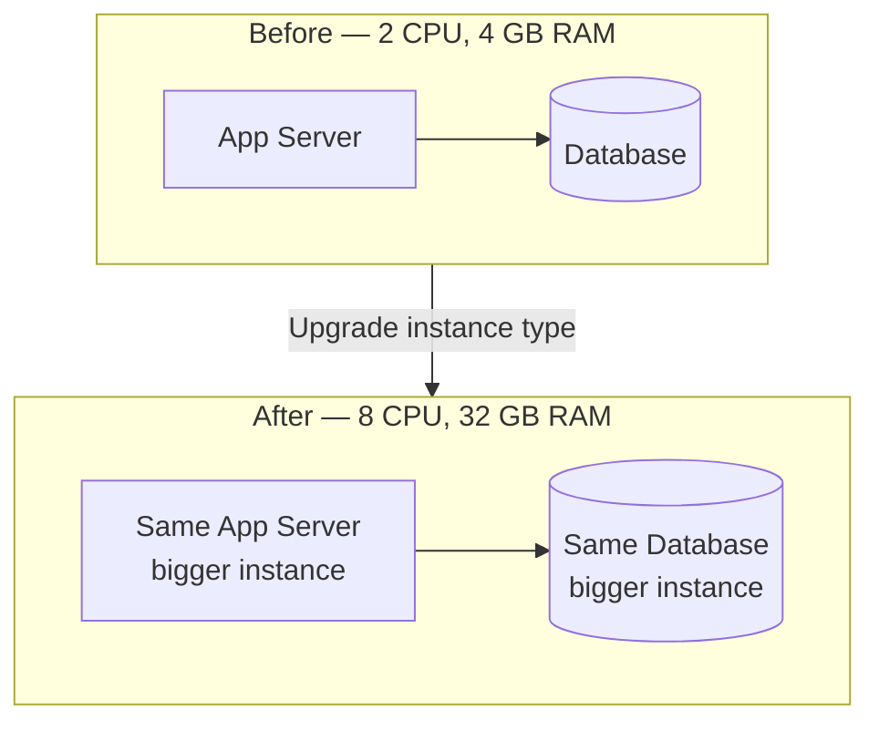
```mermaid
flowchart TB
    subgraph Before["Before — 2 CPU, 4 GB RAM"]
        App1[App Server]
        DB1[(Database)]
        App1 --> DB1
    end

    subgraph After["After — 8 CPU, 32 GB RAM"]
        App2[Same App Server<br/>bigger instance]
        DB2[(Same Database<br/>bigger instance)]
        App2 --> DB2
    end

    Before -->|"Upgrade instance type"| After
```


**How it works**

- Resize the VM or physical server (e.g., `t3.medium` → `t3.2xlarge`).
- The application usually keeps the same hostname, IP, and deployment — no sharding or clustering required.
- Databases benefit quickly: more RAM for buffer pool/cache, more CPU for query execution.

**Pros**

- Simple — often a config change or instance resize.
- No distributed-system problems (network partitions, consensus, data replication across nodes).
- Strong consistency stays straightforward — one writer, one source of truth.

**Cons**

- **Hard ceiling** — even the largest single machine has limits.
- **Downtime risk** — resizing may require restart or brief unavailability.
- **Single point of failure** — if that machine dies, the whole service is down.
- **Cost jumps** — high-end instances cost disproportionately more per unit of performance.

**Real-world examples**


| Scenario                            | Vertical scaling action                                |
| ----------------------------------- | ------------------------------------------------------ |
| PostgreSQL running slow on queries  | Move from 8 GB → 64 GB RAM so more data fits in memory |
| Node.js API hitting CPU limits      | Upgrade from 2 vCPU → 16 vCPU on the same EC2 instance |
| Redis cache evicting keys too often | Increase instance memory from 4 GB → 32 GB             |
| Early-stage startup                 | One app server + one DB — resize both as traffic grows |


**When to choose vertical scaling**

- Early product stage with moderate traffic.
- Stateful workloads that are hard to distribute (single-node DB, legacy monolith).
- Quick fix when you need headroom without redesigning the system.

---


#### Horizontal Scaling (Scale Out)

Add **more identical servers** and spread traffic, data, or work across them.

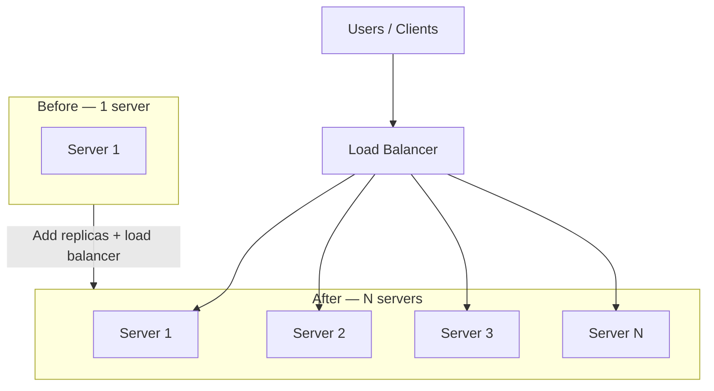
```mermaid
flowchart TB
    Users[Users / Clients] --> LB[Load Balancer]

    subgraph Before["Before — 1 server"]
        S1[Server 1]
    end

    subgraph After["After — N servers"]
        S2[Server 1]
        S3[Server 2]
        S4[Server 3]
        S5[Server N]
    end

    LB --> S2
    LB --> S3
    LB --> S4
    LB --> S5

    Before -->|"Add replicas + load balancer"| After
```


**How it works**

- Put a **load balancer** in front of stateless app servers; each request can go to any replica.
- For **stateful** systems (databases, caches), use replication, sharding, or partitioning so data spans nodes.
- Auto-scaling groups add/remove instances based on CPU, request rate, or queue depth.

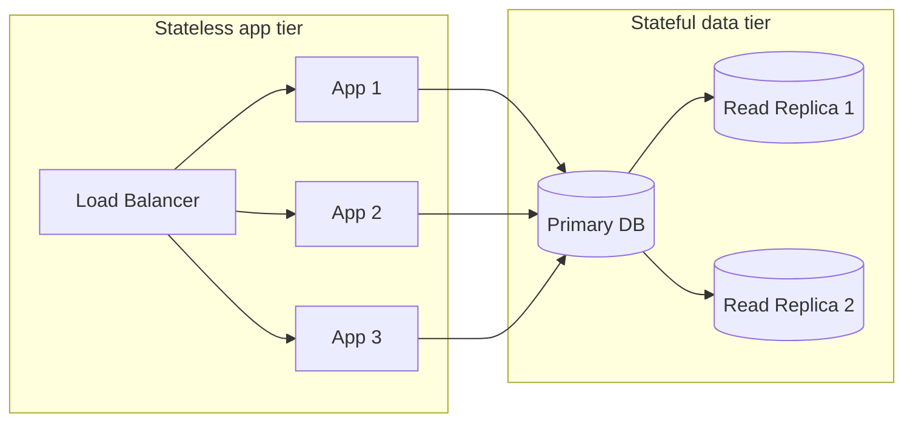
```mermaid
flowchart LR
    subgraph Stateless["Stateless app tier"]
        LB2[Load Balancer] --> A1[App 1]
        LB2 --> A2[App 2]
        LB2 --> A3[App 3]
    end

    subgraph Stateful["Stateful data tier"]
        A1 --> Primary[(Primary DB)]
        A2 --> Primary
        A3 --> Primary
        Primary --> Replica1[(Read Replica 1)]
        Primary --> Replica2[(Read Replica 2)]
    end
```


**Pros**

- **Near-unlimited growth** — keep adding nodes (within budget and design limits).
- **High availability** — one node failing does not take down the entire service.
- **Cost-efficient at scale** — commodity hardware instead of one giant machine.
- **Geographic distribution** — deploy replicas in multiple regions.

**Cons**

- Requires **stateless app design** or careful session/data management.
- **Operational complexity** — load balancers, service discovery, health checks, deployments across many nodes.
- **Data consistency challenges** — replication lag, split-brain, sharding key design.
- **Not all workloads scale linearly** — a single write-heavy DB can become the bottleneck.

**Real-world examples**


| Scenario                              | Horizontal scaling action                                                   |
| ------------------------------------- | --------------------------------------------------------------------------- |
| Netflix / YouTube streaming           | Thousands of edge and origin servers serve video in parallel                |
| Twitter / Instagram API               | Stateless API pods behind a load balancer; scale pod count with traffic     |
| Amazon product catalog reads          | Read replicas across regions; cache layers (Redis cluster)                  |
| Kafka / SQS message processing        | Add consumer instances; each partition handled by one consumer in the group |
| URL shortener at billions of requests | Shard the key→URL mapping table across many DB nodes                        |


**When to choose horizontal scaling**

- High traffic, high availability, or multi-region requirements.
- Stateless microservices, CDN edges, worker pools, and read-heavy APIs.
- When vertical scaling has hit diminishing returns or cost becomes prohibitive.

---


#### Choosing between them (practical rule of thumb)

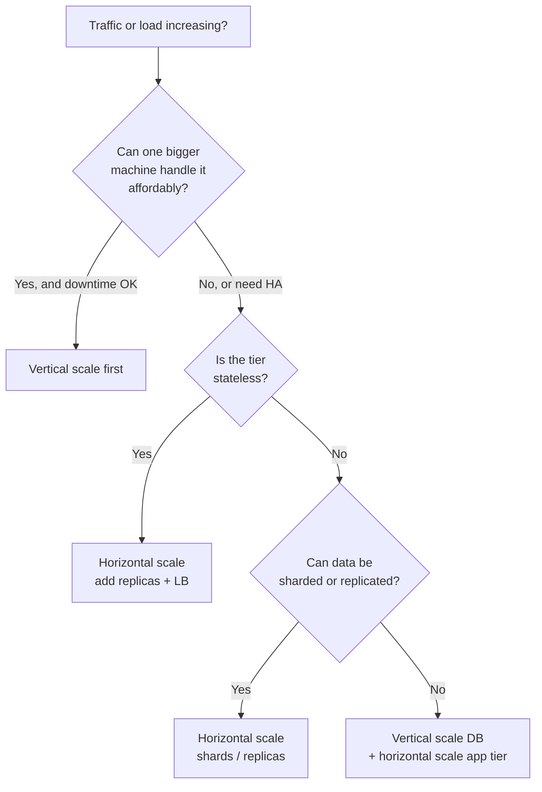
```mermaid
flowchart TD
    Start[Traffic or load increasing?] --> Q1{Can one bigger<br/>machine handle it<br/>affordably?}
    Q1 -->|Yes, and downtime OK| V[Vertical scale first]
    Q1 -->|No, or need HA| Q2{Is the tier<br/>stateless?}
    Q2 -->|Yes| H[Horizontal scale<br/>add replicas + LB]
    Q2 -->|No| Q3{Can data be<br/>sharded or replicated?}
    Q3 -->|Yes| H2[Horizontal scale<br/>shards / replicas]
    Q3 -->|No| V2[Vertical scale DB<br/>+ horizontal scale app tier]
```


Most production systems use **both**: vertically scale the database until sharding is needed, and horizontally scale the stateless application and cache layers from the start.

---


### 2. What is a load balancer, and why is it important?

A **load balancer** sits between clients and a pool of servers, forwarding each request to a healthy backend instance. It improves **availability** (no single server handles everything), **performance** (load spread evenly), and **fault tolerance** (unhealthy nodes are skipped).

---


#### How it works

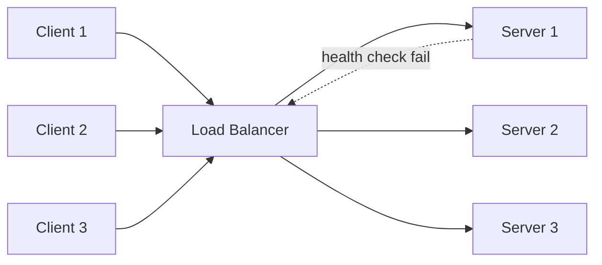
```mermaid
flowchart LR
    C1[Client 1] --> LB[Load Balancer]
    C2[Client 2] --> LB
    C3[Client 3] --> LB
    LB --> S1[Server 1]
    LB --> S2[Server 2]
    LB --> S3[Server 3]
    S1 -.->|health check fail| LB
```


1. Client sends request to a single **virtual IP / DNS name** (e.g., `api.example.com`).
2. Load balancer picks a backend using an algorithm (round-robin, least connections, weighted, IP hash).
3. **Health checks** probe servers periodically; failed nodes are removed from the pool.
4. Response flows back through the load balancer to the client (Layer 7) or directly from server (Layer 4 passthrough).

---


#### Types of load balancers


| Type                   | Layer       | What it sees               | Best for                                         |
| ---------------------- | ----------- | -------------------------- | ------------------------------------------------ |
| **L4 (Transport)**     | TCP/UDP     | IP + port                  | Raw throughput, WebSockets, gaming               |
| **L7 (Application)**   | HTTP/HTTPS  | URL path, headers, cookies | Routing `/api` vs `/static`, sticky sessions     |
| **DNS load balancing** | DNS         | Domain name                | Geographic routing, multi-region failover        |
| **Client-side LB**     | App library | Service registry           | Microservices (e.g., gRPC client load balancing) |


---


#### Common algorithms


| Algorithm                | Behavior                                      | Use case                                         |
| ------------------------ | --------------------------------------------- | ------------------------------------------------ |
| **Round-robin**          | Rotate through servers in order               | Equal-capacity, stateless servers                |
| **Least connections**    | Send to server with fewest active connections | Long-lived connections, varying request duration |
| **Weighted round-robin** | More traffic to stronger machines             | Mixed instance sizes                             |
| **IP hash**              | Same client IP → same server                  | Session affinity without cookies                 |
| **Consistent hashing**   | Minimal remapping when nodes added/removed    | Caches, sharded backends                         |


---


#### Why it matters

- **Zero-downtime deploys** — drain one server, deploy, re-add to pool.
- **Auto-scaling trigger point** — LB distributes traffic as new instances join.
- **SSL termination** — decrypt HTTPS at the LB, reduce CPU load on app servers.
- **DDoS absorption** — first line of defense; rate limiting and WAF often live here.

**Real-world examples:** AWS ALB/NLB, NGINX, HAProxy, Cloudflare, Kubernetes `Service` + Ingress.

---


### 3. What's the CAP theorem?

The **CAP theorem** (Brewer's theorem): a distributed data store can guarantee at most **two of three** properties — and during a **network partition**, **P is unavoidable**, so the real choice is **C vs A**.


| Property                    | Meaning                                                                                  |
| --------------------------- | ---------------------------------------------------------------------------------------- |
| **C — Consistency**         | Every read returns the most recent write (all nodes see the same data at the same time). |
| **A — Availability**        | Every request receives a non-error response, even if some nodes are down.                |
| **P — Partition Tolerance** | System continues operating when network links between nodes break.                       |


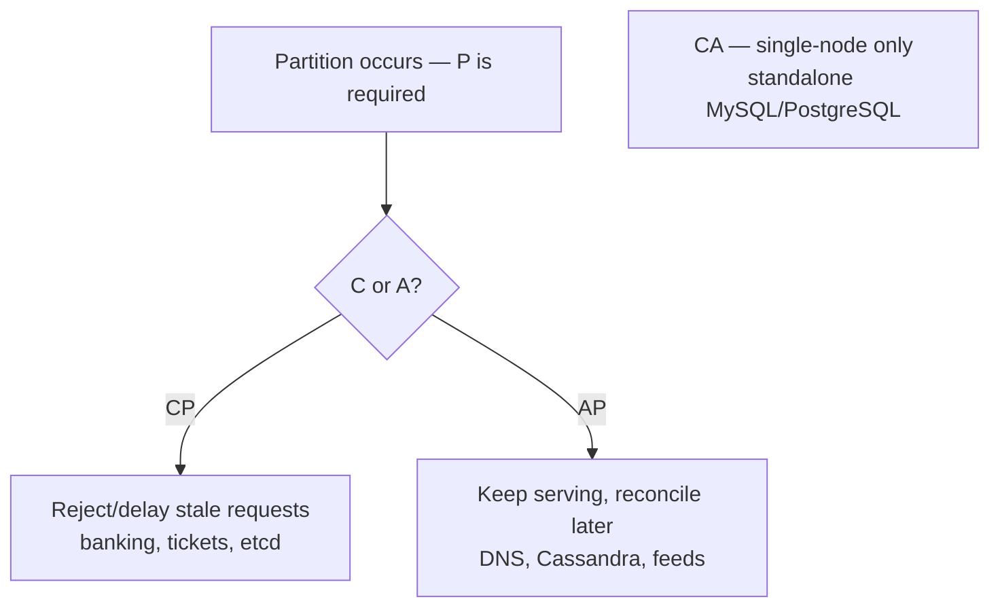
```mermaid
flowchart TD
    P[Partition occurs — P is required] --> Choice{C or A?}
    Choice -->|CP| CP[Reject/delay stale requests<br/>banking, tickets, etcd]
    Choice -->|AP| AP[Keep serving, reconcile later<br/>DNS, Cassandra, feeds]
    CA[CA — single-node only<br/>standalone MySQL/PostgreSQL]
```


| Combo  | During partition                                                         | Examples                                                            |
| ------ | ------------------------------------------------------------------------ | ------------------------------------------------------------------- |
| **CA** | Not realistic when replicated — one machine has no partition to tolerate | Standalone DB on one server                                         |
| **CP** | Block or error rather than serve stale data                              | Bank transfer, last train seat — **MongoDB**, **etcd**, **Spanner** |
| **AP** | Accept writes/reads; replicas may disagree temporarily                   | Shopping cart, subscriber count — **Cassandra**, **DynamoDB**       |


---


#### C — Consistency *(CAP ≠ ACID)*

**CAP consistency** = all replicas agree on the latest write. **ACID consistency** = transactions obey schema rules — different idea.

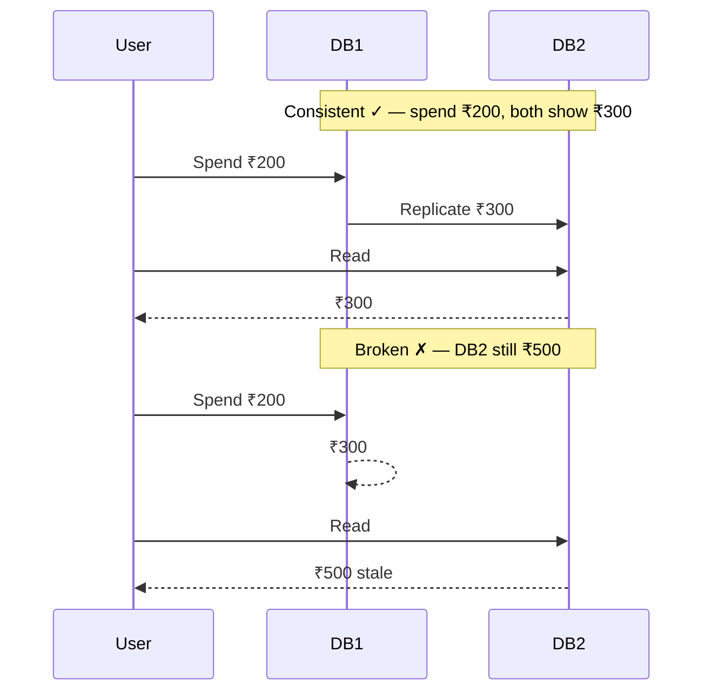
```mermaid
sequenceDiagram
    participant User
    participant DB1
    participant DB2

    Note over DB1,DB2: Consistent ✓ — spend ₹200, both show ₹300
    User->>DB1: Spend ₹200
    DB1->>DB2: Replicate ₹300
    User->>DB2: Read
    DB2-->>User: ₹300

    Note over DB1,DB2: Broken ✗ — DB2 still ₹500
    User->>DB1: Spend ₹200
    DB1-->>DB1: ₹300
    User->>DB2: Read
    DB2-->>User: ₹500 stale
```


---


#### A — Availability

Every **non-failing** node responds in reasonable time — both sides of a partition still answer if you choose **A**.

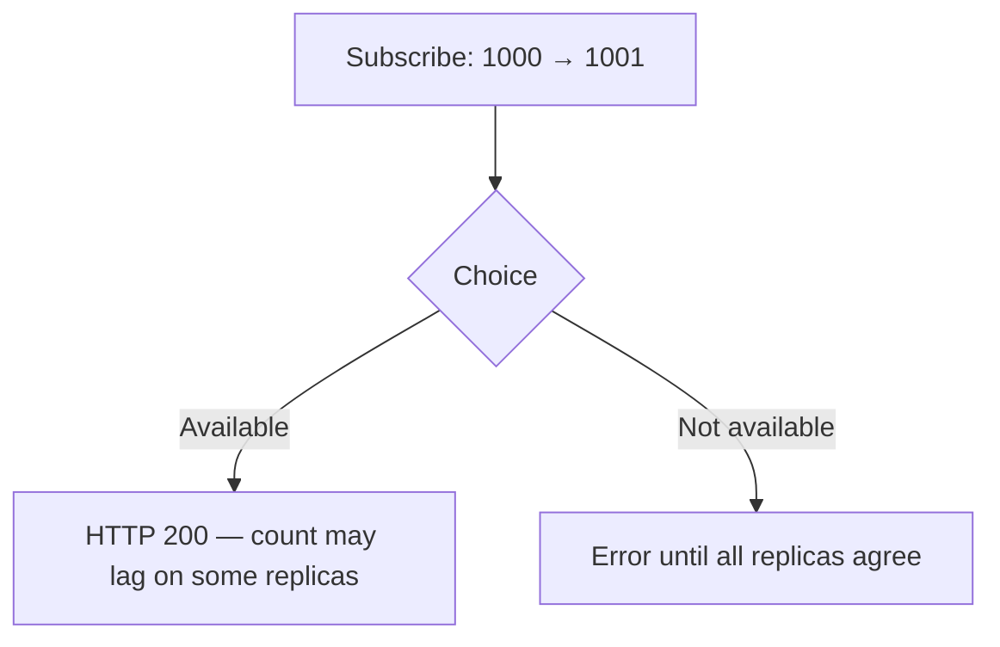
```mermaid
flowchart TD
    B[Subscribe: 1000 → 1001] --> Q{Choice}
    Q -->|Available| OK[HTTP 200 — count may lag on some replicas]
    Q -->|Not available| Fail[Error until all replicas agree]
```


---


#### P — Partition Tolerance

Network splits nodes that **cannot talk**; each group keeps running until the link heals.

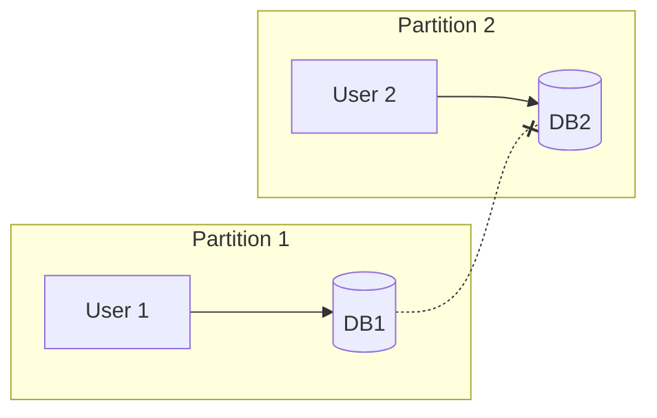
```mermaid
flowchart LR
    subgraph part1["Partition 1"]
        U1[User 1] --> DB1[(DB1)]
    end
    subgraph part2["Partition 2"]
        U2[User 2] --> DB2[(DB2)]
    end
    DB1 -.-x DB2
```


---


#### CP vs AP under partition *(diagrams)*

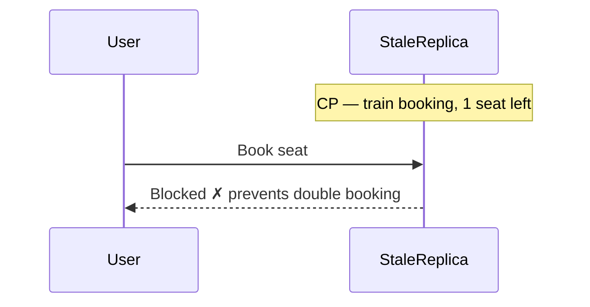
```mermaid
sequenceDiagram
    participant User
    participant StaleReplica

    Note over StaleReplica: CP — train booking, 1 seat left
    User->>StaleReplica: Book seat
    StaleReplica-->>User: Blocked ✗ prevents double booking
```


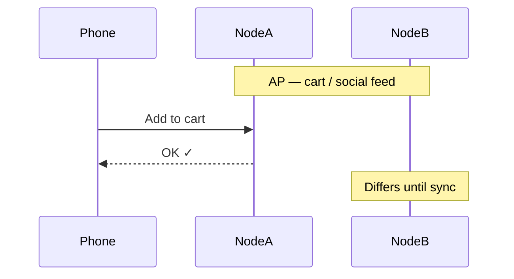
```mermaid
sequenceDiagram
    participant Phone
    participant NodeA
    participant NodeB

    Note over NodeA,NodeB: AP — cart / social feed
    Phone->>NodeA: Add to cart
    NodeA-->>Phone: OK ✓
    Note over NodeB: Differs until sync
```


---


#### Common misconceptions

- CAP applies **during a partition**, not as a permanent "pick 2 forever" label.
- **"2 of 3" is simplified** — pick databases on workload fit, not CAP letters alone.
- Systems are **rarely pure CP or AP** — tunable per operation (quorum reads, session consistency).
- **PACELC:** no partition → often **Latency vs Consistency**; partition → **Availability vs Consistency** (partitions are relatively rare).

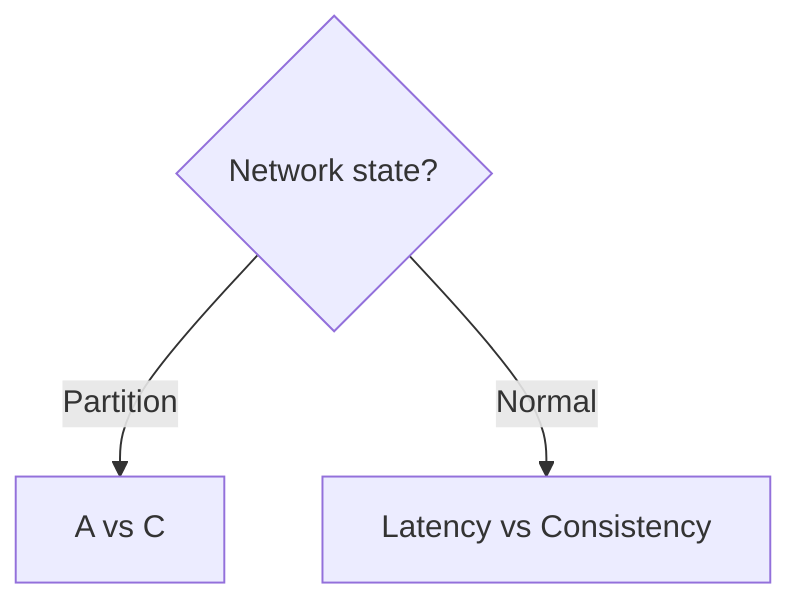
```mermaid
flowchart TD
    Start{Network state?}
    Start -->|Partition| CAP[A vs C]
    Start -->|Normal| PACELC[Latency vs Consistency]
```


---


### 4. What's the difference between strong and eventual consistency?

**Consistency models** define what a reader is guaranteed to see after a write — a spectrum from strict to relaxed.


| Model                    | Guarantee                                           | Latency                      | Use case                            |
| ------------------------ | --------------------------------------------------- | ---------------------------- | ----------------------------------- |
| **Strong consistency**   | Every read sees the latest write                    | Higher (may wait for quorum) | Banking, inventory, leader election |
| **Eventual consistency** | Reads may be stale; all replicas converge over time | Lower                        | Social likes, view counts, DNS      |
| **Read-your-writes**     | User always sees their own writes                   | Medium                       | User profile updates after save     |
| **Causal consistency**   | Related operations seen in order                    | Medium                       | Comment threads, chat               |


---


#### Strong consistency

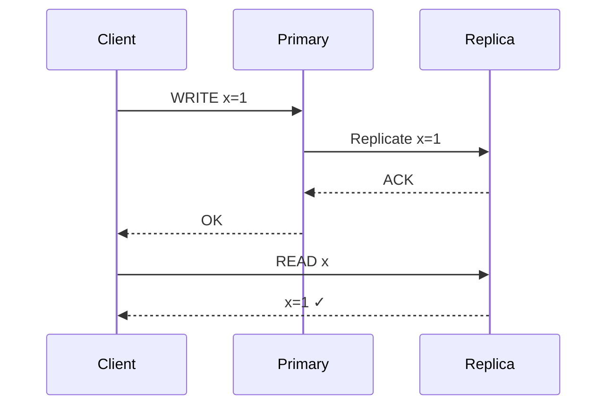
```mermaid
sequenceDiagram
    participant Client
    participant Primary
    participant Replica

    Client->>Primary: WRITE x=1
    Primary->>Replica: Replicate x=1
    Replica-->>Primary: ACK
    Primary-->>Client: OK
    Client->>Replica: READ x
    Replica-->>Client: x=1 ✓
```


Every read reflects the most recent successful write. Achieved via:

- Single leader (all writes go to primary; reads from primary or synced replicas).
- **Quorum reads/writes** — read only after W nodes acknowledge the write (e.g., Raft, Paxos).
- **Synchronous replication** — write blocked until all replicas confirm.

**Tradeoff:** Higher latency, lower availability during failures (must wait for quorum).

---


#### Eventual consistency

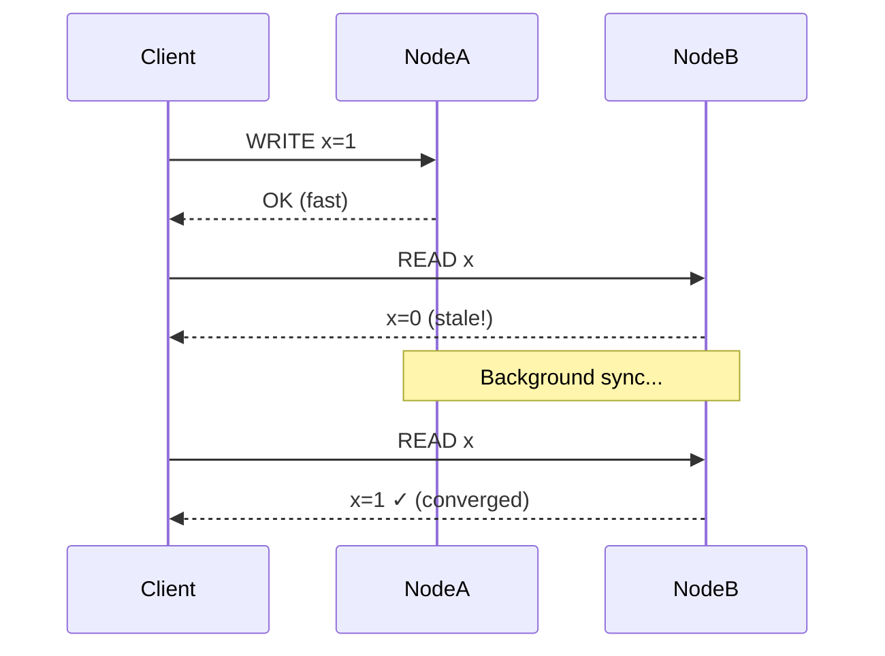
```mermaid
sequenceDiagram
    participant Client
    participant NodeA
    participant NodeB

    Client->>NodeA: WRITE x=1
    NodeA-->>Client: OK (fast)
    Client->>NodeB: READ x
    NodeB-->>Client: x=0 (stale!)
    Note over NodeA,NodeB: Background sync...
    Client->>NodeB: READ x
    NodeB-->>Client: x=1 ✓ (converged)
```


Replicas may temporarily diverge; **anti-entropy**, **gossip protocols**, or **read repair** bring them back in sync.

**Tradeoff:** Fast writes and high availability, but users may briefly see outdated data.

---


#### When to choose which

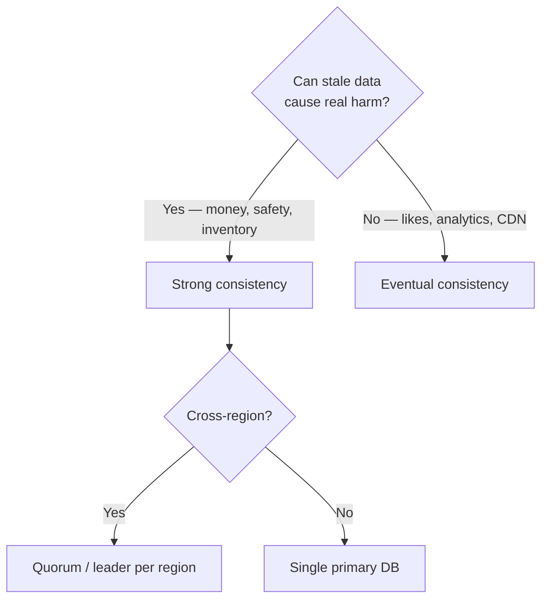
```mermaid
flowchart TD
    Q{Can stale data<br/>cause real harm?}
    Q -->|Yes — money, safety, inventory| Strong[Strong consistency]
    Q -->|No — likes, analytics, CDN| Eventual[Eventual consistency]
    Strong --> Q2{Cross-region?}
    Q2 -->|Yes| Quorum[Quorum / leader per region]
    Q2 -->|No| Single[Single primary DB]
```


**Examples:**

- **Strong:** Stripe payment ledger, airline seat booking, distributed lock (Redis Redlock with caveats).
- **Eventual:** Twitter like count, Amazon product review count, S3 cross-region replication, DNS propagation.

---


## Data & Storage


### 5. When should you use a SQL database vs. NoSQL?

**SQL (relational)** and **NoSQL (non-relational)** databases solve different problems. The choice depends on data shape, consistency needs, scale, and query patterns — not "NoSQL is always faster."


|                    | SQL (Relational)                           | NoSQL                                          |
| ------------------ | ------------------------------------------ | ---------------------------------------------- |
| **Schema**         | Fixed, enforced (tables, columns, types)   | Flexible or schema-less (documents, key-value) |
| **Relationships**  | JOINs across tables                        | Denormalized; embed or lookup by key           |
| **Transactions**   | Full ACID                                  | Often eventual; some support limited ACID      |
| **Scale pattern**  | Vertical + read replicas; sharding is hard | Built for horizontal scale                     |
| **Query language** | SQL (standard, expressive)                 | Varies (MongoDB query, Cassandra CQL)          |
| **Examples**       | PostgreSQL, MySQL, Oracle                  | MongoDB, Cassandra, Redis, DynamoDB            |


---


#### When to use SQL

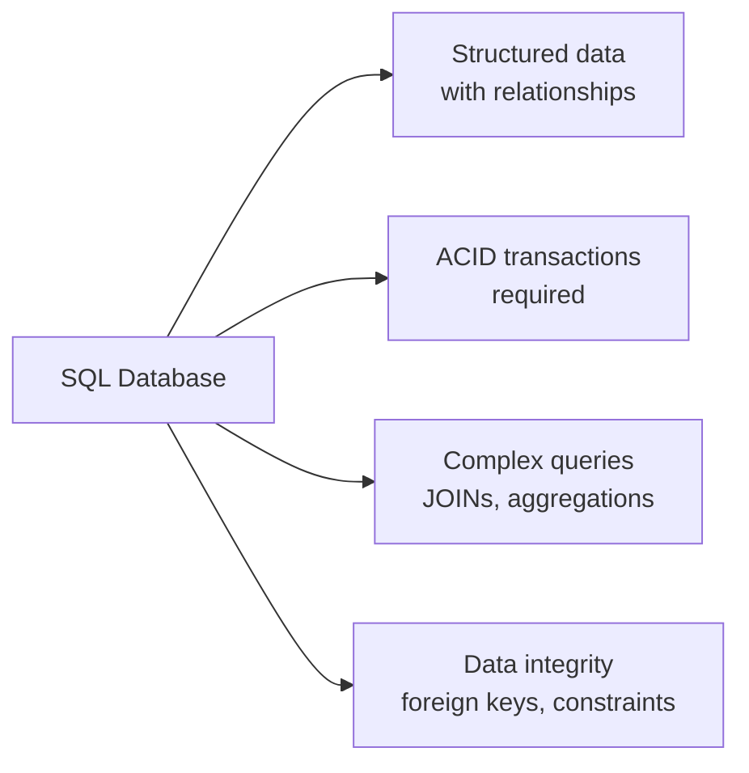
```mermaid
flowchart LR
    SQL[SQL Database] --> A[Structured data<br/>with relationships]
    SQL --> B[ACID transactions<br/>required]
    SQL --> C[Complex queries<br/>JOINs, aggregations]
    SQL --> D[Data integrity<br/>foreign keys, constraints]
```


- **Financial systems** — transfers must be atomic (debit + credit in one transaction).
- **E-commerce orders** — orders ↔ line items ↔ payments with referential integrity.
- **Reporting / analytics** — ad-hoc SQL queries across normalized tables.
- **Moderate scale** — PostgreSQL handles millions of rows with proper indexing.

**Example:** An HR system with employees, departments, and salaries — relational model with JOINs is natural.

---


#### When to use NoSQL

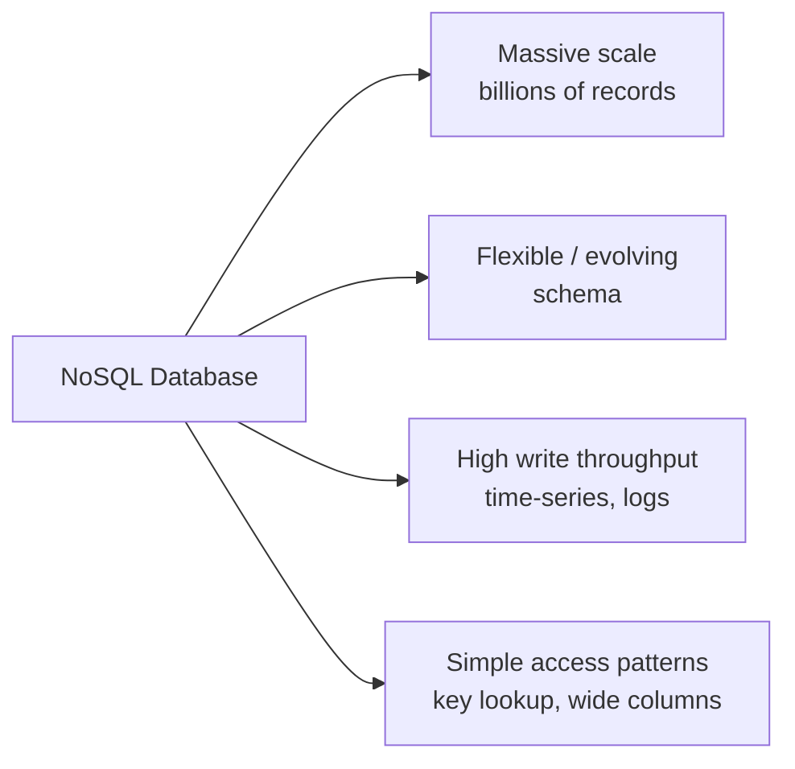
```mermaid
flowchart LR
    NS[NoSQL Database] --> A[Massive scale<br/>billions of records]
    NS --> B[Flexible / evolving<br/>schema]
    NS --> C[High write throughput<br/>time-series, logs]
    NS --> D[Simple access patterns<br/>key lookup, wide columns]
```


| NoSQL type      | Model                 | Best for                         | Example          |
| --------------- | --------------------- | -------------------------------- | ---------------- |
| **Document**    | JSON-like documents   | Content, catalogs, user profiles | MongoDB, CouchDB |
| **Key-Value**   | Key → value           | Sessions, caching, feature flags | Redis, DynamoDB  |
| **Wide-column** | Row + column families | Time-series, IoT, feeds          | Cassandra, HBase |
| **Graph**       | Nodes + edges         | Social networks, fraud detection | Neo4j, Neptune   |


**Example:** Instagram stores billions of photos metadata — Cassandra for high write throughput and geographic distribution.

---


#### Hybrid approach (common in production)

Most large systems use **both**:

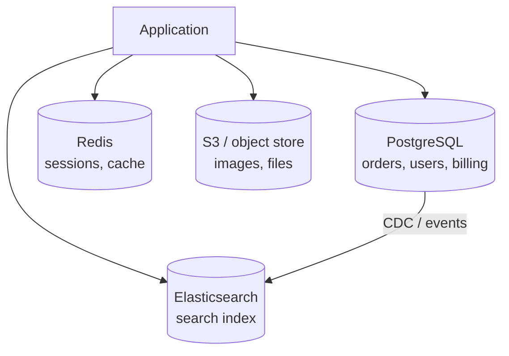
```mermaid
flowchart TB
    App[Application] --> PG[(PostgreSQL<br/>orders, users, billing)]
    App --> Redis[(Redis<br/>sessions, cache)]
    App --> ES[(Elasticsearch<br/>search index)]
    App --> S3[(S3 / object store<br/>images, files)]
    PG -->|"CDC / events"| ES
```


PostgreSQL for transactional core; Redis for speed; Elasticsearch for search; S3 for blobs.

---


### 6. What is database sharding?

**Sharding** (horizontal partitioning) splits one logical database into **multiple smaller databases (shards)**, each holding a subset of rows, distributed across servers.

---


#### How sharding works

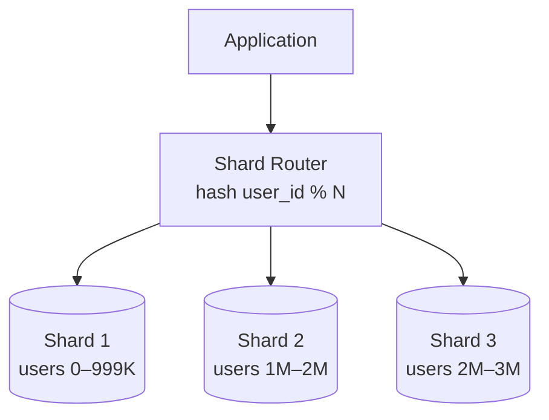
```mermaid
flowchart TB
    App[Application] --> Router[Shard Router<br/>hash user_id % N]
    Router --> S1[(Shard 1<br/>users 0–999K)]
    Router --> S2[(Shard 2<br/>users 1M–2M)]
    Router --> S3[(Shard 3<br/>users 2M–3M)]
```


1. Choose a **shard key** (e.g., `user_id`, `tenant_id`, geographic region).
2. Apply a **hash or range function** to route each row to exactly one shard.
3. Application or middleware directs queries to the correct shard(s).

---


#### Sharding strategies


| Strategy            | How it works                       | Pros                    | Cons                                             |
| ------------------- | ---------------------------------- | ----------------------- | ------------------------------------------------ |
| **Hash-based**      | `hash(key) % num_shards`           | Even distribution       | Resharding is painful (consistent hashing helps) |
| **Range-based**     | Users A–M → shard 1, N–Z → shard 2 | Range queries easy      | Hot spots if data skewed                         |
| **Geographic**      | US users → US shard, EU → EU shard | Low latency, compliance | Cross-region queries are hard                    |
| **Directory-based** | Lookup table maps key → shard      | Flexible                | Lookup table is a bottleneck                     |


---


#### Challenges

- **Cross-shard JOINs** — not supported natively; denormalize or aggregate at app layer.
- **Cross-shard transactions** — use saga pattern or two-phase commit (complex).
- **Resharding** — adding shards requires rebalancing data (consistent hashing minimizes disruption).
- **Hot shards** — one celebrity user's shard gets all traffic; mitigate with sub-sharding or caching.

**Real-world examples:** Instagram (Cassandra shards), Uber (Schemaless on MySQL shards), Discord (trillions of messages across Cassandra clusters).

**When to shard:** When a single database node cannot handle write throughput or storage size even after vertical scaling and read replicas.

---


### 7. What's a covering index and when is it useful?

A **covering index** is an index that contains **all columns** a query needs, so the database can satisfy the query entirely from the index without touching the main table (no "回表" / table lookup).

---


#### Index-only scan vs table lookup

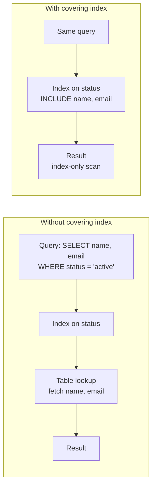
```mermaid
flowchart LR
    subgraph Without["Without covering index"]
        Q1[Query: SELECT name, email<br/>WHERE status = 'active'] --> I1[Index on status]
        I1 --> T1[Table lookup<br/>fetch name, email]
        T1 --> R1[Result]
    end

    subgraph With["With covering index"]
        Q2[Same query] --> I2[Index on status<br/>INCLUDE name, email]
        I2 --> R2[Result<br/>index-only scan]
    end
```


**Without covering index:** Index finds matching rows → for each row, fetch remaining columns from the table (random I/O).

**With covering index:** Index already has `status`, `name`, `email` → single sequential index scan.

---


#### Example

```sql
-- Frequent query
SELECT user_id, email, created_at
FROM users
WHERE status = 'active'
ORDER BY created_at DESC
LIMIT 20;

-- Covering index (PostgreSQL)
CREATE INDEX idx_active_users_covering
ON users (status, created_at DESC)
INCLUDE (user_id, email);
```

The query reads **only the index pages** — much faster for hot, repeated queries.

---


#### When to use


| Scenario                                              | Benefit                         |
| ----------------------------------------------------- | ------------------------------- |
| Dashboard queries run thousands of times/sec          | Eliminates table I/O bottleneck |
| Read-heavy OLTP (lookup by key + return a few fields) | Sub-millisecond response        |
| Reporting on indexed filter columns                   | Faster pagination               |


**Tradeoffs:**

- **Larger index** — more disk and memory (every included column adds size).
- **Write overhead** — every INSERT/UPDATE must update the covering index too.
- **Not a silver bullet** — only helps specific query patterns; profile before adding.

---


### 8. What's a cache, and what are common cache invalidation strategies?

A **cache** stores a copy of data in **faster, closer storage** so the next access skips slow work. The idea is the same everywhere — only **what** is cached, **where** it lives, and **who** shares it change.


| Term           | Meaning                                             |
| -------------- | --------------------------------------------------- |
| **Cache hit**  | Data found in cache — skip the expensive path       |
| **Cache miss** | Not in cache — fetch from origin, then populate     |
| **Hit ratio**  | `hits / (hits + misses)` — target 90%+ for hot data |
| **TTL**        | Time-to-live — entry expires after N seconds        |


---


#### Cache taxonomy — hardware, software, and LLM

```mermaid
flowchart TB
    subgraph hw["Hardware caches"]
        L1[L1 — per core, ~1 MB, ns]
        L2[L2 — per core, ~10 MB]
        L3[L3 — shared, ~10–100 MB]
        L1 --> L2 --> L3 --> RAM[(Main RAM)]
    end

    subgraph sw["Software & distributed caches"]
        Browser[Browser cache]
        CDN[CDN edge]
        App[(Redis / Memcached)]
        DBPool[(DB buffer pool)]
        Browser --> CDN --> App --> DBPool --> Disk[(Disk / DB)]
    end

    subgraph llm["LLM inference caches"]
        LM[LM Cache — prompt → response<br/>outside the model]
        Engine[LLM inference engine]
        KV[KV Cache — attention K,V tensors<br/>inside each Transformer layer]
        LM --> Engine --> KV
    end
```


| Layer                             | What it caches                     | Scope                      | Typical latency       |
| --------------------------------- | ---------------------------------- | -------------------------- | --------------------- |
| **CPU L1/L2/L3**                  | Recently used memory lines         | Per core / shared chip     | ~ns                   |
| **Browser**                       | HTTP responses, assets             | Per user                   | ~0 ms                 |
| **CDN edge**                      | Static files, cached API responses | Regional, many users       | ~10–50 ms             |
| **Application (Redis/Memcached)** | Sessions, query results, objects   | Shared across app servers  | ~1 ms                 |
| **DB buffer pool**                | Hot pages / rows                   | Per DB instance            | ~0.1 ms               |
| **LM Cache**                      | Full prompt → model output         | Shared across users        | Skips GPU run         |
| **KV Cache**                      | Attention keys & values per token  | Per conversation / request | Speeds each new token |


---


#### Hardware caches (CPU)

The CPU keeps recently used RAM in **on-chip SRAM** (L1 → L2 → L3). On a miss, the CPU stalls while fetching from RAM (100×+ slower).

```mermaid
flowchart LR
    Core[CPU core] -->|hit| L1[L1 cache]
    L1 -->|miss| L2[L2]
    L2 -->|miss| L3[L3]
    L3 -->|miss| RAM[RAM]
```


**You don't manage this in application code** — but it matters for system design: sequential memory access is fast (prefetch-friendly); random jumps cause cache misses and slow hot paths.

---


#### Software & distributed caches

The pattern most backend interviews focus on:

```mermaid
flowchart LR
    Client --> App[Application]
    App -->|1. Check| Cache[(Redis / in-memory)]
    Cache -->|HIT| App
    App -->|MISS| DB[(Database)]
    DB -->|populate| Cache
    DB --> App
```


**Examples:** Redis for sessions, Memcached for social feeds, CloudFront for static assets, `@cache` decorators on API handlers.

##### Cache invalidation strategies

> *"There are only two hard things in Computer Science: cache invalidation and naming things."* — Phil Karlton


| Strategy                       | How it works                                      | Pros                     | Cons                                  |
| ------------------------------ | ------------------------------------------------- | ------------------------ | ------------------------------------- |
| **TTL (Time-to-Live)**         | Entry expires after fixed time                    | Simple, self-healing     | Stale data until expiry               |
| **Write-through**              | Write to cache **and** DB simultaneously          | Cache always fresh       | Slower writes                         |
| **Write-behind (write-back)**  | Write to cache first; flush to DB async           | Fast writes              | Risk of data loss on crash            |
| **Cache-aside (lazy loading)** | App reads cache → miss → read DB → populate cache | Flexible, common pattern | Stale on DB update unless invalidated |
| **Explicit invalidation**      | On update/delete, remove or refresh cache key     | Precise freshness        | Must remember every write path        |


##### Cache-aside pattern (most common)

```mermaid
sequenceDiagram
    participant App
    participant Cache
    participant DB

    App->>Cache: GET user:123
    Cache-->>App: MISS
    App->>DB: SELECT * FROM users WHERE id=123
    DB-->>App: user data
    App->>Cache: SET user:123 (TTL=300s)

    Note over App,Cache: On update
    App->>DB: UPDATE users ...
    App->>Cache: DEL user:123
```


---


#### LLM caches — LM Cache vs KV Cache

LLM serving uses **two different caches at two different levels**. They are not interchangeable.


|                  | **LM Cache**                                       | **KV Cache**                                   |
| ---------------- | -------------------------------------------------- | ---------------------------------------------- |
| **Stores**       | Prompt → full response                             | Attention **K** and **V** tensors              |
| **Location**     | Outside the model (app / gateway)                  | Inside every Transformer attention layer       |
| **When it runs** | **Before** inference starts                        | **During** token-by-token generation           |
| **Shared?**      | Yes — across users with same prompt                | Usually no — one cache per active conversation |
| **Lifetime**     | Persistent (until evicted)                         | Per request / session                          |
| **Saves**        | Entire GPU inference run                           | Recomputing attention on previous tokens       |
| **Best for**     | Repeated prompts (FAQ, RAG chunks, system prompts) | Long outputs, multi-turn chat                  |


**LM Cache** — if the exact prompt was seen before, return the stored answer and **never call the model**.

**KV Cache** — during autoregressive decoding, token 4 reuses K,V from tokens 1–3 instead of recomputing them. Memory grows with **context length**.

```mermaid
flowchart TB
    Client[Client] --> GW[API Gateway]
    GW --> LM[(LM Cache<br/>outside model)]
    LM -->|hit| Resp[Return cached response]
    LM -->|miss| Engine[LLM inference engine]
    Engine --> TB[Transformer blocks]
    TB --> KV[KV Cache inside attention<br/>per layer]
    KV --> Gen[Generate next token]
```


```mermaid
flowchart TD
    P[User prompt] --> Check{LM Cache hit?}
    Check -->|Yes| Fast[Return instantly — no GPU]
    Check -->|No| Model[Run model]
    Model --> Decode[Generate token by token]
    Decode --> KV[Each token: store K,V in KV Cache<br/>reuse for all future tokens]
    KV --> Out[Response]
    Out --> Store[Optional: store in LM Cache]
```


**One-line summary:** **LM Cache** skips running the model entirely; **KV Cache** skips recomputing attention for tokens already processed in the current run.

---


## Reliability & Scaling


### 9. What's the difference between synchronous and asynchronous processing?

**Synchronous** processing blocks the caller until the operation completes. **Asynchronous** processing hands off work and continues — the result arrives later via callback, polling, or event.


|                       | Synchronous                                        | Asynchronous                                  |
| --------------------- | -------------------------------------------------- | --------------------------------------------- |
| **Caller waits?**     | Yes — blocked until response                       | No — continues immediately                    |
| **Coupling**          | Tight — caller depends on callee availability      | Loose — mediated by queue/event               |
| **Failure handling**  | Caller sees error immediately                      | Retry/dead-letter handled downstream          |
| **Latency perceived** | End-to-end in one request                          | Fast ack; work completes later                |
| **Example**           | REST API call: POST /order → wait for confirmation | POST /order → 202 Accepted → email sent later |


---


#### Synchronous processing

```mermaid
sequenceDiagram
    participant Client
    participant API
    participant Payment
    participant DB

    Client->>API: POST /checkout
    API->>Payment: Charge card
    Payment-->>API: Success
    API->>DB: Save order
    DB-->>API: OK
    API-->>Client: 200 Order confirmed
    Note over Client: Client waited for entire chain
```


**When to use:**

- User needs immediate result (login, search, payment confirmation).
- Simple request/response flows with low latency requirements.
- Strong consistency required in one atomic user action.

**Risk:** If Payment service is slow or down, the entire checkout hangs or fails.

---


#### Asynchronous processing

```mermaid
sequenceDiagram
    participant Client
    participant API
    participant Queue
    participant Worker
    participant Email

    Client->>API: POST /signup
    API->>Queue: Enqueue welcome-email job
    API-->>Client: 202 Accepted
    Queue->>Worker: Deliver job
    Worker->>Email: Send welcome email
    Email-->>Worker: Done
```


**When to use:**

- Non-critical path work (emails, notifications, analytics, thumbnails).
- Spike absorption — queue buffers burst traffic.
- Long-running tasks (video transcoding, report generation).

**Patterns:** Message queues (SQS, RabbitMQ), event streams (Kafka), webhooks, background job processors (Celery, Sidekiq).

---


#### Sync vs async decision

```mermaid
flowchart TD
    Q{Does user need<br/>result immediately?}
    Q -->|Yes| Sync[Synchronous]
    Q -->|No| Q2{Can downstream<br/>failure be retried?}
    Q2 -->|Yes| Async[Asynchronous + queue]
    Q2 -->|No| Sync2[Synchronous with<br/>timeout + fallback]
```


**Hybrid (common):** Checkout is sync for payment; order confirmation email is async via queue.

---


### 10. What are message queues used for?

A **message queue** is middleware that buffers messages between a **producer** (sender) and **consumer** (receiver), enabling reliable, decoupled, asynchronous communication.

```mermaid
flowchart LR
    P1[Order Service] -->|publish| Q[(Message Queue<br/>Kafka / SQS / RabbitMQ)]
    P2[Payment Service] -->|publish| Q
    Q -->|consume| C1[Email Worker]
    Q -->|consume| C2[Analytics Worker]
    Q -->|consume| C3[Inventory Worker]
```


---


#### Core use cases


| Use case                    | How the queue helps                                    | Example                                                                                          |
| --------------------------- | ------------------------------------------------------ | ------------------------------------------------------------------------------------------------ |
| **Decoupling services**     | Producer doesn't need to know consumers                | Order service publishes `OrderCreated`; email, analytics, inventory each subscribe independently |
| **Handling traffic spikes** | Queue absorbs burst; consumers process at their pace   | Black Friday orders spike 100×; queue buffers, workers catch up                                  |
| **Reliability / retries**   | Failed messages re-queued or sent to dead-letter queue | Payment webhook fails → retry 3× with backoff → DLQ for manual review                            |
| **Async workflows**         | Multi-step pipelines without blocking                  | Upload video → queue → transcode → queue → thumbnail → notify user                               |


---


#### Delivery guarantees


| Guarantee         | Meaning                                            | Example system                                       |
| ----------------- | -------------------------------------------------- | ---------------------------------------------------- |
| **At-most-once**  | Message delivered zero or one time; may be lost    | Fire-and-forget UDP-style                            |
| **At-least-once** | Message delivered one or more times; may duplicate | Kafka, SQS (default) — requires idempotent consumers |
| **Exactly-once**  | Message processed exactly one time                 | Kafka transactions + idempotent producer; complex    |


---


#### Popular message queue systems


| System             | Type                           | Strengths                               |
| ------------------ | ------------------------------ | --------------------------------------- |
| **Apache Kafka**   | Distributed event log / stream | High throughput, replay, event sourcing |
| **AWS SQS**        | Managed queue                  | Simple, serverless, auto-scaling        |
| **RabbitMQ**       | Traditional message broker     | Routing (exchanges), priority queues    |
| **Redis Streams**  | In-memory stream               | Low latency, lightweight                |
| **Google Pub/Sub** | Managed pub/sub                | Global, multi-subscriber                |


**Real-world example:** Uber uses Kafka for real-time event streaming (trip events, driver location); Slack uses Kafka for message indexing pipeline.

---


### 11. What is idempotency, and why does it matter?

An operation is **idempotent** if executing it **once or multiple times produces the same result**. In distributed systems, retries, duplicate messages, and network timeouts make idempotency essential.

---


#### Why duplicates happen

```mermaid
sequenceDiagram
    participant Client
    participant API
    participant DB

    Client->>API: POST /transfer $100
    API->>DB: Debit account
    DB-->>API: OK
    API--xClient: Response lost (timeout)!
    Client->>API: POST /transfer $100 (retry)
    Note over API,DB: Without idempotency: $200 debited!
```


Network timeouts cause clients to retry. Message queues deliver **at-least-once**. Without idempotency, retries create duplicates.

---


#### Idempotent vs non-idempotent


| Operation                       | Idempotent? | Why                                |
| ------------------------------- | ----------- | ---------------------------------- |
| `GET /user/123`                 | Yes         | Read-only; no state change         |
| `DELETE /user/123`              | Yes         | Deleting twice = same result (404) |
| `PUT /user/123 {name: "Alice"}` | Yes         | Sets absolute state                |
| `POST /transfer {amount: 100}`  | **No**      | Each call creates a new transfer   |
| `POST /orders`                  | **No**      | Each call creates a new order      |


---


#### How to implement idempotency

**1. Idempotency key (client-provided)**

```mermaid
sequenceDiagram
    participant Client
    participant API
    participant Store

    Client->>API: POST /transfer<br/>Idempotency-Key: abc-123
    API->>Store: Check key abc-123
    Store-->>API: Not found
    API->>Store: Process + store result for abc-123
    API-->>Client: 200 OK

    Client->>API: POST /transfer<br/>Idempotency-Key: abc-123 (retry)
    API->>Store: Check key abc-123
    Store-->>API: Found — return cached result
    API-->>Client: 200 OK (same response, no double charge)
```


**2. Natural idempotency** — use `UPSERT` or `INSERT ... ON CONFLICT DO NOTHING`.

**3. Deduplication table** — store processed message IDs (Kafka consumer offset + unique event ID in Redis/DB).

**4. State checks** — "if order status is already PAID, skip payment processing."

**Real-world:** Stripe API requires `Idempotency-Key` header on POST requests. PayPal, AWS SQS FIFO queues support deduplication IDs.

---


### 12. How do you design for fault tolerance?

**Fault tolerance** means the system continues operating (or degrades gracefully) when components fail — hardware crashes, network partitions, dependency timeouts, or traffic spikes.

---


#### Core principles

```mermaid
flowchart TB
    FT[Fault Tolerance] --> R[Redundancy<br/>no single point of failure]
    FT --> F[Failover<br/>automatic switch to backup]
    FT --> RT[Retries with backoff<br/>transient failure recovery]
    FT --> CB[Circuit breaker<br/>stop calling failing service]
    FT --> GD[Graceful degradation<br/>reduce features, not crash]
```


---


#### Redundancy

Run **multiple instances** of every critical component across availability zones.


| Component     | Redundancy pattern                       |
| ------------- | ---------------------------------------- |
| App servers   | 3+ replicas behind load balancer         |
| Database      | Primary + synchronous standby (failover) |
| Cache         | Redis Sentinel or Cluster mode           |
| Load balancer | Active-passive pair or managed (AWS ALB) |


---


#### Failover

Automatic detection and switch to a healthy backup.

```mermaid
flowchart LR
    App[Application] --> Primary[(Primary DB)]
    Primary -->|replication| Standby[(Standby DB)]
    Primary -.->|failure detected| Standby
    Standby -->|promoted| App
```


**Types:** Active-passive (standby waits), active-active (both serve traffic), DNS failover (route to healthy region).

---


#### Retries with exponential backoff

```
Attempt 1 → fail → wait 1s
Attempt 2 → fail → wait 2s
Attempt 3 → fail → wait 4s
Attempt 4 → fail → send to dead-letter queue
```

Prevents thundering herd (all clients retrying simultaneously). Add **jitter** (random delay) to spread retries.

---


#### Circuit breaker

```mermaid
stateDiagram-v2
    [*] --> Closed
    Closed --> Open: failure threshold exceeded
    Open --> HalfOpen: timeout elapsed
    HalfOpen --> Closed: probe succeeds
    HalfOpen --> Open: probe fails
```


| State         | Behavior                                          |
| ------------- | ------------------------------------------------- |
| **Closed**    | Normal — requests flow through                    |
| **Open**      | Failing — reject requests immediately (fast fail) |
| **Half-open** | Testing — allow one probe request                 |


**Example:** Payment service is down → circuit opens → checkout shows "pay later" instead of hanging 30 seconds.

---


#### Graceful degradation


| Full service                 | Degraded mode                           |
| ---------------------------- | --------------------------------------- |
| Personalized recommendations | Show popular items instead              |
| Real-time notifications      | Queue and deliver when service recovers |
| High-res images              | Serve lower-resolution thumbnails       |
| Search with filters          | Basic keyword search only               |


**Real-world:** Netflix continues streaming cached content during AWS outages; Twitter shows cached timeline when backend is slow.

---


## Performance & Availability


### 13. What's a CDN, and why use it?

A **Content Delivery Network (CDN)** is a globally distributed network of **edge servers** that cache and serve content from locations close to the user, reducing latency and offloading the origin server.

```mermaid
flowchart TB
    User_US[User in New York] --> Edge_US[CDN Edge<br/>US-East]
    User_EU[User in London] --> Edge_EU[CDN Edge<br/>EU-West]
    User_AS[User in Tokyo] --> Edge_AS[CDN Edge<br/>Asia-Pacific]
    Edge_US --> Origin[Origin Server<br/>S3 / App Server]
    Edge_EU --> Origin
    Edge_AS --> Origin
```


---


#### How a CDN works

1. **First request (cache miss):** Edge server fetches content from origin, caches it, serves to user.
2. **Subsequent requests (cache hit):** Edge server serves cached copy — no origin hit.
3. **TTL expiry:** Edge revalidates or refreshes from origin based on `Cache-Control` headers.

```mermaid
sequenceDiagram
    participant User
    participant Edge as CDN Edge Server
    participant Origin as Origin Server

    User->>Edge: GET /image.jpg
    Edge-->>User: 200 (cached) ✓ fast
    Note over Edge: Cache miss scenario
    User->>Edge: GET /new-file.js
    Edge->>Origin: Fetch /new-file.js
    Origin-->>Edge: 200 + content
    Edge-->>User: 200 + content
    Note over Edge: Cached for next user
```


---


#### What CDNs cache


| Content type                    | Cacheable?                     | Example                                   |
| ------------------------------- | ------------------------------ | ----------------------------------------- |
| Static assets (JS, CSS, images) | Yes — long TTL                 | React bundle, product photos              |
| Video streams                   | Yes — segmented (HLS/DASH)     | Netflix, YouTube                          |
| API responses                   | Sometimes — short TTL or keyed | Public product catalog                    |
| HTML pages                      | Depends — dynamic vs static    | Blog posts yes; personalized dashboard no |
| User-specific data              | No — bypass cache              | Account settings, cart                    |


---


#### Why use a CDN


| Benefit                 | Impact                                                                  |
| ----------------------- | ----------------------------------------------------------------------- |
| **Lower latency**       | Content served from nearest edge (~10–50 ms vs 200+ ms cross-continent) |
| **Reduced origin load** | 90%+ of requests never hit origin                                       |
| **DDoS protection**     | Absorb volumetric attacks at edge (Cloudflare)                          |
| **SSL termination**     | HTTPS handled at edge                                                   |
| **Global reach**        | One origin, worldwide performance                                       |


**Providers:** Cloudflare, AWS CloudFront, Akamai, Fastly, Google Cloud CDN.

**Example:** A user in India loading `amazon.com` product images gets them from a Mumbai edge server, not from AWS us-east-1.

---


### 14. How do you handle rate limiting?

**Rate limiting** controls how many requests a client can make in a given time window, protecting services from abuse, ensuring fair usage, and preventing cascading failures.

---


#### Why rate limit


| Threat            | Without rate limiting                 |
| ----------------- | ------------------------------------- |
| Brute-force login | Attacker tries millions of passwords  |
| API abuse         | One client monopolizes resources      |
| DDoS              | Traffic spike overwhelms servers      |
| Cost overrun      | Serverless/auto-scaling bills explode |


---


#### Common algorithms

**Token bucket**

```mermaid
flowchart LR
    Bucket[Token Bucket<br/>capacity = 100 tokens] -->|refill 10/sec| Bucket
    Request[Incoming Request] -->|costs 1 token| Bucket
    Bucket -->|tokens available| Allow[Allow ✓]
    Bucket -->|empty| Deny[429 Too Many Requests ✗]
```


- Bucket holds N tokens; refilled at a fixed rate.
- Each request consumes one token; no tokens = rejected.
- Allows **bursts** (use accumulated tokens) while enforcing average rate.

**Leaky bucket**

- Requests enter a queue (bucket); processed at a fixed **steady rate**.
- Queue full = requests dropped.
- Smooths traffic — no bursts allowed.


|                    | Token Bucket                 | Leaky Bucket                              |
| ------------------ | ---------------------------- | ----------------------------------------- |
| **Burst handling** | Allows bursts                | Smooths / rejects bursts                  |
| **Output rate**    | Variable (up to bucket size) | Fixed constant rate                       |
| **Use case**       | API with burst tolerance     | Strict throughput (e.g., network shaping) |


---


#### Where to enforce

```mermaid
flowchart TB
    Client --> WAF[WAF / CDN<br/>global IP rate limit]
    WAF --> GW[API Gateway<br/>per-key limits]
    GW --> App[Application<br/>per-user / per-endpoint]
    App --> Redis[(Redis<br/>distributed counter)]
```


| Layer                 | Scope                      | Example                         |
| --------------------- | -------------------------- | ------------------------------- |
| **CDN / WAF**         | Per IP, global             | Cloudflare: 100 req/min per IP  |
| **API Gateway**       | Per API key                | AWS API Gateway usage plans     |
| **Application**       | Per user / endpoint        | 5 login attempts per minute     |
| **Distributed store** | Cross-instance consistency | Redis `INCR` + TTL for counters |


---


#### Implementation example (Redis sliding window)

```
Key: rate:{user_id}:{endpoint}
INCR rate:42:/api/search  →  1  (TTL 60s)
INCR rate:42:/api/search  →  2
...
INCR rate:42:/api/search  →  101  →  return 429
```

**Response headers:** `X-RateLimit-Limit: 100`, `X-RateLimit-Remaining: 23`, `Retry-After: 45`.

**Real-world:** GitHub API (5,000 req/hr), Twitter API tiers, Stripe (100 req/s), login endpoints (5 attempts → lockout).

---


### 15. What's the difference between vertical partitioning and horizontal partitioning?

**Partitioning** splits a database into smaller, manageable pieces. **Vertical** splits by columns/features; **horizontal** splits by rows/keys.


|                             | Vertical Partitioning         | Horizontal Partitioning         |
| --------------------------- | ----------------------------- | ------------------------------- |
| **Splits by**               | Columns / features            | Rows / records                  |
| **Also called**             | Column splitting, feature DBs | Sharding                        |
| **Each partition has**      | Different columns, same rows  | Same schema, different rows     |
| **Query pattern**           | Feature-specific reads        | Scale reads/writes across nodes |
| **JOINs across partitions** | Application-level             | Expensive or impossible         |


---


#### Vertical partitioning

Split a wide table or monolith DB into **feature-specific databases** with different columns.

```mermaid
flowchart TB
    subgraph Before["Monolith DB — users table"]
        U[id, name, email, bio, avatar_url, billing_address, payment_method, preferences]
    end

    subgraph After["Vertically partitioned"]
        ProfileDB[(Profile DB<br/>id, name, email, bio, avatar)]
        BillingDB[(Billing DB<br/>id, billing_address, payment_method)]
        PrefsDB[(Preferences DB<br/>id, preferences)]
    end

    Before --> After
```


**When to use:**

- Columns accessed at very different frequencies (profile read often; billing rarely).
- Security isolation (PII in separate, encrypted DB).
- Team ownership (billing team owns billing DB).

**Example:** Instagram — user profile data separate from media metadata separate from messaging data.

---


#### Horizontal partitioning (sharding)

Split rows across multiple databases by a **partition key**.

```mermaid
flowchart TB
    subgraph Before["Single DB — 100M users"]
        All[All user rows]
    end

    subgraph After["Horizontally partitioned"]
        S1[(Shard 1<br/>user_id 0 – 33M)]
        S2[(Shard 2<br/>user_id 33M – 66M)]
        S3[(Shard 3<br/>user_id 66M – 100M)]
    end

    Before --> After
```


**When to use:**

- Single DB hits storage or write throughput limits.
- Data is naturally partitionable (by user, tenant, region).

**Example:** Discord messages sharded by channel ID; Uber trips sharded by city/region.

---


#### Combining both

Large systems often use **both** strategies:

```mermaid
flowchart TB
    App[Application] --> Profile[(Profile Shard 1)]
    App --> Profile2[(Profile Shard 2)]
    App --> Billing[(Billing DB<br/>vertical split)]
    App --> Analytics[(Analytics DB<br/>vertical split)]
```


Vertical split first (by feature/domain), then horizontal shard within high-traffic features.

---


## System Design Scenarios


### 16. How would you design a URL shortener (like bit.ly)?

**Goal:** Map a long URL to a short code (e.g., `bit.ly/abc123` → `https://example.com/very/long/path`) with fast redirects at scale.

---


#### Requirements


| Type               | Requirement                                                                                  |
| ------------------ | -------------------------------------------------------------------------------------------- |
| **Functional**     | Create short URL, redirect to original, optional custom alias, analytics (click count)       |
| **Non-functional** | Low latency redirects (< 50 ms), high availability, billions of URLs, 100:1 read/write ratio |


---


#### High-level architecture

```mermaid
flowchart TB
    Client --> LB[Load Balancer]
    LB --> API[API Servers]
    LB --> Redirect[Redirect Servers<br/>read-heavy, cached]
    API --> Cache[(Redis Cache)]
    Redirect --> Cache
    Cache -->|miss| DB[(Database<br/>short_code → long_url)]
    API --> IDGen[ID Generator<br/>base62 encoding]
    Redirect --> Analytics[Analytics Queue<br/>click events]
```


---


#### Key design decisions

**1. ID generation**


| Approach                       | Pros                                       | Cons                                          |
| ------------------------------ | ------------------------------------------ | --------------------------------------------- |
| **Auto-increment + base62**    | Simple, no collisions, sortable            | Reveals total URL count; single DB bottleneck |
| **Hash of long URL (MD5/SHA)** | Deterministic — same URL → same short code | Collisions possible; not sequential           |
| **Random + collision check**   | Unpredictable codes                        | Must check DB for uniqueness                  |


Base62 encoding: `123456789 → "8M0kX"` using `[a-zA-Z0-9]` — 7 chars = 62^7 ≈ 3.5 trillion URLs.

**2. Database schema**

```sql
CREATE TABLE urls (
    short_code   VARCHAR(7) PRIMARY KEY,
    long_url     TEXT NOT NULL,
    created_at   TIMESTAMP,
    expires_at   TIMESTAMP,
    user_id      BIGINT
);
CREATE INDEX idx_user ON urls(user_id);
```

**3. Caching hot URLs**

- 80/20 rule — 20% of URLs get 80% of clicks.
- Redis cache: `GET short:abc123` → long URL (TTL 24h).
- Redirect servers are stateless; cache-first.

**4. Handling collisions**

If hash-based: on collision, append salt and re-hash, or fall back to auto-increment.

---


#### Redirect flow

```mermaid
sequenceDiagram
    participant User
    participant Edge as CDN / Redirect Server
    participant Cache as Redis
    participant DB as Database

    User->>Edge: GET /abc123
    Edge->>Cache: GET short:abc123
    Cache-->>Edge: https://example.com/long/path
    Edge-->>User: 301 Redirect
    Edge->>Analytics: Log click event (async)
```


**301 (permanent)** vs **302 (temporary):** 301 allows browser caching; 302 enables click tracking on every visit.

**Scale estimate:** 1B URLs × 100 bytes ≈ 100 GB — fits in memory with Redis cluster; DB sharded by hash of short_code.

---


### 17. How do you design a rate-limited login system?

**Goal:** Allow legitimate users to log in while blocking brute-force attacks, credential stuffing, and account enumeration — without locking out real users.

---


#### Threat model


| Attack                  | Pattern                                            |
| ----------------------- | -------------------------------------------------- |
| **Brute force**         | Many passwords against one account                 |
| **Credential stuffing** | One password against many accounts (leaked creds)  |
| **Account enumeration** | Detect which emails exist via response differences |
| **Distributed attack**  | Many IPs, low rate each — bypass per-IP limits     |


---


#### Architecture

```mermaid
flowchart TB
    Client --> WAF[WAF / CDN<br/>IP reputation]
    WAF --> LB[Load Balancer]
    LB --> Auth[Auth Service]
    Auth --> Redis[(Redis<br/>rate counters)]
    Auth --> DB[(User DB)]
    Auth --> Captcha[Captcha Service]
    Auth --> Alert[Alert / SIEM<br/>suspicious activity]
```


---


#### Rate limiting layers


| Layer                | Key                          | Limit               | Action on exceed           |
| -------------------- | ---------------------------- | ------------------- | -------------------------- |
| **Per IP**           | `login:ip:{ip}`              | 20 attempts / 5 min | Block IP temporarily       |
| **Per account**      | `login:user:{email}`         | 5 failures / 15 min | Lock account + notify user |
| **Per IP + account** | `login:ip_user:{ip}:{email}` | 3 failures / 5 min  | Captcha required           |
| **Global**           | `login:global`               | Anomaly detection   | Alert security team        |


---


#### Login flow with rate limiting

```mermaid
sequenceDiagram
    participant User
    participant Auth as Auth Service
    participant Redis
    participant DB

    User->>Auth: POST /login {email, password}
    Auth->>Redis: INCR login:ip:1.2.3.4
    Auth->>Redis: INCR login:user:alice@email.com
    alt Rate exceeded
        Auth-->>User: 429 + CAPTCHA challenge
    else Within limits
        Auth->>DB: Verify credentials
        alt Success
            Auth->>Redis: DEL login:user:alice@email.com
            Auth-->>User: 200 + JWT token
        else Failure
            Auth->>Redis: INCR login:user:alice@email.com
            Auth-->>User: 401 Invalid credentials
        end
    end
```


---


#### Progressive enforcement

```mermaid
flowchart LR
    A[1–3 failures] -->|allow| B[Normal login]
    C[4–5 failures] -->|require| D[CAPTCHA]
    E[6–10 failures] -->|enforce| F[Exponential backoff<br/>wait 30s, 60s, 120s...]
    G[10+ failures] -->|lock| H[Account lockout 15 min<br/>+ email notification]
```


**Additional protections:**

- **Constant-time responses** — same response time for valid/invalid email (prevent enumeration).
- **Generic error messages** — "Invalid email or password" (never "user not found").
- **MFA** — second factor after password for high-value accounts.
- **IP reputation** — block known botnet IPs at WAF level (Cloudflare, AWS WAF).
- **Honeypot fields** — hidden form fields that bots fill; instant reject.

---


### 18. How would you design a feed system (like Twitter timeline)?

**Goal:** When a user opens their home feed, show recent posts from people they follow — fast, ordered, and at scale (millions of users, celebrities with 100M followers).

---


#### Core challenge

A user follows N people. Each followed user may post M times/day. On **read**, assemble and rank the latest posts — potentially scanning millions of posts for celebrity followers.

---


#### Two fundamental approaches

```mermaid
flowchart TB
    subgraph FOW["Fan-out on Write (Push)"]
        Post1[User posts] --> FanOut[Write to each<br/>follower's timeline cache]
        FanOut --> T1[Follower 1 timeline]
        FanOut --> T2[Follower 2 timeline]
        FanOut --> T3[Follower N timeline]
    end

    subgraph FOR["Fan-out on Read (Pull)"]
        Read[User opens feed] --> Fetch[Fetch recent posts<br/>from each followed user]
        Fetch --> Merge[Merge + sort + rank]
        Merge --> Display[Display feed]
    end
```


---


#### Fan-out on write (push model)

When a user posts, **immediately push** the post ID into every follower's precomputed timeline.


| Pros                            | Cons                                       |
| ------------------------------- | ------------------------------------------ |
| Fast reads — timeline pre-built | Slow writes for celebrities (100M fan-out) |
| Simple read path                | Wasted work if follower never opens app    |
| Predictable read latency        | Storage: post × followers                  |


**Celebrity problem:** Lady Gaga posts → fan-out to 80M timelines = unacceptable write latency.

**Hybrid solution:** Fan-out on write for normal users (< 10K followers); fan-out on read for celebrities. Merge at read time.

---


#### Fan-out on read (pull model)

When a user opens their feed, **query recent posts** from each followed user, merge, sort, and return top K.


| Pros                               | Cons                                        |
| ---------------------------------- | ------------------------------------------- |
| Simple writes — just save the post | Slow reads — query N followees              |
| No fan-out cost                    | Expensive for users following many accounts |
| Works for any follower count       | Hard to cache (unique per user)             |


---


#### Recommended hybrid architecture

```mermaid
flowchart TB
    Post[User creates post] --> PostDB[(Posts DB)]
    Post --> FanOut{Followers < 10K?}
    FanOut -->|Yes| TimelineCache[(Timeline Cache<br/>Redis — precomputed)]
    FanOut -->|No — celebrity| Skip[Skip fan-out]

    Read[User reads feed] --> Merge[Merge Service]
    Merge --> TimelineCache
    Merge --> CelebrityPull[Fetch celebrity posts<br/>fan-out on read]
    Merge --> Rank[Rank / filter / paginate]
    Rank --> Client[Return feed]
```


---


#### Data model

```
Timeline cache (Redis sorted set):
  Key: timeline:{user_id}
  Score: timestamp
  Member: post_id

Post store:
  post_id → {author, content, media, timestamp, likes}
```

**Ranking factors:** Recency, engagement (likes/retweets), relevance ML model, "in case you missed it" for older high-engagement posts.

**Scale:** Twitter handles ~6,000 tweets/sec; timeline cache in Redis cluster; posts in distributed DB (Manhattan, Cassandra).

---


### 19. How do you ensure exactly-once processing in a distributed system?

**Goal:** Each message or event is processed **exactly one time** — no lost messages, no duplicate side effects — even with retries, crashes, and network failures.

---


#### Why exactly-once is hard

```mermaid
sequenceDiagram
    participant Queue
    participant Worker
    participant DB
    participant External as External API

    Queue->>Worker: Process payment event
    Worker->>DB: Mark as processed
    Worker->>External: Charge customer
    External-->>Worker: OK
    Worker--xQueue: ACK lost (crash!)
    Queue->>Worker: Redeliver same event
    Worker->>External: Charge customer AGAIN ✗
```


Failures can happen **between any two steps**, causing duplicates or lost work.

---


#### Building blocks


| Building block             | Solves                                                |
| -------------------------- | ----------------------------------------------------- |
| **Idempotency**            | Duplicate processing has same effect as once          |
| **Deduplication**          | Detect and skip already-processed messages            |
| **Transactional outbox**   | Atomic write of data + event in one DB transaction    |
| **Two-phase commit (2PC)** | Coordinate commit across services (slow, rarely used) |


---


#### Pattern 1: Idempotency key + dedup store

```mermaid
sequenceDiagram
    participant Queue
    participant Worker
    participant Dedup as Dedup Store
    participant DB

    Queue->>Worker: Event {id: evt-789, ...}
    Worker->>Dedup: SET evt-789 NX (atomic)
    alt Key already exists
        Dedup-->>Worker: EXISTS — skip
    else New event
        Worker->>DB: Process business logic
        Worker-->>Queue: ACK
    end
```


Redis `SET key NX` or DB unique constraint on `event_id`.

---


#### Pattern 2: Transactional outbox

```mermaid
flowchart LR
    subgraph SingleTransaction["Single DB Transaction"]
        App[Application] --> DB[(Database)]
        App --> Outbox[(Outbox Table<br/>pending events)]
    end
    Outbox --> Relay[Outbox Relay<br/>polls + publishes]
    Relay --> Queue[(Message Queue)]
    Queue --> Consumer[Consumer]
```


1. Business write + outbox event insert in **one transaction**.
2. Separate relay process reads outbox, publishes to queue, marks as sent.
3. Consumer processes with idempotency key.

**Used by:** Uber, Netflix, many microservice architectures.

---


#### Pattern 3: Kafka exactly-once semantics

- **Idempotent producer** — deduplicates sends via producer ID + sequence number.
- **Transactional consumer** — read offset + write results in one Kafka transaction.
- Still requires **idempotent downstream** processing for external side effects.

---


#### Practical recommendation

True end-to-end exactly-once across external systems (email, payment) is **nearly impossible**. Production systems aim for:

```
At-least-once delivery + idempotent consumers = effectively exactly-once
```

**Checklist:**

- [ ] Every event has a unique `event_id`.
- [ ] Consumers check dedup store before processing.
- [ ] Side effects (DB writes, API calls) are idempotent.
- [ ] Use transactional outbox for reliable event publishing.

---


### 20. How would you monitor a large-scale distributed system?

**Goal:** Detect problems before users do, diagnose root causes quickly, and measure whether the system meets its reliability targets.

---


#### Three pillars of observability

```mermaid
flowchart TB
    Obs[Observability] --> M[Metrics<br/>what is happening?]
    Obs --> L[Logs<br/>what happened in detail?]
    Obs --> T[Traces<br/>how did a request flow?]
    M --> Dash[Dashboards + Alerts]
    L --> Dash
    T --> Dash
```


| Pillar      | Data                                           | Tool examples                            |
| ----------- | ---------------------------------------------- | ---------------------------------------- |
| **Metrics** | Numeric time-series (CPU, latency, error rate) | Prometheus, Grafana, Datadog, CloudWatch |
| **Logs**    | Structured event records (JSON lines)          | ELK Stack, Loki, Splunk, CloudWatch Logs |
| **Traces**  | Request path across services (spans)           | Jaeger, Zipkin, OpenTelemetry, Honeycomb |


---


#### Metrics — what to collect


| Category            | Key metrics                     | Alert threshold example     |
| ------------------- | ------------------------------- | --------------------------- |
| **RED (requests)**  | Rate, Errors, Duration          | Error rate > 1% for 5 min   |
| **USE (resources)** | Utilization, Saturation, Errors | CPU > 80% sustained         |
| **Business**        | Orders/min, signups, revenue    | Orders drop 50% vs baseline |


**RED method** (for services):

- **R**ate — requests per second
- **E**rrors — failed requests per second
- **D**uration — latency distribution (p50, p95, p99)

---


#### Logs — structured and searchable

```json
{
  "timestamp": "2026-09-10T12:00:00Z",
  "level": "ERROR",
  "service": "payment-service",
  "trace_id": "abc-123",
  "message": "Payment failed",
  "user_id": 42,
  "error": "card_declined"
}
```

- Always include **trace_id** to correlate logs with traces.
- Log levels: ERROR (alert), WARN (investigate), INFO (audit), DEBUG (dev only).
- Never log PII or secrets.

---


#### Distributed tracing

```mermaid
flowchart LR
    subgraph Trace["Trace: POST /checkout — 342ms"]
        S1[API Gateway<br/>12ms]
        S2[Order Service<br/>45ms]
        S3[Payment Service<br/>280ms]
        S4[Inventory Service<br/>5ms]
    end
    S1 --> S2 --> S3
    S2 --> S4
```


One **trace** follows a request across all services. Each service adds a **span** with timing. Instantly see: "Payment service took 280 ms of 342 ms total — that's the bottleneck."

**OpenTelemetry** is the vendor-neutral standard for instrumenting all three pillars.

---


#### SLIs, SLOs, and error budgets


| Term                | Definition                   | Example                           |
| ------------------- | ---------------------------- | --------------------------------- |
| **SLI** (Indicator) | Measurable aspect of service | Request latency p99               |
| **SLO** (Objective) | Target for the SLI           | p99 latency < 200 ms              |
| **SLA** (Agreement) | Contract with consequences   | 99.9% uptime or refund            |
| **Error budget**    | Allowed unreliability        | 99.9% SLO = 43 min downtime/month |


```mermaid
flowchart LR
    SLO[SLO: 99.9% availability] --> EB[Error budget:<br/>43 min/month]
    EB -->|budget remaining| Ship[Ship new features]
    EB -->|budget exhausted| Freeze[Freeze releases<br/>focus on reliability]
```


---


#### Alerting best practices


| Do                                                      | Don't                                |
| ------------------------------------------------------- | ------------------------------------ |
| Alert on **symptoms** (user-facing latency, error rate) | Alert on every internal metric spike |
| Page on-call only for **SLO violations**                | Page for non-critical warnings       |
| Include **runbook link** in alert                       | Send alert with no context           |
| Use **multi-window burn rates**                         | Single-threshold alerts (noisy)      |


**Alert pipeline:** Metric threshold breached → PagerDuty/Opsgenie → On-call engineer → Runbook → Dashboard + traces → Fix → Postmortem.

---


#### Production monitoring stack (example)

```mermaid
flowchart TB
    Apps[Microservices<br/>instrumented with OTel] --> Collector[OpenTelemetry Collector]
    Collector --> Prom[(Prometheus<br/>metrics)]
    Collector --> Loki[(Loki<br/>logs)]
    Collector --> Jaeger[(Jaeger<br/>traces)]
    Prom --> Grafana[Grafana Dashboards]
    Loki --> Grafana
    Jaeger --> Grafana
    Prom --> Alert[Alertmanager]
    Alert --> PagerDuty[PagerDuty → On-call]
```


**Real-world:** Google uses Borgmon (precursor to Prometheus); Netflix uses Atlas; most companies adopt Prometheus + Grafana + OpenTelemetry as the open-source standard.

# Author

- Rohtash Lakra

